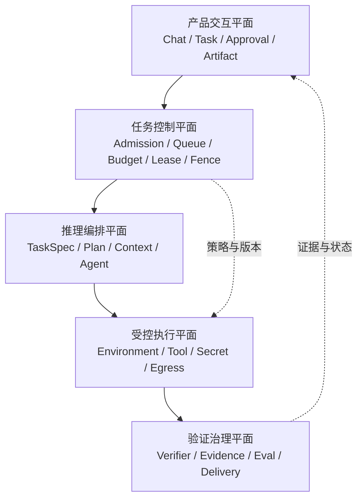
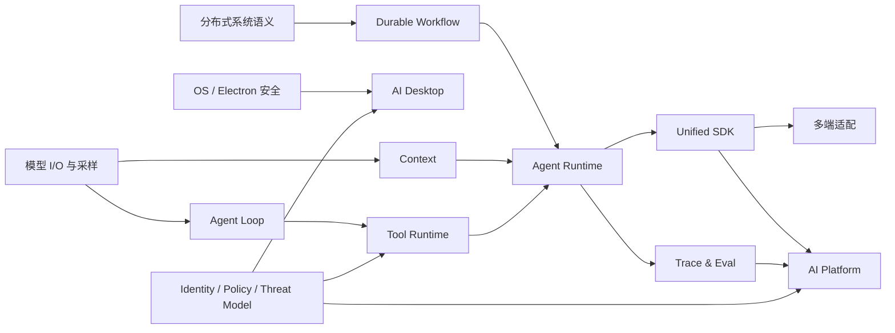

# Agent Runtime 架构能力地图

## 1. 先定义 Runtime 的真实产出

Agent Runtime 需要同时处理五个平面。只把 Electron 与模型 API 接在一起，无法覆盖任务恢复、工具副作用和治理边界。



架构设计要让五个平面的边界清楚、协议稳定、故障可恢复。产品界面显示的是任务结果，Runtime 还要解释模型超时、工具重复执行、旧 Worker 复活、审批等待、桌面进程重启、策略更新和框架替换时发生了什么。

## 2. 系统基础如何映射到 Runtime

这条路线默认读者理解至少一类复杂客户端或服务端系统。下表用于定位可复用的技术基础，以及需要补齐的 Runtime 视角。

| 系统基础 | 可直接复用 | 需要补齐的 Runtime 视角 |
| --- | --- | --- |
| Electron 跨 Windows/macOS/Linux | 进程隔离、IPC、打包、系统集成 | AI Sidecar、长任务恢复、工具权限、密钥与本地数据治理 |
| React / React Native / 微前端 | 多端抽象、状态管理、插件化、组件边界 | SDK Contract、Capability Negotiation、Event-driven UI |
| Node.js / NestJS / 微服务 | API、并发、队列、模块化 | Durable Execution、幂等、背压、租户隔离、SLO |
| RAG / LangChain / Dify | 检索链路、Agent 试点、场景落地 | Context Engineering、Eval、Prompt Injection 防护、框架退出策略 |
| 私有 npm、CI/CD、Sonar、SOP | 平台化、质量门禁、规模化 | SDK 版本治理、兼容矩阵、策略即代码、Runtime 回放测试 |

因此，主线不重复 JavaScript、React 等通用入门，而集中补齐**执行语义、模型接口差异、持久化状态机、安全策略与可观测评测**。若自测发现桌面进程模型或分布式系统基础不足，再从对应基础章并行补课。

## 3. 能力成熟度与进阶目标

采用四级标准：L1 能解释；L2 能实现；L3 能设计并处理失败；L4 能平台化并建立组织规范。核心域以 L3 为基线，关键架构域逐步达到 L4。

| 能力域 | 建议等级 | 达到等级的工程证据 |
| --- | --- | --- |
| Desktop Architecture | L3 | 可解释 Main/Renderer/Sidecar 边界；设计 typed IPC、签名更新、崩溃恢复与权限审批 |
| Agent Loop | L4 | 能定义状态机、Step Budget、终止条件、事件模型，避免无限循环和重复副作用 |
| Task Control Plane | L4 | 能设计可信接入、准入预留、公平调度、lease + fencing、SSE/Webhook 与 reconcile |
| Execution Contract | L4 | 能把目标变成 TaskSpec、Plan DAG、AcceptanceCriteria、Verifier 与 DeliveryBundle |
| Durable Workflow | L3 | 能从事件日志恢复；理解重试、补偿、版本、并发与定时器语义 |
| Context Engineering | L3 | 能做 token 预算、消息裁剪、摘要、检索、缓存与污染防护，并通过 Eval 证明 |
| Tool Runtime | L4 | Schema、权限、审批、幂等、超时、隔离、审计、结果裁剪形成统一规范 |
| Unified SDK | L4 | Provider/Transport/Storage/UI 解耦；稳定事件协议；跨端 capability negotiation |
| Framework Strategy | L3 | 能用基准场景做 Spike，形成 Build/Buy/Wrap 结论和退出方案 |
| Platform Governance | L3 | 控制面/数据面、多租户、身份、策略、成本、SLO 与发布治理能闭环 |
| Environment & Supply Chain | L3 | 环境指纹、Setup/Agent 分权、清理证明、Tool/Skill/Agent 签名与撤销能闭环 |
| Security | L3 | 完成桌面端 + Runtime + Tool + MCP 的 Threat Model，覆盖 Prompt Injection |
| Observability & Eval | L4 | Trace、Metric、Log、事件回放、离线/在线 Eval 和发布门禁统一设计 |

## 4. 知识依赖图

学习顺序由系统依赖决定，不按目录编号机械推进：



关键关系：

- **Agent Loop + Workflow**：Loop 决定“下一步做什么”，Workflow 决定“这一步如何可靠地活过失败”。
- **Context + Memory**：Context 是本次模型调用实际看到的窗口；Memory 是跨 Step/Run 可读取的状态来源，两者不能混为一谈。
- **Tool + Security**：Tool 不是普通函数调用，而是模型意图穿越信任边界、产生现实副作用的通道。
- **SDK + Platform**：SDK 承载数据面契约，控制面通过配置、策略和能力描述影响 SDK，但不能把平台内部模型泄漏给各端。
- **Observability + Eval**：Observability 解释“发生了什么”，Eval 判断“结果是否足够好”；二者通过统一 Run/Trace ID 连接。

## 5. 优先级：先学什么，暂时不学什么

### P0：进入核心实践前必须掌握

- 可恢复状态机、事件日志、幂等与取消传播。
- Request digest、防重冲突、租约 fencing、预算收尾保留与 unknown outcome。
- TaskSpec、Plan DAG、机器验收、独立 Verifier 和证据化 DeliveryBundle。
- Provider 差异隔离、流式事件归一化、Tool call 生命周期。
- Context 预算、摘要/检索策略与可测量质量。
- Electron 信任边界、沙箱、IPC allowlist、Sidecar 生命周期。
- Tool 权限、审批、审计与 Prompt Injection 防线。
- OpenTelemetry 风格 Trace 和最小 Eval 数据集。

### P1：完成首条纵向链路后补齐

- Workflow versioning、补偿、并行分支、人工节点。
- 多租户控制面、模型路由、配额与成本归因。
- 多 Agent 有界委派、worktree 隔离、预算 escrow 与 join/merge 语义。
- 环境池卫生、能力供应链签名/SBOM/撤销、删除传播与清理证明。
- MCP/A2A 的互操作与企业身份映射。
- SDK 兼容矩阵、Contract Test、canary 与弃用机制。

### P2：按业务需要学习

- 自研推理引擎、GPU 调度、模型训练/微调底层。
- 大规模向量数据库内核。
- 完整 BPMN 引擎或通用低代码平台。
- 多 Agent 社会模拟等缺少明确业务收益的复杂模式。

判断原则：Agent Runtime 覆盖产品规模化落地，但不要求自行实现全部基础设施。

## 6. 建立学习基线

请用 0～3 分回答，不能只凭“听说过”：

- 0：无法解释；1：能解释；2：实现过 happy path；3：处理过并发、失败、观测和安全。

```text
[ ] 我能画出一次 Agent Run 的完整状态机，并列出每个状态的持久化点。
[ ] 我能解释 lease 为什么不能阻止旧 Worker 写入，并在接收端实现 fencing。
[ ] 我能把自然语言目标转为可判定的 TaskSpec/AcceptanceCriteria，并让独立 Verifier 产生证据。
[ ] 我能说明“重试 Tool call”为什么可能产生重复副作用，以及如何提供幂等键。
[ ] 我能让流式调用在 UI 关闭、用户取消和 Provider 超时时向下游传播 AbortSignal。
[ ] 我能解释消息历史、工作记忆、长期记忆、RAG 和 Context Window 的边界。
[ ] 我能设计 Renderer → Main → Sidecar 的最小权限 IPC，而不是暴露通用 invoke。
[ ] 我能给两个 Provider 定义统一事件协议，并保留 capability-specific 扩展。
[ ] 我能通过 Trace 找到延迟、token、工具失败和模型回退发生在哪个 Span。
[ ] 我能给 Prompt Injection、恶意 MCP Server、路径穿越和密钥泄漏建立防线。
[ ] 我能定义一个框架替换实验，并估算迁移成本与退出条件。
[ ] 我能把一次 Runtime 变更放进离线 Eval、回放、canary 和 SLO 门禁。
[ ] 我能区分 Runtime Task、Provider Response、对话 Thread 和执行 Attempt 的状态与 ID。
```

总分低于 15：完整执行 12 周路线；15～23：跳过熟悉内容，但完成所有 P0 实验；24 以上：直接做参考项目和架构 Katas，用失败注入验证深度。

## 7. 本章练习与验收

1. 为目标 Runtime 方案建立能力雷达，记录当前覆盖、目标等级、已有工程证据和待补缺口。
2. 从过去一个 Electron 或 RAG 项目中找一个故障，分别用 Client、Runtime、SDK、Platform 四个平面重新归因。
3. 写一页 ADR：为什么新平台不能把某个具体 Agent Framework 类型直接暴露给 UI。

验收标准：能在 10 分钟架构评审中讲清五个平面的边界，指出三项主要系统风险，并给出对应的工程控制和验证证据。

下一章：[12 周学习计划 →](../../docs/00-roadmap/12-week-plan.md)
