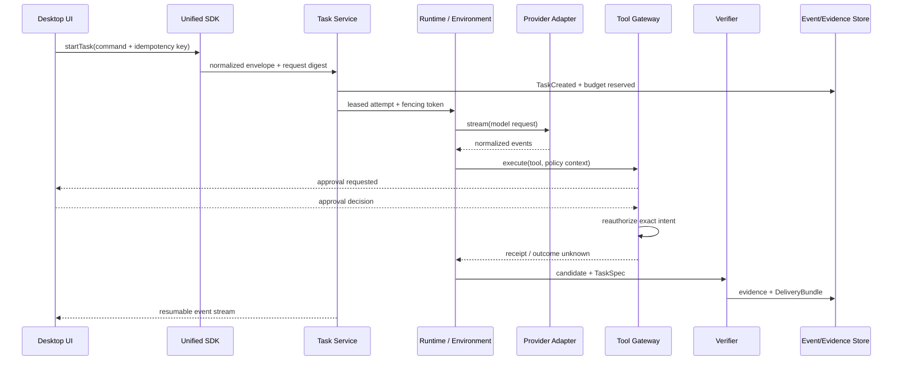

# Agent Runtime 30/60/90 天实施路线

## 总体策略：先收集事实，再划定边界

架构改造常见的偏差，是一开始重写 Runtime，或在没有运行数据时就选定“统一框架”。前 90 天先收集系统事实、团队约束和业务成功标准，再用一条纵向链路验证方向。

## 0～30 天：形成共同事实模型

### 业务与产品

- 选 3 个代表场景：高频低风险、高价值需审批、长时可恢复任务。
- 跟随一次真实用户任务，记录从意图到结果的所有等待、人工判断和失败。
- 定义成功指标：任务完成率、人工接管率、总耗时、单位成本和安全事件；模型有回复不算完成。

### 系统考古

- 画现状 C4 Context/Container 图和信任边界。
- 梳理桌面版本、OS、升级渠道、崩溃率、本地数据位置、Provider 与认证方式。
- 抽取 50～100 条失败 Run，按模型、网络、Runtime、Tool、权限、数据、用户取消分类。
- 建立 Provider/Framework 依赖清单：哪些类型或生命周期已经泄漏到业务层。

### 团队与流程

- 识别 Client、Runtime、SDK、Platform、Security、SRE 的 owner 和决策边界。
- 收集已有 RFC/ADR、事故报告、SLO、发布和回滚流程。
- 建立统一术语：Task、Thread、Turn、Run/Attempt、Step、Workflow、Tool Call、Evidence 的含义必须一致；明确 phase 与 outcome 分离。

### 30 天交付物

1. As-is 架构与数据流/信任边界图。
2. Top 10 失败模式及证据，不只凭印象。
3. Runtime 事件词汇表与最小 Task/Attempt/Step/Tool 状态定义，标出 `BLOCKED`、`CANCELING`、`outcome_unknown`。
4. 一页 North Star：未来架构原则、明确不做什么、3 个量化指标。
5. 使用 [Agent Runtime 架构覆盖矩阵](../08-appendix/architecture-source-gap-analysis.md)完成现状覆盖、缺口与风险对照。

## 31～60 天：建立稳定边界并交付纵切

选择一个价值高但风险可控的场景，沿以下链路改造：

### 技术动作

- 先建立 Provider Adapter 与统一事件协议，不先重构所有业务。
- 给 Tool 加 manifest、risk、timeout、idempotency 和 audit。
- 给入口增加 canonical request digest、防重冲突和预算预留；给 Worker 增加 lease + fencing。
- 把自然语言目标编译为 TaskSpec/AcceptanceCriteria，使用独立 Verifier 和 Claim-Evidence Map 完成验收与交付。
- 用 Event Store 保存最小恢复状态；给取消链路接入 `AbortSignal`。
- 固化环境指纹；等待审批时 checkpoint/park，撤销不必要 Secret 并释放 Worker。
- 打通 Trace ID：Desktop → SDK → Runtime → Model/Tool。
- 建 30～50 条 Eval 样本作为改造基线。

### 治理动作

- 写 3～5 个关键 ADR：Runtime 边界、事件模型、持久化策略、Provider 适配、工具权限。
- 建立每周 Runtime Review：事件 schema 变更、Tool 新增、Provider 升级必须评审。
- 明确 API 兼容级别和弃用周期。

### 60 天交付物

- 一个可演示、可观测、可取消、能从崩溃恢复，并能用 DeliveryBundle 证明结果的纵切场景。
- Provider Contract Test、Tool 安全测试、事件回放测试。
- 旧 Worker 复活、审批后参数篡改、Webhook 重复、外部效果未知和环境清理失败的故障注入报告。
- 首版 Dashboard：成功率、P95 延迟、token/cost、工具失败、恢复成功率。

## 61～90 天：平台化与路线图

### 从单点方案抽出平台能力

- 将验证后的契约固化为 `runtime-core` 和 `unified-sdk`，不把试验性策略写死。
- 把 model/tool/policy 配置移到控制面，并提供版本与回滚。
- 将 Tool/Skill/Agent 作为能力供应链治理：不可变 Release、digest、provenance、SBOM、签名、租户 Binding、撤销与 canary。
- 建立 Tenant Context，让身份信息贯穿日志、配额和存储。
- 对多 Agent 仅开放受限委派：权限交集、预算 escrow、递归上限、独立 worktree、单一 Merger 和 join contract。
- 设计 Desktop/Web/Extension/IDE 的 Capability Matrix，决定哪些能力在本地或远端执行。

### 建立发布与质量系统

- 变更路径：unit → contract → replay → offline eval → shadow/canary → full rollout。
- 为 Provider、Tool、Workflow 分别建立兼容矩阵。
- 定义 kill switch：按租户、工具、模型、版本快速停用。
- 建立事故演练：Provider 全挂、工具重复副作用、恶意上下文、策略误配置。

### 90 天交付物

1. To-be 架构与分阶段迁移图，不承诺一次性重写。
2. 两个季度路线图：可靠性、安全、SDK、多端与框架演进的明确优先级。
3. SLO 与 Error Budget、成本预算和容量估算。
4. Ownership/RACI：谁拥有协议、Runtime、工具目录、策略、桌面发布和事故响应。

## 访谈问题

### 问产品

- 哪些失败可以重试，哪些必须让用户确认？
- 任务完成的可验证结果是什么？生成文本还是系统状态真的改变？
- 哪些场景允许模型自主执行，哪些必须 human-in-the-loop？

### 问开发

- 一次 Run 的 source of truth 在哪里？进程崩溃后如何知道做到哪一步？
- Provider SDK 类型泄漏到了多少业务代码？升级一次改多少层？
- Tool 是否区分只读/写入/外发？重复调用会怎样？
- Task、Provider Response 和对话 Thread 是否混用？旧 lease 持有者如何被实际写入点 fence？
- “测试通过/已创建 PR”等最终 claim 能否找到环境指纹、真实回执和 verifier evidence？

### 问 SRE/安全

- 当前能否按 tenant/run/tool 查询完整审计链？
- 哪个开关可以在 5 分钟内停用一个失控工具？
- 本地密钥、缓存、会话、文件结果如何加密、保留与删除？
- 等待审批时是否仍占有 Worker/Secret？环境清理失败会隔离还是回池？备份删除窗口如何准确对外承诺？

## 反模式清单

- 用框架名称代替架构决策：“我们用 LangGraph，所以可恢复”。
- 先统一所有 Provider 参数，最后得到最低公分母接口。
- 把聊天消息数组当作唯一状态和审计日志。
- 只测最终回答，不测 Tool 副作用、权限和恢复。
- 一开始建设庞大控制面，但没有一条可靠数据面链路。
- 把 Desktop 当薄壳，忽略本地进程、文件、凭据与升级带来的高权限风险。

下一章：[能力测评与验收 →](assessment.md)
