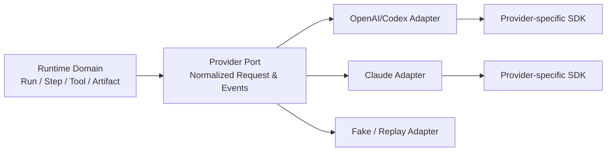
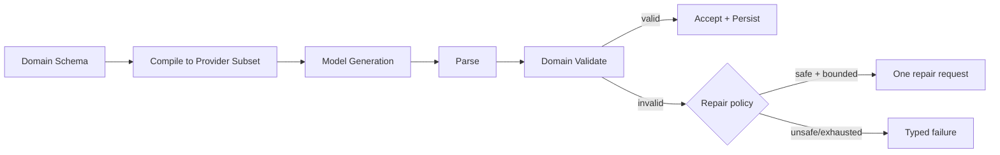

# 模型接口、流式与结构化输出

## 1. 先定领域协议，再接 Provider SDK

模型 API 的消息字段、工具参数、流式事件、reasoning、缓存、文件和会话能力都会变化。不要把所有 Provider 字段拼成一个公共接口；这样业务会依赖供应商细节，升级也会变得困难。

可以分成三层：



领域协议只表达 Runtime 真正需要的语义；Provider 特性通过 capability 和 namespaced extension 暴露，不污染核心状态机。

## 2. 请求：让输入可审计、可预算、可演进

```ts
type CanonicalContent =
  | { type: 'text'; text: string }
  | { type: 'image'; artifactId: string; mediaType: string }
  | { type: 'artifact-ref'; artifactId: string; summary?: string };

interface ModelRequest {
  requestId: string;
  runId: string;
  modelProfileId: string;
  messages: ReadonlyArray<{
    role: 'system' | 'user' | 'assistant' | 'tool';
    content: readonly CanonicalContent[];
    source?: { kind: string; id: string; version?: string };
  }>;
  tools: readonly ToolDefinition[];
  output?: { kind: 'text' } | { kind: 'json'; schemaId: string; schema: unknown };
  budget: { maxOutputTokens: number; deadlineAt: string };
  extensions?: Record<`${string}.${string}`, unknown>;
}
```

设计要点：

- `requestId` 用于 Provider 请求关联；`runId` 用于完整任务，不要混用。
- 二进制内容通过 Artifact 引用，避免事件日志和 IPC 复制大对象。
- schema 带独立 ID/版本，便于回放时找到原始契约。
- deadline 是绝对时间，跨进程传递时比层层重新设 timeout 更可靠。
- extension 必须 namespaced，如 `anthropic.cache_control`，且 Adapter 负责验证。

## 3. 响应：使用异步事件流，不返回一个大对象

```ts
type ModelEvent =
  | { type: 'response.started'; providerRequestId: string; at: string }
  | { type: 'content.delta'; index: number; text: string }
  | { type: 'tool.input.delta'; callId: string; name: string; jsonFragment: string }
  | { type: 'tool.requested'; callId: string; name: string; input: unknown }
  | { type: 'usage'; inputTokens: number; outputTokens: number; cachedInputTokens?: number }
  | { type: 'response.completed'; finishReason: 'stop' | 'tool' | 'length' | 'content-filter' }
  | { type: 'response.failed'; error: ModelError };

interface ModelProvider {
  readonly id: string;
  capabilities(): Promise<readonly Capability[]>;
  stream(request: ModelRequest, signal: AbortSignal): AsyncIterable<ModelEvent>;
}
```

### 为什么保留 delta 与 completed 两层事件

UI 需要 delta 获得即时反馈，但 Runtime 的状态转换不能依赖每个字符。`tool.input.delta` 可用于显示“正在构造参数”；执行器只在 `tool.requested` 完成并通过 schema 校验后执行。文本 delta 可在 Transport 层合并，usage/completed/failed 不可丢弃。

## 4. 正确消费流：取消、终态和资源清理

```ts
async function consumeModel(
  provider: ModelProvider,
  request: ModelRequest,
  parentSignal: AbortSignal,
  emit: (event: ModelEvent) => Promise<void>,
) {
  class EventSinkError extends Error {
    constructor(readonly cause: unknown) { super('model event sink did not commit'); }
  }
  const commit = async (event: ModelEvent) => {
    try { await emit(event); }
    catch (cause) { throw new EventSinkError(cause); }
  };
  const timeout = AbortSignal.timeout(
    Math.max(0, Date.parse(request.budget.deadlineAt) - Date.now()),
  );
  const signal = AbortSignal.any([parentSignal, timeout]);
  let terminalSeen = false;
  let terminalCommitted = false;

  try {
    for await (const event of provider.stream(request, signal)) {
      const isTerminal = event.type === 'response.completed' || event.type === 'response.failed';
      if (isTerminal) terminalSeen = true;
      await commit(event); // 保留背压；sink 失败必须交给上层恢复，不能伪装已完成
      if (isTerminal) {
        terminalCommitted = true;
        break; // 首个 terminal 关闭 iterator；绝不继续消费迟到 delta/第二终态
      }
    }
    if (!terminalSeen) {
      terminalSeen = true;
      await commit({
        type: 'response.failed',
        error: { code: 'protocol_violation', retryable: false, message: 'stream ended without terminal' },
      });
      terminalCommitted = true;
    }
  } catch (error) {
    if (error instanceof EventSinkError) {
      // sink 可能已部分提交：由 eventId/CAS 查询并恢复，绝不能再补发另一终态。
      throw error;
    }
    if (terminalCommitted) {
      // iterator.return()/adapter 清理在 terminal 后报错时，只进入诊断通道。
      recordProviderDiagnostic({ requestId: request.requestId, error, phase: 'after_terminal' });
      return;
    }
    if (signal.aborted) {
      await commit({
        type: 'response.failed',
        error: {
          code: parentSignal.aborted ? 'cancelled' : 'deadline_exceeded',
          retryable: false,
          message: 'model stream aborted',
        },
      });
      return;
    }
    await commit({
      type: 'response.failed',
      error: { code: 'provider_unavailable', retryable: true, message: 'provider stream failed' },
    });
    recordProviderDiagnostic({ requestId: request.requestId, error, phase: 'before_terminal' });
  }
}
```

`terminalSeen` 表示 Provider 已宣告终态，`terminalCommitted` 表示 Event Store/下游 sink 已确认提交，二者不能混成一个布尔值。`recordProviderDiagnostic` 只写脱敏诊断，不再发布业务事件。`await emit` 会让下游速度反馈到读取端。如果 Provider SDK 不提供背压，可在 Adapter 使用有界队列，文本 delta 满时合并；不能让慢 UI 造成无界内存增长。

## 5. 结构化输出是“约束 + 校验 + 修复策略”

模型支持 JSON Schema 不等于业务可以跳过校验。Provider 可能只支持 schema 子集；模型可能因长度、拒绝、内容过滤而没有产生完整值；版本变化也会改变行为。

推荐流程：



```ts
import { z } from 'zod';

const ChangePlan = z.object({
  summary: z.string().min(1).max(500),
  files: z.array(z.object({
    path: z.string().min(1),
    action: z.enum(['create', 'modify', 'delete']),
    reason: z.string().min(1),
  })).max(50),
  requiresApproval: z.boolean(),
});

type ChangePlan = z.infer<typeof ChangePlan>;

function decodeChangePlan(value: unknown): ChangePlan {
  const result = ChangePlan.safeParse(value);
  if (!result.success) {
    throw new RuntimeValidationError('invalid_change_plan', result.error.issues);
  }
  return result.data;
}
```

删除文件、付款、发消息等高风险动作不能因“repair 后 schema 有效”就直接执行；结构正确与授权正确是两回事。

## 6. Error Taxonomy 决定是否重试

统一 `retryable: boolean` 还不够，Runtime 需要知道失败阶段和副作用状态：

```ts
type ModelError = {
  code:
    | 'authentication'
    | 'permission_denied'
    | 'rate_limited'
    | 'context_too_large'
    | 'invalid_request'
    | 'provider_unavailable'
    | 'deadline_exceeded'
    | 'cancelled'
    | 'content_blocked'
    | 'protocol_violation';
  retryable: boolean;
  retryAfterMs?: number;
  providerCode?: string;
  providerRequestId?: string;
  message: string; // 必须已去敏
};
```

重试策略：

- 认证、权限、无效请求、上下文超限：修正输入或配置，不盲重试。
- rate limit：尊重 `retry-after`，加入 jitter，受 Run deadline/attempt budget 限制。
- provider unavailable：可在相同 profile 的 fallback model 上重试，但记录模型改变。
- 流中断：如果已经产生 Tool 请求或部分结果，由状态机判断是否恢复，Adapter 不自行重放。
- 用户取消：终态是 cancelled，不应被自动恢复为 running。

## 7. Provider Adapter 的 Contract Tests

同一套测试应运行在 Fake 与每个真实 Adapter：

```ts
export function modelProviderContract(create: () => Promise<ModelProvider>) {
  describe('ModelProvider contract', () => {
    it('emits exactly one terminal event', async () => { /* ... */ });
    it('does not emit after terminal event', async () => { /* ... */ });
    it('assembles tool input before tool.requested', async () => { /* ... */ });
    it('propagates cancellation', async () => { /* ... */ });
    it('preserves provider request id for tracing', async () => { /* ... */ });
    it('maps unknown provider events without crashing the process', async () => { /* ... */ });
  });
}
```

真实 Adapter 测试分两层：录制/回放 fixtures 保证快速稳定；少量 nightly live tests 发现 Provider 行为变化。Fixture 必须去敏，并记录 SDK、API、模型版本。

## 8. 常见失败模式

- 把 SSE/WebSocket chunk 当领域事件，一个 chunk 中可能有多帧，一帧也可能跨 chunk。
- 收到工具参数片段就执行，导致无效或被后续片段改变的参数进入真实系统。
- Adapter 内自动重试整个调用，Runtime 不知道重复了哪些决策。
- UI 断开后模型继续昂贵生成，因为 AbortSignal 没有跨层传播。
- JSON parse 成功就认为数据有效，没有 domain validation。
- 把 Provider 原始错误直接展示，泄漏请求、密钥、路径或内部策略。

## 9. 练习与验收

1. 实现一个会随机拆分 JSON fragment 的 Fake Provider，证明 assembler 不依赖 chunk 边界。
2. 用有界队列模拟 UI 每秒只能处理 20 次更新，Provider 每秒发 500 个 delta；关键事件必须完整。
3. 给 Context Too Large、Rate Limit、断流、取消写状态转移表。
4. 用同一 Contract Suite 测两个 Adapter，并列出所有 capability 差异。

验收：删除 Adapter 中所有业务状态后，仍能用领域事件完整表达一次调用；更换 Provider 不改变 Agent Loop 的核心 reducer。

## 延伸阅读

- [OpenAI API Reference](https://developers.openai.com/api/reference/overview)
- [Anthropic API：Streaming Messages](https://docs.anthropic.com/en/api/messages-streaming)
- [JSON Schema 2020-12](https://json-schema.org/draft/2020-12)
- [WHATWG Streams Standard](https://streams.spec.whatwg.org/)

下一章：[分布式系统语义 →](distributed-systems.md)
