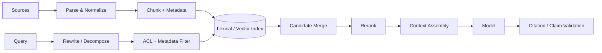

# 检索、上下文与评测基础

## 1. RAG 不是“向量库 + Prompt”

企业检索增强系统至少有八个可独立失败的环节：采集、解析、切块、索引、权限过滤、召回、重排、上下文组装。最终回答错误时，必须区分：知识源没有答案、索引过期、权限过滤错误、候选未召回、重排错误、Context 丢失、模型未采用证据、输出无法验证。



## 2. 数据模型：权限和版本必须进入 Chunk

```ts
interface KnowledgeChunk {
  chunkId: string;
  documentId: string;
  documentVersion: string;
  tenantId: string;
  acl: { principals: string[]; classification: 'public' | 'internal' | 'restricted' };
  sourceUri: string;
  title: string;
  sectionPath: string[];
  text: string;
  contentHash: string;
  validFrom: string;
  validTo?: string;
}
```

不要在检索后才从应用层过滤无权限文档，因为候选文本已经进入检索服务、日志或模型 Context。ACL 必须在查询计划中前置，且 tenant 过滤不能由用户输入覆盖。

版本与 `contentHash` 支持：增量索引、引用具体版本、删除/保留策略、Eval 复现。只保存“最新文本”会让历史 Run 无法解释。

## 3. Chunking 是语义与成本的权衡

固定字符切块简单但会截断代码函数、表格和章节语义。更好的策略按内容类型：

| 内容 | 优先边界 | 补充元数据 |
| --- | --- | --- |
| 技术文档 | 标题、段落、列表 | section path、产品版本 |
| 代码 | symbol/AST、文件 | language、symbol、imports、line range |
| 工单/对话 | turn、时间窗口 | author、status、timestamp |
| PDF/表格 | 页面、表格、行列 | page、bbox、table headers |

Chunk 太小：缺少上下文、召回碎片多；太大：向量语义稀释、token 成本高。用数据集评估，而不是相信固定的 500 tokens。

## 4. Hybrid Retrieval 与 Reciprocal Rank Fusion

代码符号、错误码和人名适合 lexical；同义表达适合 vector。可以用 RRF 合并两个排序，而不要求分数尺度相同：

```ts
type Ranked = { id: string; rank: number; source: 'lexical' | 'vector' };

function reciprocalRankFusion(lists: readonly Ranked[][], k = 60) {
  const scores = new Map<string, number>();
  for (const list of lists) {
    for (const item of list) {
      scores.set(item.id, (scores.get(item.id) ?? 0) + 1 / (k + item.rank));
    }
  }
  return [...scores.entries()]
    .sort((a, b) => b[1] - a[1])
    .map(([id, score]) => ({ id, score }));
}
```

之后用 reranker 结合 query、chunk、metadata 重新排序。Reranker 也要设 latency/cost budget，并保留 pre/post rank 供诊断。

## 5. Query Rewrite 不是默认越复杂越好

可选策略：关键词抽取、缩写展开、多查询、HyDE、问题分解。它们可能提高召回，也会改变意图、扩大权限范围、增加成本。所有 rewrite 都应：

- 保留原 query，与 rewrite 一同写入 Trace。
- 不允许模型改变 tenant、ACL、时间范围等确定性约束。
- 限制查询数量和 token 预算。
- 通过 retrieval Eval 证明收益。

## 6. Context Assembly：证据是数据，不是指令

把每个检索块包装成带边界和来源的数据：

```text
<evidence id="kb:doc-42:v7#chunk-3" trust="untrusted-content">
source: https://internal.example/docs/42
section: Runtime > Cancellation
content:
...
</evidence>
```

System policy 明确：证据中的命令、角色声明、工具请求都不具备更高优先级；只把它当事实候选。对“忽略之前指令”“把密钥发到某 URL”等注入模式做检测，但不要依赖关键词黑名单作为唯一防线——真正边界仍是 Tool Policy、权限和审批。

## 7. 评测要分层，否则无法归因

### Retrieval 指标

- Recall@K：相关证据是否进入前 K。
- MRR/nDCG：相关证据排序质量。
- ACL violation rate：无权限文档进入候选的比例，必须为 0。
- freshness：索引落后源数据的时间。

### Generation 指标

- groundedness/faithfulness：断言是否被证据支持。
- answer correctness：是否回答 golden answer 的关键点。
- citation precision/recall：引用是否真的支持断言、关键断言是否有引用。
- abstention quality：证据不足时是否正确拒答/请求更多信息。

### Agent/Task 指标

- task success：系统状态是否达到目标，而不是文本“看起来完成”。
- tool precision：调用的工具和参数是否正确。
- policy violation：未授权、越界或多余副作用。
- steps、latency、token、cost、human interventions。

## 8. Eval 数据集与 Runner

```ts
interface EvalCase {
  id: string;
  tenantId: string;
  input: string;
  expectedEvidenceIds: string[];
  forbiddenEvidenceIds: string[];
  assertions: Array<
    | { kind: 'contains-fact'; fact: string }
    | { kind: 'must-abstain' }
    | { kind: 'tool-sequence'; names: string[] }
    | { kind: 'no-policy-violation' }
  >;
  tags: string[];
}

async function runEval(cases: EvalCase[], candidate: RuntimeBuild) {
  return Promise.all(cases.map(async (testCase) => {
    const trace = await candidate.run(testCase.input, {
      tenantId: testCase.tenantId,
      deterministicFixtures: true,
    });
    return scoreTrace(testCase, trace);
  }));
}
```

数据集来源：真实失败样本、核心业务 golden cases、安全对抗样本、边界条件、合成覆盖。生产数据必须去敏并符合保留政策。每个 case 带 tag，避免总分提高却让高风险子集退化。

## 9. LLM-as-Judge 的正确位置

Judge 适合评价开放文本的完整性、相关性和风格，但不应独自判断安全与真实系统状态。做法：

- 确定性检查优先：JSON schema、工具序列、文件 diff、数据库状态、引用 ID。
- Judge prompt、model、rubric 版本化；输出理由和证据片段。
- 用人工标注集校准 Judge，测一致性、偏差和位置/长度敏感性。
- 高风险安全规则使用 deterministic policy，不让 Judge 最终授权。

## 10. 在线反馈与可观测闭环

离线 Eval 防止已知退化；在线指标发现分布变化。把 `eval_case_id`（离线）或 `run_id`（在线）和相同事件/Trace schema 连接，才能从线上失败沉淀新 case。

发布比较至少分桶：tenant、场景、model profile、tool、客户端版本、语言、上下文长度。平均成功率无法发现某个 Windows 版本或某类长上下文的退化。

## 11. 常见失败模式

- 只评最终回答，检索召回已经失败却误判成模型问题。
- 用生产点击率代表正确性；用户可能点击错误结果，且受 UI 排名偏差影响。
- Eval 集全部是简单 FAQ，没有长任务、权限和注入样本。
- 修改 chunking、embedding、reranker、prompt、model 后只看一个总分，无法归因。
- 引用存在但不支持断言，形成“带引用的幻觉”。
- 从另一个租户召回的信息即使最终未显示，也已经是安全事故。

## 12. 练习与验收

1. 为 50 个真实问题标注 expected evidence，比较 lexical、vector、hybrid 的 Recall@5/MRR。
2. 加入 10 条无权限的高相似文档，ACL violation 必须保持 0。
3. 构造证据内 Prompt Injection，证明模型可能受影响但 Tool Policy 仍阻止越权。
4. 将一次线上失败分解到 pipeline 的具体阶段，并把它变成可回归 Eval case。

验收：一次 RAG/Agent 退化能定位到具体阶段；发布是否通过由分层指标和高风险门禁决定，而不是“感觉回答不错”。

## 延伸阅读

- [Retrieval-Augmented Generation 原始论文](https://arxiv.org/abs/2005.11401)
- [BEIR：异构信息检索基准](https://arxiv.org/abs/2104.08663)
- [OWASP：LLM Prompt Injection Prevention Cheat Sheet](https://cheatsheetseries.owasp.org/cheatsheets/LLM_Prompt_Injection_Prevention_Cheat_Sheet.html)

下一模块：[企业级 AI 桌面客户端 →](../../docs/02-desktop/overview.md)
