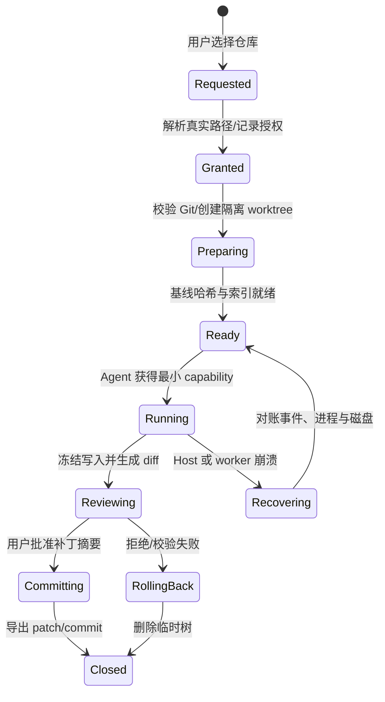
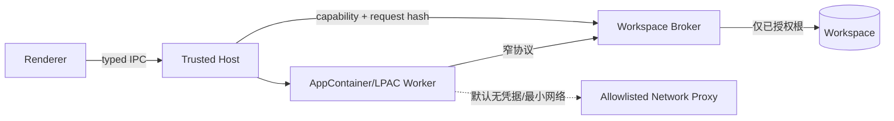

# Coding Agent 本地主机：从工作区授权到可审计补丁

Windows/macOS Coding Agent Host 要同时处理工作区授权、代码索引、进程树、补丁副作用和崩溃恢复。能启动 shell 还不够，验收要看安全链是否可审计、可复现。文中的厂商与 OS 行为于 **2026-08-30** 按官方资料核对；标注为“建议”的内容属于架构推导，不代表操作系统承诺。

## 1. 先建立工作区生命周期

Coding Agent 的工作区不是一个字符串路径，而是一项有状态租约：



一次租约至少固化：`workspaceId`、用户可见路径、解析后的 canonical root、仓库 common-dir、基线 commit、worktree 路径、读写 scope、到期时间和创建它的用户/窗口身份。每次文件操作重新执行“规范化路径 → 拒绝越根 → 拒绝不允许的符号链接穿透”，不能只在选目录时检查一次。

```ts
export interface WorkspaceLease {
  workspaceId: string;
  displayRoot: string;
  canonicalRoot: string;
  gitCommonDir: string;
  baseCommit: string;
  worktreeRoot: string;
  mode: "read" | "patch";
  expiresAt: string;
}

export interface WorkspaceHost {
  grant(selectionToken: Uint8Array): Promise<WorkspaceLease>;
  prepare(id: string): Promise<{ treeHash: string; indexVersion: string }>;
  freeze(id: string): Promise<{ head: string; diffHash: string }>;
  close(id: string, outcome: "accepted" | "discarded" | "recovery"): Promise<void>;
}
```

上例故意接收 `selectionToken` 而不是 Renderer 自报路径：Windows 可由原生 picker/broker 产生授权，macOS 可由 `NSOpenPanel` 产生 security-scoped bookmark。Renderer 只持 `workspaceId`。

## 2. Git worktree 是隔离单元，不是事务本身

建议每个可写 Run 使用独立 linked worktree；只读分析可共享一个只读索引快照。Git 官方说明一个仓库可关联多个 worktree，`--detach` 适合一次性实验；`--lock` 能避免正在执行的 worktree 被 prune。不要直接删除目录，要走 `git worktree remove`，异常后再 `repair/prune`。

```bash
# Host 生成不可预测的 run-id；路径必须位于专用运行目录。
git rev-parse --show-toplevel
git rev-parse --git-common-dir
git worktree add --detach --lock --reason "agent run-01H..." \
  /var/tmp/acme-agent/run-01H/worktree HEAD

# 只在该 worktree 内执行；先拒绝已有脏状态。
git -C /var/tmp/acme-agent/run-01H/worktree status --porcelain=v2 -z
git -C /var/tmp/acme-agent/run-01H/worktree diff --binary --no-ext-diff

# 正常回收；崩溃巡检时先 list --porcelain -z，再按租约记录对账。
git worktree unlock /var/tmp/acme-agent/run-01H/worktree
git worktree remove /var/tmp/acme-agent/run-01H/worktree
git worktree prune --dry-run --verbose
```

worktree 仍共享 object database 和部分仓库元数据，因此它不是强安全沙箱，也不适合让不可信进程直接写 `.git` common-dir。Host 应以参数数组启动 Git、禁用用户自定义 pager/editor/hooks，限制环境变量，并将“仓库内容写权限”与“common-dir 管理权限”分开。submodule、LFS filter、clean/smudge filter 和 hooks 都可能执行程序，导入未知仓库时必须有明确策略。

### 2.1 Patch transaction：预检、冻结、应用、验证、发布

“把模型输出写进文件”没有原子性。可操作的补丁事务应为：

1. `BeginPatch`：记录 `runId/baseCommit/treeHash`，冻结索引版本。
2. `StagePatch`：把统一 diff 保存为不可变 artifact，计算 SHA-256；拒绝绝对路径、越根路径和超限二进制。
3. `ValidatePatch`：在临时 worktree 执行 `git apply --check --index`；如果允许三方合并，单独展示 `--3way` 可能产生的冲突语义。
4. `ApplyPatch`：用同一 artifact 应用，随后重新计算 diff，不信任模型自报的文件列表。
5. `Verify`：运行受限格式化、类型检查和测试，收集退出码与 artifact。
6. `CommitDecision`：UI 展示真实 diff hash、测试结果、权限变化；批准后导出 patch 或创建 commit，拒绝则丢弃整个 worktree。

```ts
type PatchRecord = {
  patchId: string; runId: string; baseCommit: string;
  artifactSha256: string; status: "staged" | "applied" | "verified" | "accepted" | "discarded";
};

async function applyTransaction(rec: PatchRecord, patchFile: string, cwd: string) {
  await git(["apply", "--check", "--index", "--whitespace=error-all", patchFile], cwd);
  await appendEvent({ type: "PatchValidated", patchId: rec.patchId, sha256: rec.artifactSha256 });
  await git(["apply", "--index", "--whitespace=error-all", patchFile], cwd);
  const actual = await git(["diff", "--cached", "--binary", "--no-ext-diff"], cwd);
  await appendEvent({ type: "PatchApplied", patchId: rec.patchId, actualDiffSha256: sha256(actual) });
  // 测试失败并不自动恢复用户原工作区：丢弃隔离 worktree 即可。
}
```

`git apply --check` 只证明当前树能否应用，不证明代码正确；`--index` 还要求 index 与 working tree 的目标项一致。补丁接受必须绑定 `artifactSha256 + actualDiffSha256 + baseCommit`，避免审批后内容被替换（TOCTOU）。

## 3. PTY、进程树与取消是三个不同问题

PTY 解决交互式终端兼容；进程容器解决后代归属；取消协议解决“先温和、后强杀”。只杀启动 PID 会遗留 `npm -> shell -> test runner -> browser` 后代；只关闭 PTY 又不保证后台进程退出。

```ts
interface ProcessHandle {
  operationId: string;
  pid: number;
  write(data: Uint8Array): Promise<void>;
  resize(cols: number, rows: number): Promise<void>;
  cancel(deadlineMs: number): Promise<"cooperative" | "forced" | "unknown">;
  output(): AsyncIterable<{ seq: number; channel: "pty" | "stderr"; bytes: Uint8Array }>;
}
```

建议取消分四阶段：持久化 `CancelRequested`；停止下发新工具；向前台会话发送合作式中断并等待短 deadline；最后终止整个 OS 进程容器。终态前必须确认容器无活动进程，不能把“信号已发送”写成 `Cancelled`。进程输出要有单调序号和背压；控制序列、ANSI/OSC 链接和超长行进入 UI 前要过滤。

### 3.1 Windows：Job Objects + ConPTY

Windows Job Object 用于把进程集合当作一个单元施加 CPU、内存、活动进程数和生命周期约束。创建子进程时先 `CREATE_SUSPENDED`，将它分配到 Job，再恢复线程，可缩小“子进程在归组前派生后代”的竞态；设置 `JOB_OBJECT_LIMIT_KILL_ON_JOB_CLOSE` 后，最后一个 Job handle 关闭会终止关联进程。Windows 8+ 支持 nested jobs。

```cpp
HANDLE job = CreateJobObjectW(nullptr, nullptr);
JOBOBJECT_EXTENDED_LIMIT_INFORMATION lim{};
lim.BasicLimitInformation.LimitFlags =
  JOB_OBJECT_LIMIT_KILL_ON_JOB_CLOSE | JOB_OBJECT_LIMIT_PROCESS_MEMORY;
lim.ProcessMemoryLimit = 2ull * 1024 * 1024 * 1024;
SetInformationJobObject(job, JobObjectExtendedLimitInformation, &lim, sizeof(lim));

// CreateProcessW(..., CREATE_SUSPENDED | EXTENDED_STARTUPINFO_PRESENT, ...)
AssignProcessToJobObject(job, processInfo.hProcess);
ResumeThread(processInfo.hThread);
// 强制取消：TerminateJobObject(job, AGENT_CANCELLED_EXIT_CODE)
```

用 I/O completion port 监听 `NEW_PROCESS/EXIT_PROCESS/ACTIVE_PROCESS_ZERO`，但微软明确指出除特定 notification-limit 消息外，Job 消息主要是通知，交付并非全都保证；终态仍要 `QueryInformationJobObject` 对账，PID 也要配合打开的 handle 防止复用误判。

ConPTY 是字符模式应用的伪控制台宿主，输入输出通道是 UTF-8；它适合承载 PowerShell、cmd、REPL 和测试 runner 的终端行为。ConPTY 不替代 Job Object：创建 pseudoconsole、准备 `STARTUPINFOEX` 的属性后，仍把真正客户端进程放进 Job。输出 pipe 必须持续读取，否则缓冲区背压可能让子进程看似“卡死”。

```powershell
# 事故采样：ETW/WPR 是诊断，不是业务审计真相。
wpr -start GeneralProfile -filemode
# 复现 agent 进程 CPU/磁盘异常
wpr -stop agent-runtime.etl
```

ETW 由 controller、provider、consumer 组成，可动态启停并实时/离线消费；官方也说明慢磁盘、消费者不及时或事件过大都可能丢事件。因此 ETW 用来性能取证，`runId/toolCallId/patchId` 的可靠审计仍写 Runtime event store。

### 3.2 Windows：AppContainer 与 Named Pipe ACL

AppContainer/LPAC 是真正的安全边界：token 含 Package SID 与 capability SID，默认限制文件、注册表、网络、凭据和其他进程。它特别适合解析不可信内容或运行低权限分析 worker；但 Coding Agent 需要编译器、包管理器、Git 与用户选择目录，不能假设“套一个 AppContainer 就都能工作”。建议用 broker 模式：



Host 创建 Named Pipe 时必须传显式 security descriptor，只允许当前用户 SID、Host SID 和目标 AppContainer SID。微软文档指出默认 pipe DACL 还会给 Everyone 与 anonymous 读权限，所以 `CreateNamedPipe(..., nullptr)` 不能作为企业默认。连接后再用客户端进程/token 校验做纵深防御，消息层仍校验长度、版本、nonce 和 `workspaceId`；ACL 不是协议校验。

```text
# SDDL 仅示意：由原生代码按运行时 SID 构造，不要复制固定账户。
D:P(A;;GA;;;SY)(A;;GA;;;OW)(A;;GRGW;;;<APP_CONTAINER_SID>)
```

### 3.3 macOS：entitlements、TCC、bookmark 与 XPC

entitlement 是嵌入代码签名的 capability 声明；App Sandbox 用 `com.apple.security.app-sandbox` 限制资源。它与 TCC 是两层机制：即使 sandbox entitlement 允许某类能力，Desktop/Documents/Downloads、自动化、辅助功能等仍可能需要用户同意；Full Disk Access 不能由代码静默获得。不要捕获权限失败后提示用户“关闭安全设置”，应解释具体用途并保留降级路径。

```xml
<!-- 主 App 示例：以实际功能最小化；Helper/XPC 有自己的 entitlements。 -->
<key>com.apple.security.app-sandbox</key><true/>
<key>com.apple.security.files.user-selected.read-write</key><true/>
<key>com.apple.security.files.bookmarks.app-scope</key><true/>
<key>com.apple.security.network.client</key><true/>
```

用户通过 `NSOpenPanel` 选择目录后，持久化带 `.withSecurityScope` 的 bookmark；恢复时检查 `bookmarkDataIsStale`，重建过期 bookmark，在访问前 `startAccessingSecurityScopedResource()`，并用 `defer` 确保 stop。bookmark 是授权凭证，应加密保存、绑定租户并可撤销；不要把解析后的路径当作永久授权。

```swift
var stale = false
let url = try URL(resolvingBookmarkData: data,
                  options: [.withSecurityScope],
                  relativeTo: nil,
                  bookmarkDataIsStale: &stale)
guard url.startAccessingSecurityScopedResource() else { throw GrantError.denied }
defer { url.stopAccessingSecurityScopedResource() }
if stale { /* 重新创建并原子替换 bookmark */ }
try performScopedOperation(at: url)
```

高风险 parser、索引器或 Git broker 放入 XPC service。Apple 官方说明 XPC 由 `launchd` 按需启动、空闲关闭、崩溃重启，并可做 privilege isolation。XPC service 可能突然终止，故请求带 `operationId`，服务尽量无状态；Host 将“请求已发出”与“副作用已提交”分开。不要给所有 XPC helper 复制主 App 的宽 entitlement；每个 executable 独立签名与审计。

```bash
codesign -dvvv --entitlements - "/Applications/Acme Agent.app"
codesign --verify --deep --strict --verbose=2 "/Applications/Acme Agent.app"
# TCC 归因排障；不要把日志中的用户路径上传到遥测。
log stream --debug --predicate 'subsystem == "com.apple.TCC"'
```

## 4. AST、LSP 与增量索引

文本搜索回答“字符串在哪”，AST 回答“语法结构是什么”，LSP 回答“在当前编译配置下符号指向谁”。三者应分层组合：

- 文件目录层：`path + contentHash + language + size + ignoreReason`；尊重 `.gitignore`、私有目录和大小上限。
- 语法层：Tree-sitter concrete syntax tree、定义/导入/调用边；Tree-sitter 支持先 `tree.edit(change)` 再带 old tree 重解析并共享未变结构。
- 语义层：按语言启动 LSP，以 JSON-RPC 获取 definition/reference/diagnostic；维护 initialize capability 与文档版本，不能把过期响应写入新版本。
- 检索层：符号/路径倒排索引、结构边、可选 embedding；每条记录带 `workspaceId + baseCommit + fileHash + indexSchemaVersion`。

```ts
type FileDelta = { uri: string; oldHash?: string; newHash?: string; edit?: InputEdit };

async function updateIndex(delta: FileDelta) {
  const version = await versions.reserve(delta.uri, delta.newHash);
  const old = syntaxCache.get(delta.uri);
  if (old && delta.edit) old.tree.edit(delta.edit);
  const tree = parser.parse(await readGrantedFile(delta.uri), old?.tree);
  if (!(await versions.isCurrent(delta.uri, version))) return; // 丢弃迟到结果
  await indexTxn.replaceFile({ uri: delta.uri, version, tree, hash: delta.newHash! });
  lsp.didChange(delta.uri, version, /* incremental contentChanges */);
}
```

文件 watcher 只是提示，不是真相：事件可能合并、溢出或乱序。定期用 content hash 对账；分支切换/大规模生成代码时进入 bulk mode，暂停逐文件 embedding，先完成清单与 AST，再低优先级补语义。索引不能越过工作区 grant，也不能把秘密文件默认发送到远端 embedding。

## 5. 失败模式与处置

| 失败 | 错误直觉 | 正确处置 |
|---|---|---|
| Host 崩溃后 worktree 残留 | 启动时删除临时目录 | 先用租约事件与 `worktree list --porcelain -z` 对账；运行中锁定项隔离，过期项再回收 |
| 用户批准后补丁被替换 | “文件名一样即可” | 审批绑定 base commit 与两个 diff hash，提交前再次 CAS |
| 取消后浏览器/编译器仍在跑 | `kill(parentPid)` | OS 进程容器 + 合作式中断 + deadline + 容器空状态确认 |
| ConPTY 没输出 | 命令卡死 | 独立持续 drain 输出，做背压和字节级记录；PTY 与 Job 生命周期分离 |
| Windows pipe 被旁路连接 | 本机 IPC 天然可信 | 显式 DACL、校验连接方 token、nonce、防重放、schema/长度限制 |
| macOS bookmark 偶发失效 | 永久保存路径 | 解析 stale 标记、重建 bookmark、访问期间成对 start/stop |
| 索引与当前代码不一致 | watcher 等价于事务日志 | 文档版本 + content hash + 定期全量对账；拒绝迟到 LSP/AST 结果 |
| XPC 重启后重复写文件 | RPC 超时等于失败 | operationId、意图先落盘、对账真实 diff；未知结果不盲重试 |

## 6. 实战练习与验收

实现“扫描仓库 → 修改两个文件 → 跑测试 → 用户批准”的 Host 纵向切片。

- [ ] Windows 使用 Job Object 承载整个进程树，关闭/强杀后 `ACTIVE_PROCESS_ZERO` 与查询结果一致；ConPTY 能交互、resize、处理 UTF-8。
- [ ] Named Pipe 明确拒绝非当前用户/非目标 AppContainer；fuzz 过长 frame 不导致 Host 崩溃。
- [ ] macOS 在重启后通过 security-scoped bookmark 恢复授权；用户撤权时退化为重新选择目录，不要求 Full Disk Access。
- [ ] Agent 永不写原工作区；审批内容包含 `baseCommit/artifactSha256/actualDiffSha256`，拒绝后原仓库字节不变。
- [ ] 强杀 Host 于“补丁应用后、事件确认前”，重启能判定真实状态且不重复应用。
- [ ] 修改单文件只重建受影响 AST/符号；模拟 watcher 丢事件后，hash 巡检最终修复索引。
- [ ] 记录取消 P95、残留进程数、索引新鲜度、补丁回滚成功率；ETW/Unified Log 不包含代码正文和密钥。

## 7. 关联章节

先复习[桌面总体架构](overview.md)、[进程与类型化 IPC](process-ipc.md)和[桌面安全](security.md)。事件与副作用语义见[工具系统](../03-runtime/tool-system.md)、[流式与恢复](../03-runtime/streaming-recovery.md)；工作区事件落盘见[SQLite Event Store](../03-runtime/persistence-sqlite.md)。

## 官方资料（核对时间：2026-08-30）

- [Git worktree](https://git-scm.com/docs/git-worktree)、[git apply](https://git-scm.com/docs/git-apply)
- [Tree-sitter：增量解析](https://tree-sitter.github.io/tree-sitter/using-parsers/3-advanced-parsing.html)、[Language Server Protocol](https://microsoft.github.io/language-server-protocol/)
- [Microsoft：Job Objects](https://learn.microsoft.com/en-us/windows/win32/procthread/job-objects)、[Job completion port](https://learn.microsoft.com/en-us/windows/win32/api/winnt/ns-winnt-jobobject_associate_completion_port)
- [Microsoft：Pseudoconsoles / ConPTY](https://learn.microsoft.com/en-us/windows/console/pseudoconsoles)、[AppContainer](https://learn.microsoft.com/en-us/windows/win32/secauthz/implementing-an-appcontainer)
- [Microsoft：Named Pipe security](https://learn.microsoft.com/en-us/windows/win32/ipc/named-pipe-security-and-access-rights)、[ETW](https://learn.microsoft.com/en-us/windows/win32/etw/about-event-tracing)
- [Apple：Entitlements](https://developer.apple.com/documentation/bundleresources/entitlements)、[App Sandbox 文件访问与 bookmark](https://developer.apple.com/documentation/security/accessing-files-from-the-macos-app-sandbox)
- [Apple：XPC](https://developer.apple.com/documentation/xpc)、[macOS 文件访问与 TCC](https://support.apple.com/guide/security/controlling-app-access-to-files-in-macos-secddd1d86a6/web)
