# 打包、签名、更新与崩溃恢复

> 发布包含可重现构建、平台签名、公证、更新签名、分批发布、回滚和数据兼容。CI 的 `build` 只是其中一步。

## 1. 先建立产物矩阵

Windows/macOS 至少明确以下矩阵，不能拿开发机产物代替发布验证：

| 平台 | 架构 | 常见产物 | 发布要求 |
|---|---|---|---|
| macOS | arm64、x64（或 universal） | `.app` + `.dmg`/zip | Developer ID 签名、hardened runtime、notarization、staple |
| Windows | x64，按用户群考虑 arm64 | MSIX/MSI/NSIS/Squirrel | Authenticode；企业策略、SmartScreen、安装上下文 |

AI 客户端还含 sidecar、原生 Node addon、搜索工具等。生成 manifest：每个文件记录路径、SHA-256、架构、版本、签名主体和 SBOM 引用；应用启动握手再次校验 Runtime 协议和 binary hash。Tauri `externalBin` 要为目标 triple 生成正确文件名；Electron ASAR 外的二进制必须进入签名范围。

```mermaid
flowchart LR
  Tag[受保护 Release Tag] --> Build[隔离构建矩阵]
  Build --> Test[安装/启动/协议 Smoke]
  Test --> Sign[平台签名 + macOS 公证]
  Sign --> Manifest[SBOM/哈希/更新元数据]
  Manifest --> Canary[内部/1% Canary]
  Canary --> Phased[10% → 50% → 100%]
  Phased --> Observe[崩溃/启动/Runtime SLO]
  Observe -->|异常| Halt[暂停渠道/回退指针]
```



构建秘密使用 CI 的短期身份或受控 secret store，禁止写进仓库与产物。签名步骤在 fuses、打包、二进制注入完成之后；签名后修改任何字节都会破坏信任链。

## 2. Electron 发布链

Electron 官方文档建议公开分发的 Windows/macOS 应用进行代码签名。macOS 是两步：先签名，再上传 Apple notarization；Electron Forge/Packager 可调用 `@electron/osx-sign` 与 `@electron/notarize`。Windows 证书策略应由企业 PKI/发布团队确定，并使用时间戳服务，避免证书过期后历史签名失效。

官方 `autoUpdater` 在 macOS/Windows 上工作：macOS 使用 Squirrel.Mac；Windows 会按打包格式自动选择 Squirrel.Windows 或 MSIX updater（MSIX 由 `process.windowsStore` 检测）。Linux 没有内置支持。私有企业产品通常要自建 authenticated update feed，并分别验证所选包格式的 feed/回滚语义。更新器只在 Main 运行，并防止重复检查：官方 API 特别提醒，连续调用两次 `checkForUpdates()` 会下载两次。

```ts
import { app, autoUpdater } from "electron";

let checking = false;
const finishCheck = () => { checking = false; };

// checkForUpdates() 不返回可等待的 Promise；检查/下载生命周期由事件结束。
// update-available 后会继续自动下载，此时仍不能解除重复调用保护。
autoUpdater.on("update-not-available", finishCheck);
autoUpdater.on("error", error => {
  finishCheck();
  recordUpdateFailure(classify(error));
});
autoUpdater.on("update-downloaded", () => {
  finishCheck();
  markReadyForNextRestart();
});

export function checkUpdateOnce() {
  if (!app.isPackaged || checking) return;
  checking = true;
  try {
    autoUpdater.setFeedURL({ url: updateUrlFor(process.platform, process.arch) });
    autoUpdater.checkForUpdates();
  } catch (error) {
    // setFeedURL/checkForUpdates 的同步失败不会触发异步完成事件。
    finishCheck();
    recordUpdateFailure(classify(error));
  }
}
```

更新 URL 必须包含 channel、platform、arch 和当前版本，鉴权令牌应短期化。macOS 自动更新要求应用已签名，网络还受 ATS 约束。不要为了 HTTP 更新源关闭 ATS；部署 HTTPS、证书轮换和代理兼容策略。

## 3. Tauri 2 发布链

Tauri 可生成 macOS app/DMG 和 Windows MSI/NSIS 等。macOS 直接下载场景同样需要 Developer ID 签名与 notarization。Tauri updater 有一条强约束：**更新包签名验证不能关闭**。客户端内置公钥，CI 用私钥签更新 artifact；丢失私钥会使已安装客户端无法接受新签名，因此要做离线备份与双人恢复演练。

```json
{
  "bundle": { "createUpdaterArtifacts": true },
  "plugins": {
    "updater": {
      "pubkey": "<PUBLIC_KEY>",
      "endpoints": ["https://updates.example.com/{{target}}/{{arch}}/{{current_version}}"]
    }
  }
}
```

服务端无更新返回 `204`；有更新返回含 `version`、`url`、`signature` 的 JSON，`notes`/`pub_date` 可选。以上配置字段需以锁定的 Tauri 2/updater plugin schema 为准。平台代码签名证明发布者身份，Tauri updater key 验证更新渠道，两者不能互相替代。

## 4. 更新协议与灰度

更新 manifest 至少包含：version、minimum supported version、channel、platform、arch、artifact hash、signature、size、release notes、强制/可延期策略、Runtime protocol 范围。服务端按租户策略、设备 ring、稳定随机桶分配版本；不要按每次请求重新随机，避免设备来回跳 ring。

健康门禁建议：

- 安装成功率、下一次启动成功率、启动 P95；
- renderer/main/runtime crash-free sessions；
- Runtime 握手失败率、会话恢复率、tool terminal 丢失率；
- 登录、代理、证书、更新检查错误分类；
- 与上一稳定版比较，而非只看绝对阈值。

“回滚”通常是发布旧代码的新版本号，因为 updater 会阻止降级或数据已迁移。维护 N 与 N-1 公共协议兼容，并让服务端随时停止发放坏版本。

## 5. 数据迁移：先兼容，后清理

采用 expand/contract：版本 N 添加新字段/索引且旧代码可忽略；N+1 双读/双写并完成后台迁移；确认最低活跃版本后 N+2 才删除旧字段。迁移以 journal 记录 `migrationId、from、to、started、committed`，崩溃后可继续；重要数据库迁移前创建校验过的备份并设磁盘配额。

更新前 Runtime 进入 `draining`：拒绝新 turn、等待安全终态、持久化 checkpoint。不能在工具写文件一半时强制退出。超时则记录 `interrupted_by_upgrade`，下次启动询问用户是恢复、查看 diff 还是放弃，绝不自动重放非幂等工具。

## 6. 崩溃检测与恢复

Electron 应尽早启动 `crashReporter`；官方说明底层使用 Crashpad。是否上传需服从用户与企业策略。`render-process-gone` 的原因区分 `crashed`、`oom`、`integrity-failure` 等，不要统一显示“网络错误”。

```ts
app.on("render-process-gone", (_e, contents, details) => {
  recordCrash({ process: "renderer", reason: details.reason, code: details.exitCode });
  if (details.reason === "crashed" || details.reason === "oom") {
    recreateWindowWithRecoveryBanner(contents.id);
  }
});

app.on("child-process-gone", (_e, details) => {
  runtimeSupervisor.observeProcessExit(details);
});
```

会话恢复依赖 append-only 事件和 checkpoint：启动时把所有 `running` turn 转为 `recovery_required`，查询 Provider 是否有确定终态；无法确认时不标成功。Renderer 崩溃可重建视图并从 `lastSeenSeq` 回放；Runtime 崩溃由 Supervisor 限速重启；Main 连续启动崩溃则进入 safe mode（禁插件、禁自动恢复、保留导出诊断入口）。

崩溃转储可能含代码和密钥，默认脱敏、限制留存与访问，上传前获得策略许可。不要把完整 prompt 放进 crashReporter extra；Electron 对 extra 字段还有长度约束。

### 企业部署与紧急控制

企业环境往往不用应用内更新器独立决策：Windows 可能通过 Intune/SCCM/MSIX 企业策略分发，macOS 通过 MDM、pkg/DMG 和配置 profile 管理。客户端要区分 `self-managed` 与 `organization-managed`，后者只报告可用版本并服从管理员维护窗，避免应用更新器和 MDM 同时安装造成锁竞争。系统级/用户级安装、自动启动、代理与数据目录必须在安装契约中固定，升级不得悄悄改变作用域。

发布控制面需要 kill switch，但它只能收窄能力：暂停新 turn、禁用某 Provider/插件/工具、停止某版本更新；不能远程扩大本地权限。策略文档带签名、版本、到期时间和 last-known-good，离线时按风险确定 fail closed/open。紧急回退演练要覆盖控制面不可达、设备时钟错误和签名密钥轮换。

每个渠道维护 minimum-supported 与 blocked-build 列表。检测 blocked build 后先保全用户工作和导出能力，再要求更新；不要让强制更新对正在执行的工具硬中断。发布复盘需关联 artifact hash、构建 runner image、SBOM、签名证书序列号、notarization ID、灰度 ring 与观测 dashboard，从一个 crash trace 能反查到完整供应链。

## 7. 生产失败模式

- **只验证 HTTPS，不验证更新签名**：存储桶或账号被攻破即可投毒。平台签名 + updater 签名 + hash。
- **签名证书/密钥只有一人知道**：人员变动后无法发版。双人控制、过期告警、恢复演练。
- **强制更新时硬杀 Agent**：留下半写文件与重复工具。drain/checkpoint/确定性恢复。
- **新版本能安装但首次启动失败**：CI 只测试压缩包。干净 VM 上执行 install → launch → runtime handshake → update-from-N-1。
- **坏版本自动重启风暴**：Supervisor 与应用互相拉起。崩溃预算、指数退避、safe mode、远程停止发放。

## 8. 练习与验收

关联：[总体架构](overview.md)、[IPC Supervisor](process-ipc.md)、[SDK 兼容测试](../04-sdk/compatibility-testing.md)。

练习：设计 N-1 → N 的端到端发布演练。验收：两平台产物签名可由系统工具验证；macOS notarization/staple 通过；篡改一个字节后更新被拒；断网、代理、磁盘满、更新中断都有明确状态；坏版本可在 10 分钟内停止灰度；Runtime 在 turn 中被杀后不会重复执行已完成工具；safe mode 能导出脱敏诊断。

## 官方资料（核对时间：2026-08）

- [Electron Code Signing](https://www.electronjs.org/docs/latest/tutorial/code-signing)
- [Electron Updating Applications](https://www.electronjs.org/docs/latest/tutorial/updates)
- [Electron autoUpdater](https://www.electronjs.org/docs/latest/api/auto-updater/)
- [Electron crashReporter](https://www.electronjs.org/docs/latest/api/crash-reporter)
- [Tauri Distribute](https://v2.tauri.app/distribute/)
- [Tauri macOS Code Signing](https://v2.tauri.app/distribute/sign/macos/)
- [Tauri Updater](https://v2.tauri.app/plugin/updater/)
