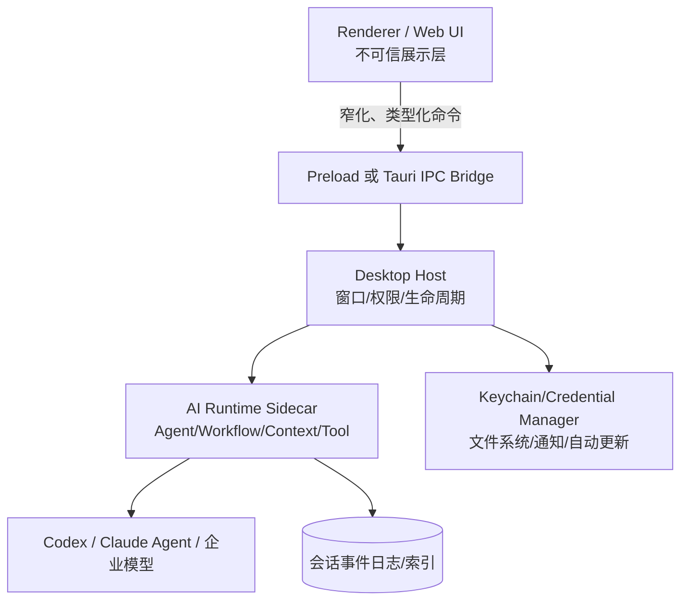

# AI 桌面客户端：边界、选型与总体架构

AI 桌面客户端要明确可信边界、桌面容器和进程分工。本地高权限能力留在受控 Host，Web、Extension 与 IDE 共用的协议放进 SDK。

## 1. 先定义桌面端的职责

桌面客户端是**受控的本地能力宿主**，负责用户身份接入、本地工作区授权、操作系统集成、Agent 进程托管、升级和崩溃恢复。模型协议、会话语义和事件定义放在 SDK 中。可以按四层组织：



关键判断是：UI 被 XSS 攻破后，攻击者能做什么？如果答案是“调用任意 Node API、读取任意路径、启动任意命令”，架构已经失败。Renderer 只能表达业务意图，例如 `workspace.select`、`agent.cancel`，不能得到 `fs`、`shell`、原始 IPC 或长期密钥。

## 2. Electron 与 Tauri 2 如何选

| 决策维度 | Electron | Tauri 2 |
|---|---|---|
| 渲染运行时 | 随应用携带 Chromium，跨机器一致 | 使用系统 WebView，体积小但平台差异更明显 |
| 主进程语言 | Node.js/TypeScript，团队上手快 | Rust Core，内存安全、原生接口和权限模型更强 |
| Agent SDK 亲和度 | Node SDK、CLI 托管最直接；`utilityProcess` 可隔离重活 | Node SDK 通常需打成 sidecar；Rust 与 JS 双栈复杂度更高 |
| 安全基线 | 能做好，但需正确配置 sandbox、context isolation、CSP、fuses | Capability/permission/scope 原生细粒度；Rust Core 代码仍需自行审计 |
| 包体与冷启动 | 较大；渲染一致性换空间 | 通常更小；系统 WebView 版本成为兼容矩阵 |
| 企业运维 | Electron 生态成熟、案例多 | 签名与 updater 完整，但 sidecar 多架构产物管理更重 |

不要用“包体大小”单点决策。可执行的 ADR 判据如下：

- 团队以 TypeScript 为主、需要快速复用 Codex/Claude Agent Node SDK、必须保证 Chromium 行为一致：优先 Electron。
- 已有 Rust 能力、核心诉求是小体积和细粒度本地权限、愿意维护 WebView/sidecar 矩阵：考虑 Tauri 2。
- 高风险命令执行无论选哪个，都放在独立 Runtime 进程；Tauri 不是自动安全，Electron 也不是天然不安全。
- 做 2 周纵向切片：同一套登录、选目录、启动 Agent、流式事件、取消、升级原型，实测首屏、RSS、安装包、崩溃隔离和签名流水线后再定型。

## 3. 推荐进程拓扑

### Electron

1. **Main**：窗口、菜单、协议、OS 权限、更新器、Runtime Supervisor；严禁运行长耗时推理循环。
2. **Preload**：唯一的 Renderer 权限门面，只暴露冻结的业务 API。
3. **Renderer**：React/Vue 等 UI；按“不可信 Web 内容”防护。
4. **Utility Process / sidecar**：运行统一 AI SDK、Provider 适配器、索引器。Electron 官方建议需要派生 Node 子进程时优先考虑 `utilityProcess`，它支持 MessagePort 且更贴合 Chromium 服务进程模型。
5. **Tool Sandbox**：执行 shell、浏览器、代码分析的更低权限子进程或容器；与保存密钥的进程分离。

### Tauri 2

WebView 仅调用声明过的 command；Rust Core 经 Runtime Authority 按 origin、window label、capability、permission、scope 授权。Node 版 Agent SDK应打成自包含 sidecar，由 Rust Supervisor 启动。`externalBin` 的每个目标架构都要带 target triple 后缀，并在 capability 中把可执行文件与参数模式列入 allow scope。

## 4. 把平台差异收敛成端口

业务层不得直接 import `electron` 或 `@tauri-apps/api`：

```ts
export interface DesktopPort {
  pickWorkspace(): Promise<{ grantId: string; displayPath: string }>;
  readSecret(ref: string): Promise<Uint8Array>; // 仅 Runtime 可注入此实现
  notify(input: { title: string; body: string }): Promise<void>;
  onLifecycle(cb: (e: "suspend" | "resume" | "shutdown") => void): () => void;
}

export interface RuntimeSupervisor {
  start(options: { version: string; workspaceGrant: string }): Promise<void>;
  health(): Promise<{ pid: number; protocol: string; busy: boolean }>;
  stop(reason: "upgrade" | "logout" | "shutdown"): Promise<void>;
}
```

`grantId` 比裸路径重要：授权服务保存“用户明确选择的根目录 + 读写范围 + 到期时间”，Runtime 每次操作都重新解析真实路径并校验仍在根目录内。这样未来 Web 端可把实现换成 File System Access API，IDE 端换成 workspace URI，业务协议不变。

## 5. 关键数据与非功能目标

按数据敏感度分区，而非全塞进 `userData`：

- 系统凭据库：refresh token、API key、设备私钥；数据库只存引用。
- 加密配置库：租户策略、Provider 配置、授权记录。
- 可恢复事件库：会话事件、turn 状态、工具审批；用 append-only + checkpoint。
- 可删除缓存：模型列表、索引块、缩略图；版本化并设磁盘配额。
- 脱敏诊断：trace ID、版本、错误分类；默认不采集 prompt、代码或命令输出。

建议首版 SLO：启动到可交互 P95 < 2.5 秒；取消指令到 Runtime 确认 P95 < 500 ms；UI 线程连续阻塞不得超过 50 ms；Runtime 崩溃后 5 秒内恢复并标记未决 turn；更新失败可回到上一可启动版本。数字要由产品场景校准，但必须在 ADR 中量化。

### 启动、关闭与多窗口的确定性顺序

启动顺序建议固定为：读取不可变 build manifest → 尽早启用 crash reporting → 打开最小配置与租户索引 → 初始化凭据库但不解密全部秘密 → 启动 Runtime 并完成版本/能力握手 → 注册 IPC → 创建窗口 → 恢复 session 快照 → 最后检查更新。若先创建窗口再注册 IPC，首屏可能发出丢失的请求；若握手失败仍开放工作区按钮，用户会得到一串无因果的错误。

关闭也不是直接 `app.quit()`：先广播 `shutdown.requested`，停止接收新 turn；对运行中工具按风险选择等待、checkpoint 或请求取消；提交事件游标与数据库 WAL；撤销 credential lease；优雅停止 Runtime；最后销毁窗口。设置总 deadline，超时后才 forced kill，并在下一次启动产生 `recovery_required`。系统关机、应用更新和用户退出可使用不同 deadline，但都复用同一状态机。

多窗口不要共享隐式“当前租户/当前 workspace”。每个窗口创建不可伪造的 `windowContextId`，Main 映射到 tenant、session 与 grant；所有 IPC 都从 sender 找 context，拒绝由 Renderer 自报 tenant。辅助预览窗口只拿只读 capability，登录窗口不拿 workspace capability。这样既降低跨窗口 confused-deputy 风险，也让未来支持多组织并行变得可解释。

架构评审时还要回答容量问题：单 Runtime 托管全部 session 还是按租户/工作区分片？前者资源省但故障域大，后者隔离强但进程多。通常先用一个 Supervisor 管多个按工作区分片的 worker，给总 CPU、RSS、并发 turn、事件队列和磁盘缓存设配额；UI 只展示排队与资源不足事实，不自行启动第二套未受控 Runtime。

## 6. 生产失败模式

- **Main 进程兼做 Runtime**：一次同步文件遍历冻结所有窗口。解决：隔离进程、流式分页、事件循环延迟告警。
- **按 Provider 直接写 UI**：切换供应商时状态机和文案遍地分叉。解决：统一事件协议与 capability 驱动 UI。
- **Tauri sidecar 只构建本机架构**：Intel Mac 或 Windows ARM 安装后无法启动。解决：CI 产物矩阵、安装后 smoke test、哈希清单。
- **恢复只靠“重新发 prompt”**：可能重复执行写文件/付款类工具。解决：turn ID、tool call ID、幂等键和终态日志。
- **把自动更新等同于覆盖二进制**：数据 schema 已前滚却无法后退。解决：expand/contract 数据迁移和兼容窗口。

## 7. 关联知识

继续阅读：[进程与类型化 IPC](process-ipc.md)、[桌面安全与密钥](security.md)、[Provider 适配](provider-adapters.md)、[打包、更新与恢复](distribution.md)。统一协议见 [统一 SDK 总览](../04-sdk/overview.md)。

## 8. 实战练习与验收

为“选择目录后让 Agent 只读分析代码”写一份 ADR，并做 Electron 与 Tauri 纵向原型。

验收条件：能画出至少四个信任域；Renderer 无 Node/Rust 原始能力；越界路径被拒绝；Runtime 被强杀后 UI 不退出且可恢复；两种平台都通过 macOS arm64/x64 与 Windows x64 的最小构建矩阵；ADR 包含实测 RSS、安装包、冷启动和团队维护成本。

## 官方资料（核对时间：2026-08）

- [Electron Process Model](https://www.electronjs.org/docs/latest/tutorial/process-model)
- [Electron utilityProcess](https://www.electronjs.org/docs/latest/api/utility-process)
- [Tauri Project Structure](https://v2.tauri.app/start/project-structure/)
- [Tauri Runtime Authority](https://v2.tauri.app/security/runtime-authority/)
- [Tauri Embedding External Binaries](https://v2.tauri.app/develop/sidecar/)
