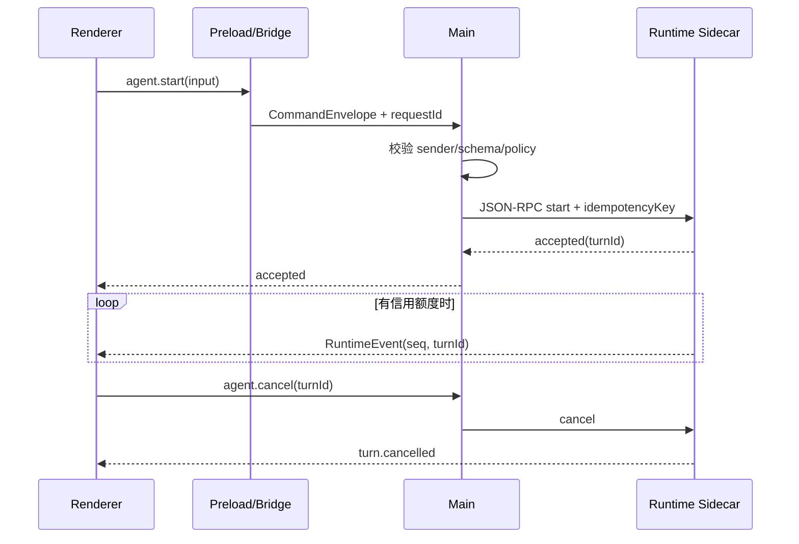

# 进程模型与类型化 IPC

> IPC 是桌面应用的安全 API。每条消息都要可验证、可取消、可背压、可审计；版本不一致时要明确失败。

## 1. 命令、查询与事件先分开

- **Command**：改变状态，如 `agent.start`、`tool.approve`；必须有 `requestId`、调用者、截止时间和幂等语义。
- **Query**：读取快照，如 `session.get`；返回有限大小且可分页。
- **Event**：事实广播，如 `turn.output.delta`；事件已发生，消费者不能用“返回值”改变它。



不要把大流量 token delta 走 `ipcRenderer.invoke` 一问一答。命令走 request/response；事件流用 `MessagePort`、Tauri `Channel` 或 sidecar 的 framed stream，并显式设计水位线。

## 2. 协议先于实现

下面是一份可直接实现的 TypeScript 合约。Zod 只示范一种运行时校验方式，生产中也可由 JSON Schema/Protobuf 生成类型。

```ts
import { z } from "zod";

const StartAgent = z.object({
  workspaceGrant: z.string().uuid(),
  prompt: z.string().min(1).max(200_000),
  clientRequestId: z.string().uuid(),
});

const Commands = {
  "agent.start": StartAgent,
  "agent.cancel": z.object({ turnId: z.string().min(1) }),
} as const;

type CommandName = keyof typeof Commands;
type Input<K extends CommandName> = z.infer<(typeof Commands)[K]>;

export type RpcResult<T> =
  | { ok: true; value: T }
  | { ok: false; error: { code: string; message: string; retryable: boolean } };
```

协议包应同时包含 `protocolVersion`、`minPeerVersion` 和 feature bits。字段只追加不改义；未知事件可忽略，未知命令必须返回 `METHOD_NOT_SUPPORTED`。不要把 Provider 原始对象跨进程传输：其中可能含不可 structured-clone 的类实例、循环引用或敏感头。

## 3. Electron：窄化 preload，而非暴露 ipcRenderer

```ts
// preload.ts
import { contextBridge, ipcRenderer } from "electron";

const api = Object.freeze({
  startAgent: (input: unknown) => ipcRenderer.invoke("agent.start", input),
  cancelAgent: (turnId: string) => ipcRenderer.invoke("agent.cancel", { turnId }),
  onRuntimeEvent: (fn: (event: unknown) => void) => {
    const listener = (_event: Electron.IpcRendererEvent, payload: unknown) => fn(payload);
    ipcRenderer.on("runtime.event", listener);
    return () => ipcRenderer.removeListener("runtime.event", listener);
  },
});
contextBridge.exposeInMainWorld("desktopAI", api);
```

主进程必须验证 payload **和 sender**：

```ts
// main/ipc.ts
import { ipcMain } from "electron";

function trusted(event: Electron.IpcMainInvokeEvent): boolean {
  const url = new URL(event.senderFrame.url);
  return url.protocol === "app:" && url.host === "ui";
}

ipcMain.handle("agent.start", async (event, raw) => {
  if (!trusted(event)) throw new Error("UNTRUSTED_IPC_SENDER");
  const input = StartAgent.parse(raw);
  return supervisor.request("agent.start", input, { deadlineMs: 30_000 });
});
```

不要把 event 对象传回 Renderer；Electron 官方明确指出它包含 `sender` 等原始能力。每个方法单独暴露，给 Renderer 的 `.d.ts` 从同一 schema 生成。

## 4. Runtime 流、背压与取消

事件信封建议如下：

```ts
type RuntimeEvent = {
  schema: "ai.runtime.event/v1";
  sessionId: string;
  turnId: string;
  runId: string;
  runSeq: number;              // Runtime 内部：单个 Run 内严格递增
  at: string;
  traceId: string;
  payload: unknown;
};
```

Runtime 维护每个订阅者的 credit，例如 UI 初始授权 128 条；消费后批量 `ACK(runId, lastRunSeq, +64)`。`runSeq` 只恢复一条 Run 流；统一 SDK 若提供 session 级订阅，由 Gateway 为聚合流另行分配 `sessionSeq`，同时保留原 `runSeq`，两类 cursor 不可混用。超过高水位时优先合并 `text.delta`，但绝不丢 `tool.requested`、`turn.failed`、`turn.completed`。取消使用 `AbortSignal` 贯穿 Main → Adapter → Provider；超过 grace period 后终止子进程，并把状态记为 `cancelled_forced`，不能假装 Provider 已正常取消。

Sidecar stdio 若使用 JSONL，stdout 必须只输出协议，日志一律 stderr；单行设最大字节数，解析失败后断开并上报。更稳妥的是长度前缀帧：`4-byte big-endian length + UTF-8 JSON`，可抵抗换行和半包问题。

## 5. Tauri 2：command + capability + Channel

Rust command 同样做输入校验和状态检查；只注册 command 不等于完成授权设计。对插件和 sidecar 操作，要在 capability 中限定窗口、平台、可执行文件与参数。

```rust
#[derive(serde::Deserialize)]
#[serde(rename_all = "camelCase", deny_unknown_fields)]
struct CancelInput { turn_id: String }

#[tauri::command]
async fn cancel_agent(
    input: CancelInput,
    state: tauri::State<'_, RuntimeState>,
) -> Result<(), ApiError> {
    if input.turn_id.len() > 128 { return Err(ApiError::invalid("turnId")); }
    state.supervisor.cancel(&input.turn_id).await
}
```

事件流可用 `tauri::ipc::Channel`（具体泛型签名以锁定的 Tauri 版本为准），不要为每个 token 建一次全局 emit；后者缺少自然背压。远程 origin 默认不得调用本地 command。

## 6. Supervisor 与状态机

Runtime 状态至少是：`stopped → starting → ready → draining → stopped`，任意阶段可进入 `failed(backoffUntil)`。启动握手交换协议版本、binary hash、capabilities；健康检查应验证事件循环响应，而不仅是 PID 存在。采用有上限的指数退避并设置熔断：60 秒内崩溃 5 次就停止自动重启，给用户导出脱敏诊断的入口。

UI 订阅单个 Run 时，重连发送 `(runId, lastSeenRunSeq)`，Runtime 从该 Run 的持久事件日志回放；订阅 SDK session 聚合流时则发送 `lastSeenSessionSeq` 给 Gateway，二者不可混用。若对应历史已被 compaction，则返回同一 cursor scope 的快照 + 新起始序号。切勿依赖内存 EventEmitter 恢复关键状态。

### Command ledger：解决“到底执行了没有”

网络/进程 IPC 最大的工程难题不是超时，而是超时后的不确定性。Main 在转发有副作用的命令前，把 `(tenantId, clientRequestId, commandDigest)` 写入 ledger，状态为 `received`；Runtime 接受后记录 `accepted(turnId)`；终态再写 `completed/failed/cancelled`。同一 idempotency key 与相同 digest 重试时返回原记录，不再执行；key 相同但 digest 不同返回 `IDEMPOTENCY_CONFLICT`。ledger 的写入和业务事件提交要在同一事务边界或采用 outbox，否则仍会出现“工具已执行、记录没写”的双写裂缝。

查询接口 `command.status(requestId)` 必须在 client timeout 后仍可用。UI 因此能区分“确定失败”“仍在执行”“结果未知需人工恢复”，不能把一切 timeout 都变成红色失败并允许再次点击。只读查询可以有限自动重试；写文件、提交代码等命令只有具备 ledger 证据才能重试。

### MessagePort 与序列化细节

Electron structured clone 不会保留 class prototype、Error 自定义字段或某些 Node 对象，`Buffer` 跨边界也应规范成 `Uint8Array/BlobRef`。传 `MessagePort` 后所有权发生转移，原端不可继续使用；端口要有显式 hello、close、heartbeat 与 generation ID，防止旧窗口端口在重载后继续消费新 session 的事件。

对高频流，Main 不必反序列化再序列化每个 token；可以验证首帧/握手后把受控 port 连接给 Runtime，但授权仍由 Main 建立，Runtime 仍验证 session。观察指标至少包含 command queue depth、IPC 往返 P95、decode failure、event lag（latestSeq - committedSeq）、forced cancel 和 Supervisor restart reason，且不得把 payload 当 metric label，避免高基数与敏感数据泄漏。

### 调度、优先级与租户隔离

IPC 收到快不代表 Runtime 消费得过来。Main/Runtime 之间设置有界 command queue，并按租户和 session 做加权公平：cancel、approval resolve、heartbeat 等控制命令优先于新 run；交互 turn 优先于后台索引；同 session 的有序 command 不能被跨越。队满返回带 retry hint 的 `RESOURCE_EXHAUSTED`，不能把所有 Promise 留在内存里。优先队列还要防饿死，例如后台任务等待超过阈值后提升一次权重。

每个 envelope 从已认证连接上下文取得 tenant/user/device，传入 payload 的相同字段只用于一致性比对。Main 到 Runtime 的本地连接也建立 principal：哪个窗口、插件或 IDE extension 发起，具有什么 capability。Runtime 不应因为消息“来自 Main”就跳过 workspace、tool policy 和审批检查，否则 Main 中一个 confused-deputy bug 会变成全权限执行。

流订阅同样受授权约束。客户端只能订阅归属自己的 session，重连 cursor 必须在该 session 的保留范围内；错误响应不区分“session 不存在”和“存在但无权”，避免枚举。多窗口共享 session 时为每个 subscriber 维护独立 credit/cursor，一个隐藏窗口卡顿不能阻塞可见窗口，也不能用 ACK 冒充另一个 subscriber 已提交。

进程退出要处理半关闭：pipe 可读端 EOF 不代表所有写入都已落盘，先停止发送，等待 Runtime 的 `drained(lastCommittedSeq)`，再关闭端口。若主进程即将被系统强杀，至少 fsync command/event ledger 并写一个小型 shutdown marker；下一次启动看到 marker 缺失，就走非正常恢复而不是相信缓存中的 running 状态。

协议错误要按连接计数并熔断。单条非法用户输入返回 validation error；连续坏帧、超限或伪造 requestId 表明 peer 已损坏/恶意，应断开并记录安全事件。不要把解析异常堆栈和原始 payload 回显给 Renderer，它可能包含路径、secret 或攻击字符串。

## 7. 生产失败模式

- **重复注册 handler/listener**：窗口热重载后一次点击执行多次。集中注册，unsubscribe 可重复调用，测试 listener 数量。
- **无界 token 事件**：Renderer 卡顿后 Main 内存暴涨。信用窗口、合并 delta、总队列配额。
- **请求超时但后台仍写文件**：UI 显示失败，工具继续执行。超时必须触发取消并等待确定性终态。
- **只做 TypeScript 类型不做运行时校验**：跨进程输入本质不可信。边界处 schema parse，错误不回显堆栈。
- **版本升级半完成**：新 UI 向旧 sidecar 发新命令。握手能力协商、双版本 contract test、原子切换。

## 8. 练习与验收

关联：[安全与密钥](security.md)、[事件协议](../04-sdk/contracts-events.md)、[Transport 与扩展](../04-sdk/transport-extensions.md)。

练习：实现一个可流式输出、取消和断线重放的 `agent.start`。验收：伪造 sender 被拒；1 MB payload 被拒；10 万条 delta 不使队列无界增长；取消后 1 秒内出现终态；杀掉 Runtime 后按 `lastSeenRunSeq` 恢复；新客户端连接旧 Runtime 时能明确降级而非崩溃。

## 参考资料

- [Electron IPC Tutorial](https://www.electronjs.org/docs/latest/tutorial/ipc)
- [Electron Context Isolation](https://www.electronjs.org/docs/latest/tutorial/context-isolation)
- [Electron utilityProcess](https://www.electronjs.org/docs/latest/api/utility-process)
- [Tauri Runtime Authority](https://v2.tauri.app/security/runtime-authority/)
- [Tauri Capabilities](https://v2.tauri.app/security/capabilities/)
- [Tauri Inter-Process Communication](https://v2.tauri.app/concept/inter-process-communication/)
