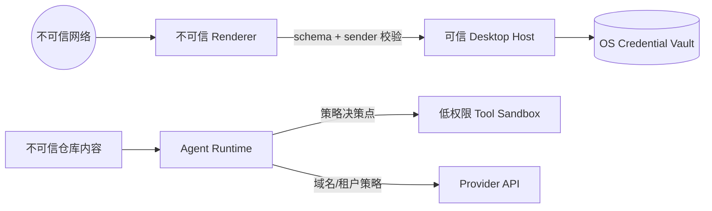

# 桌面安全：沙箱、权限、工作区与密钥

> 安全目标：假设 Renderer 已被 XSS 控制、Provider 输出包含恶意指令、仓库中存在提示注入文件，攻击者仍不能越权读取密钥、访问未授权目录或静默执行高风险工具。

## 1. 资产、主体与边界

从数据流威胁模型开始；安全开关只能作为后续控制。

| 资产 | 典型威胁 | 主要控制 |
|---|---|---|
| API key、refresh token、设备证书 | XSS/日志/崩溃转储泄漏 | OS 凭据库、进程分离、短期令牌、脱敏 |
| 源代码与企业文档 | 越界读取、上传给错误 Provider | workspace grant、egress policy、审计 |
| 工具执行能力 | prompt injection 触发命令、供应链脚本 | 参数化工具、审批、沙箱、最小权限 |
| 更新产物与 sidecar | 更新源劫持、二进制替换 | 签名、哈希、原子安装、反回滚策略 |
| 会话与上下文 | 跨租户混淆、缓存残留 | tenant-scoped key、加密、生命周期清理 |



信任不能沿调用链自动传递：Main 收到“用户点击了批准”仍需绑定 `toolCallId + 参数摘要 + sessionId + 有效期`，避免批准一个命令却执行另一个。

## 2. Electron 加固基线

```ts
import { BrowserWindow, shell } from "electron";

const win = new BrowserWindow({
  webPreferences: {
    preload: path.join(__dirname, "preload.js"),
    nodeIntegration: false,
    contextIsolation: true,
    sandbox: true,
    webSecurity: true,
  },
});

win.webContents.setWindowOpenHandler(({ url }) => {
  if (isAllowedHttps(url)) void shell.openExternal(url);
  return { action: "deny" };
});
win.webContents.on("will-navigate", (event, url) => {
  if (!isOwnAppUrl(url)) event.preventDefault();
});
```

这里 `setWindowOpenHandler` 即使允许外链也应先 `deny`，再由 Main 校验后调用 `shell.openExternal`；不要让新窗口继承意外权限。进一步要求：

- 本地 UI 使用自定义 `app://` 协议，不依赖高权限 `file://`；CSP 至少从 `default-src 'self'; script-src 'self'; object-src 'none'; base-uri 'none'` 起步。
- 所有加载远程内容的 session 设置 `setPermissionRequestHandler`；相机、麦克风、通知、剪贴板逐项决策。
- 不向 Web 内容暴露原始 `ipcRenderer`、`shell`、`webContents` 或可传任意路径/命令的通用函数。
- 发布时配置 Electron fuses：通常关闭 `runAsNode`、`nodeOptions`、`nodeCliInspect`，启用 ASAR integrity 与 only-load-from-ASAR；以实际需求验证，`runAsNode` 会影响 `child_process.fork`，可改用 Utility Process。
- 跟进受支持的 Electron 版本。框架、Chromium、Node 和 NPM 依赖共同构成攻击面。

## 3. Tauri 2 能力不是全局 allowlist

Capability 要按窗口和职责拆分。一个窗口落入多个 capability 时权限会合并，因此不要把 `windows: ["*"]` 当默认模板。

```json
{
  "$schema": "../gen/schemas/desktop-schema.json",
  "identifier": "workspace-picker",
  "windows": ["main"],
  "platforms": ["macOS", "windows"],
  "permissions": ["dialog:allow-open"]
}
```

Sidecar 权限还需把 `shell:allow-spawn` 的 `name`、`sidecar: true` 和参数规则写入 scope。动态参数应使用严格正则；不要设 `args: true`。Tauri Runtime Authority 能阻止未授权 origin 调用 command，但不能修复有漏洞的 Rust command、过宽 scope、供应链攻击或系统 WebView 0-day。

## 4. 密钥生命周期

长期秘密只进 Keychain（macOS）或 Credential Manager/DPAPI（Windows）。Electron `safeStorage` 可用于加密小块数据，但应先检查 `isEncryptionAvailable()`；Linux 行为另有差异。这里聚焦 Windows/macOS，仍要避免把它当成跨平台 HSM。Tauri 可通过审核过的 stronghold/keyring 方案或原生实现，关键是建立 `SecretStore` 端口。

```ts
interface SecretStore {
  put(scope: { tenant: string; provider: string }, secret: Uint8Array): Promise<string>;
  withSecret<T>(ref: string, use: (bytes: Uint8Array) => Promise<T>): Promise<T>;
  delete(ref: string): Promise<void>;
}

// 返回 ref，不把 key 发给 Renderer；日志也不得输出 bytes。
const credentialRef = await secrets.put({ tenant: "t-1", provider: "openai" }, key);
```

Sidecar 启动时不要把 key 放在命令行（可被进程列表看到），也避免长期继承整个 `process.env`。更安全的做法：Main 与已校验哈希的 Runtime 建立本地 authenticated channel，发放只在内存中存在的短期访问令牌；退出、登出、租户切换立即撤销。崩溃转储和 debug bundle 默认剔除 header、prompt、环境变量与路径中的用户名。

## 5. 工作区授权与路径安全

```ts
import { realpath } from "node:fs/promises";
import path from "node:path";

async function resolveGranted(root: string, candidate: string) {
  const [realRoot, realTarget] = await Promise.all([realpath(root), realpath(candidate)]);
  const rel = path.relative(realRoot, realTarget);
  if (rel === "" || (!rel.startsWith(".." + path.sep) && rel !== "..")) return realTarget;
  throw new Error("PATH_OUTSIDE_GRANT");
}
```

这只是起点：打开文件前后还可能发生 symlink/TOCTOU 竞态。高风险写操作应使用目录句柄相对访问、`O_NOFOLLOW`（平台允许时）、原子临时文件 + rename，并在 Tool Sandbox 中限制 OS 可见路径。Windows 还要标准化盘符大小写、UNC、junction、`\\?\` 长路径；macOS 要考虑 alias、大小写不敏感卷与 TCC 授权。

Grant 应包含：规范化根、允许动作（read/write/execute）、排除 glob、租户、创建来源、到期时间。路径检查只解决“在哪里”，还需数据出站策略解决“能否发送”：Provider allowlist、代理、证书、租户区域与敏感文件规则。

## 6. 工具审批与提示注入

不要让模型直接拼 shell 字符串。优先设计结构化工具，例如 `git.status({cwdGrant})`、`file.patch({path, diff})`；确需 shell 时展示可执行文件、参数、cwd、环境差异与影响摘要。审批票据：

```ts
type Approval = {
  toolCallId: string;
  argsDigest: string;      // canonical JSON 的 SHA-256
  decision: "allow-once" | "deny";
  expiresAt: number;
};
```

“始终允许”必须绑定工具 + 参数范围 + workspace + 租户，并可在设置中撤销。来自 README、网页、MCP resource 的内容都是数据，不是系统指令；运行时应标记来源，限制它改变权限策略。审批 UI 不接受 Provider 自己生成的风险说明作为唯一依据，风险由本地策略引擎计算。

### 企业身份、代理与租户切换

桌面端常同时处理用户身份、设备身份和 Provider 凭据，三者不能混成一个 token。用户 OIDC token 用于企业控制面；设备证书用于设备合规与 mTLS；Provider lease 只允许指定模型/API。每种 token 都校验 issuer、audience、tenant、scope、expiry，刷新失败时进入可恢复的 `auth_required`，不能降级到个人默认账号。浏览器登录回调使用随机 state、PKCE、固定自定义协议路径，并防止第二实例抢走回调。

企业代理可能进行 TLS inspection。产品应使用系统信任库还是自带 CA bundle，必须形成明确策略；不要遇到证书错误就关闭校验。代理认证凭据进入 OS vault，Runtime 只得到按目标 host 使用的短期 lease。网络层记录错误类别和证书主体摘要，不记录 Authorization/Proxy-Authorization。

租户切换是一项安全事务：drain 当前 turn，关闭订阅，清除 Renderer 内存状态与剪贴板临时内容，撤销旧租户 lease，清理分区 cookie/cache，重新计算插件和 workspace grant，再开放新会话。所有缓存 key 必须含 tenant；“最近 workspace”也可能泄漏项目名称。Windows/macOS 的通知正文、任务栏最近文件、崩溃截图和屏幕录制同样属于数据出口，应提供管理员策略与隐私模式。

审计事件记录“谁在何时通过哪个客户端，以何策略批准了哪个参数摘要，结果为何”，但审计不等于全量录屏。对 prompt、代码、tool output 使用内容引用和分类标签，只有具备调查权限的人通过二次授权访问；设置保留期、导出和删除流程，并保证审计写入失败时高风险工具 fail closed。

## 7. 生产失败模式

- **key 存 localStorage/SQLite 明文**：Renderer 被攻破即全部泄漏。迁移到系统凭据库并轮换旧 key。
- **Main 校验扩展名、Runtime 使用真实路径**：symlink 绕过。授权点和使用点使用同一规范化/句柄策略。
- **CSP 有 `unsafe-eval` 且加载 CDN**：供应链脚本得到桌面桥权限。本地打包资源、nonce/hash、去掉动态执行。
- **批准与工具参数未绑定**：竞态替换参数。审批签名覆盖 canonical arguments。
- **日志“排障方便”记录完整输入**：诊断包成为数据外泄通道。字段级分类、默认脱敏、用户预览后导出。

## 8. 练习与验收

关联：[类型化 IPC](process-ipc.md)、[Provider 适配](provider-adapters.md)、[统一 SDK 插件安全](../04-sdk/transport-extensions.md)。

练习：给桌面客户端写威胁模型并实现 workspace grant。验收：XSS 测试无法得到 Node/Tauri 原始 API；`../`、symlink、junction 越界被拒；伪造审批摘要失败；进程列表、日志、crash dump 不出现 API key；远程页面请求摄像头与任意 navigation 被拒；安全 fuses/capabilities 在 CI 自动校验。

## 参考资料

- [Electron Security Checklist](https://www.electronjs.org/docs/latest/tutorial/security)
- [Electron Context Isolation](https://www.electronjs.org/docs/latest/tutorial/context-isolation)
- [Electron Fuses](https://www.electronjs.org/docs/latest/tutorial/fuses)
- [Tauri Security](https://v2.tauri.app/security/)
- [Tauri Capabilities](https://v2.tauri.app/security/capabilities/)
- [Tauri Runtime Authority](https://v2.tauri.app/security/runtime-authority/)
