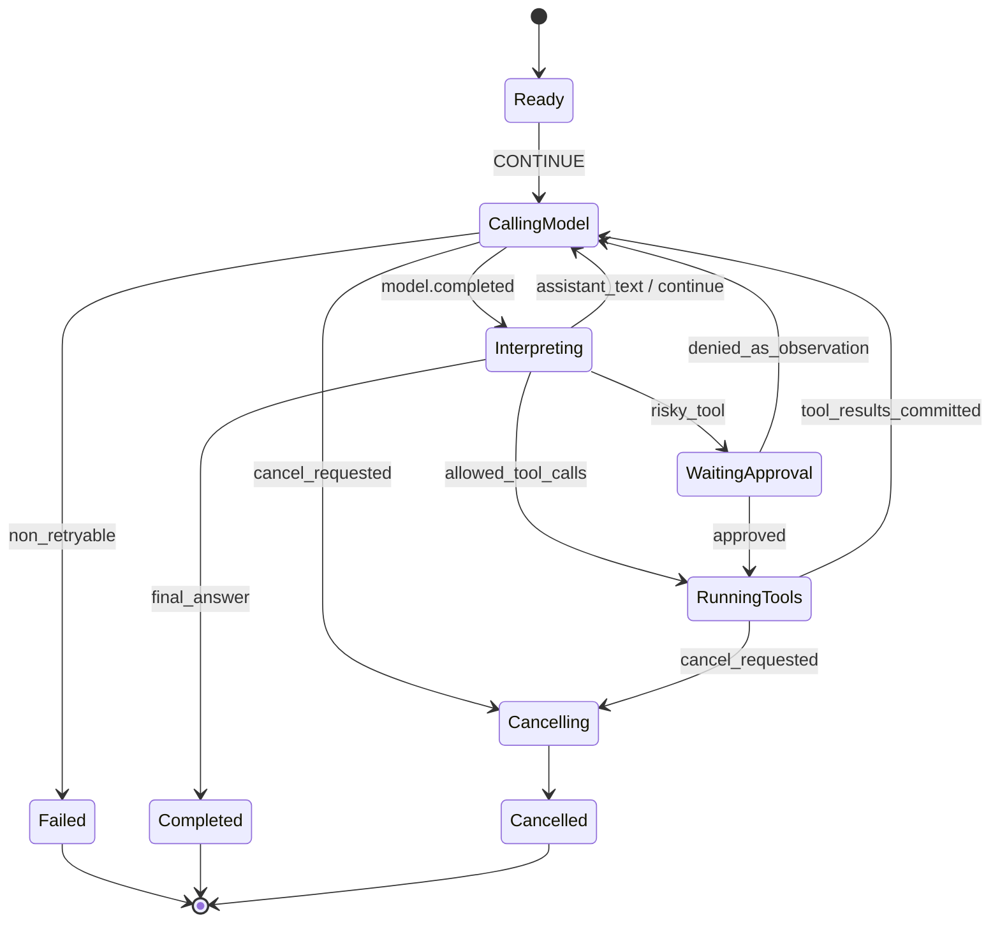

# Agent Loop：事件驱动状态机，而不是无限 `while`

Agent 循环负责有限决策和动作提议，Runtime 负责审批、取消、恢复与终止。先看状态机，再看它与 Workflow 引擎的边界。

## 1. Agent 的本质：受约束的策略执行器

Agent 可以抽象为：在状态 `S` 下，根据观测 `O` 和策略（模型 + 硬规则）选择动作 `A`，环境返回新观测，再次决策。模型并不是状态机本身，它只是一个不确定的动作提议器。终止条件、权限、回合上限和状态转移必须由 Runtime 掌握。

一次可靠循环至少经历：构建上下文 → 调用模型 → 解析结构化输出 → 校验动作 → 执行或请求批准 → 记录结果 → 判断终止。模型输出永远不直接触发副作用。



## 2. 状态与事件应是判别联合

不要用十几个布尔值表示状态：`isRunning=true, isWaiting=true, cancelled=false` 会产生非法组合。TypeScript 的判别联合让非法转移在编译和测试阶段暴露。

```ts
type ToolCall = { callId: string; name: string; args: unknown };
type ToolResult = { callId: string; ok: boolean; output: unknown };

type AgentState =
  | { tag: "ready"; turn: number }
  | { tag: "calling_model"; turn: number; requestId: string }
  | { tag: "waiting_approval"; turn: number; approvalId: string; calls: ToolCall[] }
  | { tag: "running_tools"; turn: number; batchId: string; calls: ToolCall[] }
  | { tag: "completed"; answer: string }
  | { tag: "failed"; code: string; retryable: boolean }
  | { tag: "cancelled"; reason?: string };

type AgentEvent =
  | { type: "RunStarted" }
  | { type: "ModelRequested"; requestId: string }
  | { type: "ModelProposedFinal"; text: string }
  | { type: "ModelProposedTools"; calls: ToolCall[] }
  | { type: "ApprovalRequested"; approvalId: string; calls: ToolCall[] }
  | { type: "ApprovalResolved"; approvalId: string; allowed: boolean }
  | { type: "ToolsDispatched"; batchId: string; calls: ToolCall[] }
  | { type: "ToolsFinished"; results: ToolResult[] }
  | { type: "RunFailed"; code: string; retryable: boolean }
  | { type: "CancelRequested"; reason?: string };
```

状态是事件折叠后的缓存；事件才是可审计事实。Reducer 必须纯净：不能取当前时间、不能随机、不能发网络请求。

## 3. 纯 Reducer 与 Effect Command

```ts
type Command =
  | { type: "CallModel"; requestId: string; turn: number }
  | { type: "AskApproval"; approvalId: string; calls: ToolCall[] }
  | { type: "ExecuteTools"; batchId: string; calls: ToolCall[] }
  | { type: "AppendObservation"; text: string }
  | { type: "PublishFinal"; text: string }
  | { type: "Stop" };

type Reduced = { state: AgentState; commands: Command[] };

export function reduce(state: AgentState, event: AgentEvent): Reduced {
  const terminal = state.tag === "completed" || state.tag === "failed" || state.tag === "cancelled";
  if (terminal) {
    // 终态不可被晚到的取消、模型回调或工具回调覆盖；原始事件进入诊断流。
    return { state, commands: [] };
  }
  if (event.type === "CancelRequested") {
    return { state: { tag: "cancelled", reason: event.reason }, commands: [{ type: "Stop" }] };
  }

  switch (state.tag) {
    case "ready": {
      if (event.type !== "RunStarted") return { state, commands: [] };
      const requestId = `model:${state.turn}`; // 生产中由确定性 ID 工厂生成
      return {
        state: { tag: "calling_model", turn: state.turn, requestId },
        commands: [{ type: "CallModel", requestId, turn: state.turn }]
      };
    }
    case "calling_model": {
      if (event.type === "ModelProposedFinal") {
        return {
          state: { tag: "completed", answer: event.text },
          commands: [{ type: "PublishFinal", text: event.text }]
        };
      }
      if (event.type === "ModelProposedTools") {
        const risky = event.calls.some(c => c.name.startsWith("write_") || c.name === "shell");
        if (risky) {
          const approvalId = `approval:${state.turn}`;
          return {
            state: { tag: "waiting_approval", turn: state.turn, approvalId, calls: event.calls },
            commands: [{ type: "AskApproval", approvalId, calls: event.calls }]
          };
        }
        const batchId = `tools:${state.turn}`;
        return {
          state: { tag: "running_tools", turn: state.turn, batchId, calls: event.calls },
          commands: [{ type: "ExecuteTools", batchId, calls: event.calls }]
        };
      }
      break;
    }
    case "waiting_approval": {
      if (event.type !== "ApprovalResolved" || event.approvalId !== state.approvalId) break;
      if (!event.allowed) {
        // 拒绝也成为下一轮模型可见的观测，避免 Run 无解释地回到 ready。
        return {
          state: { tag: "ready", turn: state.turn + 1 },
          commands: [{ type: "AppendObservation", text: "用户拒绝了高风险工具调用，请调整计划。" }]
        };
      }
      const batchId = `tools:${state.turn}`;
      return {
        state: { tag: "running_tools", turn: state.turn, batchId, calls: state.calls },
        commands: [{ type: "ExecuteTools", batchId, calls: state.calls }]
      };
    }
    case "running_tools": {
      if (event.type === "ToolsFinished") {
        return { state: { tag: "ready", turn: state.turn + 1 }, commands: [] };
      }
      break;
    }
  }
  return { state, commands: [] };
}
```

示例为了聚焦省略了“工具结果已写入上下文后再发 `RunStarted/ContinueRequested`”的事件。生产实现不应靠外部调用者猜测何时继续；可以新增 `ObservationCommitted`，由 reducer 生成下一次 `CallModel`。

## 4. 驱动器：先落事实，再执行命令

正确顺序是：接收事件 → 乐观锁追加 → reduce → 保存状态快照 → 持久化 Command/Outbox → 异步执行。若先调用工具再写事件，进程恰好崩溃就无法判断工具是否执行；若只写“准备执行”而没有幂等键，恢复时可能执行两次。

```ts
interface Store {
  load(runId: string): Promise<{ state: AgentState; seq: number }>;
  commit(input: {
    runId: string; expectedSeq: number; event: AgentEvent;
    next: AgentState; commands: Command[];
  }): Promise<void>; // 同一事务写 event + snapshot + outbox
}

async function dispatch(store: Store, runId: string, event: AgentEvent): Promise<void> {
  for (let retry = 0; retry < 3; retry++) {
    const current = await store.load(runId);
    const next = reduce(current.state, event);
    try {
      await store.commit({ runId, expectedSeq: current.seq, event, next: next.state, commands: next.commands });
      return;
    } catch (e) {
      if (!(e instanceof OptimisticConflict)) throw e;
    }
  }
  throw new Error(`run ${runId} is contended`);
}

class OptimisticConflict extends Error {}
```

Outbox worker 用 `commandId` claim 命令、执行后写回结果事件。一次进程只能持有 Run lease，但幂等不能只依赖 lease，因为 lease 可能在长 GC、休眠或网络分区时过期。

### 4.1 把不变量写进模型之外

高级工程实践是先列不变量，再实现状态：每个 Run 最多一个终态；终态不可回到活动态；一个 `callId` 只能对应一个规范化工具调用；工具终态必须引用已有的 dispatch；批准只能消费一次且参数哈希一致；`turn` 只能递增；任何可见 Final 都必须来自已提交事件。每次 `reduce` 后运行断言，发现历史损坏时隔离 Run，而不是“尽量继续”制造新副作用。

事件 schema 也要演进。给 payload 使用显式版本和 upcaster，例如把旧版 `ToolDone { text }` 升级成新版 `ToolFinished { status, content }`，Reducer 只消费当前内存版本。不要修改旧事件；否则同一历史在新旧 worker 上含义不同。未知事件默认暂停并报警，不能静默忽略可能影响权限或终止的事实。

Command ID 应由稳定输入确定，例如 `runId/turn/commandType/index`，而不是每次重放随机生成。执行器保存 command 的 `pending/running/succeeded/failed/unknown`；`unknown` 表示进程可能已完成外部动作但没有收到确认，需要查询或人工处理。这样“重试”成为明确状态转移，而不是 catch 后递归调用。

### 4.2 错误也要成为领域事件

区分 provider 限流、上下文超限、模型拒绝、参数解析失败、工具业务拒绝、权限拒绝和 Runtime 缺陷。只有策略认定可重试的错误才生成 RetryScheduled，并把 attempt、退避截止时间和预算影响写入事件。模型可以看到经过脱敏、可行动的工具错误，但不应看到内部堆栈。相同错误连续出现时，循环策略应切换方案、请求人工或失败退出，而不是不断把同一句错误喂回模型。

## 5. 模型输出如何进入状态机

Provider Adapter 要把不同 SDK 的流式事件规范化为领域事件：

```ts
type ModelDelta =
  | { type: "text_delta"; text: string }
  | { type: "tool_arg_delta"; callId: string; name?: string; json: string }
  | { type: "usage"; input: number; output: number }
  | { type: "done"; finishReason: string };
```

增量只用于 UI 和临时聚合；只有完整工具参数通过 JSON/schema 校验后，才能产生 `ModelProposedTools`。不要在每个 `tool_arg_delta` 上执行。还要处理：同轮多个 tool call、无效 JSON、重复 `callId`、模型同时产生文字与工具、未知 finish reason。

**串行还是并行工具**：只有声明为只读、彼此无数据依赖且资源预算允许的调用才并行。写操作默认串行；并行结果回填时保持模型原始 call 顺序，避免非确定性上下文。

## 6. 终止、预算与防循环

至少设置四类预算：`maxTurns`、总 token、总工具次数/并发、wall-clock deadline。终止不能只依赖模型说“完成”：

- Final 必须符合输出 schema 或产品完成条件；
- 连续 N 次同名同参工具调用，触发 loop detector；
- 连续工具错误应让模型获得结构化失败，达到阈值后失败或降级；
- 预算耗尽应产生明确 `BudgetExceeded`，而不是伪装成普通回答。

可以用标准化参数哈希检测循环：`sha256(toolName + canonicalJson(args))`。注意搜索翻页、轮询状态等调用参数可能相同但语义合理，应允许工具声明 `repeatPolicy`。

## 7. Handoff、多 Agent 与 Workflow 的边界

Handoff 是“更换下一轮决策策略”，不是启动一个没有父子关系的新聊天。应记录 from/to agent、转交原因、传递的上下文视图和预算。Manager-as-tool 适合主 Agent 保留控制权；handoff 适合领域 Agent 接管后续轮次。

Agent Loop 适合短周期、不确定路径的认知决策；Workflow 适合确定的业务阶段、长等待、重试和补偿。常见组合是 Workflow 节点调用 Agent，Agent 产生结构化决策后回到 Workflow。不要让模型自己承担支付、审批链或发布流程的最终状态机。

## 8. 失败模式与生产权衡

| 失败模式 | 表现 | 防线 |
| --- | --- | --- |
| 递归工具循环 | 成本暴涨、永不结束 | turn/tool/token budget + 参数指纹 |
| 工具结果与 call 错配 | 模型基于错误结果推理 | 稳定 callId，按调用顺序回填 |
| 审批后参数偷换 | 用户批准 A，实际执行 B | 批准对象绑定规范化参数哈希 |
| 进程崩溃后重复动作 | 重复邮件、重复写文件 | outbox + idempotency key + 查询确认 |
| UI 显示完成但事件未提交 | 刷新后结果消失 | committed event 才驱动最终 UI |
| 取消竞态 | Cancel 与 ToolSucceeded 交错 | 单 Run 序列号定义胜负，副作用提交前检查 |

## 9. 单元测试、练习与验收

Reducer 适合表驱动和性质测试：任何终态收到普通事件都不得重新进入 running；`CancelRequested` 从所有非终态都只能到 cancelled；同一事件序列重放结果必须相同。

```ts
import { strict as assert } from "node:assert";

const s0: AgentState = { tag: "ready", turn: 0 };
const s1 = reduce(s0, { type: "RunStarted" }).state;
assert.equal(s1.tag, "calling_model");
const s2 = reduce(s1, { type: "CancelRequested", reason: "user" }).state;
assert.deepEqual(s2, { tag: "cancelled", reason: "user" });
assert.deepEqual(reduce(s2, { type: "RunStarted" }).state, s2);
```

**练习**：补全 `ObservationCommitted`、`ModelFailed`、`ToolFailed` 三类事件和 retry command；规定 retry 退避时间由事件承载，确保重放不会重新随机。

**验收点**：

- [ ] 状态类型无法表达 running 与 completed 同时成立。
- [ ] 所有 I/O 都通过 Command 执行，Reducer 是确定性纯函数。
- [ ] 工具审批绑定精确参数与权限，拒绝能回到模型形成观测。
- [ ] Run 有 turn/token/time/tool 四类预算及可解释的终止事件。
- [ ] 崩溃恢复不会因重复 Command 产生重复业务效果。

## 延伸阅读

- [OpenAI Agents SDK：Running agents](https://developers.openai.com/api/docs/guides/agents/running-agents)
- [OpenAI Agents SDK：Orchestration and handoffs](https://developers.openai.com/api/docs/guides/agents/orchestration)
- [OpenAI Agents SDK：Agent definitions](https://developers.openai.com/api/docs/guides/agents/define-agents)
- [Temporal：Workflow Replay 与确定性](https://docs.temporal.io/workflow-execution)
