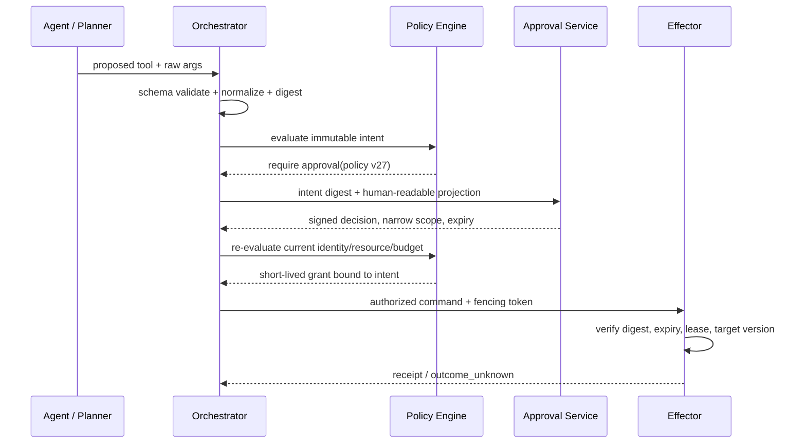
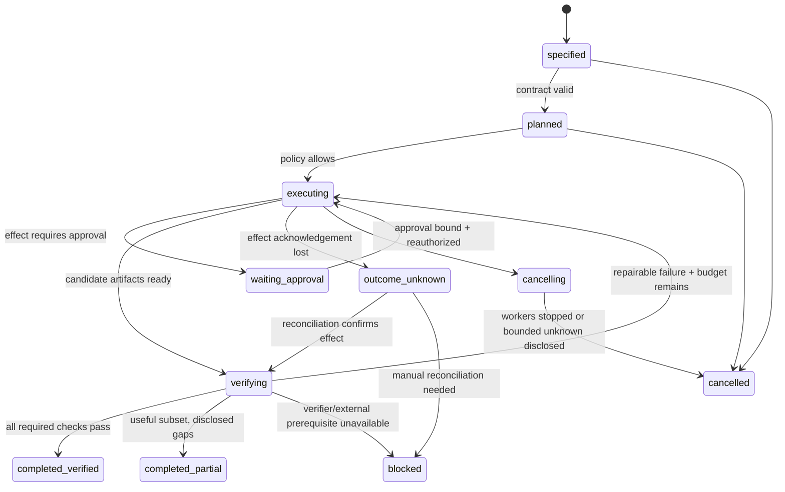

# 执行契约与验证：用证据确认完成状态

Agent Runtime 需要把用户目标编译为可执行、可授权、可验证、可交付的契约。这里使用 `TaskSpec → Plan → Authorized Intent → Evidence → DeliveryBundle`，把计划、执行与最终裁决分开。

不能把模型输出“已经修复”当作完成依据。它只证明生成过一句话，没有证明目标文件确实改变、测试在目标环境通过、外部系统完成写入，也没有证明执行内容仍是用户批准的内容。

生产系统需要把“完成”拆成三个独立问题：

1. **执行契约**：究竟要达到什么结果，允许触及什么范围？
2. **授权执行**：实际提交的副作用，是否仍与计划、策略和批准一致？
3. **验证交付**：哪些结论有哪份证据，哪些仍未知或只完成了一部分？


## 1. 对象层级：Goal、Plan 与事实

| 对象 | 回答的问题 | 是否可变 | 权威来源 |
| --- | --- | --- | --- |
| `Goal` | 用户想得到什么业务结果 | 用户可补充 | 原始用户输入及确认记录 |
| `TaskSpec` | 范围、约束、验收、交付是什么 | 版本化修改 | Runtime 编译后由用户/策略约束 |
| `Plan` | 准备用哪些步骤完成 | 可重规划，旧版不可改写 | Planner 输出 + Runtime 校验 |
| `ExecutionIntent` | 这一次准备提交哪个具体效果 | 创建后不可变 | Orchestrator 规范化生成 |
| `Receipt/Artifact` | 外部世界实际返回了什么 | 追加事实，不覆盖 | Tool/环境及存储系统 |
| `VerificationResult` | 哪条验收是否被证据满足 | 可重新验证并形成新版 | 独立 Verifier |
| `DeliveryBundle` | 能安全向人或机器宣称什么 | 每次交付不可变 | Delivery synthesizer |

`TaskSpec` 约束 Plan，Plan 产生 Intent，Intent 驱动副作用；反方向不能偷偷改写。例如模型发现修改 CI 更方便，不能直接把 CI 路径加入 scope。它只能提出 `scope_change_requested`，由原授权主体重新确认。

## 2. TaskSpec：把自然语言编译成机器可检查的契约

### 2.1 TypeScript Schema

以下 schema 把“程序可判定”和“需要评审”分开。`review` 条目不会自动通过，而是进入人工或独立评审队列。

```ts
import { z } from "zod";

const Sha256 = z.string().regex(/^sha256:[a-f0-9]{64}$/);
const CriterionBase = z.object({
  id: z.string().regex(/^ac_[a-z0-9_]+$/),
  required: z.boolean().default(true),
  description: z.string().min(1),
});

const AcceptanceCriterion = z.discriminatedUnion("type", [
  CriterionBase.extend({
    type: z.literal("command"),
    commandRef: z.string(),       // 引用受管命令，不接受任意 shell 文本
    expectedExitCodes: z.array(z.number().int()).default([0]),
    timeoutMs: z.number().int().positive().max(30 * 60_000),
  }),
  CriterionBase.extend({
    type: z.literal("artifact"),
    artifactKind: z.enum(["patch", "report", "sbom", "test_log"]),
    minCount: z.number().int().positive().default(1),
  }),
  CriterionBase.extend({
    type: z.literal("diff_policy"),
    policyRef: z.string(),
  }),
  CriterionBase.extend({
    type: z.literal("state_query"),
    verifierRef: z.string(),      // 例如按业务幂等键查询 SaaS 状态
    predicateRef: z.string(),     // 版本化 predicate，不执行用户代码
  }),
  CriterionBase.extend({
    type: z.literal("schema"),
    schemaRef: z.string(),
  }),
  CriterionBase.extend({
    type: z.literal("review"),
    rubricRef: z.string(),
    requiredReviewerRole: z.string(),
  }),
]);

export const TaskSpecSchema = z.object({
  taskId: z.string(),
  version: z.number().int().positive(),
  goal: z.object({
    originalTextRef: z.string(),
    normalizedOutcome: z.string().min(1),
  }),
  scope: z.object({
    workspaceRef: z.string(),
    allowedPaths: z.array(z.string()).min(1),
    forbiddenPaths: z.array(z.string()).default([]),
    allowedExternalSystems: z.array(z.string()).default([]),
  }),
  constraints: z.array(z.object({
    id: z.string(),
    rule: z.string(),
    source: z.enum(["user", "tenant_policy", "repository", "runtime"]),
  })),
  acceptance: z.array(AcceptanceCriterion).min(1),
  delivery: z.object({
    kind: z.enum(["answer", "patch", "draft_pr", "report", "structured"]),
    schemaRef: z.string().optional(),
    humanMergeRequired: z.boolean().default(true),
  }),
  budgets: z.object({
    deadlineAt: z.string().datetime(),
    maxModelTokens: z.number().int().positive(),
    maxToolCalls: z.number().int().positive(),
    maxCostMinor: z.number().int().nonnegative(),
    verificationReservePct: z.number().min(0.05).max(0.5),
  }),
  parentDigest: Sha256.optional(),
});

export type TaskSpec = z.infer<typeof TaskSpecSchema>;
```

不要把验证命令直接作为用户字符串交给 shell。`commandRef=test.node.unit@4` 应由 Verifier Registry 解析成固定 argv、工作目录、环境白名单、资源上限和输出处理策略。

### 2.2 Schema 校验之后还需要语义校验

类型正确不代表契约合理。下面这些不变量跨字段，必须由可信 Runtime 检查：

```ts
type Issue = { path: string; code: string; message: string };

export function validateTaskSpec(spec: TaskSpec): Issue[] {
  const issues: Issue[] = [];
  const ids = new Set<string>();

  for (const ac of spec.acceptance) {
    if (ids.has(ac.id)) issues.push({
      path: `acceptance.${ac.id}`, code: "DUPLICATE_ID", message: "验收 ID 必须唯一"
    });
    ids.add(ac.id);
  }

  if (spec.delivery.kind === "structured" && !spec.delivery.schemaRef) {
    issues.push({ path: "delivery.schemaRef", code: "SCHEMA_REQUIRED",
      message: "机器消费的交付必须固定输出 schema" });
  }

  const hasRequiredDeterministicCheck = spec.acceptance.some(
    x => x.required && x.type !== "review"
  );
  if (!hasRequiredDeterministicCheck) {
    issues.push({ path: "acceptance", code: "ONLY_SUBJECTIVE_CHECKS",
      message: "至少要有一个非主观的必选验证器" });
  }

  if (spec.budgets.verificationReservePct * spec.budgets.maxCostMinor < 1) {
    issues.push({ path: "budgets.verificationReservePct", code: "NO_VERIFY_RESERVE",
      message: "预算必须实际保留给验证与清理" });
  }
  return issues;
}
```

路径 scope 还要使用真实路径、仓库边界和符号链接策略检查；glob 的字符串比较不是授权。约束冲突也必须显式失败，例如用户要求“创建 PR”，同时策略要求“禁止任何外部写入”，不能让 Planner 自行选择一边。

### 2.3 验收条件的质量标准

好的验收条件满足 `observable + bounded + attributable`：

- **可观测**：有命令结果、系统查询、Artifact 或人工签署；
- **有边界**：在固定环境、版本和时间窗口内判断；
- **可归因**：证据能关联到本任务、具体 plan/attempt，而非复用一张旧截图。

“代码质量好”“问题已修复”“性能没有下降”都不可直接判定。应分别改成 lint/静态规则、失败用例 + 回归用例、固定数据集上的 P95 阈值与置信区间。若当前无法定义阈值，诚实标为 `review` 或 `unverified`。

## 3. Plan DAG：它是可审计的假设，不是授权票据

### 3.1 步骤模型

```ts
type RiskBand = "R0" | "R1" | "R2" | "R3" | "R4";

interface PlanStep {
  id: string;
  dependsOn: string[];
  purpose: string;
  requiredCapabilities: string[];
  readSet: string[];
  proposedWriteSet: string[];
  expectedEffects: Array<"none" | "workspace_write" | "external_write" | "irreversible">;
  acceptanceIds: string[];
  verifierRefs: string[];
  estimatedCostMinor: number;
  riskHint: RiskBand;       // Planner 的提示，不是最终授权结论
  compensationRef?: string;
}

interface ExecutionPlan {
  planId: string;
  taskSpecDigest: string;
  version: number;
  previousPlanDigest?: string;
  replanReason?: string;
  steps: PlanStep[];
}
```

提交 Plan 前至少验证：图无环；依赖 ID 存在；每条 required acceptance 有可达步骤负责；并行步骤的写集合不冲突；估算没有侵占验证保留；使用的 capability 存在且版本可用。

```ts
export function topologicalOrder(plan: ExecutionPlan): string[] {
  const byId = new Map(plan.steps.map(s => [s.id, s]));
  if (byId.size !== plan.steps.length) throw new Error("duplicate step id");
  const indegree = new Map(plan.steps.map(s => [s.id, 0]));
  const next = new Map(plan.steps.map(s => [s.id, [] as string[]]));

  for (const step of plan.steps) for (const dep of step.dependsOn) {
    if (!byId.has(dep)) throw new Error(`unknown dependency: ${dep}`);
    indegree.set(step.id, indegree.get(step.id)! + 1);
    next.get(dep)!.push(step.id);
  }

  const ready = [...indegree].filter(([, n]) => n === 0).map(([id]) => id).sort();
  const ordered: string[] = [];
  while (ready.length) {
    const id = ready.shift()!;
    ordered.push(id);
    for (const child of next.get(id)!) {
      const n = indegree.get(child)! - 1;
      indegree.set(child, n);
      if (n === 0) ready.push(child), ready.sort();
    }
  }
  if (ordered.length !== plan.steps.length) throw new Error("plan contains cycle");
  return ordered;
}
```

### 3.2 R0～R4 只是一个策略 Profile

把“读文件=R0、生产删除=R4”当成解释示例很有用，但它不是跨企业通用定律。同一个 `read` 在公开示例仓库可能低风险，在并购数据目录可能是最高风险；同一个 PR 创建动作在个人 fork 与受监管仓库也不同。

最终风险由 Policy Engine 根据主体、数据分类、资源、环境、参数、网络目标、可逆性和当前时点计算。模型只能提供 `riskHint`，不能降级系统计算结果。不同租户应发布自己的 `risk-profile@version`，并用测试 fixture 证明每条规则。

### 3.3 重规划是新版本，不是原地改数组

重规划触发包括假设被否定、环境漂移、验证失败、预算变化、scope 变更和外部冲突。正确流程是：

1. 追加 `plan.replan_requested(reason, evidenceRefs)`；
2. 以当前已提交事实构造 Plan vN+1；
3. 保存旧/新摘要及结构化 diff；
4. 重新检查 DAG、预算、风险和验收覆盖；
5. 使尚未执行的旧 Intent 失效；
6. 参数、资源或策略变化时重新审批。

已经发生的副作用不能因“计划已改”从历史消失。新计划要么接纳该事实，要么调度可验证的补偿。

## 4. Plan / Effector 分离：模型提出意图，执行器提交效果

Planner 与 Agent Loop 可以提出 `ExecutionIntent`，但不能直接拿到文件系统、shell 或 SaaS client。可信 Orchestrator 将意图规范化，Policy 决策；Effector 只接受短期授权的不可变命令。

```ts
interface ExecutionIntent {
  intentId: string;
  taskId: string;
  taskSpecDigest: string;
  planDigest: string;
  stepId: string;
  attempt: number;
  tool: { name: string; version: string };
  canonicalArgs: unknown;
  argsDigest: string;
  target: { resourceRef: string; observedVersion?: string };
  environmentFingerprintDigest: string;
  requestedAt: string;
}

interface AuthorizedCommand {
  intent: ExecutionIntent;
  grantId: string;
  policyVersion: string;
  approvalDigest?: string;
  expiresAt: string;
  fencingToken: number;
}
```

Effector 不接受“差不多相同”的参数。canonicalization 必须采用固定的跨语言规范并通过测试向量验证；普通 `JSON.stringify` 不能承诺跨语言相同摘要。`resourceRef + observedVersion` 用于防止审批后目标对象发生替换。

## 5. 审批绑定：批准的是确切动作，不是 Agent 的解释

审批记录至少覆盖：task/plan/step/attempt、`tool@version`、canonical args digest、资源引用与观察版本、环境指纹、策略版本、授权主体、范围、过期时间和 nonce。展示文本可以帮助人理解，但签名或 MAC 必须覆盖规范化事实。



批准后仍需重新授权，因为等待期间用户权限、租户策略、预算、资源版本或任务取消状态都可能变化。以下任一变化都让原票据失效：args、tool 版本、目标资源版本、写入范围、policy 约束或批准期限。批准只允许“尝试执行”，它不证明执行成功，也不扩大沙箱的技术边界。

## 6. Verifier 是独立控制点

主 Agent 生成实现，也让主 Agent自由判断“测试已过”，形成自证循环。独立并不一定意味着另一台服务，但至少要求：

- Verifier 读取不可变 TaskSpec、Artifact/Receipt 和环境事实，不接受 Agent 改写规则；
- 验证器来自版本化 Registry，命令、镜像、predicate 与 rubric 都有摘要；
- Verifier 使用独立预算、身份、网络和写权限，通常只读待验对象；
- 验证事件单独记录，失败报告可回送修复，但 Agent 不能覆盖旧结果；
- 用 LLM review 时，把被评内容标为不可信数据，并用确定性门禁兜底。

```ts
type VerifyStatus = "passed" | "failed" | "unverified" | "verifier_error";

interface VerificationResult {
  verificationId: string;
  criterionId: string;
  criterionDigest: string;
  status: VerifyStatus;
  verifier: { ref: string; version: string; digest: string };
  environmentFingerprintDigest: string;
  evidenceRefs: string[];
  observed: Record<string, unknown>;
  startedAt: string;
  finishedAt: string;
}
```

`failed` 表示被测对象不满足条件；`verifier_error` 表示验证设施自身失败；`unverified` 表示没有足够证据或外部依赖不可达。后二者都不能伪装为通过，但也不应误报为代码一定错误。

## 7. 验证流水线：确定性证据优先

按成本和确定性排序执行，并允许相互独立的检查并行：

1. Artifact 完整性、schema 与摘要；
2. 禁止路径、secret、二进制和变更规模等 diff gate；
3. 语法、格式、类型和静态规则；
4. 构建、单元与集成测试；
5. 安全、依赖、许可证与 API 兼容检查；
6. 对权威系统做状态查询，确认外部效果；
7. 独立 Agent review；
8. 高风险或主观标准的人工 review。

不必对每个项目运行所有层。TaskSpec 和仓库策略共同选择必选 verifier，但安全门禁不能由模型为节省预算而删除。预算到 100% 才开始验证已经太迟；Admission 阶段必须预留验证、清理和交付额度。

### 7.1 Diff Gate 示例

```ts
interface ChangedFile { path: string; status: "added" | "modified" | "deleted"; bytes: number }
interface DiffPolicy {
  forbidden: RegExp[];
  lockfilesNeedApproval: boolean;
  maxFiles: number;
  maxAddedBytes: number;
}

function checkDiff(files: ChangedFile[], policy: DiffPolicy) {
  const violations: string[] = [];
  if (files.length > policy.maxFiles) violations.push("DIFF_FILE_LIMIT");
  if (files.reduce((n, f) => n + (f.status === "added" ? f.bytes : 0), 0) > policy.maxAddedBytes)
    violations.push("DIFF_SIZE_LIMIT");
  for (const file of files) {
    if (policy.forbidden.some(re => re.test(file.path))) violations.push(`FORBIDDEN:${file.path}`);
    if (policy.lockfilesNeedApproval && /(^|\/)([^/]*lock[^/]*)$/i.test(file.path))
      violations.push(`LOCKFILE_REVIEW:${file.path}`);
  }
  return [...new Set(violations)];
}
```

生产实现还应解析补丁内容，检查 secret、CI/权限配置、测试删除、公开 API 扩张和混淆代码。只按文件名判断不够；但扫描器命中也只是证据，需要可解释规则和受控例外流程。

### 7.2 环境指纹决定证据是否可比

一条“测试通过”至少关联：基础镜像 digest、仓库基线与测试 revision、依赖 lock hash、setup script hash、OS/架构、toolchain 版本、Verifier 版本、策略/网络 profile、受管环境变量摘要和时间。

```ts
interface EnvironmentFingerprint {
  imageDigest: string;
  repoBaseCommit: string;
  testedRevision: string;
  dependencyLockDigest: string;
  setupDigest: string;
  os: string;
  arch: string;
  toolchain: Record<string, string>;
  verifierBundleDigest: string;
  policyProfile: string;
  networkProfile: string;
}
```

不要哈希 secret 值后写进指纹：低熵 secret 可能被离线猜测。记录 secret 的版本化引用或租约 ID，正文留在 Secret Broker。持久开发容器会漂移，应捕获实际指纹；“镜像标签相同”不是环境相同。

### 7.3 Evidence 需要来源链，而不是日志路径

```ts
interface Evidence {
  evidenceId: string;
  kind: "command_receipt" | "artifact" | "state_snapshot" | "review_attestation";
  subjectRef: string;           // 被证明的 revision / resource / artifact
  subjectDigest?: string;
  producer: { workloadId: string; componentVersion: string };
  capturedAt: string;
  environmentFingerprintDigest: string;
  contentRef: string;
  contentDigest: string;
  redactionPolicy: string;
  signatureRef?: string;
}
```

命令日志要包含规范 argv、cwd ref、exit code、起止时间、timeout/kill 状态及 stdout/stderr Artifact；不能只保存最后一行“PASS”。Evidence 内容可按保留政策删除，但 claim 必须随之降级为证据不可用，不能继续展示绿色通过。

## 8. Claim-Evidence Map：最终结论必须可追溯

最终回答中的每个重要 claim 都映射到验收项和证据：

```ts
interface Claim {
  claimId: string;
  statement: string;
  criterionIds: string[];
  evidenceRefs: string[];
  confidence: "verified" | "partially_verified" | "unverified";
  limitations: string[];
}
```

例子：

| Claim | 所需证据 | 不能作为充分证据 |
| --- | --- | --- |
| “回归测试通过” | 目标 revision 上受管命令 exit 0 + 完整日志 | Agent 复述“已通过” |
| “PR 已创建” | Git provider 按幂等键查询到 PR ID/URL | HTTP 请求发出事件 |
| “未修改 CI” | 基线到交付 revision 的完整 diff scope 结果 | 只查看 Agent 声称修改的文件 |
| “没有性能回归” | 可比较指纹、固定基准、多次样本与阈值 | 单次本机运行更快 |

若一项 claim 没有 Evidence，它可以作为“推测/建议”表达，但不能放在“已完成”列表。

## 9. Structured Output 的保证边界

Provider 原生 structured output 能显著减少格式漂移，但它不是任务成功证明。正确处理至少区分：

- **正常完成且 schema 有效**：可进入业务校验；
- **拒答/安全拒绝**：是显式终态，不应强行解析成业务对象；
- **长度/上下文截断**：可能得到不完整对象，标记 incomplete；
- **网络/Provider 错误**：没有可信业务输出；
- **schema 有效但语义无效**：例如 `status="succeeded"` 却无任何证据，仍应拒绝。

```ts
type ModelEnvelope<T> =
  | { kind: "completed"; value: unknown; nativeStructured: boolean }
  | { kind: "refusal"; reason: string }
  | { kind: "incomplete"; reason: "length" | "context" | "cancelled" }
  | { kind: "failed"; code: string };

function acceptStructured<T>(envelope: ModelEnvelope<T>, schema: z.ZodType<T>): T {
  if (envelope.kind !== "completed") throw new Error(`no business value: ${envelope.kind}`);
  const parsed = schema.safeParse(envelope.value); // 原生 schema 后仍在 Runtime 校验
  if (!parsed.success) throw new Error("STRUCTURED_OUTPUT_INVALID");
  return parsed.data;
}
```

允许修复时，把它建模为有限次数的新 model attempt，保存原错误和成本。不得静默把未知枚举改成 `succeeded`、丢弃 `additionalProperties` 中的安全字段，或让“JSON.parse 成功”等于 schema/业务有效。

## 10. DeliveryBundle：把任务结果与可信度一起交付

任务状态、验证状态、外部效果状态是三个维度，不要压成一个 `success: boolean`。

```ts
type TaskOutcome = "succeeded" | "partial" | "blocked" | "failed" | "cancelled";
type VerificationSummary = "verified" | "partially_verified" | "unverified" | "invalid";
type EffectState = "none" | "confirmed" | "compensated" | "outcome_unknown";

interface DeliveryBundle {
  bundleId: string;
  taskId: string;
  taskSpecDigest: string;
  finalPlanDigest: string;
  outcome: TaskOutcome;
  verification: VerificationSummary;
  summary: string;
  claims: Claim[];
  criteria: Array<{ id: string; status: VerifyStatus; resultRef?: string }>;
  artifacts: Array<{ ref: string; digest: string; kind: string }>;
  externalEffects: Array<{
    intentId: string;
    state: EffectState;
    receiptRef?: string;
    reconciliationRef?: string;
  }>;
  warnings: string[];
  unresolvedItems: string[];
  usage: { modelTokens: number; toolCalls: number; costMinor: number; durationMs: number };
  environmentFingerprintDigests: string[];
  createdAt: string;
}
```

语义必须固定：

- `succeeded + verified`：所有 required criteria 都有有效证据，且没有未知外部效果；
- `partial`：明确交付了有价值的子集，同时列出未满足 criteria；
- `blocked`：需要权限、批准、输入或外部条件，未来可以恢复；
- `unverified`：并不等于失败，只表示当前没有足够证据；
- `outcome_unknown`：调用可能已产生副作用但没有确认，既不能报成功也不能盲重试；必须查询、对账或人工处理；
- `cancelled`：描述编排停止，不自动证明所有已提交效果都撤销。

Delivery synthesizer 只能从已提交事件与 VerificationResult 投影，不能让模型自由填写 `outcome`。自然语言摘要也应由结构化 bundle 生成或逐 claim 校验。

## 11. 完成状态机



`blocked` 可以恢复，不应与永久 `failed` 混用。取消和 timeout 也可能留下 `outcome_unknown`；系统不能因为本地 worker 已死就宣称外部动作未发生。

## 12. 端到端 Coordinator 骨架

下面是协议顺序，不是可直接复制的事务实现：Event Store、Effect Ledger 和外部系统通常不能处于同一 ACID 事务，需结合 outbox、幂等键、receipt 查询与 fencing token。

```ts
async function advance(step: PlanStep, ctx: RuntimeContext) {
  const intent = await ctx.intentCompiler.compile(step, ctx.taskSpec, ctx.environment);
  await ctx.events.appendExpected(ctx.runId, ctx.headSeq, { type: "intent.proposed", intent });

  const firstDecision = await ctx.policy.evaluate(intent, ctx.principal);
  const approval = firstDecision.kind === "require_approval"
    ? await ctx.approvals.parkAndWait(intent, firstDecision) // checkpoint 后释放 worker/lease
    : undefined;

  await ctx.cancellation.throwIfRequested();
  const grant = await ctx.policy.reauthorize({
    intent, approval, principal: ctx.principal,
    currentResourceVersion: await ctx.resources.version(intent.target.resourceRef),
    currentEnvironmentDigest: ctx.environment.digest,
  });

  const receipt = await ctx.effector.execute({
    intent, grant, fencingToken: ctx.lease.fencingToken,
  });
  await ctx.events.recordEffectOutcome(intent.intentId, receipt);

  if (receipt.state === "outcome_unknown") {
    await ctx.reconciliation.enqueue(intent);
    return;
  }
  await ctx.verification.scheduleFor(step.acceptanceIds, receipt.subjectRefs);
}
```

等待人工批准时应 checkpoint 并释放执行槽；不能让一个同步 Promise 数小时持有 worker、环境锁或过期 lease。恢复后重新取得 lease/fencing token，再执行上面的 reauthorization。

## 13. 必测不变量

```ts
import { describe, expect, it } from "vitest";

describe("execution contract", () => {
  it("rejects cyclic plans", () => {
    const plan = {
      planId: "p", taskSpecDigest: "d", version: 1,
      steps: [
        { id: "a", dependsOn: ["b"] },
        { id: "b", dependsOn: ["a"] },
      ],
    } as ExecutionPlan;
    expect(() => topologicalOrder(plan)).toThrow(/cycle/);
  });

  it("does not accept refusal as structured business output", () => {
    const Result = z.object({ status: z.literal("succeeded") });
    expect(() => acceptStructured({ kind: "refusal", reason: "policy" }, Result))
      .toThrow(/no business value/);
  });

  it("never promotes unknown effect to verified success", () => {
    const effects: EffectState[] = ["confirmed", "outcome_unknown"];
    const canClaimVerifiedSuccess = effects.every(x => x === "none" || x === "confirmed");
    expect(canClaimVerifiedSuccess).toBe(false);
  });
});
```

还应做 property/fault-injection tests：

- 随机改变审批后的任一参数、tool 版本或 target version，执行必须被拒；
- 任意时刻 kill worker，恢复后已确认副作用不重复，未知结果进入 reconcile；
- 两个 worker 持有新旧 fencing token，旧 worker 永远不能提交效果/事件；
- 删除一份 Evidence 后，相关 claim 不再保持 `verified`；
- 测试超时、进程被 kill、日志被截断，不能误判 exit 0；
- Replan 后，旧 plan 尚未执行的授权不可复用；
- 主 Agent 在输出中声称“全部通过”，而一项 required criterion 失败，DeliveryBundle 必须是 `invalid/partial` 或 `failed`；
- flaky 测试偶然通过不能自动解除 quarantine，发布策略按明确规则处理。

## 14. 常见失败模式

| 失败模式 | 为什么危险 | 修正 |
| --- | --- | --- |
| TaskSpec 只有 goal 文本 | scope 和完成定义可被执行中漂移 | 版本化范围、约束、验收和交付 |
| Planner 输出就是授权 | 模型可通过改计划扩权 | 每个具体 Intent 单独做 Policy/Approval |
| R0～R4 写死在代码 | 数据分类和租户语境被忽略 | 风险 profile 版本化，系统计算不接受模型降级 |
| 批准自然语言摘要 | TOCTOU 下参数或目标可替换 | 绑定 canonical args、资源版本、策略和过期 |
| 批准后直接执行 | 等待期间权限/预算/资源已变化 | 执行前重新授权与版本校验 |
| 主 Agent 自己宣布测试通过 | 生成者自证，没有可信来源 | 独立 Verifier + Evidence provenance |
| 外部 timeout 记 failed 后重试 | 可能制造两次真实效果 | `outcome_unknown` + query/reconcile |
| structured output 有 `success` 就完成 | schema 不证明业务事实 | Runtime schema + semantic + evidence validation |
| 预算耗尽才验证 | 无法清理、对账和证明 | Admission 预留 verification/cleanup budget |
| 复用旧日志作为证据 | revision/环境不匹配 | Evidence 绑定 subject 与 environment fingerprint |

## 15. 架构练习与验收

**练习**：为“修复支付重试缺陷，创建 Draft PR，但不得修改 CI 或自动合并”实现一条纵向切片。

1. 编译并冻结 TaskSpec，至少包含 command、diff policy、artifact、state query 四类验收；
2. 生成含探索、写测试、改实现、验证、创建 PR 的 DAG；
3. 创建 PR 必须生成绑定 repo revision、head branch、title/body digest 的审批；
4. 审批等待期间改变 repo 权限或 head revision，恢复时应拒绝旧票据；
5. 模拟创建 PR 成功但响应丢失，按幂等键查询并生成 confirmed receipt；
6. 从结果生成 Claim-Evidence Map 和 DeliveryBundle。

**完成验收**：

- [ ] 任一 required acceptance 都能追到版本化 Verifier 和 Evidence；
- [ ] Plan 经过无环、依赖、写冲突、预算和验收覆盖校验；
- [ ] 模型不能降低 risk、扩大 scope、替换批准参数或直接执行副作用；
- [ ] `failed`、`unverified`、`verifier_error` 和 `outcome_unknown` 在 UI/API 中含义不同；
- [ ] structured refusal、截断、schema invalid 和语义 invalid 均有独立测试；
- [ ] 最终“已完成”结论只能由投影规则产生，不能来自模型自由文本。

## 关联章节

- [Runtime 总览](overview.md)：Run/Event/Command/Capability 的基本边界。
- [Durable Workflow](workflow-engine.md)：Activity、checkpoint、恢复、补偿和版本演进。
- [Tool System](tool-system.md)：参数规范化、Policy、审批、沙箱与副作用账本。
- [持久化与 SQLite](persistence-sqlite.md)：CAS append、outbox、effect receipt 与恢复。
- [可观测性与 Evals](observability-evals.md)：Evidence 与 Trace 的差异、离线/在线质量门禁。
- [统一事件契约](../04-sdk/contracts-events.md)：跨 Provider 的终态、Tool 和 structured output 事件。
- [端到端参考架构](../07-practice/reference-architecture.md)：把这些控制点放回桌面—云端的端到端链路。
