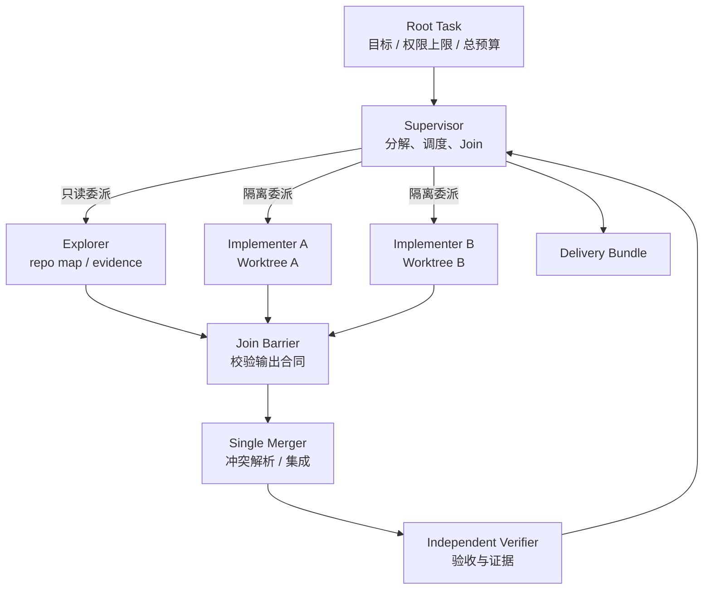
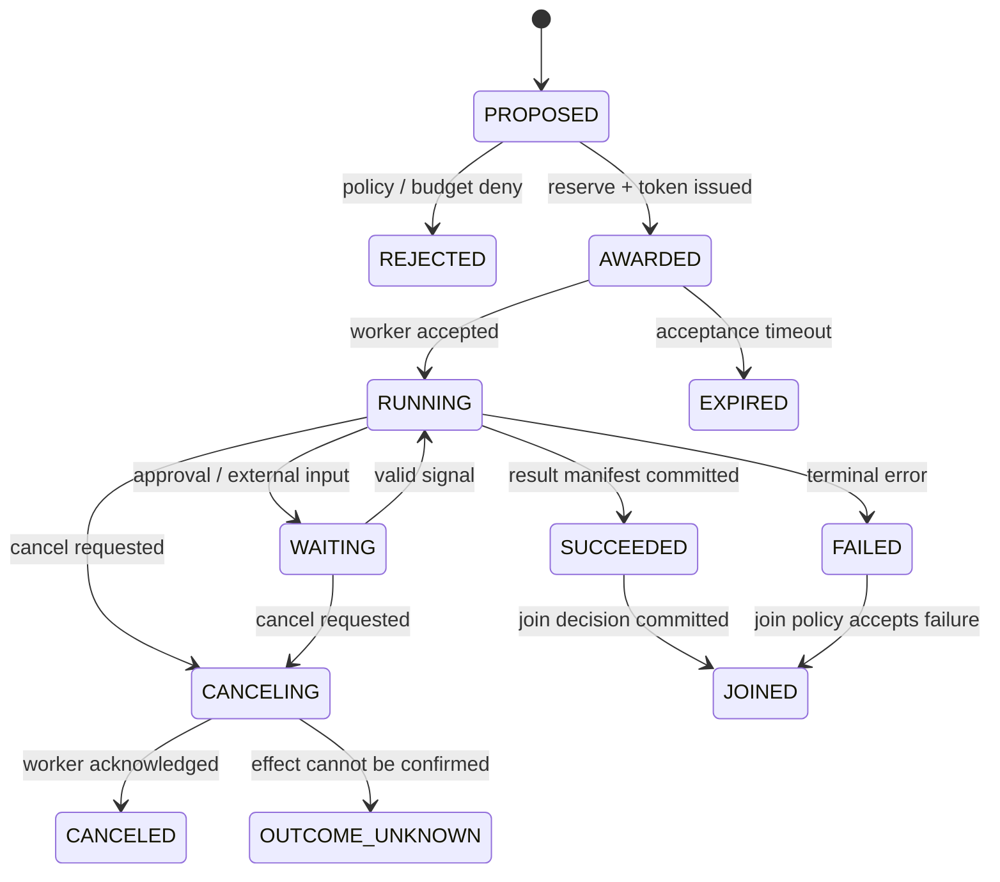

# Multi-Agent 编排：受限委派、隔离执行与确定性汇合

Multi-Agent 编排要求委派可恢复、可审计，且不能扩大权限。下面定义 Supervisor–Worker 合同、预算托管、Context 与 Worktree 隔离、Join/Cancel 语义和冲突处理。

## 1. 先判断是否真的需要多 Agent

多 Agent 的收益来自**隔离、专门化和并行产出证据**，不是角色扮演。只有任务能拆成低耦合子问题，且节省的时间大于编排、重复上下文和合并成本时，才值得使用。

| 候选任务 | 建议 | 原因 |
| --- | --- | --- |
| 分模块代码探索、安全审查、独立测试组 | 并行 | 输入边界清晰，结果主要是只读证据 |
| 两个不相交目录的实现，分别使用 Worktree | 条件并行 | 需要文件所有权、共同基线与单一合并者 |
| 多 Agent 同改一个核心文件 | 串行或先设计后实现 | 语义冲突远大于并行收益 |
| 生产发布、付款、群发消息 | 单一受控执行者 | 外部副作用需要明确责任和审批顺序 |
| 严格依赖的数据库迁移链 | 顺序 Workflow | 后一步依赖前一步的真实状态 |
| 十分钟内单 Agent 即可完成的小任务 | 单 Agent | 调度和汇总会增加成本与失败面 |

可用一个粗略准入函数约束“为了并行而并行”：

```ts
type ParallelismEstimate = {
  serialMs: number;
  criticalPathMs: number;
  coordinationMs: number;
  mergeRisk: number;          // 0..1
  independentEvidence: boolean;
};

export function shouldDelegate(x: ParallelismEstimate): boolean {
  const saved = x.serialMs - x.criticalPathMs - x.coordinationMs;
  return x.independentEvidence && saved > 30_000 && x.mergeRisk < 0.45;
}
```

这个函数只给 Scheduler 提供成本提示，不能让模型自行决定授权。安全策略、租户配额和任务风险仍有最终否决权。

## 2. Supervisor–Worker 的权限边界

Supervisor 负责保留用户目标、拆分工作、分配预算、观察事件、处理异常并汇总交付。Worker 只完成窄任务，返回结构化产物和证据。Verifier 与 Merger 最好是显式角色，避免实现者既改代码又给自己判定通过。



不变量：

1. 子 Agent 的有效权限不得大于父任务权限；
2. 委派不是共享用户身份，而是签发短期、限定 audience 的工作负载身份；
3. 审批是执行某个已授权意图的门禁，**不能创造父任务原本没有的权限**；
4. 子任务预算来自父任务预留，不能凭空增加；
5. 子 Agent 的陈述不是事实，必须附带可验证证据；
6. 写入隔离，汇合集中，最终验证基于合并后的状态。

## 3. 委派合同：Delegation Envelope

不要给子 Agent 一句自然语言就放任执行。委派需要机器可验证的 Envelope，并绑定父任务、输入快照和策略版本。

```ts
type JoinPolicy =
  | { kind: "all" }
  | { kind: "any_success"; cancelRemainder: boolean }
  | { kind: "quorum"; required: number };

type DelegationEnvelope = {
  delegationId: string;
  parentTaskId: string;
  parentStepId: string;
  tenantId: string;
  objective: string;
  inScope: string[];
  outOfScope: string[];
  inputArtifacts: Array<{ uri: string; sha256: string; trust: "trusted" | "untrusted" }>;
  baseRevision?: string;
  capabilityRequest: CapabilityRequest;
  budget: BudgetGrant;
  deadline: string;
  maxDepth: number;
  mayDelegate: boolean;
  outputSchemaId: string;
  acceptanceCriteria: string[];
  joinGroup: { id: string; policy: JoinPolicy };
  policySnapshot: { version: string; digest: string };
  nonce: string;
  expiresAt: string;
};

type CapabilityRequest = {
  toolIds: string[];
  resources: string[];
  effects: Array<"read" | "write_workspace" | "network" | "external_write">;
};

type BudgetGrant = {
  inputTokens: number;
  outputTokens: number;
  toolCalls: number;
  costMicros: number;
  wallTimeMs: number;
  childCount: number;
};
```

Runtime 应规范化 Envelope 并计算摘要；子 Agent 接收签名后的 `delegationId + digest`，不能自行改写 JSON。`inputArtifacts.sha256` 防止任务开始后读取到另一版本。`outOfScope` 用于解释与审计，真正的隔离由 Capability、Sandbox 和 Worktree 实现。

### 3.1 Contract-Net：竞标不授予权限

工作池异构时，可以采用简化 Contract-Net：Supervisor 发布窄任务；候选 Agent 根据能力、队列、地域和预估成本返回 Bid；Scheduler 硬过滤后选择；最后签发 Award。模型生成的“我能完成”只是一项软信号。

```text
announce(delegation digest)
  -> bid(agent profile, capability match, ETA, estimated budget)
  -> scheduler hard filters(policy, region, health, trust, capacity)
  -> score(cost, eval quality, latency)
  -> award(signed envelope, short-lived identity)
  -> accept | reject
  -> progress events
  -> result manifest | terminal failure
```

不得让 Worker 在 Bid 中追加工具、扩大路径或延长截止时间。需要变更时，必须返回 `change_request`，由 Supervisor 重新走预算与策略裁决，并生成新版本 Envelope。

## 4. 权限守恒：始终取交集

子任务有效授权应在可信控制面计算：

```text
effective = parent_task_capability
          ∩ agent_profile_capability
          ∩ tenant_policy
          ∩ delegation_request
          ∩ current_resource_policy
          ∩ environment_boundary
```

其中任一项为空就拒绝。审批只将 `requires_approval` 状态转换为“允许使用该交集”，不能把 `read` 变成 `write`，也不能加入新资源。

```ts
async function issueDelegatedToken(
  parent: CapabilitySet,
  profile: AgentProfile,
  env: DelegationEnvelope,
  ctx: PolicyContext
): Promise<string> {
  const effective = intersectCapabilities(
    parent,
    profile.maximumCapabilities,
    env.capabilityRequest,
    await policy.allowedCapabilities(ctx),
    ctx.environment.capabilities
  );
  if (!covers(effective, env.capabilityRequest)) {
    throw new Error("DELEGATION_CAPABILITY_DENIED");
  }
  return signer.mint({
    subject: profile.agentId,
    actor: ctx.userId,
    audience: "agent-worker",
    delegationId: env.delegationId,
    capabilities: effective,
    envelopeDigest: canonicalHash(env),
    expiresAt: minTime(env.expiresAt, parent.expiresAt)
  });
}
```

Worker 调用 Tool 时还要再次授权，因为资源状态、撤权、策略和数据分类可能已变化。不要把父 Agent 的长效 token、云密钥或用户 cookie 塞进子 Agent Context。

## 5. 预算托管、截止时间与递归界限

并发会快速放大 token、浏览器、沙箱和外部 API 成本。父任务应先把预算放入 escrow，再启动子任务；子任务结束或取消后退回未使用部分。只有数据库中原子预留成功，调度才算成功。

```sql
BEGIN;
SELECT remaining_cost_micros, remaining_children
FROM task_budget
WHERE task_id = :parent_id
FOR UPDATE;

-- 条件不满足时 UPDATE 影响 0 行，整个委派失败。
UPDATE task_budget
SET remaining_cost_micros = remaining_cost_micros - :grant,
    remaining_children = remaining_children - 1,
    version = version + 1
WHERE task_id = :parent_id
  AND remaining_cost_micros >= :grant
  AND remaining_children >= 1;

-- 应用层必须断言 updated_rows = 1；否则 ROLLBACK，不能继续创建 escrow。

INSERT INTO budget_escrow(
  delegation_id, parent_task_id, granted_micros, spent_micros, status
) VALUES (:delegation_id, :parent_id, :grant, 0, 'reserved');
COMMIT;
```

预算守恒不只看金额，还包括 token、tool call、并发槽位、step 和数据读取量。截止时间满足：

```text
child.deadline <= parent.deadline - join_and_verify_reserve
child.maxDepth < parent.maxDepth
sum(active child grants) <= parent reserved budget
```

平台还应设置租户级 `max_fan_out`、任务级 `max_total_descendants`、Agent Profile 的 `may_delegate`，以及全局并发阈值。深度限制防递归链，后代总数限制防宽度爆炸，两者缺一不可。

## 6. 上下文、Memory、Secret 与 Worktree 隔离

### 6.1 最小上下文下放

子 Agent 只拿目标所需的 Context Slice：任务合同、相关文件/Artifact、必要架构约束和输出 schema。根 Agent 保留用户完整历史、最终决策与跨子任务状态。结果回传摘要、证据 URI、内容哈希和置信度，不把完整 trace 塞回根 Context。

不可信网页、Issue、日志和其他 Agent 输出继续带 provenance/trust label。另一个 Agent 的消息仍是**数据**，不会因为来自内部 Agent 就升级为指令。

### 6.2 Secret 不继承

需要访问 GitHub 的 Worker 向 Secret Broker 换取 `repo + operation + delegationId + TTL` 绑定的短凭据；不能看到父任务的原始 token。取消或撤权时 Broker 可按 delegation 撤销。日志和 Model Context 只保存 secret reference。

### 6.3 写入隔离

每个写 Worker 使用独立 Worktree 或快照，并固定共同 `baseRevision`：

```yaml
workspace:
  kind: git_worktree
  base_revision: 9c91e2a
  owner_delegation_id: dlg_01J...
  writable_paths:
    - packages/runtime/**
  forbidden_paths:
    - .github/workflows/**
    - infra/prod/**
  network_profile: build-proxy-only
```

文件所有权是调度约束，不是 Git 锁。符号链接、生成器跨目录输出和构建脚本都可能越界，因此 Executor 仍要检查真实写入集合；结束后比较基线生成变更清单。

## 7. 可恢复状态机与事件协议

Supervisor 不能靠进程内 `Promise.all` 作为真相。委派、接受、心跳、输出、取消和 Join 都必须是持久事件。



事件至少包含以下字段：

```ts
type AgentEvent = {
  eventId: string;
  tenantId: string;
  rootTaskId: string;
  delegationId: string;
  parentDelegationId?: string;
  sequence: number;
  type:
    | "delegation.proposed" | "delegation.awarded" | "worker.accepted"
    | "worker.progress" | "artifact.committed" | "worker.succeeded"
    | "worker.failed" | "cancel.requested" | "cancel.acknowledged"
    | "effect.outcome_unknown" | "join.completed";
  traceId: string;
  causationId?: string;
  envelopeDigest: string;
  payloadRef?: string;
  createdAt: string;
};
```

事件流以 `(delegationId, sequence)` 唯一；状态更新使用 expected sequence 做乐观并发。大结果放 Artifact Store，事件只存引用与哈希。所有子 trace 用 `traceId` 和 parent span 关联，同时保留 `delegationId`，否则并发树在日志中无法重建。

## 8. Join：如何汇合完成结果

Join 策略必须在派发前固定：

- `all`：所有分支到终态；适合分片处理和多模块实现；
- `any_success`：首个满足验收的结果获胜；其余分支发取消，但晚到结果仍要记录；
- `quorum(n)`：至少 n 个独立结果；适合评审或冗余判断，不适合投票决定客观测试是否通过；
- 自定义 barrier：必须是版本化的确定性代码，不能临时问 LLM “是否够了”。

`all` 只定义“何时可以汇合”，并不把失败分支变成成功；Join Decision 还要携带失败集合，由父步骤按验收规则决定修复、降级或失败。

```ts
function decideJoin(policy: JoinPolicy, states: ChildTerminal[]): JoinDecision {
  const success = states.filter(x => x.status === "succeeded" && x.contractValid);
  if (policy.kind === "all") {
    return states.every(x => x.terminal)
      ? { ready: true, accepted: success.map(x => x.id) }
      : { ready: false };
  }
  if (policy.kind === "any_success") {
    return success.length ? { ready: true, accepted: [success[0].id] } : { ready: false };
  }
  return success.length >= policy.required
    ? { ready: true, accepted: success.slice(0, policy.required).map(x => x.id) }
    : { ready: false };
}
```

先验证 output schema、Artifact 哈希、基线版本和 capability evidence，再把结果纳入 Join。晚到消息按事件 ID 去重，但不能静默丢弃；它可能暴露取消传播失败或外部副作用。

## 9. 取消传播与副作用不确定性

取消沿委派树传播，但不同层次语义不同：

1. **Soft cancel**：不启动新 step/child，让当前原子动作完成；
2. **Hard cancel**：停止模型流、终止子进程和沙箱，递归请求后代取消；
3. **Emergency kill**：撤销凭据、切断网络、隔离 Worker 并保留取证状态。

`cancel_requested` 不等于 `canceled`。对邮件、支付、发布等外部副作用，进程被杀只意味着结果未知；若下游不支持幂等键或状态查询，必须标记 `outcome_unknown` 并转人工协调。任意外部系统无法由本地 Runtime 普遍保证 exactly-once；正确目标是幂等、receipt、查询/对账、补偿和显式未知状态。

## 10. 冲突检测、单一合并者与集成验证

实现 Worker 返回 Patch Manifest，而非直接合入目标分支：

```ts
type PatchManifest = {
  delegationId: string;
  baseRevision: string;
  headRevision: string;
  patchSha256: string;
  changedFiles: Array<{
    path: string;
    beforeSha256: string | null;
    afterSha256: string | null;
  }>;
  generatedArtifacts: Array<{ uri: string; sha256: string }>;
  verificationEvidence: string[];
};
```

Merger 依次执行：

1. 验证 Manifest 签名、Artifact 和共同基线；
2. 检查路径是否超出委派范围；
3. 计算文件级、符号级和配置语义冲突；
4. 将已接受 Patch 应用到最新集成分支；
5. 冲突时生成新任务，禁止 last-writer-wins；
6. 在**合并后的整体状态**运行构建、测试、安全扫描与 diff gate；
7. 产生新的 Delivery/Verification Bundle。

两个 Patch 不改同一文件也可能语义冲突，例如一个改 API schema，另一个依赖旧生成代码。文件集合只是第一道门，还需契约测试、类型检查和集成测试。Merger 不应自动获得生产发布权；发布是后续独立能力和审批点。

## 11. 调度器骨架：租约、fencing 与幂等派发

Worker lease 防止无人续约任务长期占用，但仅有 lease 不能阻止旧 Worker 在失联后继续写。每次重新领取都递增 fencing token；下游写入必须拒绝旧 token。

```ts
async function dispatch(envelope: DelegationEnvelope) {
  const digest = canonicalHash(envelope);
  const reservation = await budgets.reserve(envelope.parentTaskId, envelope.delegationId, envelope.budget);
  try {
    const award = await delegations.createOnce({
      id: envelope.delegationId,
      digest,
      reservationId: reservation.id,
      state: "awarded"
    });
    await outbox.publishOnce(`award:${award.id}:${award.fencingToken}`, {
      ...award,
      envelope,
      token: await issueToken(envelope, award.fencingToken)
    });
  } catch (error) {
    await budgets.releaseIfUnconsumed(reservation.id);
    throw error;
  }
}

async function commitWorkerResult(result: WorkerResult) {
  await db.transaction(async tx => {
    const current = await tx.delegation.forUpdate(result.delegationId);
    if (result.fencingToken !== current.fencingToken) throw new Error("STALE_WORKER");
    if (canonicalHash(result.manifest) !== result.manifestDigest) throw new Error("BAD_DIGEST");
    await tx.result.insertIdempotent(result);
    await tx.event.appendExpected(current.sequence, toSucceededEvent(result));
  });
}
```

消息队列通常是 at-least-once；`createOnce`、Outbox、Inbox 和结果唯一键共同承担重复交付。不要把“同一消息只消费一次”错误提升为外部副作用 exactly-once。

## 12. 失败模式与处置

| 失败模式 | 表象 | 正确处置 |
| --- | --- | --- |
| 父 Agent 把全部 token/工具交给子 Agent | 开发快但 blast radius 无界 | Capability 交集、短期身份、逐调用再授权 |
| 让 Agent 自报能力和风险 | 恶意/错误 Profile 获得任务 | Registry 是候选输入，策略与探测证据硬过滤 |
| `Promise.all` 作为编排状态 | Supervisor 重启后丢失分支 | 持久委派事件、Checkpoint、确定性 Join |
| 并发 Worker 共享可写目录 | 非确定覆盖、难以归因 | Worktree/快照隔离、文件所有权、单一 Merger |
| 子任务各自无限递归 | fan-out 成本风暴 | depth、descendant、fan-out、预算四重上限 |
| 首个成功后直接遗忘其他分支 | 晚到写入和泄漏不可见 | 取消传播、终态追踪、late-result 审计 |
| 仅 lease 不用 fencing | 旧 Worker 失联后仍提交 | 单调 fencing token，下游校验最新 epoch |
| 多数 Agent 同意即当测试通过 | 共同幻觉 | 客观 verifier 优先，投票只用于主观评审 |
| 取消后标记所有动作未发生 | 重复发布或付款 | receipt、状态查询、`outcome_unknown` |
| 合并者沿用实现者自测结论 | 集成状态未验证 | 合并后独立完整验证 |

## 13. 测试策略

单元测试覆盖 Envelope schema、Capability 交集、预算守恒、Join 函数和深度限制；属性测试生成随机委派树，验证“任何后代权限不超根权限”“任何时刻已花费 + escrow + remaining 不超总额”。

集成测试至少注入：

- Award 发布前后 Supervisor 崩溃，验证只出现一个逻辑委派；
- Worker lease 过期、旧 Worker 晚到提交，验证 fencing 拒绝；
- 一半子 Agent 超时、一个输出 schema 无效、一个 Artifact 哈希错误；
- `any_success` 完成同时另一分支开始外部副作用；
- Secret 在父任务撤权后 60 秒内失效；
- 两个不重叠文件变更造成 API 语义冲突；
- 合并后测试失败，验证不会继续自动发布；
- 对外请求已成功但响应丢失，验证进入 reconcile 而非盲重试。

```ts
it("delegation cannot amplify capabilities", async () => {
  const root = caps("repo:read", "src/**");
  const requested = caps("repo:write", "**/*");
  await expect(authorizeDelegation(root, requested)).rejects.toThrow("DENIED");
});

it("stale worker cannot commit after reassignment", async () => {
  const oldLease = await acquire("dlg-1");
  clock.advanceBy(leaseTtl + 1);
  const newLease = await acquire("dlg-1");
  expect(newLease.fencingToken).toBeGreaterThan(oldLease.fencingToken);
  await expect(commit(oldLease, result())).rejects.toThrow("STALE_WORKER");
});
```

## 14. 架构评审清单

- [ ] 每个委派有规范化 Envelope、摘要、过期时间和不可变输入引用。
- [ ] 有效权限由父能力、Agent Profile、租户策略、资源状态和环境边界取交集。
- [ ] 审批只能打开已有权限内的门禁，不能扩大 scope。
- [ ] Budget escrow 原子预留；有 depth、fan-out、descendant 和截止时间上限。
- [ ] 子 Agent 使用最小 Context、独立短凭据；其他 Agent 输出仍按不可信内容处理。
- [ ] 写任务在独立 Worktree/快照运行，只有单一 Merger 写集成分支。
- [ ] 委派状态与 Join 是持久协议，重启后不依赖内存 Promise。
- [ ] Lease 使用 fencing，晚到结果和迟到副作用均可审计。
- [ ] 取消能传播到模型、工具、沙箱和后代，并保留 `outcome_unknown`。
- [ ] 合并后执行独立验证，主观多数票不能替代客观验收。

## 15. 实战练习

设计一个“跨三个语言模块升级依赖”的多 Agent Workflow：Explorer 生成影响图；三个 Implementer 分别修改 Go、TypeScript、Python Worktree；Security Reviewer 检查供应链；Merger 集成；Verifier 执行共同端到端测试。要求：总预算 8 美元、最大深度 2、每个 Worker 只有本模块写权限、依赖下载只走代理、任一 lockfile 越界变更阻断 Join、Supervisor 重启可恢复、旧 Worker 不能提交、取消后能列出所有结果未知的外部动作。

交付物应包含：Delegation Envelope 示例、事件序列、预算 ledger、Capability 矩阵、Patch Manifest、故障注入报告和最终 Verification Bundle。

## 关联章节与延伸阅读

- [Durable Workflow：事件历史、重试与取消](workflow-engine.md)
- [Tool System：Capability、审批与副作用](tool-system.md)
- [Streaming 与崩溃恢复](streaming-recovery.md)
- [安全威胁模型：跨 Agent 与供应链](../06-platform/security-threat-model.md)
- [多租户、身份与治理](../06-platform/multitenancy-governance.md)
- [OpenAI Codex：Subagents](https://developers.openai.com/codex/agent-configuration/subagents)
- [W3C Trace Context](https://www.w3.org/TR/trace-context/)
- [Google Cloud：Fencing tokens and distributed locks](https://cloud.google.com/blog/products/databases/transactional-databases-and-fencing-tokens)
