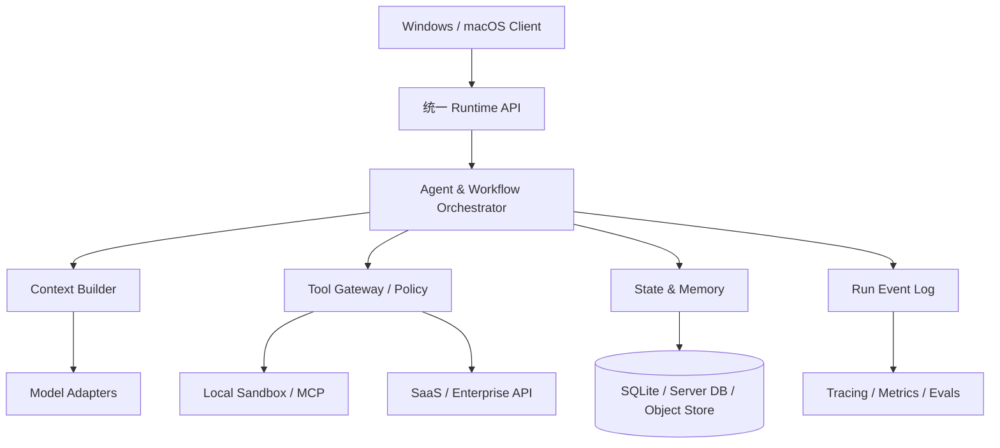

# Agent Runtime 总览：执行语义、系统边界与控制面

Agent Runtime 为产品提供稳定的任务语义，并吸收模型、网络、工具和进程的不确定性。本章先统一 Run、Step、Event、Tool 与 Workflow 的含义，再划定桌面 Runtime 和后端服务的边界。

## 1. Runtime 到底负责什么

模型 SDK 解决的是“发出一次推理请求”；AI Runtime 解决的是“一项工作如何在不可靠的模型、网络、工具和进程之上可靠完成”。它位于产品与模型供应商之间，向上提供稳定的任务语义，向下吸收供应商差异。

一套企业级 Runtime 至少要对以下问题给出统一答案：

- **执行**：当前轮由谁推理，允许调用什么工具，何时结束、暂停或转交？
- **状态**：哪些状态仅存在于本轮内，哪些需要跨进程、跨设备恢复？
- **上下文**：有限窗口中放什么、丢什么，压缩后如何保留事实和因果？
- **副作用**：写文件、发邮件、执行命令如何鉴权、审计、去重和补偿？
- **可靠性**：断网、崩溃、限流、用户取消后，能否判断“做到了哪一步”？
- **治理**：一次运行花了多少钱、为什么失败、新版本是否比旧版本更好？

不要把 Runtime 等同于某个 Agent Framework。Framework 是可替换的执行适配器；会话、权限、事件、持久化和观测契约才是平台资产。



## 2. 六个核心抽象与边界

### 2.1 Task 与 Run/Attempt：业务承诺和执行尝试

`Task` 不是 HTTP 请求，也不等于一次模型 Response。它可能持续数分钟、等待人工批准数小时，并在客户端重启后继续。`Run/Attempt` 是推进这个 Task 的一次可替换执行尝试：

```ts
export type TaskPhase =
  | "queued" | "preparing" | "running" | "waiting_approval"
  | "waiting_external" | "verifying" | "delivering" | "canceling" | "terminal";

export type TaskOutcome =
  | "none" | "succeeded" | "failed" | "canceled"
  | "partial" | "unverified" | "outcome_unknown";

export interface TaskExecution {
  taskId: string;
  threadId?: string;          // CI/webhook Task 可以没有产品会话
  runId: string;
  attempt: number;            // 同一 Task 的执行尝试
  workflowVersion: string;    // 决定可重放语义
  phase: TaskPhase;
  outcome: TaskOutcome;
  headSeq: number;            // 最后持久化事件序号
  fencingToken: number;       // 防止旧执行者在 lease 失效后继续写
  createdAt: string;
  updatedAt: string;
}
```

`threadId` 聚合用户可见的长期对话；`taskId` 表示平台向调用者作出的业务承诺；`runId/attempt` 隔离一次执行尝试。一个 Thread 可触发多个 Task，CI Task 也可没有 Thread。混用这些 ID 会造成消息串线、重复副作用和无法计算成功率。

### 2.2 Event：事实，而不是当前对象快照

事件表示已经发生且不可改写的事实，例如 `ModelRequested`、`ToolApprovalRequested`、`ToolSucceeded`。UI、断点恢复、审计和 Trace 都应消费同一条有序事件流，而不是各建一份含义略有不同的日志。

事件应包含 `eventId/taskId/runId/seq/type/time/causationId/correlationId/payload/schemaVersion`。其中：

- `seq` 只要求在单个 Run 内单调递增；
- `causationId` 指向导致本事件的直接事件，便于还原因果；
- `correlationId` 串起一次模型调用或工具调用的开始、增量和结束；
- `schemaVersion` 用于历史事件迁移，不能依赖 TypeScript 类型“自动兼容”。

### 2.3 Command：意图，不是事实

Reducer 根据当前状态与输入事件产生 Command，例如“调用模型”“请求批准”“提交工具”。Command 可能失败，也可能因重放而再次生成，所以执行器必须以 `commandId` 去重。事件与命令分离，才能在测试中纯函数验证决策，在生产中隔离不可靠 I/O。

### 2.4 Capability：受约束的能力

Tool 只是能力的模型可见描述；Capability 还应绑定主体、资源范围、风险级别、配额和过期时间。例如“读取当前工作区 `src/**`”与“读取任意文件”不能注册成同一权限。桌面端尤其要假设本地 MCP Server、插件和网页内容都可能不可信。

### 2.5 TaskSpec 与 Plan：目标契约和可变假设

`TaskSpec` 固定目标、范围、约束、预算、交付和机器可判定验收；`Plan` 是完成目标的版本化 DAG，可以在假设被否定后重规划。Plan 不是授权票据，模型增加写入范围时必须提出 scope change，不能偷偷改 TaskSpec。

### 2.6 Evidence 与 DeliveryBundle：证明和交付

测试退出码、真实 diff、外部系统回执、环境指纹等构成 Evidence。独立 Verifier 将验收条件映射到 Evidence；DeliveryBundle 同时携带结果、验证程度、限制和未知副作用。没有 Evidence 的模型陈述只能标为建议或未验证，不能作为“已完成”。

## 3. 推荐分层

| 层 | 主要职责 | 不应承担 |
| --- | --- | --- |
| Product API | start/resume/cancel/approve/subscribe | 供应商特有消息格式 |
| Orchestration | 状态机、回合限制、路由、handoff | 直接执行 shell/网络请求 |
| Context | 选取、排序、压缩、引用、预算 | 修改业务事实 |
| Tool Gateway | schema、策略、批准、沙箱、幂等 | 决定业务工作流走向 |
| Persistence | 事件、快照、租约、artifact | 拼 prompt |
| Adapters | OpenAI/Anthropic/本地模型协议转换 | 泄漏到上层领域模型 |
| Governance | trace、metric、eval、成本、安全审计 | 影响核心执行确定性 |

这个分层的关键不是“多建几层 class”，而是保持替换边界：更换模型不应迁移数据库；更换 Workflow 引擎不应改变客户端事件协议；增加 Web/IDE 端不应复制权限规则。

## 4. 桌面端的双平面架构

企业客户端通常需要把 **控制平面** 与 **执行平面** 分开：

- 控制平面位于云端：租户策略、模型路由、额度、组织审计、远程 Workflow。
- 执行平面可在本地：文件系统、IDE、凭据代理、沙箱命令、离线模型。
- 两者之间传 Capability Token，而不是长期主凭据；Token 应绑定 `runId + tool + resource + expiry`。

Electron 中不要让 renderer 直接持有 API Key 或 Node 全权限。典型链路是 renderer → 类型化 IPC → 主进程 Runtime → 受限 worker/子进程。IPC 入参同样做 schema 校验；`contextIsolation` 不是业务授权系统。

## 5. 最小可演进骨架

下面接口刻意不依赖具体框架：

```ts
type RunInput = { threadId: string; text: string; clientRequestId: string };
type RunEvent = { runId: string; seq: number; type: string; payload: unknown };

export interface Runtime {
  start(input: RunInput): Promise<{ runId: string }>;
  resume(runId: string): Promise<void>;
  approve(runId: string, approvalId: string, decision: "allow" | "deny"): Promise<void>;
  cancel(runId: string, reason?: string): Promise<void>;
  events(runId: string, afterSeq?: number): AsyncIterable<RunEvent>;
}

export interface ModelPort {
  generate(req: { messages: unknown[]; tools: unknown[]; signal: AbortSignal }):
    AsyncIterable<{ type: "text" | "tool_call" | "usage"; data: unknown }>;
}

export interface EventStore {
  append(runId: string, expectedSeq: number, fencingToken: number,
         events: Omit<RunEvent, "seq">[]): Promise<number>;
  read(runId: string, afterSeq?: number): AsyncIterable<RunEvent>;
}
```

`expectedSeq` 处理同一事件流上的并发，lease/heartbeat 负责调度所有权；它们仍不能阻止失联旧 Worker 恢复写入。生产环境还需递增 fencing token，并在事件、Artifact、Checkpoint 等每个接收写入点拒绝旧 token。

## 6. 关键设计权衡

1. **快照还是事件溯源**：纯快照简单但无法审计与精确恢复；纯事件重放成本高。常用方案是事件为真相、每 N 个事件生成可丢弃快照。
2. **本地还是云端编排**：本地低延迟、能访问工作区但容易被关机；云端稳定却无法直接触达本地资源。把等待本地执行建模为外部 Activity，而不是假装是一次同步 RPC。
3. **通用 DSL 还是 TypeScript Workflow**：DSL 易可视化和校验，复杂逻辑表达力有限；代码工作流灵活但升级、确定性与非研发配置更难。平台通常同时提供有限 DSL 和逃生舱。
4. **Exactly-once 幻觉**：跨网络无法保证任意副作用严格只执行一次；实际目标是“至少一次投递 + 幂等效果”，不能幂等时采用业务去重键、查询确认或补偿。

## 7. 常见失败模式

| 症状 | 根因 | 架构修正 |
| --- | --- | --- |
| 重启后回答重复、工具重复执行 | 只保存最终消息 | 先持久化意图与调用 ID，再执行副作用 |
| 换模型后业务代码到处改 | 上层依赖供应商消息结构 | 统一领域事件，adapter 保留原始载荷用于调试 |
| “取消”后邮件仍发出 | 只停止 token 流 | 传播取消并查询真实效果；不能确认时交付 `outcome_unknown`，禁止盲目重发 |
| 历史任务升级后无法恢复 | Workflow 无版本 | 固化 definitionVersion，使用补丁/迁移或旧 worker |
| Trace 能看但无法复现 | 日志没有 prompt/tool/version | 保存可脱敏的输入引用、版本和确定性决策事件 |

## 8. 与后续章节的关系

- Agent Loop 解释单次自治决策如何推进；Workflow 负责跨时长、跨失败的确定性编排。
- 执行契约把 Goal 编译为 TaskSpec/Plan/Acceptance，再由独立 Verifier 生成 Evidence 与 DeliveryBundle。
- Context 是模型每次决策的“读模型”；Memory 是跨轮持久化与召回机制，两者不等价。
- Tool System 管副作用边界；Streaming/Recovery 管进行中的交付与恢复。
- 多 Agent 编排必须维持权限与预算守恒；任务控制平面负责准入、公平调度、lease/fencing 与异步交付。
- Observability/Evals 分别回答“这次发生了什么”和“系统整体是否变好”。

## 9. 实战练习与验收

**练习**：为“扫描仓库 → 提议补丁 → 用户批准 → 应用补丁 → 运行测试”画出 Run 事件表。至少覆盖客户端在批准后、应用补丁前崩溃的情形，并说明恢复时如何避免重复写入。

**验收点**：

- [ ] 能区分 Task、Thread、Run/Attempt、Event、Command、Tool、Capability。
- [ ] 能给出一个不依赖具体模型厂商的 Runtime API。
- [ ] 能解释为何事件日志是恢复依据，而 UI 消息不是。
- [ ] 能说明桌面主进程、renderer、沙箱 worker 的权限边界。
- [ ] 面对“exactly once”要求，能落到幂等键、确认与补偿方案。

## 延伸阅读

- [OpenAI Agents SDK：官方概览](https://developers.openai.com/api/docs/guides/agents)
- [执行契约、规划与验证](execution-contract-verification.md)
- [多 Agent 编排](multi-agent-orchestration.md)
- [任务控制平面](../06-platform/task-control-plane.md)
- [Temporal：Workflow Execution、Event History 与 Replay](https://docs.temporal.io/workflow-execution)
- [Model Context Protocol：Architecture](https://modelcontextprotocol.io/docs/learn/architecture)
- [Electron Security Checklist](https://www.electronjs.org/docs/latest/tutorial/security)
