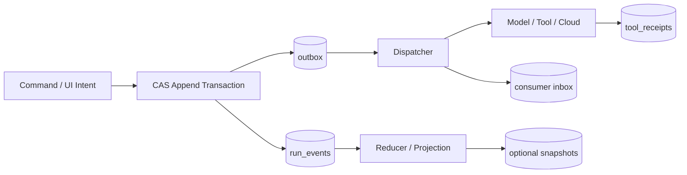
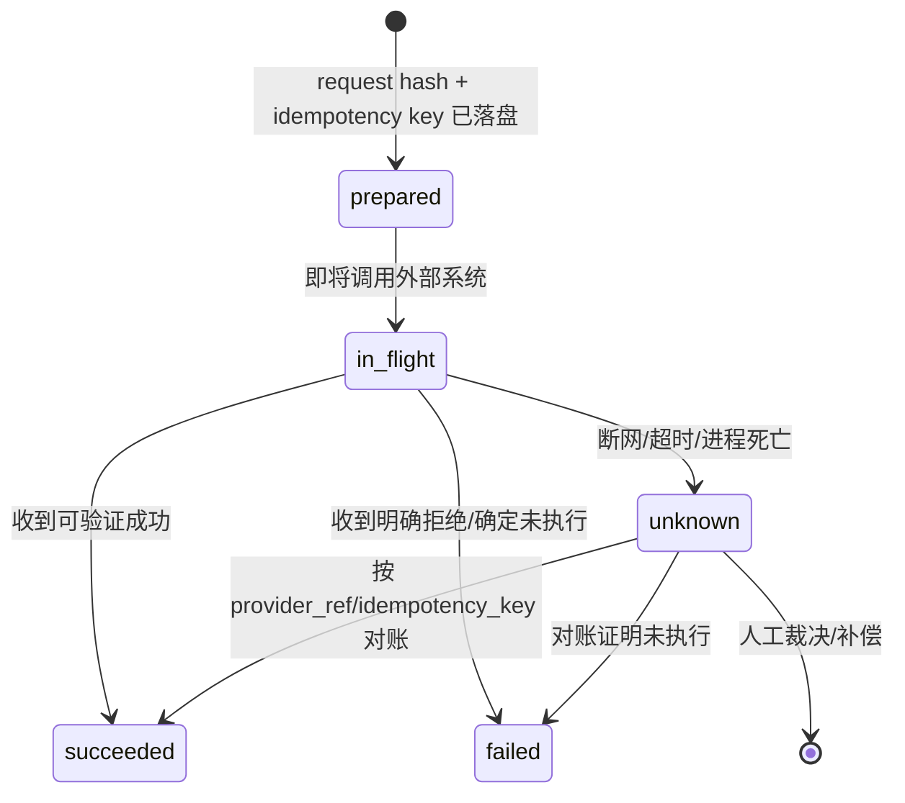

# SQLite 持久化内核：Event Store、Outbox 与未知副作用

本章把“事件为真相”落实为 SQLite schema 和事务代码，并串起 CAS append、WAL、收发箱、`receipt_unknown`、迁移与灾难恢复。SQLite 行为已于 **2026-08-30** 按官方文档核对；表结构和阈值是参考实现，仍需用实际负载验证。

## 1. 持久化边界：先写事实，再推进世界

桌面 Runtime 可能在任意指令间被退出、强杀或断电。数据库至少要回答：某个 Run 已经提交到哪个事件、哪个 Command 等待派发、某个外部副作用是否确定完成、升级后的进程能否读懂旧数据。



原则是：

- `run_events` 是不可变事实；`runs.head_seq` 是并发游标，不是另一份业务真相。
- 更新事件和创建待派发消息必须同一事务，否则会出现“状态已前进、消息丢失”。
- 网络调用永远不能和本地 SQLite 事务原子提交；用 outbox/inbox、幂等键和 receipt 对账缩小不确定区间。
- snapshot、全文索引、向量缓存都可重建，损坏时不能反向覆盖事件。

## 2. 可直接执行的 schema

以下 SQL 可交给 `sqlite3 runtime.db < 001_init.sql`。时间统一由应用写 Unix 毫秒，避免多进程墙钟格式混乱；payload 保存领域 JSON，但常用过滤字段要提升为列。

```sql
PRAGMA application_id = 0x41475254;       -- "AGRT"，识别误打开的文件
PRAGMA foreign_keys = ON;

CREATE TABLE schema_migrations (
  version       INTEGER PRIMARY KEY,
  name          TEXT NOT NULL,
  checksum      TEXT NOT NULL,
  applied_at_ms INTEGER NOT NULL
) STRICT;

CREATE TABLE runs (
  run_id          TEXT PRIMARY KEY,
  thread_id       TEXT NOT NULL,
  definition_ver TEXT NOT NULL,
  head_seq        INTEGER NOT NULL DEFAULT 0 CHECK (head_seq >= 0),
  status          TEXT NOT NULL CHECK (status IN (
                    'queued','running','waiting_approval','waiting_external',
                    'cancelling','completed','failed','cancelled')),
  lease_owner     TEXT,
  lease_until_ms  INTEGER,
  created_at_ms   INTEGER NOT NULL,
  updated_at_ms   INTEGER NOT NULL
) STRICT;

CREATE TABLE run_events (
  run_id          TEXT NOT NULL REFERENCES runs(run_id) ON DELETE RESTRICT,
  seq             INTEGER NOT NULL CHECK (seq > 0),
  event_id        TEXT NOT NULL UNIQUE,
  event_type      TEXT NOT NULL,
  schema_version  INTEGER NOT NULL CHECK (schema_version > 0),
  causation_id    TEXT,
  correlation_id  TEXT,
  payload_json    TEXT NOT NULL CHECK (json_valid(payload_json)),
  created_at_ms   INTEGER NOT NULL,
  PRIMARY KEY (run_id, seq)
) WITHOUT ROWID, STRICT;

CREATE INDEX run_events_correlation
  ON run_events(run_id, correlation_id, seq) WHERE correlation_id IS NOT NULL;

-- 让“同一个客户端请求重试”返回同一结果，并检测 request_id 被换内容。
CREATE TABLE append_requests (
  request_id      TEXT PRIMARY KEY,
  run_id          TEXT NOT NULL REFERENCES runs(run_id),
  expected_seq    INTEGER NOT NULL,
  batch_sha256    TEXT NOT NULL,
  result_head_seq INTEGER NOT NULL,
  created_at_ms   INTEGER NOT NULL
) STRICT;

CREATE TABLE outbox (
  message_id       TEXT PRIMARY KEY,
  run_id           TEXT NOT NULL REFERENCES runs(run_id),
  source_seq       INTEGER NOT NULL,
  topic            TEXT NOT NULL,
  ordering_key     TEXT NOT NULL,
  payload_json     TEXT NOT NULL CHECK (json_valid(payload_json)),
  status           TEXT NOT NULL DEFAULT 'pending'
                   CHECK (status IN ('pending','publishing','delivered','dead')),
  attempts         INTEGER NOT NULL DEFAULT 0,
  visible_at_ms    INTEGER NOT NULL,
  locked_by        TEXT,
  lock_until_ms    INTEGER,
  last_error_class TEXT,
  delivered_at_ms INTEGER,
  UNIQUE (run_id, source_seq, topic)
) STRICT;

CREATE INDEX outbox_due
  ON outbox(status, visible_at_ms, message_id);

CREATE TABLE inbox (
  consumer        TEXT NOT NULL,
  message_id      TEXT NOT NULL,
  payload_sha256  TEXT NOT NULL,
  status          TEXT NOT NULL CHECK (status IN ('processing','done','poisoned')),
  result_json     TEXT CHECK (result_json IS NULL OR json_valid(result_json)),
  received_at_ms  INTEGER NOT NULL,
  completed_at_ms INTEGER,
  PRIMARY KEY (consumer, message_id)
) WITHOUT ROWID, STRICT;

CREATE TABLE tool_receipts (
  tool_call_id     TEXT PRIMARY KEY,
  run_id           TEXT NOT NULL REFERENCES runs(run_id),
  tool_name        TEXT NOT NULL,
  idempotency_key  TEXT NOT NULL UNIQUE,
  request_sha256   TEXT NOT NULL,
  status           TEXT NOT NULL CHECK (status IN (
                     'prepared','in_flight','succeeded','failed','unknown')),
  provider_ref     TEXT,
  result_json      TEXT CHECK (result_json IS NULL OR json_valid(result_json)),
  error_class      TEXT,
  started_at_ms    INTEGER,
  finished_at_ms   INTEGER,
  updated_at_ms    INTEGER NOT NULL
) STRICT;

CREATE TABLE run_snapshots (
  run_id          TEXT NOT NULL REFERENCES runs(run_id),
  through_seq     INTEGER NOT NULL,
  reducer_version TEXT NOT NULL,
  state_json      TEXT NOT NULL CHECK (json_valid(state_json)),
  state_sha256    TEXT NOT NULL,
  created_at_ms   INTEGER NOT NULL,
  PRIMARY KEY (run_id, through_seq)
) WITHOUT ROWID, STRICT;

PRAGMA user_version = 1;
```

`STRICT` 仍不替你做领域校验；事件反序列化必须按 `event_type + schema_version` 验证。不要给事件表加“更新 payload”的管理接口，纠错应追加 `...Corrected` 事件。

## 3. 连接初始化：WAL 不是“无锁模式”

```sql
PRAGMA journal_mode = WAL;          -- 持久数据库属性；启动时仍校验返回值
PRAGMA synchronous = FULL;          -- 事件真相优先耐久性
PRAGMA busy_timeout = 5000;         -- 等锁上限；超时后仍会 SQLITE_BUSY
PRAGMA foreign_keys = ON;           -- 每条连接都设置
PRAGMA trusted_schema = OFF;
PRAGMA wal_autocheckpoint = 1000;
PRAGMA journal_size_limit = 67108864;
```

WAL 允许 reader 与 writer 多数时候并行，但同一时刻仍只有一个 writer；checkpoint 还会受长读事务影响。SQLite 官方明确说明 WAL 模式仍可能返回 `SQLITE_BUSY`，例如恢复、最后连接清理或锁等待超时。因此：读流不要长时间持有 transaction；写事务短小；把 `BUSY` 作为有界重试的正常类别而非“数据库坏了”；在交互线程之外做 checkpoint。

`busy_timeout` 不是队列公平性保证，也不能修复死锁式应用设计。若多个进程都写同一文件，建议 Runtime Supervisor 选一个持久化 writer，通过本地 IPC 串行接收 append；其他连接主要读。不要把 WAL 数据库放在不满足 SQLite 共享内存/锁语义的网络文件系统上。

## 4. CAS append：用头序号拒绝双推进

下面是 `better-sqlite3` 风格的完整核心。该库的 transaction wrapper 提供 `immediate()`；生产实现还应把 JSON schema 校验放在进入事务前，并给错误分类。

```ts
import Database from "better-sqlite3";
import { createHash } from "node:crypto";

type NewEvent = {
  eventId: string; type: string; schemaVersion: number;
  causationId?: string; correlationId?: string; payload: unknown;
};
type AppendInput = {
  requestId: string; runId: string; expectedSeq: number;
  nowMs: number; newStatus: string; events: NewEvent[];
};

const db = new Database("runtime.db");
db.pragma("journal_mode = WAL");
db.pragma("synchronous = FULL");
db.pragma("busy_timeout = 5000");
db.pragma("foreign_keys = ON");

const canonical = (x: unknown) => JSON.stringify(x); // 生产使用稳定键序 canonical JSON
const digest = (x: string) => createHash("sha256").update(x).digest("hex");

const appendTxn = db.transaction((input: AppendInput): number => {
  const batchJson = canonical({
    runId: input.runId, expectedSeq: input.expectedSeq,
    newStatus: input.newStatus, events: input.events,
  });
  const batchHash = digest(batchJson);

  const seen = db.prepare(
    "SELECT batch_sha256, result_head_seq FROM append_requests WHERE request_id = ?"
  ).get(input.requestId) as { batch_sha256: string; result_head_seq: number } | undefined;
  if (seen) {
    if (seen.batch_sha256 !== batchHash) throw new Error("REQUEST_ID_REUSED_WITH_DIFFERENT_BODY");
    return seen.result_head_seq;
  }

  const run = db.prepare("SELECT head_seq FROM runs WHERE run_id = ?").get(input.runId)
    as { head_seq: number } | undefined;
  if (!run) throw new Error("RUN_NOT_FOUND");
  if (run.head_seq !== input.expectedSeq) throw new Error(`SEQ_CONFLICT:${run.head_seq}`);

  const putEvent = db.prepare(`
    INSERT INTO run_events
      (run_id, seq, event_id, event_type, schema_version, causation_id,
       correlation_id, payload_json, created_at_ms)
    VALUES (?, ?, ?, ?, ?, ?, ?, ?, ?)`);
  const putOutbox = db.prepare(`
    INSERT INTO outbox
      (message_id, run_id, source_seq, topic, ordering_key, payload_json, visible_at_ms)
    VALUES (?, ?, ?, 'runtime.event', ?, ?, ?)`);

  input.events.forEach((e, i) => {
    const seq = input.expectedSeq + i + 1;
    const payload = canonical(e.payload);
    putEvent.run(input.runId, seq, e.eventId, e.type, e.schemaVersion,
      e.causationId ?? null, e.correlationId ?? null, payload, input.nowMs);
    putOutbox.run(`evt:${e.eventId}`, input.runId, seq, input.runId,
      canonical({ runId: input.runId, seq, type: e.type, payload: e.payload }), input.nowMs);
  });

  const newHead = input.expectedSeq + input.events.length;
  const changed = db.prepare(`
    UPDATE runs SET head_seq = ?, status = ?, updated_at_ms = ?
    WHERE run_id = ? AND head_seq = ?`
  ).run(newHead, input.newStatus, input.nowMs, input.runId, input.expectedSeq);
  if (changed.changes !== 1) throw new Error("SEQ_CONFLICT");

  db.prepare(`INSERT INTO append_requests
    (request_id, run_id, expected_seq, batch_sha256, result_head_seq, created_at_ms)
    VALUES (?, ?, ?, ?, ?, ?)`
  ).run(input.requestId, input.runId, input.expectedSeq, batchHash, newHead, input.nowMs);
  return newHead;
});

export const append = (input: AppendInput) => appendTxn.immediate(input);
```

`BEGIN IMMEDIATE` 在事务开始就争取写锁，避免先读后升级锁时才发现冲突；CAS 的 `WHERE head_seq = expected` 仍保留，因为它表达业务并发契约，也保护未来更换存储实现。两个 worker 同时推进时，一个成功，另一个拿到 `BUSY` 或 `SEQ_CONFLICT`，后者必须 reload + reduce，不能把旧事件简单换一个 seq 再写。

## 5. Outbox / Inbox：接受重复投递，拒绝重复效果

Dispatcher 在短事务中 claim 到期消息：把 `pending` 或租约过期的 `publishing` 更新为自己的 `locked_by/lock_until_ms`，提交后才发网络请求。发布成功再开新事务标记 `delivered`。如果进程在“远端已收、delivered 未写”之间崩溃，消息会重复，所以接收端以 `(consumer, message_id)` 去重。

```sql
BEGIN IMMEDIATE;
UPDATE outbox
SET status='publishing', locked_by=:worker, lock_until_ms=:now + 30000,
    attempts=attempts+1
WHERE message_id = (
  SELECT message_id FROM outbox
  WHERE visible_at_ms <= :now
    AND (status='pending' OR (status='publishing' AND lock_until_ms < :now))
  ORDER BY visible_at_ms, message_id LIMIT 1
)
RETURNING *;
COMMIT;
```

消费者先比较 payload hash：同 ID 同 hash 且 `done`，返回已存结果；同 ID 不同 hash，标记 poisoned 并告警；首次消息插入 inbox，并把**本地数据库内**业务效果与 `status='done'` 放同一事务。若效果在外部系统，则继续使用下节 receipt 协议，不能因为有 inbox 就宣称 exactly-once。

退避使用 decorrelated jitter，并尊重供应商 `Retry-After`；`401/403/schema_invalid` 通常进入 dead-letter 而非自动重试。outbox 的 payload 保存最小引用，敏感大 artifact 放加密对象存储或本地 artifact 区，避免消息表无限膨胀。

## 6. `receipt_unknown`：超时不是失败

对“写文件、发邮件、创建工单、付款”类工具，超时只说明调用方没收到结果，不能证明对方没执行。正确状态机：



执行前先插入 `prepared`，提交后更新 `in_flight` 再调用；收到明确结果才写成功/失败。恢复器扫描 `in_flight` 与 `unknown`：若供应商提供 idempotency key 或查询 API，以相同 key 查询/安全重试；若是可读回的文件补丁，用真实文件 hash 对账；若不可查询且副作用非幂等，暂停 Run 请求人工确认，绝不把 unknown 自动改成 failed 后重发。

```ts
async function invokeTool(call: ToolCall) {
  receipts.prepare(call.id, call.idempotencyKey, sha256(call.args));
  receipts.markInFlight(call.id, Date.now());
  try {
    const result = await tool.execute(call.args, { idempotencyKey: call.idempotencyKey });
    receipts.markSucceeded(call.id, result.providerRef, result.value);
    return result.value;
  } catch (e) {
    if (isDefinitiveRejection(e)) receipts.markFailed(call.id, classify(e));
    else receipts.markUnknown(call.id, classify(e));
    throw e;
  }
}
```

## 7. Migration：版本是恢复协议的一部分

每个 migration 文件有单调版本、不可变 checksum 和 `up` SQL。启动流程先获取独占 migration lease、制作一致性备份、`BEGIN IMMEDIATE`、校验已应用 checksum、执行下一版本、写 `schema_migrations` 与 `PRAGMA user_version`、提交，再运行 smoke query。禁止启动时静默 downgrade。

采用 expand/contract：版本 N 新增 nullable 列/新表并双读；N+1 回填并双写；确认旧客户端退出兼容窗口后，N+2 才删除旧结构。事件 schema migration 通常在读取时 upcast 到当前内存模型，保留原事件字节；只有经过离线演练才物理重写历史。

```sql
-- 002_add_event_tenant.sql（示例）
BEGIN IMMEDIATE;
ALTER TABLE runs ADD COLUMN tenant_id TEXT;
INSERT INTO schema_migrations(version, name, checksum, applied_at_ms)
VALUES (2, 'add_event_tenant', :sha256, :now_ms);
PRAGMA user_version = 2;
COMMIT;
```

升级包必须声明 `minReadableSchema/maxReadableSchema`。新 schema 已前滚但应用二进制回滚时，旧版本应拒绝启动并引导恢复兼容版本，而不是“尽力读”。

## 8. 备份、完整性、恢复与加密

### 8.1 一致性备份

WAL 文件是数据库持久状态的一部分；数据库仍打开时只复制主 `.db` 可能丢已提交事务或得到损坏副本。用 SQLite Online Backup API、CLI `.backup` 或 `VACUUM INTO` 生成一致性快照：

```bash
mkdir -p backups
sqlite3 runtime.db ".backup 'backups/runtime-20260830.db'"
sqlite3 backups/runtime-20260830.db "PRAGMA quick_check; PRAGMA foreign_key_check;"

# 维护窗口可显式 checkpoint；不要在未知进程仍使用时手工删 -wal/-shm。
sqlite3 runtime.db "PRAGMA wal_checkpoint(TRUNCATE);"
```

备份采用多代保留、独立加密、原子改名，并定期做**恢复演练**。能生成备份不等于能恢复：演练要启动指定旧/新应用版本、重放事件、检查 head seq 与 artifact 引用。

### 8.2 完整性与灾难恢复

日常冷启动可按风险运行 `PRAGMA quick_check`，维护窗口运行更彻底的 `PRAGMA integrity_check` 和单独的 `PRAGMA foreign_key_check`。发现 `SQLITE_CORRUPT`：停止写入、保留原文件及其 WAL/SHM、复制到隔离位置、从最近健康备份恢复，再重放可验证的外部事件。SQLite CLI `.recover` 是尽量抢救未损数据的最后手段，不保证完美还原，输出必须进入一份新库并经业务不变量校验。

```bash
sqlite3 corrupt-copy.db ".recover" > recovered.sql
sqlite3 recovered.db < recovered.sql
sqlite3 recovered.db "PRAGMA integrity_check; PRAGMA foreign_key_check;"
```

### 8.3 加密边界

SQLite 公共核心不提供透明静态加密；SQLite 官方的 SEE 是单独授权扩展。企业桌面端可组合：FileVault/BitLocker 保护关机磁盘、SEE 或经过法务与安全评估的等价方案保护数据库文件、字段级 envelope encryption 保护极少数 payload。三者不能替代运行时访问控制：同一用户下被攻破的高权限进程仍可能读取已解密数据。

密钥放 Keychain/Credential Manager/硬件支持的密钥库，数据库只存 key ID；备份密钥与数据分离；轮换要支持旧 key 解密和新 key 写入的窗口。不要记录 prompt/API key 到 SQLite 错误日志。`secure_delete` 也不能承诺 SSD、文件系统快照和旧 WAL 中的物理擦除，因此根本策略是最小化敏感正文、短保留、加密和可验证的 crypto-erasure。

## 9. 典型失败模式

| 症状 | 根因 | 修复 |
|---|---|---|
| 偶发出现两个相同 `seq` | 读 head 后在事务外写 | `BEGIN IMMEDIATE` + `UPDATE ... WHERE head_seq=?` + 唯一主键 |
| UI 已显示 ToolRequested，但 worker 未收到 | 事件与队列分两次提交 | run event 与 outbox 同事务 |
| 重启后重复发邮件 | timeout 被写成 failed | unknown receipt + idempotency/query/人工裁决 |
| WAL 越来越大 | 长读事务阻止 checkpoint | 分页读取、关闭游标、监控 checkpoint backlog |
| 备份恢复后少最后几轮 | 在线时只复制 `.db` | Online Backup API / `.backup` / `VACUUM INTO` |
| 回滚应用后打不开库 | destructive migration 过早执行 | expand/contract、schema 兼容范围、备份和恢复演练 |
| `busy_timeout` 后仍报 BUSY | 把 timeout 当锁消失保证 | 短事务、有界抖动重试、单 writer 架构 |
| 加密库仍泄漏 prompt | 日志/trace/snapshot 留明文 | 数据分类、字段最小化、全链路脱敏与保留策略 |

## 10. 练习与验收

实现一个 4 进程并发测试器：两个 worker 争抢同一 Run，另一个 dispatcher，另一个 crash injector。

- [ ] 10 万次随机 append 后 `(run_id, seq)` 无洞、无重复，`runs.head_seq = max(seq)`。
- [ ] 相同 `requestId + body` 重试返回相同 head；同 requestId 换 body 被拒绝。
- [ ] 在事件提交后、publish 前强杀，重启仍投递；在 publish 后、mark delivered 前强杀，消费者只产生一次业务效果。
- [ ] 模拟不可查询的非幂等工具超时，Run 进入等待裁决而非自动重试。
- [ ] 持续 reader 下测量 WAL 大小、checkpoint 延迟与 `SQLITE_BUSY` 率，给出阈值与报警。
- [ ] 从在线备份恢复并重放至同一 head；对损坏副本验证 quarantine 与 `.recover` 手册。
- [ ] migration N-1 → N、N 版本二进制回退、断电中断三条路径都有自动化测试。

## 11. 关联章节

概念入口见[Runtime 总览](overview.md)与[Agent Loop](agent-loop.md)；副作用协议见[工具系统](tool-system.md)，恢复策略见[流式与恢复](streaming-recovery.md)，指标见[可观测与评测](observability-evals.md)。桌面工作区的 patch receipt 见[Coding Agent Host](../02-desktop/coding-agent-host.md)。

## 官方来源（核对时间：2026-08-30）

- [SQLite Write-Ahead Logging](https://www.sqlite.org/wal.html)、[Transactions](https://www.sqlite.org/lang_transaction.html)、[Busy timeout](https://www.sqlite.org/c3ref/busy_timeout.html)
- [SQLite PRAGMA](https://www.sqlite.org/pragma.html)、[WAL file format and recovery](https://www.sqlite.org/walformat.html)
- [SQLite Online Backup API](https://www.sqlite.org/backup.html)、[Recovering corrupt databases](https://www.sqlite.org/recovery.html)
- [SQLite Security guidance](https://www.sqlite.org/security.html)、[SQLite Encryption Extension](https://www.sqlite.org/see/doc/release/www/readme.wiki)
