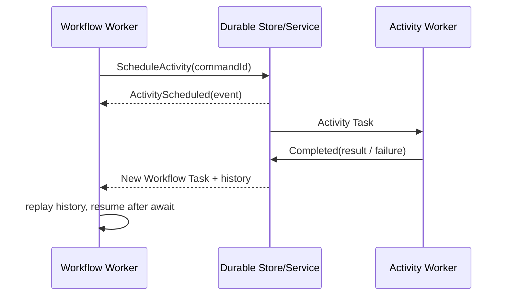

# Durable Workflow：长任务的持久化执行

Durable Workflow 用事件历史和确定性重放处理进程崩溃与人工等待。内容覆盖 Activity、重试、超时、信号、版本和补偿，也比较成熟引擎与轻量自建编排的适用边界。

## 1. Promise 链为什么不等于 Workflow

下面代码在正常进程里没有问题，但只要应用在 `charge()` 成功后、`sendReceipt()` 前崩溃，就无法从内存知道做到哪里：

```ts
await reserveInventory(order);
await charge(order);
await sendReceipt(order);
```

“数据库里存一个 status”只能解决最简单流程。当出现并行分支、计时器、人工审批、子流程、重试和版本升级时，单个状态字段无法表达每一步的输入、尝试次数、因果关系和已完成副作用。

Durable Workflow 将决定执行进度的事件持久化，通过确定性重放恢复 Workflow 局部状态；所有非确定性 I/O 都隔离到 Activity。Temporal 的 Workflow Execution 采用这种模型：命令产生的结果进入 Event History，worker 可重放历史恢复到最新位置。

## 2. Workflow、Activity、Event History

- **Workflow Definition**：描述业务编排的确定性函数，如顺序、分支、并行、等待、补偿。
- **Workflow Execution**：某个 definition 版本的一次有身份运行，具有 workflowId/runId。
- **Activity**：可能失败或产生副作用的 I/O，例如模型调用、写文件、HTTP、发邮件。
- **Command/Event**：Workflow 请求调度 Activity/Timer 等 Command；引擎将调度与结果写入历史 Event。
- **Worker**：拉取任务、重放 Workflow、执行 Activity；worker 不是状态真相来源。



重放时不会真的再次调用已完成 Activity；SDK 看到相同调度点，就从历史取回旧结果。这要求 Workflow 代码对同一历史必须生成相同 Command 序列。

## 3. 确定性边界

Workflow 代码中通常不能直接使用：

- `Date.now()`、`Math.random()`、随机 UUID（除非引擎提供可重放版本）；
- 直接 `fetch()`、数据库查询、文件 I/O；
- 依赖对象遍历、竞态完成顺序等不稳定结果决定分支；
- 未版本化地修改历史已运行到的控制流。

把这些操作放进 Activity，或者把结果作为 Signal/Update/Event 写入历史。注意“模型推理”高度非确定，必须是 Activity；重放不能重新请求模型，否则输出、成本和副作用路径都会变化。

```ts
// 接近 Temporal TypeScript SDK 的写法；Activity 函数实现在 workflow 文件之外。
import { proxyActivities, defineSignal, setHandler, condition } from "@temporalio/workflow";
import type * as activities from "./activities";

const { askAgent, publishApprovalRequest, applyPatch, runTests, revertPatch } = proxyActivities<typeof activities>({
  startToCloseTimeout: "10 minutes",
  retry: { maximumAttempts: 4, initialInterval: "2 seconds", backoffCoefficient: 2 }
});

type ApprovalDecision = {
  approvalId: string;
  canonicalArgsHash: string;
  policyVersion: string;
  decision: "allow" | "deny";
};
export const approvalSignal = defineSignal<[ApprovalDecision]>("approval");

export async function codeChangeWorkflow(input: { repoId: string; request: string }) {
  let decision: "allow" | "deny" | undefined;
  let expected: Omit<ApprovalDecision, "decision"> | undefined;
  let approvalPublished = false;
  setHandler(approvalSignal, value => {
    // proposal 尚未持久化/发布，或任一绑定字段不一致时，晚到与抢跑信号都无效。
    if (!expected || !approvalPublished) return;
    if (value.approvalId !== expected.approvalId) return;
    if (value.canonicalArgsHash !== expected.canonicalArgsHash) return;
    if (value.policyVersion !== expected.policyVersion) return;
    decision ??= value.decision; // 一次性消费；重复信号幂等
  });

  const proposal = await askAgent(input);       // 非确定性：Activity
  expected = {
    approvalId: proposal.approvalId,
    canonicalArgsHash: proposal.canonicalArgsHash,
    policyVersion: proposal.policyVersion
  };
  // 此 Activity 以 approvalId 幂等；命令入口还要确认 approval.requested 已提交、
  // 当前身份有权限且票据未过期，不能只依赖 Workflow 内的字符串比较。
  await publishApprovalRequest({ ...expected, summary: proposal.summary });
  approvalPublished = true; // 只有 durable publish 成功返回后才开始接受决策
  await condition(() => decision !== undefined); // 可持久等待数小时
  if (decision === "deny") return { status: "denied" as const };

  const receipt = await applyPatch({ repoId: input.repoId, patch: proposal.patch });
  try {
    const tests = await runTests({ repoId: input.repoId, revision: receipt.revision });
    if (!tests.ok) throw new Error("tests failed");
    return { status: "completed" as const, revision: receipt.revision };
  } catch (error) {
    await revertPatch({ repoId: input.repoId, receipt }); // 补偿，不是数据库回滚
    throw error;
  }
}
```

## 4. Activity 的交付语义与幂等

Activity 常见是 **at-least-once**：worker 可能已经完成外部写入，却在上报结果前崩溃，引擎随后重试。所有可重试 Activity 都要回答“重复调用会怎样”。

```ts
type SendMailInput = {
  tenantId: string;
  messageId: string; // 业务幂等键，由 Workflow 确定性生成
  to: string;
  body: string;
};

async function sendMail(input: SendMailInput, db: DB, provider: MailProvider) {
  const existed = await db.mailReceipt.findUnique({ key: input.messageId });
  if (existed) return existed;

  // 更理想：下游 provider 也接收同一个 idempotency key。
  const remote = await provider.send(input, { idempotencyKey: input.messageId });
  return db.mailReceipt.insertUnique({ key: input.messageId, remoteId: remote.id });
}
```

本地文件写入可采用“写临时文件 → fsync → 原子 rename”，并把目标内容哈希作为幂等依据。Shell 命令通常不可天然幂等，应拆成“查询当前状态”和“执行变更”，或运行在可回滚快照/工作树中。

## 5. 重试、超时与心跳不是一个旋钮

生产 Activity 至少区分：

- **Schedule-to-start timeout**：排队太久，反映 worker 容量/路由问题；
- **Start-to-close timeout**：单次尝试最长执行时间；
- **Schedule-to-close timeout**：包含所有排队和重试的总上限；
- **Heartbeat timeout**：长 Activity 多久必须汇报一次进度。

错误也要分类：限流、网络抖动、worker 崩溃可重试；schema 不兼容、权限拒绝、余额不足通常不可盲目重试。模型请求重试尤其要注意：若请求可能已被供应商接收但响应丢失，重试会产生新费用和新输出；应保存 provider request id，支持时使用供应商幂等机制，否则将其作为新 attempt 明确记录。

退避应指数增长并加 jitter，但计算出的 `nextAttemptAt` 要作为事件持久化；自研引擎重放时不能重新抽随机数。

## 6. Signal、Query、Update 与人工审批

- **Signal**：异步通知 Workflow 某件事发生，不要求同步返回业务结果，如“用户取消”。
- **Query**：只读查看当前状态，不能改变历史；用于 UI 展示。
- **Update**：带校验和结果的状态修改，例如“批准并返回已接受”。不同引擎命名不同，但语义应分离。

审批记录必须绑定 `runId/stepId/toolName/canonicalArgsHash/policyVersion/approver/expiry`。收到重复批准时应幂等；过期批准不得应用到参数已改变的新 attempt。

## 7. 取消、终止与补偿

取消是协作协议：Workflow 收到取消后，请求子 Workflow/Activity 停止；Activity 通过 heartbeat 或 `AbortSignal` 感知，并尽力清理。终止则是强制停止编排，清理逻辑可能不运行，适合失控流程而非正常用户操作。

分布式副作用不能依靠 ACID 回滚，通常使用 Saga：每个成功步骤记录补偿动作，失败时逆序执行。补偿本身也可能失败，因此必须可重试、幂等且可人工介入。并非所有动作都能补偿——邮件发出无法“收回”，此类不可逆动作应尽量后置，且在执行前设置明确批准点。

## 8. 版本升级与历史兼容

最危险的操作是直接改变已有 Workflow 的命令顺序。例如旧版本历史先 A 后 B，新代码改为先 B 后 A，重放会发生 non-determinism。

可选策略：

1. 新启动运行使用 `workflowVersion=v2`，旧 worker 继续服务 v1，直到存量结束；
2. 使用引擎提供的 patch/version marker，在历史中固化某次执行走旧分支还是新分支；
3. 对超长会话使用 Continue-As-New：携带精简状态开启新 run，截断不断增长的历史；
4. 事件 schema 只做向后兼容扩展，破坏性变更通过 upcaster 转成内存新版本。

部署前用生产历史样本做 replay test，而不只是单元测试当前路径。

## 9. 何时自研，何时采用成熟引擎

若只是桌面端几秒钟的工具调用，SQLite 事件表 + outbox + lease 可能足够。出现以下任意组合时，应认真评估 Temporal 等成熟引擎：跨天等待、数十万并发流程、复杂重试/计时器、跨服务 Activity、工作流升级和运营可视化。

自研容易低估的部分包括：任务租约与粘性调度、历史分页/压缩、计时器海量调度、worker 版本路由、死信与重放工具、跨区域一致性。采用成熟引擎的代价则是基础设施、确定性编程约束、序列化边界以及团队学习成本。

## 10. 失败模式

| 失败模式 | 后果 | 纠正 |
| --- | --- | --- |
| 在 Workflow 内直接 fetch | 重放重复 I/O、历史不确定 | 封装为 Activity |
| 所有错误统一无限重试 | 成本风暴、永久卡死 | 错误分类 + attempt/deadline 上限 |
| Activity 无幂等键 | 重复支付/邮件/文件修改 | 业务键 + 下游去重 + receipt |
| 只设单个 timeout | 无法区分容量与执行卡死 | 分离 queue/attempt/overall/heartbeat |
| 升级直接改控制流 | 存量历史无法重放 | 版本 worker、patch marker、replay test |
| 把 Query 当更新 | 状态变了却无历史 | 所有修改走 Signal/Update/Event |

## 11. 测试、练习与验收

测试层次应包括：纯 Workflow 分支测试、Activity 合约测试、虚拟时间测试（几天计时器几秒跑完）、历史重放测试、故障注入。重点注入“副作用成功但结果上报失败”这一窗口。

**练习**：设计“生成周报 → 等待负责人审核 → 发布到三个渠道”的 Workflow。要求 Slack 发布成功、邮件失败时可恢复；超过 24 小时未审批自动过期；Workflow v2 新增敏感词检查但不能破坏 v1 存量运行。

**验收点**：

- [ ] 能明确指出 Workflow 确定性边界，模型调用全部在 Activity。
- [ ] 每个可重试副作用都有幂等键或可执行的确认/补偿策略。
- [ ] 能区分四类 timeout、取消与终止、Signal/Query/Update。
- [ ] 发布前可对旧历史运行 replay test。
- [ ] 能基于任务时长、规模与运维成本做自研/采用引擎决策。

## 延伸阅读

- [Temporal Workflow Execution 与 Replay](https://docs.temporal.io/workflow-execution)
- [Temporal TypeScript 开发指南](https://docs.temporal.io/develop/typescript)
- [Temporal Activity Execution](https://docs.temporal.io/activity-execution)
- [Microsoft Azure Architecture Center：Saga Pattern](https://learn.microsoft.com/en-us/azure/architecture/patterns/saga)
