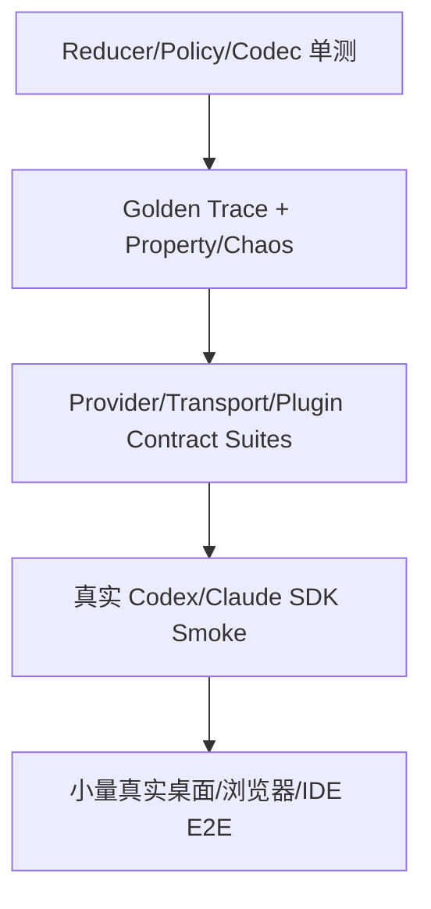

# 兼容性与测试：Contract Suite、回放与升级门禁

> 编译通过只是起点。测试还要覆盖 Provider 换版本、Runtime 跨版本、Transport 断线、客户端跨端和进程崩溃，确认公共状态机与安全不变量仍成立。

## 1. 版本面与兼容承诺

至少有五个独立版本：Client SDK、wire protocol、Runtime、Provider adapter、底层 SDK/CLI。桌面应用版本只是它们的组合，不应拿一个 `package.json.version` 代替矩阵。

| 组件 | 推荐版本策略 | 必测兼容方向 |
|---|---|---|
| TypeScript Client SDK | SemVer | 新 SDK 对当前/N-1 Runtime；旧 SDK 对新 Runtime |
| Wire protocol | major/minor + schema ID | 同 major 新字段；major 握手拒绝/降级 |
| Runtime | 独立发布 | 当前与 N-1 Client、Desktop Host |
| Adapter | 独立 SemVer | 公共 ProviderPort conformance |
| Provider SDK/runtime | lockfile + binary hash | 锁定组合 smoke、升级候选回放 |

支持窗口写进策略，例如 Runtime 3.x 接受 client protocol 3.x 与 2.x；不支持时握手返回 `INCOMPATIBLE_PROTOCOL`、服务端范围和升级 URL，不能连接后在第一条工具事件上崩溃。

Schema diff 门禁：增加 optional 字段通常允许；删除/改义、optional 变 required、枚举收窄、格式变化必须升 major。TypeScript 类型由 schema 生成，禁止手改类型而忘记 wire schema。

## 2. 测试金字塔



- **Unit**：状态转换、错误分类、路径/grant、能力交集、路由评分。
- **Property/Fuzz**：事件重复、乱序、缺失、随机断线、decoder 边界。
- **Contract**：每个 adapter/transport/plugin host 跑同一行为套件。
- **Replay**：脱敏的 Provider trace 经过新 adapter，比较公共语义。
- **Smoke**：少量真实 API/CLI，发现文档/SDK/runtime 漂移。
- **E2E**：真实安装包、签名、更新、进程崩溃与 UI 恢复。

不要把所有测试都连真实模型：慢、贵、输出非确定且难定位。行为不变量在 fake/record-replay 层测，真实 smoke 只验证集成表面。

## 3. Provider Contract Suite

```ts
export function providerContract(make: () => Promise<ProviderPort>) {
  describe("ProviderPort", () => {
    it("emits exactly one terminal event", async () => {
      const p = await make();
      const events: ProviderEvent[] = [];
      const session = await p.open(openFixture, AbortSignal.timeout(5_000));
      await p.run(session, runFixture, async e => { events.push(e); },
        AbortSignal.timeout(10_000));
      expect(events.filter(isTerminal)).toHaveLength(1);
      assertValidTransitions(events);
    });

    it("does not retry side effects after ambiguous failure", async () => {
      const p = await makeWithFault({ afterToolCommit: "disconnect" });
      await expect(run(p)).rejects.toMatchObject({ code: "RECOVERY_REQUIRED" });
      expect(toolLedger.commits).toBe(1);
    });

    it("honors cancellation or declares forced-cancel capability", async () => {
      const p = await make();
      await assertCancellationContract(p);
    });
  });
}
```

完整套件覆盖：session create/resume/not-found；流顺序与终态；tool call/approval 参数摘要；usage 缺失/为零；结构化输出验证；deadline/cancel；认证、限流、过载、网络、协议错误；未知 Provider 事件；dispose 幂等。Adapter 不支持某能力时必须在 descriptor 明示，套件改验“确定性拒绝”，不能 skip 掉。

Fake Provider 用脚本描述 trace：`emit → awaitApproval → toolResult → fail/complete`，支持虚拟时钟和故障注入。不要让 fake 复制某一家 SDK 数据结构，否则公共合约会被它悄悄绑架。

## 4. Transport Contract Suite

对 in-memory、Electron/Tauri IPC、HTTP+WS/SSE、native messaging、IDE transport 复用同一套测试：

1. 握手选择最高公共协议，完全不相交时拒绝。
2. 并发 requestId 不串响应，取消只影响目标请求。
3. eventId 去重、seq gap 报错、`afterSeq` 精确恢复。
4. 慢消费者触发背压且内存不超过预算。
5. 断线发生在 command 发送前、发送后未响应、收到 accepted 后三种窗口，幂等结果正确。
6. 超大帧、深嵌套、非法 UTF-8/JSON、压缩炸弹在 decode 前受限。
7. 未认证、错 tenant、错 Origin/extension ID/local peer 被拒且不泄漏存在性。

测试用 transport proxy 随机 drop、duplicate、reorder、delay 和 half-close。对顺序 transport，reorder 用于验证 decoder 能报告协议破坏；不是要求业务容忍一切。

## 5. Golden trace 与语义比较

录制 trace 时在边界立刻脱敏：prompt/代码替换为固定 token，ID 映射为稳定别名，credential/header 永不落盘。Fixture 存：输入意图、Provider 原始事件的最小必要形状、期望公共事件与不变量、SDK/runtime 版本。

比较分两层：

- 严格比较 schema、event type、状态转换、tool id/args digest、错误 code、终态数量。
- 对 Provider 生成文本、时间、token usage 用 predicate/range，不做脆弱全量快照。

SDK 升级时先对历史 corpus 回放。差异分类为预期新增、公共语义改变、安全能力改变、未知；只有预期差异更新 golden，且 PR 记录原因。不能看到 snapshot 大面积变化就一键接受。

## 6. Property、模型与混沌测试

用 property-based generator 生成合法事件序列，再进行重复、截断、terminal 竞争、delta 合并等变换。核心性质：合法序列重放结果确定；重复 eventId 不改变结果；terminal 后任何业务事件被拒；非法审批 digest 永不执行工具；snapshot + suffix 等价于完整回放。

状态模型测试把 SUT 与简单 reference model 对比：command `start/approve/deny/cancel/crash/reconnect` 随机组合，检查 turn phase、tool ledger 和 seq cursor。

混沌场景包括：Runtime 在工具前/中/后被 kill；磁盘满；event store 事务失败；Provider 空闲不产事件；网络恢复；系统 suspend/resume；机器时钟跳变；更新正好在 running turn；Renderer OOM。每个场景要有“允许损失边界”，例如可丢未提交 delta，但不能丢 tool terminal 或重复副作用。

## 7. 跨端与跨平台矩阵

PR 快速矩阵用 Linux/模拟 transport；合并与夜间矩阵至少覆盖 macOS arm64、macOS x64、Windows x64，Node LTS/项目锁定版本，以及 Chromium/系统 WebView 基线。浏览器扩展要测试 service worker 被主动终止后重连；VS Code 同时测 Node extension host 与 web extension host（后者无 Node/child process）。

桌面 E2E 从**已签名安装包**运行，而非 dev server：

- 干净安装、首次启动、登录、选 workspace、运行/取消；
- N-1 安装 → 建会话 → 升 N → 恢复；
- Renderer/Runtime crash 后重建；
- 代理、自签企业 CA/证书轮换按支持政策验证；
- sidecar 架构/hash/签名和 fuses/capabilities 自动检查；
- 卸载后按产品政策保留或删除数据。

## 8. 真实 SDK Smoke 与漂移监测

对 `@openai/codex-sdk`：验证安装的最小 `startThread → run → resumeThread`、thread ID、成功/失败映射与 sandbox；如使用 streamed API，再覆盖事件 union。对 `@anthropic-ai/claude-agent-sdk`：验证 `query()` async iterable、允许工具、拒绝工具、终态/usage、session 能力。用临时 workspace 和只读/无网络默认策略，设置费用与时长上限。

锁定包版本仍不代表底层 CLI/runtime 不变，因此报告同时记录 package version、CLI/runtime version、Node、OS、binary hash。官方 SDK 新版本由 bot 建候选 PR，不在运行时自动拉 latest。

Smoke 失败首先隔离 candidate，不应直接阻塞已发布稳定组合。若供应商服务故障，测试标为 external unavailable 并保留诊断；不能把真实断言删掉来“修绿”。

## 9. 安全与合规测试

- IPC/API schema fuzz；原型污染键、超深 JSON、Unicode 路径、Windows UNC/junction、macOS symlink。
- XSS 后尝试调用未暴露 API、伪造 sender、读取 vault、绕过 CSP。
- Prompt injection 要求扩大权限、泄漏 secret、访问 grant 外文件，策略必须拒绝。
- 插件尝试 scope 外文件/域名/命令、hook 超时/崩溃、manifest 权限升级。
- 日志/trace/crash bundle secret scanning，fixture 也不得含真实客户数据。
- 更新包篡改、旧签名、错误架构、回滚与数据 migration 中断。

安全回归要成为 release gate；高风险边界最好做独立渗透测试和威胁模型复审。

## 10. 升级 Runbook 与门禁

1. 阅读官方 changelog、类型 diff、最低 Node/OS 变化和许可证/条款。
2. 更新 lockfile，但不同时重构公共协议。
3. 编译穷尽 switch；运行 schema diff、unit/property、所有 contract。
4. 回放历史 golden corpus，人工审查语义差异。
5. 运行真实 SDK smoke、桌面 install/update E2E 和安全回归。
6. 内部 ring → 1% → 10% → 50% → 100%，观察 adapter error、unknown event、crash、恢复和成本。
7. 保留旧 adapter/runtime 产物与服务端 kill switch，满足回退窗口。

Release gate 需产出机器可读 compatibility report：测试组合、版本/hash、通过率、已接受差异、风险 owner、到期例外。没有 owner/期限的 skip 视为失败。

## 11. 生产失败模式

- **只 mock SDK 方法返回文本**：工具/流/取消均未测。用行为脚本和真实 smoke。
- **golden 保存真实 prompt**：测试仓库变数据泄漏源。录制时脱敏并扫描。
- **E2E 只跑开发模式**：签名、ASAR、sidecar 路径、WebView 差异未覆盖。测最终安装包。
- **兼容测试全是 happy path**：真正事故发生在 accepted 未响应、工具已提交等不确定窗口。故障注入覆盖每个边界。
- **Provider 升级与公共 major 同时发布**：无法判断回归来源。分步、独立版本、可回退。

## 12. 练习与验收

关联：[Provider 抽象](provider-abstraction.md)、[事件协议](contracts-events.md)、[Transport/插件](transport-extensions.md)、[桌面分发恢复](../02-desktop/distribution.md)。

练习：为 fake Provider 和 in-memory transport 建首个 conformance harness，再加入一个真实 adapter。验收：至少 30 个公共行为用例；随机事件测试可复现 seed；杀进程不会重复 tool side effect；N-1 client 与 N Runtime 双向兼容测试；真实 SDK 报告包含包/CLI/hash；篡改更新、伪造 IPC、日志 secret scan 全部进入发布门禁。

## 参考资料

- [Semantic Versioning 2.0.0](https://semver.org/)
- [JSON Schema Specification](https://json-schema.org/specification)
- [OpenAI Codex SDK](https://developers.openai.com/codex/sdk)
- [OpenAI Codex TypeScript samples](https://github.com/openai/codex/tree/main/sdk/typescript/samples)
- [Claude Agent SDK changelog](https://github.com/anthropics/claude-agent-sdk-typescript/blob/main/CHANGELOG.md)
- [VS Code Web Extension testing](https://code.visualstudio.com/api/extension-guides/web-extensions#test-your-web-extension)
