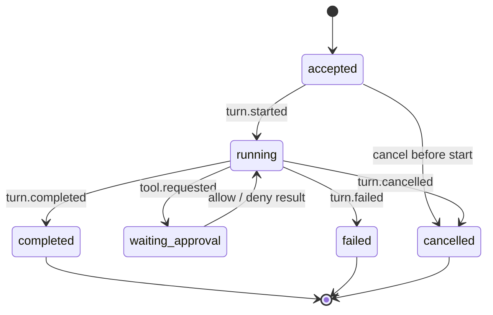

# 合约与事件协议：可回放的 Agent 状态机

> 一个可靠的事件协议要回答：发生了什么、属于哪个 session/turn、顺序如何、是否可重放、消费者怎样识别终态、敏感字段怎样处理。只定义 `onToken()` 远远不够。

## 1. Wire envelope

```ts
export interface EventEnvelope<P extends AgentPayload = AgentPayload> {
  schema: "com.example.ai.event/v1";
  eventId: string;          // 全局唯一，用于去重
  sessionId: string;
  turnId?: string;
  seq: number;              // 对外 SDK session 流内单调递增，由 Gateway 分配
  runSeq?: number;          // 映射 Runtime Run 时保留其 Run 内游标
  occurredAt: string;       // RFC 3339；排序以 seq 为准
  traceId: string;
  causationId?: string;     // 导致本事件的 command/event
  correlationId: string;    // 一次用户操作链
  payload: P;
}
```

不要用时间戳排序：设备时钟可能漂移，多个进程也无法保证精度。这里明确区分两个边界：Runtime 内部事件的 `runSeq` 只在单个 Run 内连续；统一 SDK 对外的 `seq` 在 session 聚合流内连续。Gateway 映射事件时保留 `runSeq`，再事务性分配 session `seq`；任何 API 都不能拿一个游标去恢复另一个范围。`eventId` 去重，`causationId` 追因果，`correlationId/traceId` 做跨进程诊断。ID 不承载租户等业务信息，避免泄漏。

## 2. 最小事件分类

```ts
type AgentPayload =
  | { type: "session.created"; provider: string; capabilitiesHash: string }
  | { type: "turn.accepted"; inputDigest: string }
  | { type: "turn.started" }
  | { type: "assistant.text.delta"; streamId: string; text: string }
  | { type: "assistant.message.completed"; messageId: string; text?: string }
  | { type: "tool.requested"; call: ToolCall; risk: RiskAssessment }
  | { type: "tool.approval.resolved"; callId: string; decision: "allow" | "deny" }
  | { type: "tool.started"; callId: string }
  | { type: "tool.output.delta"; callId: string; chunkRef: string }
  | { type: "tool.completed"; callId: string; result: ToolResult }
  | { type: "context.compacted"; checkpointId: string; throughSeq: number }
  | { type: "turn.completed"; finishReason: FinishReason; usage?: Usage }
  | { type: "turn.failed"; error: AgentError }
  | { type: "turn.cancelled"; mode: "cooperative" | "forced" };
```

Delta 是瞬时展示优化，不应是唯一事实。每个 message/tool 都要有 completed 事件或 blob 快照，使重放不必拼接百万 token。大输出放 blob store，事件只存 content-addressed ref、媒体类型、长度和脱敏级别。

## 3. Turn 状态机与不变量



必须通过 reducer/assertion 强制以下不变量：

- 每个 turn 恰好一个终态：completed、failed、cancelled 三选一。
- `tool.completed` 之前必须出现同 callId 的 requested；若已审批，args digest 必须相同。
- terminal 之后不能再出现业务事件；迟到 Provider 事件只能进入诊断通道。
- `(sessionId, seq)` 唯一且连续；发现 gap 先补拉，不能静默跳过。
- 同一个 `idempotencyKey` 重试 `run` 返回原 turn，不创建第二个副作用链。

```ts
function reduceTurn(state: TurnState, e: EventEnvelope): TurnState {
  if (state.terminal) throw new ProtocolError("EVENT_AFTER_TERMINAL");
  switch (e.payload.type) {
    case "turn.started":
      if (state.phase !== "accepted") throw new ProtocolError("INVALID_TRANSITION");
      return { ...state, phase: "running" };
    case "turn.completed":
      if (state.phase !== "running") throw new ProtocolError("INVALID_TRANSITION");
      return { ...state, phase: "completed", terminal: true, usage: e.payload.usage };
    case "turn.failed":
      if (!["accepted", "running", "waiting_approval"].includes(state.phase)) {
        throw new ProtocolError("INVALID_TRANSITION");
      }
      return { ...state, phase: "failed", terminal: true, error: e.payload.error };
    case "turn.cancelled":
      if (!["accepted", "running", "waiting_approval"].includes(state.phase)) {
        throw new ProtocolError("INVALID_TRANSITION");
      }
      return { ...state, phase: "cancelled", terminal: true };
    default:
      return applyNonTerminal(state, e);
  }
}
```

## 4. 工具合约与审批绑定

```ts
type ToolCall = {
  callId: string;
  tool: { id: string; version: string };
  arguments: unknown;       // 由 tool 对应 JSON Schema 验证
  argumentsDigest: string;  // canonical JSON 后哈希
  workspaceGrant?: string;
};

type ToolResult =
  | { status: "ok"; output?: unknown; outputRef?: string }
  | { status: "error"; error: AgentError };
```

工具 schema 使用显式 dialect（可选 JSON Schema 2020-12），`additionalProperties: false` 作为敏感工具默认值。Schema 版本与工具实现版本分开；重大参数语义变化发布新 major。审批记录覆盖 callId、tool version、argumentsDigest、grant、用户主体、决策与到期时间，Runtime 执行前二次比对。

Tool output 不是模型可无限信任的“系统消息”；标注 source、integrity 与 sensitivity。MCP/网页/仓库返回的文本可能含提示注入，进入 Context 时保留来源边界。

## 5. 错误模型

```ts
type AgentError = {
  code:
    | "INVALID_ARGUMENT" | "AUTH_REQUIRED" | "PERMISSION_DENIED"
    | "POLICY_DENIED" | "RATE_LIMITED" | "PROVIDER_UNAVAILABLE"
    | "TIMEOUT" | "CANCELLED" | "CONFLICT" | "PROTOCOL_ERROR"
    | "STRUCTURED_OUTPUT_INVALID"
    | "INTERNAL";
  message: string;              // 可安全展示，不含 secret/堆栈
  retryable: boolean;
  retryAfterMs?: number;
  providerCode?: string;        // 允许列表/脱敏后的原始分类
  details?: Record<string, unknown>;
};
```

HTTP 500 不必然可重试，timeout 也不代表没有副作用。只有明确幂等或可查询原 turn 时自动重试。`message` 与内部 `diagnosticRef` 分离；Provider 响应体、stack、文件内容不回传前端。取消是预期终态，不应全部计入错误率。

## 6. Usage、成本与结构化输出

Usage 统一字段应允许缺失：`inputTokens?`、`outputTokens?`、`cachedInputTokens?`、`reasoningTokens?`，并保留 `providerUsageRef`。`undefined` 表示供应商未报告，0 表示确实为零。费用使用 `{amount, currency, pricingVersion, estimated}`，不能把动态价目硬编码进事件 reducer。

结构化输出事件包含 `schemaId + value`，Runtime 在发布 completed 前再次验证。校验失败是 `STRUCTURED_OUTPUT_INVALID`，可按策略进行有限修复 turn；不能 `JSON.parse` 成功就当满足 schema。

## 7. 持久化、回放与压缩

推荐 append-only event store + materialized snapshot。写事件和更新 idempotency/terminal index 在同一事务；订阅采用 transactional outbox，避免数据库已写成功但事件未发。客户端带 `afterSeq` 重连；服务端若仍保留事件就增量回放，否则返回 `snapshot(atSeq) + events(afterSeq)`。

Compaction 不能删除审计所需的 tool approval 与副作用终态。`context.compacted` 说明用于模型上下文的摘要/checkpoint，不等于删除法律审计事件。数据保留按租户政策执行，删除 blob 后保留不可逆摘要时也要评估是否仍构成个人数据。

流控：客户端授予 credit 或 transport 有界 buffer；可合并连续 text delta，但每次合并仍保持起止 seq 映射。关键事件永不丢弃。慢消费者超过配额时断开并允许从 last committed seq 重连。

### Command/Response 也是合约

事件只描述事实，意图通过 command 进入：

```ts
type CommandEnvelope<T = unknown> = {
  schema: "com.example.ai.command/v1";
  requestId: string;
  idempotencyKey: string;
  tenantId: string;          // 服务端仍从身份核对，不盲信
  issuedAt: string;
  deadlineAt: string;
  expectedSessionRevision?: number;
  command: { type: string; input: T };
};

type CommandResponse<T> =
  | { requestId: string; status: "accepted"; operationId: string; value?: T }
  | { requestId: string; status: "rejected"; error: AgentError };
```

`accepted` 只表示 Runtime 持久接受，不表示 turn 成功；业务结果由后续事件给出。对修改 session 配置、解决审批等竞争操作使用 `expectedSessionRevision`，不匹配返回 conflict，防止两个窗口互相覆盖。纯 query 可以返回 snapshot，但要带 `atSeq/revision`，调用者才能判断它与事件流的位置关系。

命令 canonicalization 必须跨语言一致：UTF-8、对象键排序、数值/Unicode 规则固定，再计算 digest。不要直接对 `JSON.stringify` 结果签名后期望 Rust/Python 得到同一字节。可采用标准 canonical JSON 实现，或让可信 Runtime 对解析后的 schema 值生成摘要并把确认摘要回显给审批 UI。

### 快照一致性与多订阅者

Snapshot 至少包含 `sessionId、atSeq、schemaVersion、turns/materializedState、hash`。生成时读取同一数据库一致性视图；若事件写入同时发生，快照的 atSeq 必须对应其中的最后事件。恢复算法先校验 hash/schema，再应用 `seq > atSeq` 的 suffix。新 reducer 若不能读取旧 snapshot，可丢弃快照从仍保留的事件重放；因此事件和 snapshot 的保留策略要留出升级窗口。

每个订阅者维护独立 cursor，不以“某个 UI 已 ACK”删除全局事件。服务端可以有 durable consumer（审计、索引）和 ephemeral consumer（临时 UI）；只有保留策略与全部关键 durable cursor 都允许时才 compact。慢订阅者不能无限阻止清理：超过最大滞后后置为 `snapshot_required`，下次从新快照开始。

离线客户端可能提交基于旧 revision 的审批。服务端先检查 tool call 仍处于 waiting、参数摘要和策略版本未变；否则返回 stale，不允许“晚到的允许”复活已取消或已替换的工具。终态、审批和 tool ledger 应由数据库唯一约束保护，而不仅是单进程锁。

事件字段要带数据分类策略，而不是事后猜测。公开元数据、企业内部标识、源代码/文档、凭据分别进入不同存储与导出路径；内容类字段优先用受控 BlobRef。做“删除某用户/项目”时，通过索引找到 session、blob、snapshot 和 Provider transcript，并发出 tombstone/审计结果；不能为了事件溯源而声称 append-only 永不删除。哈希也可能可关联个人或机密内容，是否保留需经过隐私评估。

## 8. Schema 演进

- 新增 optional 字段通常向后兼容；必填字段、枚举收窄、字段改义是 breaking。
- 枚举消费者必须有 unknown 分支；生产统计 unknown 以推动升级。
- 事件类型不复用；废弃后保持解析能力直到兼容窗口结束。
- 代码类型从 schema 生成；CI 比较 schema diff，禁止仅改 `.d.ts`。
- 协议 decode 先限制总字节、深度、数组长度，再校验，防止资源耗尽。

## 9. 生产失败模式

- **只有 token delta 没有完成快照**：断线后无法一致恢复。增加聚合 completed 与 blob ref。
- **以到达顺序当业务顺序**：多 transport 重连时乱序。seq + gap detection + 去重。
- **失败事件之后又发 completed**：Provider adapter 两条回调竞争。terminal CAS/唯一索引。
- **错误 message 原样透传**：暴露请求头、路径或 prompt。稳定 code + 安全 message + 受限诊断。
- **新增枚举让旧客户端崩溃**：对 unknown 没有默认分支。保留原始类型并以安全降级展示。

## 10. 练习与验收

关联：[Transport 与插件](transport-extensions.md)、[兼容与测试](compatibility-testing.md)、[桌面类型化 IPC](../02-desktop/process-ipc.md)。

练习：给“读取文件 → 请求写入审批 → 应用补丁”生成完整事件 trace，并写 reducer。验收：随机重复、乱序、丢一条事件时 reducer 能去重/报 gap/拒绝非法转换；并发 terminal 只有一个提交成功；断线后可从 seq 恢复；敏感输出只存 blob ref；旧 decoder 面对新增事件不会获得额外权限。

## 参考资料

- [JSON Schema Specification](https://json-schema.org/specification)
- [OpenTelemetry Trace semantic concepts](https://opentelemetry.io/docs/concepts/signals/traces/)
- [OpenAI Codex SDK and sandbox presets](https://developers.openai.com/codex/sdk)
- [Claude Agent SDK streaming](https://code.claude.com/docs/en/agent-sdk/streaming-output)
- [Claude Agent SDK permissions](https://code.claude.com/docs/en/agent-sdk/permissions)
