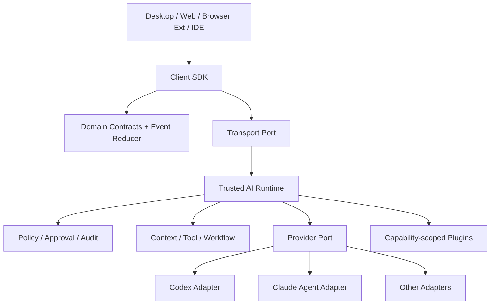

# 统一 AI SDK：边界、分层与跨端形态

> SDK 固定企业自己的 Agent 语义：Session、Turn、Event、Tool、Approval、Context 与 Policy。Provider 特性通过可协商扩展保留，平台能力通过端口注入。

## 1. 设计目标与边界

目标：同一 Runtime Core 可被 Windows/macOS 桌面端、Web、Browser Extension、IDE Extension 调用；Provider 替换不影响 UI 状态机；网络、本地进程、测试内存传输共享协议；安全策略位于可信执行端；升级有兼容窗口。

非目标：不承诺不同模型输出等价；不把文件系统和 shell 假装成浏览器通用 API；不泄漏 Provider 原始类型；不在前端 bundle 放长期 API key；不以“最低共同能力”阻止某一家高级特性。



## 2. 推荐包结构

```text
packages/
  contracts/            # 纯数据类型、JSON Schema、错误码、版本
  core/                 # session/turn reducer、能力协商；无 Node API
  client/               # 面向应用的 facade
  transport-web/        # fetch + WebSocket/SSE
  transport-electron/   # preload 业务桥实现
  transport-extension/  # browser runtime/native messaging
  transport-vscode/     # VS Code extension host
  runtime-node/         # 可信 Runtime 组合根
  provider-codex/       # 唯一可依赖 @openai/codex-sdk 的包
  provider-claude/      # 唯一可依赖 Claude Agent SDK 的包
  plugin-sdk/           # 插件 manifest/host API/conformance
  testkit/              # fake transport/provider、golden traces
```

`contracts` 必须 browser-safe：不引用 `Buffer`、`fs.PathLike`、Electron、VS Code 或供应商类型。二进制用 `Uint8Array`（进程内）或 `BlobRef`（线上传输）；路径使用 URI/grant，不把 `C:\...` 作为公共领域模型。

## 3. 核心领域模型

```ts
export type SessionId = string & { readonly __brand: "SessionId" };
export type TurnId = string & { readonly __brand: "TurnId" };

export interface CreateSessionInput {
  provider: string;
  workspace?: { grantId: string };
  policyProfile: string;
  metadata?: Record<string, string>; // 限键数、键值长度
}

export interface RunInput {
  sessionId: SessionId;
  content: Array<
    | { type: "text"; text: string }
    | { type: "blob_ref"; blobId: string; mediaType: string }
  >;
  output?: { schemaId: string };
  idempotencyKey: string;
  deadlineMs?: number;
}

export interface AgentClient {
  capabilities(): Promise<NegotiatedCapabilities>;
  createSession(input: CreateSessionInput): Promise<{ sessionId: SessionId }>;
  run(input: RunInput, options?: { signal?: AbortSignal }): AsyncIterable<AgentEvent>;
  cancel(turnId: TurnId): Promise<void>;
  resume(sessionId: SessionId, after?: { seq: number }): AsyncIterable<AgentEvent>;
}
```

Session 是可持续上下文；Turn 是一次有终态的执行；Tool Call 是 Turn 内的副作用单元；Event 是事实。`run()` 返回 AsyncIterable 而不是回调，便于取消、背压和组合；也可提供 `runToCompletion()` 便利方法，但它必须复用同一 reducer，不能另写一套语义。

## 4. 能力协商，而非平台猜测

```ts
type CapabilityDescriptor = {
  id: string;                         // 例 agent.resume、tool.shell
  version: string;                    // 能力自身版本
  availability: "available" | "policy-denied" | "unavailable";
  constraints?: Record<string, unknown>; // maxBytes、modes、schema dialect
};
```

客户端握手提交 `protocolVersions`、`clientKind` 和期望能力；Runtime 返回选中的协议、能力与约束。UI 依据结果渲染：`tool.shell` 在 Web 不可用时展示远程执行选项，而不是点击后才抛 Node API 错误。能力来源是 `platform ∩ provider ∩ tenantPolicy ∩ userGrant`，且会随会话、租户和网络变化，不应只在应用安装时计算一次。

高级 Provider 特性使用带命名空间的扩展，如 `openai.codex.reasoning_effort`，但公共 SDK 只接受已注册 schema 的扩展值；未知扩展不可穿透到供应商请求，避免任意参数注入。

## 5. 四类宿主的接入方式

| 宿主 | SDK 运行位置 | Transport | 本地能力原则 |
|---|---|---|---|
| Electron/Tauri | UI 使用 client；Runtime 在 Main 后的 sidecar | typed IPC/MessagePort | grant + OS sandbox；密钥不进 Renderer |
| Web | 浏览器仅 client；Runtime 在企业服务端 | HTTPS + WS/SSE | 无任意文件/shell；用上传或远程 workspace |
| Browser Extension MV3 | service worker/content script 只做轻客户端 | HTTPS 或 native messaging | worker 会休眠，状态持久化；content script 不可信 |
| IDE Extension | Node extension host 或 Web extension host | in-process/IPC/HTTPS | 文件用 IDE workspace API；Web host 无 Node/child process |

Chrome Manifest V3 后台是按需唤醒的 service worker，不能依赖永驻内存；也禁止远程托管可执行 JS。Native messaging 宿主是单独安装的本地程序，扩展 manifest 需申请权限且 native host 必须限制允许的 extension ID。VS Code Web extension 在浏览器 WebWorker 中，没有 Node API、不能启动进程，workspace 也可能是虚拟文件系统，因此公共合约必须用 URI 与能力协商。

## 6. 安全责任分配

- Client SDK 做输入大小/形状校验和安全 UX，但它不是最终授权点。
- Runtime 验证身份、租户、grant、策略、审批与审计，是 policy enforcement point。
- Provider adapter 只做协议翻译、错误分类、取消和能力探测，不自行放宽策略。
- Tool/plugin host 再次检查细粒度 scope；模型文本永远不能修改权限。
- Transport 提供机密性、完整性、peer identity、重放防护；“localhost”不等于可信。

浏览器直连 Provider 且内嵌 API key 是禁止架构。若 Provider 支持真正受限的短期客户端令牌，也要由后端签发并限制 audience、scope、TTL 与用量。

## 7. 版本与发布

公共协议、TypeScript SDK、Runtime、Provider adapter 分别版本化。建议 wire protocol 使用整数 major/minor + schema ID；N Runtime 支持 N 与 N-1 client major；SDK 遵守 SemVer。废弃过程：先加替代字段并采集使用率，再标 deprecated，跨越公开兼容窗口后才删除。永远不要改变已有事件字段含义。

首期演进路线：

1. 稳定 session/turn/event/error 与 in-memory testkit。
2. 打通 Electron IPC + remote Web transport。
3. 引入 Codex/Claude adapter 与 capability negotiation。
4. 加 tool approval、audit、replay、contract suite。
5. 再扩 Browser/IDE transport 和插件生态。

### Facade、低阶 API 与条件导出

对应用开发者提供两层 API。高阶 facade 负责常见路径：`client.sessions.create()`、`session.runToCompletion()`、`session.stream()`；低阶层暴露 command/event/transport，供 Runtime、调试器和高级 IDE 集成。两层必须共享同一 command builder 与 reducer，否则一个 Provider bug 会在“流式”和“非流式”得到不同状态。Facade 返回稳定领域对象，不返回 transport response 或 Provider message。

```ts
const session = await client.sessions.create({
  provider: "codex-local",
  policyProfile: "workspace-review",
  workspace: { grantId },
});

for await (const event of session.stream({
  content: [{ type: "text", text: "分析失败测试，不要修改文件" }],
  idempotencyKey: crypto.randomUUID(),
})) {
  viewModel.apply(event); // 同一 reducer 可用于重连回放
}
```

包使用条件导出隔离运行时，例如 `./client` 可在 browser/node，`./runtime/node` 才允许 Node 内建模块；不要用 `typeof window` 在同一个 bundle 里动态选择，因为 bundler 仍可能把 Node SDK 和秘密处理代码打进浏览器。为 `contracts` 生成 ESM 类型与 JSON Schema；若支持 CommonJS，必须做 dual-package hazard 测试，保证 branded ID、singleton registry 不因双实例失效。

公共 API 的资源都要可释放：Client、subscription、upload、plugin registration 提供 `close/dispose` 或 `Symbol.asyncDispose`（需按项目 TypeScript/Node 基线决定）。取消与释放不同：abort 一个 turn 不等于关闭整个 session；页面卸载也不等于服务端取消，默认只断订阅并保留可恢复任务。

### 配置优先级与可观测性

配置合并顺序必须可解释，例如 build default < tenant policy < user setting < per-run option，但安全上限只能被更高信任层收窄。每次 run 生成 `EffectiveConfig` 摘要，记录每个关键值来源；模型、Provider、网络、工具和数据区域不可由 prompt 修改。未知配置键启动即报错，避免拼写错误静默落到危险默认。

SDK 内置结构化 telemetry hook，但默认不包含内容。统一属性包括 sdk/runtime/protocol/adapter 版本、client kind、capability hash、turn phase、error code、latency、token/cost 估算；session/user/tenant 采用受控哈希且禁止作为无限基数 metric label。调用方可注入 OpenTelemetry 适配器，但无 telemetry 也不能影响业务路径。

跨端可移植性要用构建门禁证明：对同一 public entry 分别以 `node`、`browser`、`webworker` 条件打包，检查没有意外的 Node polyfill、Provider SDK 或动态代码执行；在 VS Code 虚拟 workspace fixture 中运行 URI 操作；在 MV3 测试中主动终止 service worker。功能可以按 capability 减少，但相同事件、错误和安全含义不能因宿主不同而漂移。

API 设计评审还应检查“可测试替换点”：时钟、ID、Transport、CredentialProvider、Policy、BlobStore 都通过窄端口注入；业务代码不读取全局环境变量或单例。这样回放可使用虚拟时钟和固定 ID，Web/desktop 也不会因为某个隐藏全局配置得到不同结果。

## 8. 生产失败模式

- **“OpenAI-compatible” 等于统一 SDK**：只统一请求外形，Agent 生命周期和工具语义仍分裂。
- **core import Node 模块**：Web/VS Code Web 构建才发现不可用。CI 对 `contracts/core` 做 browser 条件导出和禁依赖检查。
- **capability 是 boolean 常量**：忽略版本、策略和约束。使用带 availability/constraints 的描述符。
- **客户端做最终审批**：篡改客户端即可越权。Runtime 重新计算并绑定参数摘要。
- **Provider 原始 JSON 进持久模型**：升级后无法回放。公共事件为主，原始 payload 仅做受限诊断引用。

## 9. 练习与验收

依次学习：[合约与事件协议](contracts-events.md)、[Provider 抽象](provider-abstraction.md)、[Transport 与插件](transport-extensions.md)、[兼容与测试](compatibility-testing.md)。桌面宿主见 [客户端总体架构](../02-desktop/overview.md)。

练习：为“读取当前 workspace、流式分析、请求一次写文件审批”画出四端部署图。验收：`contracts/core` 可在 Node 与浏览器构建；Web 无 shell 时不出现运行时崩溃；同一事件 reducer 驱动 Desktop/Web/IDE；密钥和原始 Provider 类型不跨可信边界；旧 client 可连接新 Runtime 并协商降级。

## 参考资料

- [OpenAI Codex SDK](https://developers.openai.com/codex/sdk)
- [Claude Agent SDK Overview](https://code.claude.com/docs/en/agent-sdk/overview)
- [Chrome Extensions Manifest V3](https://developer.chrome.com/docs/extensions/develop/migrate/what-is-mv3)
- [MDN Native messaging](https://developer.mozilla.org/en-US/docs/Mozilla/Add-ons/WebExtensions/Native_messaging)
- [VS Code Web Extensions](https://code.visualstudio.com/api/extension-guides/web-extensions)
