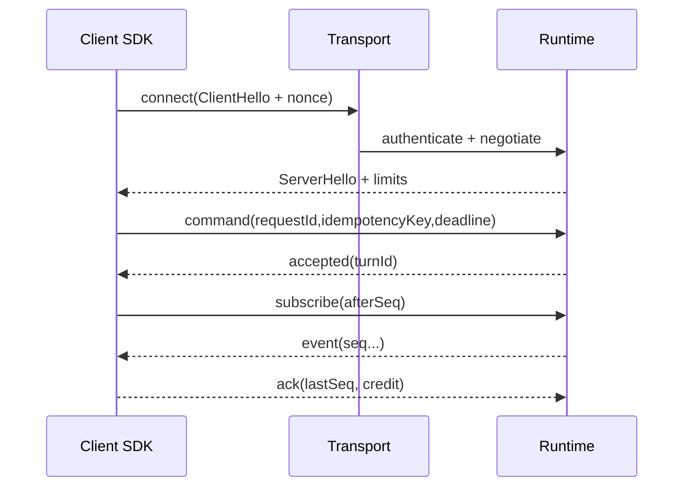

# Transport 与扩展机制：跨端连接和安全插件

> Transport 只负责可靠、安全地搬运公共命令与事件，不解释 Agent 语义。插件是受能力约束的扩展单元，不能在 Runtime 里任意 `require()` 代码包。

## 1. Transport 端口

```ts
export interface Transport {
  connect(hello: ClientHello, signal?: AbortSignal): Promise<ServerHello>;
  request<T>(command: CommandEnvelope, options?: {
    signal?: AbortSignal;
  }): Promise<ResponseEnvelope<T>>;
  subscribe(input: { sessionId: string; afterSeq?: number }, options?: {
    signal?: AbortSignal;
  }): AsyncIterable<EventEnvelope>;
  upload?(blob: Blob, meta: BlobMeta, signal?: AbortSignal): Promise<BlobRef>;
  close(reason?: string): Promise<void>;
}

type ClientHello = {
  protocolVersions: string[];
  client: { kind: "desktop" | "web" | "browser-extension" | "ide"; version: string };
  requestedCapabilities: string[];
  nonce: string;
};
```

`connect()` 返回 selected protocol、server/runtime version、capabilities、限额、heartbeat/idle timeout 和 server nonce。握手前除健康检查外不接受业务命令。端到端期限使用 `CommandEnvelope.deadlineAt` 的绝对 RFC 3339 时间；每层结合单调时钟计算剩余预算，而不是每层重新给 30 秒。Transport 的本地 `AbortSignal` 可让调用方停止等待，但不能篡改已持久接受命令的业务终态。



## 2. Framing 与限额

所有 transport 共享 envelope，不共享字节 framing。stdio/native messaging 可用 32-bit length prefix；WebSocket 一帧一个 JSON/CBOR envelope；HTTP command 返回 JSON，事件用 SSE/WS；进程内直接传 readonly object。统一要求：

- decode 前限制帧大小、嵌套深度、字符串/数组长度；大文件走 blob channel。
- 每个响应带 requestId；未知/重复响应不唤醒错误请求。
- checksum 只发现传输损坏，不替代 TLS/签名认证。
- stdout transport 禁止混日志；日志走 stderr 或独立 channel。
- 压缩只对达到阈值且非秘密混合内容开启，避免压缩侧信道与小包 CPU 浪费。

Native messaging 的平台实现有消息大小限制，不能用来直接流大量上下文。做 chunk protocol 时每 chunk 包含 blobId、index、total、hash；Runtime 落盘到配额受控的临时区，完整 hash 验证后才发布 BlobRef。

## 3. 各宿主实现策略

### Desktop IPC

Electron Renderer 只接触 preload 暴露的业务方法，流使用 MessagePort；Main 验证 sender 和 schema，再转发 Runtime。Tauri command 受 capability/permission/scope 控制，流优先 Channel。不能把“来自本机”当认证：本地 WebSocket/pipe 需随机 endpoint、文件权限、peer 校验和一次性 token。

### Web

Command 使用 HTTPS POST + idempotency key；事件使用 WebSocket（双向控制/credit）或 SSE（部署简单，ACK 另走 HTTP）。认证使用企业 OIDC session/短期 access token；CSRF、Origin、CORS 是不同控制。断线后以 `afterSeq` 恢复，指数退避遵守网络在线状态与服务端 retry hint。

### Browser Extension

Manifest V3 service worker 会被终止，SDK 状态必须可序列化到 extension storage/服务端，唤醒后重新握手与订阅。Content script 输入不可信，只能 `runtime.sendMessage` 到 worker，由 worker 校验 tab/origin/shape。若接本地 Runtime，使用 native messaging host，host manifest 限制允许的 extension ID；本机宿主自行安装、签名和更新。

### IDE

VS Code desktop 的 Node extension host 可用本地 socket/child sidecar；VS Code Web extension 在 WebWorker 中无 Node/child process，只能 web transport，并通过 `vscode.workspace.fs` 访问可能为虚拟文件系统的 workspace。把 URI 与 `WorkspacePort` 注入 SDK，不把 `fsPath` 写死。Webview 类似 Renderer，是展示层，不保存 token、不直接连 sidecar。

## 4. 重连、背压和取消

订阅者持久化“已应用”而非“已收到”的 `lastCommittedSeq`。服务端每连接给初始 credit；客户端 reducer 提交后批量 ACK。断线后：

1. 停止接受依赖实时连接的新副作用命令；
2. 重连并重新认证/协商，不能复用过期能力；
3. 用 lastCommittedSeq 补拉；
4. 去重 eventId，检测 seq gap；
5. 恢复 UI 的 running/waiting approval 状态。

取消本身也是带 requestId 的 command。网络断开不等于取消成功；UI 显示 `cancel_requested`，只有收到 `turn.cancelled` 或查询到终态才改为 cancelled。服务端对过期 deadline 主动取消底层 Provider，并记录 cooperative/forced。

## 5. Transport 安全

- 远程：TLS、标准身份令牌、audience/scope/tenant 校验；敏感企业可加 mTLS/private network。
- 本地：Unix domain socket/Named Pipe 权限、peer user/SID 校验、随机 nonce 握手；TCP localhost 端口会被同机进程探测。
- 防重放：短期 session key、单调 request nonce/idempotency ledger；高风险审批票据绑定 args digest。
- Origin：Web/extension 显式 allowlist；不要用字符串 `startsWith` 验证 URL。
- 日志：header/token/prompt/blob 不进 access log；trace ID 可跨层，用户 ID 做受控 pseudonym。

## 6. 插件模型：声明式 manifest

```json
{
  "manifestVersion": 1,
  "id": "com.example.git-tools",
  "version": "2.3.0",
  "entry": "dist/worker.js",
  "engine": { "runtimeApi": ">=2.1 <3" },
  "contributes": {
    "tools": [{ "id": "git.status", "schema": "schemas/git-status.json" }]
  },
  "permissions": [
    { "id": "workspace.read", "scope": ["**/.git/**"] },
    { "id": "process.exec", "commands": ["git"], "argsProfile": "read-only-git" }
  ]
}
```

Manifest 是请求权限，不是自动授权。安装时解析、展示、由租户策略裁决，生成不可由插件改写的 EffectiveGrant。工具注册使用 `(pluginId, toolId, major)` 唯一键，schema 和描述做大小限制；冲突确定性失败。

Plugin API 只提供 capability object：

```ts
export interface PluginContext {
  tools: { register(def: ToolDefinition, impl: ToolHandler): Disposable };
  workspace: ScopedWorkspace;  // 不暴露 node:fs
  http: ScopedHttpClient;      // host allowlist、预算、审计
  secrets: { withLease<T>(name: string, fn: (lease: SecretLease) => Promise<T>): Promise<T> };
  telemetry: StructuredLogger;
  signal: AbortSignal;
}
```

不要把 Runtime DI container、数据库连接、原始 credential 或全局 fetch 传给插件。

## 7. 插件隔离与生命周期

隔离等级按风险选：

1. 受信内建扩展可进程内，但仍走相同 capability API。
2. 企业审核 JS 插件放 Worker/Utility Process，限制内存、CPU、deadline；Node Worker 不是强安全沙箱，不能隔离恶意原生模块。
3. 第三方/不可信插件放独立低权限进程、OS sandbox、容器或远程服务；网络和文件系统由 host broker。

生命周期：`discover → verify signature/hash → policy resolve → start → health → drain → stop`。启动握手交换 plugin API version 与贡献清单；失败只禁用该插件，不拖垮 Runtime。升级采用并行校验、drain 旧实例、原子切换；插件数据 namespace 版本化，迁移失败可回退。

插件包需签名/可信发布源、lockfile/SBOM、依赖扫描与撤销列表。签名说明来源，不说明安全；还需代码审查、沙箱和权限。插件自动更新不能绕过管理员批准的 major/权限变化。

## 8. Hook 的边界

Hook 事件分 `beforeTool`（可 deny/requireApproval，但必须有超时）、`afterTool`（只能附加观察结果）、`onEvent`（异步审计）。多个决策 hook 采用明确组合规则：deny 优先，requireApproval 次之，所有 allow 才允许。禁止插件改变其他插件 payload 或吞掉 terminal event。

每个 hook 有执行预算和 circuit breaker；超时默认 fail closed 还是 fail open 由风险分类决定，高风险工具必须 fail closed。Hook 输出同样经 schema 校验和脱敏。

### 连接状态机与密钥轮换

Transport 对外暴露 `disconnected → connecting → ready → degraded → closing → closed`。同一时刻只允许一个连接尝试；generation 自增，旧 generation 的响应与事件全部丢弃。Heartbeat 包含双方 last sent/committed seq，不承载业务数据；连续丢失进入 degraded 并停止新副作用命令，但已持久化的服务端 turn 可继续，UI 显示“后台执行、正在重连”。

远程 access token 过期时，Transport 暂停新 command，调用注入的 credential provider 刷新，再重新握手；不得在多个并发 401 上发起刷新风暴。刷新 token 不进入 SDK 事件或插件。若 tenant/scope 变化，关闭所有旧订阅并清空能力缓存。Local nonce/session key 同样要轮换，Runtime 重启后旧客户端必须重新认证，不能只凭残留 socket 继续调用。

WebSocket/SSE 的代理可能有空闲超时；heartbeat 间隔由服务端协商并加入抖动。浏览器后台节流会延迟 timer，不能把一次 heartbeat 延迟当 agent crash，恢复时以服务端状态和 seq 为准。离线队列默认只缓存可证明幂等的用户命令，并设数量、字节、TTL；审批和取消通常不应长期离线排队，因为到达时上下文可能已过期。

### 插件撤销与数据所有权

管理员撤销插件时先阻止新调用，取消/等待在途 handler，撤销 secret lease 和网络 grant，注销工具，再卸载包。历史事件仍保留 plugin/tool 的版本化身份，但 UI 不应为查看历史而重新执行插件代码。插件私有数据位于 host 分配的 namespace，有配额、schema version、导出/删除接口；插件不能用文件名猜其他 namespace。

插件被禁用、证书撤销或行为熔断后，Runtime 计算新 capability hash 并通知客户端。等待该插件审批的 tool call 进入确定性 denied/failed，而不是永远等待。若插件贡献 migration，迁移在无业务权限的专用阶段运行；失败保留旧数据和旧包，不让半迁移实例接收请求。

对于远程插件/MCP 服务，manifest 还要声明数据分类、目标域、认证方式和 residency；连接结果视为不可信 tool output。远端声称的工具 schema 每次握手做 hash/version 比对，未审批的 schema/权限变化应隔离为 pending update。

## 9. 生产失败模式

- **service worker 内存保存 turn 状态**：休眠后丢失。持久 cursor + Runtime 事件源。
- **localhost 无认证**：恶意网页/同机进程调用 Agent。peer identity + nonce + strict Origin。
- **插件拿到全局 fs/fetch**：manifest 权限形同虚设。brokered capability objects + 进程隔离。
- **SSE 断线后从最新开始**：漏 tool approval/terminal。afterSeq + gap detection。
- **插件 hook 无限等待**：所有 turn 堵死。deadline、隔离 executor、熔断。
- **热升级两版本同时注册工具**：调用随机落到旧实现。generation ID + 原子 registry swap。

## 10. 练习与验收

关联：[合约与事件](contracts-events.md)、[兼容测试](compatibility-testing.md)、[桌面 IPC](../02-desktop/process-ipc.md)、[桌面安全](../02-desktop/security.md)。

练习：实现 in-memory、WebSocket fake、Browser MV3 三种 transport，以及只读 Git 插件。验收：所有 transport 通过同一 conformance suite；随机断线后无漏/重放副作用；慢消费者内存有界；伪造 extension ID/native client 被拒；插件尝试访问 scope 外路径与域名失败；插件崩溃不结束 Runtime；major/新增权限更新需要重新审批。

## 参考资料

- [Chrome Manifest V3](https://developer.chrome.com/docs/extensions/develop/migrate/what-is-mv3)
- [Chrome Native Messaging](https://developer.chrome.com/docs/extensions/develop/concepts/native-messaging)
- [MDN Native messaging](https://developer.mozilla.org/en-US/docs/Mozilla/Add-ons/WebExtensions/Native_messaging)
- [VS Code Extension Host](https://code.visualstudio.com/api/advanced-topics/extension-host)
- [VS Code Web Extensions](https://code.visualstudio.com/api/extension-guides/web-extensions)
- [Tauri Plugin Development](https://v2.tauri.app/develop/plugins/)
