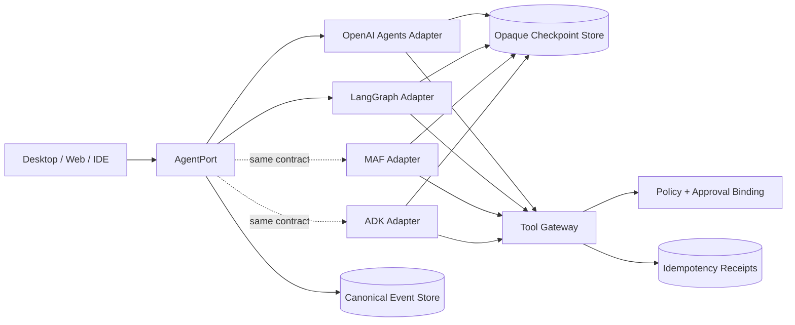

# Framework Adapter 实战：统一暂停、审批与事件契约

OpenAI Agents SDK（TypeScript）和 LangGraph（Python）可以接入同一 Runtime 边界，再由契约测试验证暂停、跨进程恢复、工具拦截、取消和事件顺序。示例基于 **2026-08-30** 查阅的 API；生产代码仍需锁定依赖与 Agent Definition 版本。

## 1. 先确定所有框架都不能越过的边界

框架负责“如何推理/编排”，平台负责“谁可以做什么、执行是否重复、事实如何留痕”。Adapter 需要隔开两者：框架 checkpoint 只作为恢复游标，tool callback 只作为提案入口，stream event 也不直接成为产品 API。



`AgentPort` 的输入必须显式携带稳定身份、版本和 deadline；输出事件必须单调编号且只有一个终态。下面是可直接放进 `agent-port.ts` 的最小合同：

```ts
export type AgentEventData =
  | { type: "run.started"; runId: string }
  | { type: "run.resumed"; runId: string; checkpointId: string }
  | { type: "text.delta"; text: string }
  | { type: "tool.proposed"; callId: string; name: string; args: unknown }
  | { type: "approval.required"; approvalId: string; checkpointId: string;
      name: string; args: unknown; argsSha256: string }
  | { type: "tool.completed"; callId: string; resultRef: string }
  | { type: "handoff"; agent: string }
  | { type: "run.completed"; output: unknown }
  | { type: "run.cancelled"; reason: string }
  | { type: "run.failed"; code: string; retryable: boolean };

// seq 由持久化 Journal 按整个 run 分配，而不是由某次进程内 drive() 从 1 计数。
export type AgentEvent = AgentEventData & { seq: number };

export type StartCommand = {
  runId: string; tenantId: string; actorId: string; input: string;
  agentDefinitionVersion: string; deadlineAt: string;
};
export type ResumeCommand = {
  runId: string; checkpointId: string; approvalId: string;
  resumeRequestId: string; // 客户端重试时保持不变
  decision: "approve" | "reject"; decidedBy: string;
};

export interface AgentPort {
  start(command: StartCommand, signal: AbortSignal): AsyncIterable<AgentEvent>;
  resume(command: ResumeCommand, signal: AbortSignal): AsyncIterable<AgentEvent>;
}
```

checkpoint 以 envelope 包装框架私有 payload。`payload` 应加密，`payloadSha256` 用于发现损坏；`frameworkVersion + definitionVersion` 决定由哪一版代码反序列化。不要把它当作可跨框架迁移的状态。

```ts
type CheckpointEnvelope = {
  id: string; runId: string;
  framework: "openai-agents-js" | "langgraph" | "maf" | "adk";
  frameworkVersion: string; definitionVersion: string;
  payloadCiphertext: string; payloadSha256: string;
  status: "waiting_approval" | "claimed" | "resumable" | "consumed";
  claimOwner?: string; claimLeaseUntil?: string;
  createdAt: string;
};
```

恢复不能先做不可逆的 `consume()`。正确协议是 `waiting → claimed(lease)`：`resumeRequestId` 由 command ledger 去重，同一请求的重试返回原 accepted/result 或 `IN_PROGRESS`，绝不能把同一活跃 claim token 发给第二个 worker；worker claim 另绑定 `workerId + fencingToken`。只有“后继 checkpoint + 新审批事件”或“终态事件”在同一事务落库时，旧 checkpoint 才变成 `consumed`。进程在中间崩溃时租约会过期，旧 checkpoint 仍可恢复；执行过的外部工具则由 Tool Gateway receipt 对账。

## 2. Tool Gateway：审批之后仍要再次授权

审批只证明某人在某时刻看过某组参数。真正执行前还要验证：租户/用户仍有权限，参数摘要与审批绑定一致，资源版本未变化，幂等键未消费，deadline 未过期。所有 adapter 都只注册一个受控 wrapper，禁止把文件、shell 或网络客户端直接注册给框架。

```ts
interface ToolGateway {
  executeOnce(input: {
    runId: string; tenantId: string; actorId: string;
    callId: string; tool: string; args: unknown;
    approvalId: string; approvedArgsSha256: string;
    idempotencyKey: string;
  }): Promise<{ resultRef: string; display: string }>;
}

// 事务语义：同一个 idempotencyKey 只允许一次副作用；并发重放返回同一 receipt。
// 伪 SQL：INSERT receipt(key,status) ... ON CONFLICT DO NOTHING，赢家执行并提交结果。
```

“先审批、后执行”有一个常见竞态：审批后文件可能已被别人修改。对 `apply_patch` 应把目标文件基线 hash、规范化 patch hash 和仓库/worktree ID 一并放进 args 摘要；不一致就生成新的 proposal，不复用旧批准。

## 3. OpenAI Agents SDK TypeScript adapter

### 3.1 安装与稳定性边界

示例安装 `@openai/agents` 和 `zod`，并按文档使用 Zod v4。示例采用 `Agent`、`tool`、`run`、`RunState.fromString()` 和 streaming `interruptions`；仓库应提交 lockfile，并把实际解析出的 SDK 版本写入 checkpoint。恢复时按该版本加载，不以文章日期代替版本信息。

```bash
mkdir oa-adapter-lab && cd oa-adapter-lab
npm init -y
npm install @openai/agents zod
npm pkg set type=module
npm ls @openai/agents zod
```

下面的 agent 每次写文件都先触发 SDK 原生审批。`execute` 内仍进入 Tool Gateway；`runId` 由 agent factory 的闭包固定，避免把秘密放进会序列化的 run context。示例中的 `sha256/stableCallId` 是普通确定性 helper，生产实现必须用 canonical JSON（对象 key 排序）后再摘要。

```ts
import { Agent, RunState, run, tool,
  isOpenAIResponsesRawModelStreamEvent } from "@openai/agents";
import { z } from "zod";

type Dependencies = {
  checkpoint: {
    get(id: string): Promise<{ runId: string; payload: string;
      frameworkVersion: string; definitionVersion: string }>;
    claim(id: string, input: { resumeRequestId: string; workerId: string;
      leaseMs: number }): Promise<ResumeLease>;
    release(lease: ResumeLease): Promise<void>; // 已结算时为幂等 no-op
  };
  journal: RunJournal;
  tools: ToolGateway;
};

type ResumeLease = {
  checkpointId: string; claimToken: string; resumeRequestId: string;
  workerId: string; fencingToken: bigint; settled: boolean;
};

type PauseTransaction = {
  runId: string; eventKey: string; payload: string;
  frameworkVersion: string; definitionVersion: string;
  approvals: Array<{ approvalId: string; name: string; args: unknown; argsSha256: string }>;
  resumeLease?: ResumeLease;
};
type FinishTransaction = {
  runId: string; eventKey: string;
  terminal: Extract<AgentEventData,
    { type: "run.completed" | "run.cancelled" | "run.failed" }>;
  resumeLease?: ResumeLease;
};

interface RunJournal {
  // eventKey 在同一 run 内唯一；重复提交返回原事件与原 seq。
  append(runId: string, eventKey: string, data: AgentEventData): Promise<AgentEvent>;
  // 两者都在一个数据库事务中分配 seq、写事件，并结算旧 claim（如有）。
  pause(input: PauseTransaction): Promise<AgentEvent[]>;
  finish(input: FinishTransaction): Promise<AgentEvent>;
}

function makeAgent(cmd: StartCommand, deps: Dependencies) {
  const applyPatch = tool({
    name: "apply_patch",
    description: "Apply a unified patch inside the assigned worktree",
    parameters: z.object({
      patch: z.string().min(1),
      baseSha256: z.string().length(64),
    }),
    needsApproval: true,
    execute: async (args) => {
      const callId = stableCallId(cmd.runId, "apply_patch", args);
      const argsSha256 = sha256(canonicalJson(args));
      const approval = await loadApprovalRecord(callId);
      const receipt = await deps.tools.executeOnce({
        runId: cmd.runId, tenantId: cmd.tenantId, actorId: cmd.actorId,
        callId, tool: "apply_patch", args,
        // 实际值从服务端不可变 approval record 读取；不要相信模型参数。
        approvalId: approval.id,
        approvedArgsSha256: approval.argsSha256,
        idempotencyKey: `tool:${cmd.runId}:${callId}:${argsSha256}`,
      });
      return receipt.display;
    },
  });

  return new Agent({
    name: "coding-agent-v7",
    instructions: "Inspect first. Propose a patch; never claim it was applied before tool output.",
    tools: [applyPatch],
  });
}
```

这里故意不把 SDK `interruption` 当作平台 approval record。adapter 先将其规范化、持久化 checkpoint，再由审批服务生成不可变记录；resume 时从记录读取决定。`stableApprovalId` 至少绑定 `runId + toolName + canonicalArgs + SDK call identity`。

```ts
class OpenAIAgentsPort implements AgentPort {
  constructor(private deps: Dependencies,
              private sdkVersion: string,
              private workerId: string,
              private definitionVersion = "coding-agent-v7") {}

  async *start(cmd: StartCommand, signal: AbortSignal): AsyncIterable<AgentEvent> {
    yield* this.drive(cmd, cmd.input, undefined, signal);
  }

  async *resume(rc: ResumeCommand, signal: AbortSignal): AsyncIterable<AgentEvent> {
    const lease = await this.deps.checkpoint.claim(rc.checkpointId, {
      resumeRequestId: rc.resumeRequestId, workerId: this.workerId, leaseMs: 60_000,
    });
    let executionStarted = false;
    try {
      const saved = await this.deps.checkpoint.get(rc.checkpointId);
      if (saved.runId !== rc.runId) throw new Error("CHECKPOINT_RUN_MISMATCH");
      if (saved.frameworkVersion !== this.sdkVersion ||
          saved.definitionVersion !== this.definitionVersion) {
        throw new Error("INCOMPATIBLE_CHECKPOINT");
      }

      const cmd = await loadOriginalStartCommand(rc.runId); // 服务端事实，不信任客户端
      const agent = makeAgent(cmd, this.deps);               // 重建同一 agent graph
      const state = await RunState.fromString(agent, saved.payload);
      const item = state.getInterruptions().find(
        (i) => stableApprovalId(rc.runId, i) === rc.approvalId,
      );
      if (!item) throw new Error("APPROVAL_NOT_PENDING");
      await verifyDecisionRecord(rc, item); // actor、参数摘要、期限、资源版本
      if (rc.decision === "approve") state.approve(item);
      else state.reject(item, { message: "Rejected by reviewer" });

      // lease 会续期；只有 pause()/finish() 的事务提交才会将其 settled。
      executionStarted = true;
      yield* this.drive(cmd, state, lease, signal);
    } finally {
      // 仅在尚未跨入框架执行边界时主动释放。执行开始后的异常让租约到期并 reconcile，
      // 避免一个仍在运行的 Tool 与新 worker 并发推进。
      if (!executionStarted && !lease.settled) {
        await this.deps.checkpoint.release(lease);
      }
    }
  }

  private async *drive(
    cmd: StartCommand,
    input: string | RunState<any, any>,
    resumeLease: ResumeLease | undefined,
    signal: AbortSignal,
  ): AsyncIterable<AgentEvent> {
    const attemptId = resumeLease?.resumeRequestId ?? "initial";
    const emit = (key: string, data: AgentEventData) =>
      this.deps.journal.append(cmd.runId, `${attemptId}:${key}`, data);
    yield await emit("opened", resumeLease
      ? { type: "run.resumed", runId: cmd.runId,
          checkpointId: resumeLease.checkpointId }
      : { type: "run.started", runId: cmd.runId });
    const agent = makeAgent(cmd, this.deps);
    let sourceIndex = 0;
    let stream: Awaited<ReturnType<typeof run>> | undefined;

    try {
      stream = await run(agent, input, {
        stream: true, signal,
        toolExecution: { preApprovalInputGuardrails: true },
      });
      for await (const e of stream) {
        // 优先使用 provider/SDK 稳定 event ID；没有时用持久 attempt + source ordinal。
        const sourceKey = providerEventKey(e) ?? `source:${sourceIndex++}`;
        if (isOpenAIResponsesRawModelStreamEvent(e) &&
            e.data.event.type === "response.output_text.delta") {
          yield await emit(sourceKey, { type: "text.delta", text: e.data.event.delta });
        } else if (e.type === "agent_updated_stream_event") {
          yield await emit(sourceKey, { type: "handoff", agent: e.agent.name });
        } else if (e.type === "run_item_stream_event" && e.name === "tool_called") {
          const p = normalizeToolCall(e.item);
          yield await emit(sourceKey, { type: "tool.proposed", ...p });
        } else if (e.type === "run_item_stream_event" && e.name === "tool_output") {
          const p = normalizeToolOutput(e.item);
          yield await emit(sourceKey, { type: "tool.completed", ...p });
        }
      }
      // 官方要求先等 completed，再读取 interruptions/finalOutput。
      await stream.completed;
    } catch (error) {
      // AbortSignal 只是发起取消；仍等 completed/错误收敛，再写终态。
      await stream?.completed.catch(() => undefined);
      const terminal: FinishTransaction["terminal"] =
        signal.aborted && cancellationConfirmed(error)
        ? { type: "run.cancelled", reason: "abort_confirmed" }
        : { type: "run.failed",
            code: signal.aborted ? "OUTCOME_UNKNOWN" : classify(error),
            retryable: false };
      const terminalEvent = await this.deps.journal.finish({
        runId: cmd.runId, eventKey: `${attemptId}:terminal`, terminal,
        resumeLease,
      });
      if (resumeLease) resumeLease.settled = true;
      yield terminalEvent;
      return;
    }

    if (stream!.interruptions.length) {
      const payload = stream!.state.toString();
      const approvals = stream!.interruptions.map((i) => {
        const args = parseToolArguments(i.arguments);
        const argsSha256 = sha256(canonicalJson(args));
        return { approvalId: stableApprovalId(cmd.runId, i),
          name: i.name, args, argsSha256 };
      });
      // checkpoint、approval records、事件和旧 claim 结算必须在同一事务；
      // 事务返回后才允许向 UI 发布 approval.required。
      const events = await this.deps.journal.pause({
        runId: cmd.runId, eventKey: `${attemptId}:pause`, payload,
        frameworkVersion: this.sdkVersion,
        definitionVersion: this.definitionVersion, approvals, resumeLease,
      });
      if (resumeLease) resumeLease.settled = true;
      for (const event of events) yield event;
      return; // 暂停不是 completed，也不是 failed
    }

    const terminalEvent = await this.deps.journal.finish({
      runId: cmd.runId, eventKey: `${attemptId}:terminal`,
      terminal: { type: "run.completed", output: stream!.finalOutput },
      resumeLease,
    });
    if (resumeLease) resumeLease.settled = true;
    yield terminalEvent;
  }
}
```

这里的 `AgentPort` 是 **Runtime worker 内部端口**：Supervisor 必须持续 drain 生成器并把已提交 Journal 事件分发给订阅者。UI/SSE 断线只能取消订阅，不能通过“停止迭代”终止任务；业务取消必须发送 command 并走 `AbortSignal → 下游确认 → terminal event`。Journal 的 pause/finish 还要校验 fencing token，拒绝租约过期后旧 worker 的迟到提交。

上例需要按锁定版本补写两个窄 helper：`normalizeToolCall/normalizeToolOutput` 只访问该版本导出的 item union，并对未知 variant fail closed。当前公开 `RunState.getInterruptions()`、`state.approve/reject`、`RunState.fromString` 就是恢复 seam，**不要读取 `_` 前缀内部字段**。helper 与 SDK 类型一起编译、用官方 `ScriptedModel` 做确定性测试，避免靠真实模型碰运气。

恢复边界是：序列化状态可能含应用 context，但不得放 token/密钥。长时间 pending 的状态必须跟随原 SDK 与原 agent graph 版本恢复。官方建议需要并行恢复旧任务时用 package alias 同时安装两版 SDK。若反序列化不能证明 output ownership，SDK 会 fail closed；平台应把旧任务转人工或从安全输入新开 run，不能强制篡改 state。

## 4. LangGraph Python adapter

### 4.1 最小可运行 graph

以下示例锁定 **LangGraph 1.1.x API 边界**，使用 v3 event streaming。开发演示可用内存 checkpointer；跨进程恢复必须换成官方支持的持久 checkpointer，并先完成实际数据库连接、序列化安全和备份演练。

```bash
python -m venv .venv
source .venv/bin/activate
python -m pip install "langgraph>=1.1,<2"
python -m pip freeze > requirements.lock
```

graph 把副作用放在 `interrupt()` 之后。LangGraph 恢复时会从 node 开头重新执行，所以 interrupt 前只能做纯计算或幂等操作。

```python
from __future__ import annotations
from hashlib import sha256
import json
from typing import Any, TypedDict

from langgraph.graph import StateGraph, START, END
from langgraph.checkpoint.memory import InMemorySaver
from langgraph.types import Command, interrupt

class State(TypedDict, total=False):
    run_id: str
    tenant_id: str
    actor_id: str
    request: str
    proposal: dict[str, Any]
    approved: bool
    output: str

def canonical(value: Any) -> str:
    return json.dumps(value, ensure_ascii=False, sort_keys=True,
                      separators=(",", ":"))

def plan(s: State) -> dict:
    args = {"patch": s["request"], "baseSha256": "0" * 64}
    digest = sha256(canonical(args).encode()).hexdigest()
    return {"proposal": {
        "callId": f"call-{digest[:16]}", "name": "apply_patch",
        "args": args, "argsSha256": digest,
        "approvalId": f"apr-{s['run_id']}-{digest[:16]}",
    }}

def request_approval(s: State) -> dict:
    # 恢复后本 node 从头执行；到达同一 interrupt 时，返回 Command(resume=...) 的值。
    decision = interrupt({"type": "approval.required", **s["proposal"]})
    expected = s["proposal"]["approvalId"]
    if decision.get("approvalId") != expected:
        raise ValueError("APPROVAL_NOT_BOUND_TO_PROPOSAL")
    return {"approved": decision.get("decision") == "approve"}

def route(s: State) -> str:
    return "execute" if s["approved"] else "rejected"

def execute(s: State) -> dict:
    p = s["proposal"]
    # gateway.execute_once 还会核对服务端审批记录、args hash 与幂等 receipt。
    receipt = gateway.execute_once(
        run_id=s["run_id"], tenant_id=s["tenant_id"], actor_id=s["actor_id"],
        call_id=p["callId"], tool=p["name"], args=p["args"],
        approval_id=p["approvalId"], approved_args_sha256=p["argsSha256"],
        idempotency_key=f"tool:{s['run_id']}:{p['callId']}:{p['argsSha256']}",
    )
    return {"output": receipt["display"]}

def rejected(_: State) -> dict:
    return {"output": "Tool call rejected; no side effect occurred."}

b = StateGraph(State)
b.add_node("plan", plan)
b.add_node("approval", request_approval)
b.add_node("execute", execute)
b.add_node("rejected", rejected)
b.add_edge(START, "plan")
b.add_edge("plan", "approval")
b.add_conditional_edges("approval", route,
                        {"execute": "execute", "rejected": "rejected"})
b.add_edge("execute", END)
b.add_edge("rejected", END)
graph = b.compile(checkpointer=InMemorySaver())  # 仅单进程实验
```

### 4.2 start/resume 与事件归一

LangGraph 的 `thread_id` 是持久游标，不是用户聊天 ID，也不能由另一租户猜到后复用。adapter 以服务端生成的 opaque cursor 作为 `thread_id`，业务 `runId` 单独记录。v3 protocol event 在一个 run 内带递增 `seq`，但平台仍生成自己的 run/event 序号，以便跨 restart、fallback 和多框架保持合同。

```python
def drive(start: dict, resume: dict | None = None):
    cursor = checkpoint_index.load_or_create_cursor(start["runId"])
    config = {"configurable": {"thread_id": cursor}}
    graph_input = (
        Command(resume={
            "approvalId": resume["approvalId"],
            "decision": resume["decision"],
        })
        if resume else {
            "run_id": start["runId"], "tenant_id": start["tenantId"],
            "actor_id": start["actorId"], "request": start["input"],
        }
    )

    attempt_id = resume["resumeRequestId"] if resume else "initial"
    stream = graph.stream_events(graph_input, config=config, version="v3")
    yield journal.append(
        start["runId"], f"{attempt_id}:opened",
        {"type": "run.resumed", "runId": start["runId"],
         "checkpointId": resume["checkpointId"]}
        if resume else {"type": "run.started", "runId": start["runId"]},
    )

    # raw ProtocolEvent 是 TypedDict；也可消费 stream.messages/values 投影。
    for source_index, event in enumerate(stream):
        method = event["method"]
        data = event["params"]["data"]
        source_key = provider_event_key(event) or f"source:{source_index}"
        event_key = f"{attempt_id}:{source_key}"
        if method == "messages":
            text = normalize_message_delta(data)
            if text:
                yield journal.append(start["runId"], event_key,
                                     {"type": "text.delta", "text": text})
        elif method == "tools":
            normalized = normalize_tool_protocol_event(data)
            if normalized:
                yield journal.append(start["runId"], event_key, normalized)

    if stream.interrupted:
        # interrupts 中的 value 是 interrupt(...) 的 JSON payload。
        proposals = [pending.value for pending in stream.interrupts]
        # 一次事务写 cursor envelope、全部审批事件，并结算旧 claim。
        for persisted in journal.bind_and_pause(
            run_id=start["runId"], event_key=f"{attempt_id}:pause",
            thread_id=cursor, framework_version=LANGGRAPH_VERSION,
            definition_version="patch-graph-v3", proposals=proposals,
            resume_lease=resume.get("lease") if resume else None,
        ):
            yield persisted
        return

    final_state = stream.output
    if final_state.get("approved"):
        p = final_state["proposal"]
        yield journal.append(
            start["runId"], f"{attempt_id}:tool:{p['callId']}:completed",
            {"type": "tool.completed", "callId": p["callId"],
             "resultRef": receipt_ref_for(start["runId"], p["callId"])},
        )
    yield journal.finish(
        run_id=start["runId"], event_key=f"{attempt_id}:terminal",
        terminal={"type": "run.completed", "output": final_state.get("output")},
        resume_lease=resume.get("lease") if resume else None,
    )
```

这段是 adapter 的版本化边界：`stream_events(..., version="v3")`、`stream.interrupted`、`stream.interrupts`、`stream.output` 已按 2026-08-30 官方 Event Streaming 页面核对；event 对象的各 channel payload 仍需以 `requirements.lock` 对应类型写 `normalize_*`，不能靠 `hasattr` 静默吞未知事件。若团队锁在旧版，使用该版官方 `graph.stream/invoke` 与 `__interrupt__` 合同写独立 adapter，不要在同一个函数里猜 v1/v2/v3。

resume 入口还必须做三项原子校验：checkpoint 可 claim、审批记录的 `approvalId/argsSha256/runId` 一致、definition/framework version 可恢复。之后才调用 `Command(resume=...)`。`journal.append()` 在数据库里为 `(run_id, event_key)` 建唯一键并原子分配下一个 run seq，所以恢复不会从 1 重新编号。生产 checkpointer 与平台 journal 若无法同库事务，就用稳定 checkpoint ID、transactional outbox 和 reconcile job 处理“graph cursor 已提交、平台 envelope 未写成”的 receipt-unknown；不能靠普通先后调用假装原子。

## 5. 同一组 contract tests

测试模型输出不应依赖真实大模型的随机工具选择。为每个 adapter 注入 deterministic model/provider：固定先提出一个 `apply_patch`，批准后固定输出 `done`；真实 provider 另跑 smoke test。合同测试只观察 `AgentPort` 与 fake Tool Gateway，因此能抓住框架升级造成的语义破坏。

```ts
describe.each([
  ["openai-agents", makeOpenAITestPort],
  ["langgraph", makeLangGraphTestPort],
])("AgentPort contract: %s", (_name, makePort) => {
  it("restart + approval produces one idempotent business effect", async () => {
    const h = new RecordingToolGateway();
    let port = await makePort(h);
    const first = await collect(port.start(fixtureStart("run-7"), neverAbort()));
    const pending = exactlyOne(first, "approval.required");
    expect(h.effects).toHaveLength(0);
    expect(terminalEvents(first)).toHaveLength(0); // pause 不是终态

    port = await makePort(h); // 模拟进程退出并重建 adapter
    const resumed = await collect(port.resume({
      runId: "run-7", checkpointId: pending.checkpointId,
      approvalId: pending.approvalId, resumeRequestId: "resume-7",
      decision: "approve", decidedBy: "alice",
    }, neverAbort()));
    expect(h.effects).toHaveLength(1);
    expect(types(resumed).at(-1)).toBe("run.completed");

    await expect(collect(port.resume({
      runId: "run-7", checkpointId: pending.checkpointId,
      approvalId: pending.approvalId, resumeRequestId: "resume-7",
      decision: "approve", decidedBy: "alice",
    }, neverAbort()))).rejects.toThrow(/CONSUMED|NOT_PENDING/);
    expect(h.effects).toHaveLength(1);
  });

  it("reject and cancel never execute tools", async () => { /* 同合同断言 */ });
  it("tampered args/checkpoint/tenant fail closed", async () => { /* 同合同断言 */ });
  it("seq increases and exactly one terminal is emitted", async () => { /* 同合同断言 */ });
});
```

批准路径的黄金事件序列应是：

```text
start:  run.started → tool.proposed? → approval.required → [pause, no terminal]
resume: run.resumed → tool.completed → text.delta* → run.completed
effect: 0 before approval; 1 after approval; replay/reconcile remains 1
```

`tool.proposed` 是否能从框架流中可靠取得可以声明为 capability；但 `approval.required`、零前置副作用、可恢复和单一终态是硬合同。外部世界不存在平台凭空保证的通用 exactly-once：只有下游支持幂等键或可查询业务 ID，再配合 receipt/reconcile，才能实现“一个业务效果”；否则超时必须进入 `outcome_unknown`，禁止盲重试。额外必测：取消发生在模型流、审批等待、工具执行三个位置；乱序/重复 provider event；旧 checkpoint 版本；损坏密文；审批过期；同一 checkpoint 两个并发 resume；工具返回结果但 adapter 写 event 前崩溃。

## 6. MAF 与 ADK 如何接入同一合同

### 6.1 Microsoft Agent Framework

MAF Workflow 的 `RequestPort`（Python 为 `ctx.request_info()`/response handler）天然对应 `approval.required`：adapter 把 `RequestInfoEvent` 规范化并持久化平台审批记录，将审批答复变成 workflow response。官方说明 pending requests 会进入 checkpoint，恢复时重新出现；这正适合“至少一次送达 + approvalId 去重”，不代表可以执行两次工具。

MAF checkpoint 在 superstep 末产生；查阅的文档说明，Python 1.13.0 起还会在首个 superstep 前、request response 投递时生成 entry checkpoint。升级时必须保留 workflow topology 和稳定 executor identity，并用旧版本 fixture 回放。工具仍包装为 Tool Gateway，approval-required tool 只负责暂停，真正 function invocation 前再次鉴权。adapter 映射：

| MAF 表面 | AgentPort |
|---|---|
| `RequestInfoEvent` / request payload | `approval.required` |
| workflow checkpoint ID | envelope 的 opaque cursor |
| response | `ResumeCommand.decision` |
| output event | `text.delta` 或 `run.completed` |
| executor/tool event | `tool.proposed/completed` |

checkpoint storage 是信任边界。官方说明部分 Python file/Cosmos 实现对非 JSON 类型使用受限 pickle；若威胁模型禁止反序列化任何 pickle，就实现仅 JSON/明确 codec 的 storage provider，而不是假设“restricted”消除了所有风险。

### 6.2 Google Agent Development Kit

ADK adapter 以 `SessionService` 的 session/invocation 标识建立 cursor，消费 Event 流并通过 `get_function_calls()`、function response、final response 等正规接口归一。`before_tool_callback` 是 Tool Gateway 拦截点：可在调用前执行 policy/schema 检查或返回替代结果，阻止原工具；需要人工批准的 custom tool 使用官方 tool confirmation，将 confirmation request 映射为 `approval.required`。

查阅的文档将 tool confirmation 标为 experimental，并列出最低版本（Python 1.14、TypeScript 0.2、Go 0.3）；Python resumability 文档要求 1.16+，且明确指出 ADK Web/CLI 暂不支持 resume。只有你选择的 Runner、SessionService、App `resumability_config` 组合通过“杀进程后恢复”测试，才可声明 `durable_resume=true`。否则 adapter 仍满足单次运行事件合同，但等待审批必须交给外部 workflow 或返回“不支持长暂停”。

MAF/ADK 都必须跑第 5 节同一 suite。框架特有能力只放在 capability：

```ts
type AdapterCapabilities = {
  durableResume: boolean;
  multiplePendingApprovals: boolean;
  tokenDelta: boolean;
  toolProposalEvent: boolean;
  serializableCheckpoint: boolean;
};
```

## 7. 常见失败模式

| 症状 | 根因 | 修正 |
|---|---|---|
| 审批前文件已改变 | tool 直接注册给框架，审批只是 UI | 所有调用经 Tool Gateway；副作用只在批准后 |
| 批准了 A 参数却执行 B | approvalId 未绑定 canonical args hash | 决策记录绑定 run/call/tool/args/resource version |
| 重启后无法反序列化 | SDK/agent graph 已升级 | checkpoint 记录精确版本；旧 worker/包别名恢复 |
| LangGraph 恢复重复发邮件 | `interrupt()` 前已有副作用 | interrupt 前纯计算；执行节点幂等 receipt |
| 两个审批者都触发执行 | checkpoint 没有租约式 claim | `waiting → claimed(lease)` CAS，终态/后继暂停事务才 consume |
| stream 显示完成但仍有审批 | 未等 streaming `completed` 就读结果 | 消费流并 await completed，再判 interruptions/终态 |
| 取消后后台继续执行 tool | 只断客户端 SSE | AbortSignal/CancelToken 贯穿 runner 与 Tool Gateway，等确认 |
| checkpoint 泄露 API key | 把 secret 放进 serializable context | context 只放 ID；密钥按执行时身份短租约获取 |
| 框架升级事件悄悄丢失 | 默认分支忽略未知 event | exhaustiveness/unknown metric/golden fixtures，升级先跑合同 |
| 把内存 saver 用到生产 | demo 能 resume 被误认为跨进程持久 | durable checkpointer + kill/restart/backup/recovery 验收 |

## 8. 练习与验收

建立一个 `adapter-lab`，同一个测试命令启动 OpenAI Agents 与 LangGraph 两个实现：

- [ ] `start` 在 tool 执行前稳定产生 `approval.required`，checkpoint 落库后才把事件发给 UI。
- [ ] 杀掉进程、用同一版本重启、approve 后继续；旧进程不需要存活。
- [ ] reject 路径工具 effect 为 0，并向模型/最终用户提供明确拒绝结果。
- [ ] 两个线程同时 resume 同一 checkpoint，只有一个 claim 成功；赢家崩溃后租约到期可恢复，Tool Gateway receipt 永远只有一条。
- [ ] 篡改 args、tenant、runId、approvalId、definitionVersion 任一字段都 fail closed。
- [ ] 模型流、审批等待、工具执行三处取消均在 deadline 内得到明确终态或 `outcome_unknown`，后台进程不泄漏。
- [ ] 事件 `seq` 严格递增，pause 无终态，结束恰好一个终态；随机重复/拆分 delta 不改变最终文本和 tool args。
- [ ] OpenAI checkpoint 不含 token；LangGraph checkpointer 从内存替换为持久实现后通过 kill -9/重启恢复。
- [ ] 把依赖升级一个 minor version，使用旧 checkpoint fixture 和 golden events 证明兼容；不兼容时路由到旧 worker。
- [ ] MAF 或 ADK 至少选一个实现第三个 adapter，并原样跑同一 contract suite，不另写宽松测试。

验收演示不能只是一次 happy path。录制并保存四份证据：暂停前无副作用的 receipt 查询、checkpoint envelope（密文与版本，不含正文秘密）、并发 resume 只有一个赢家的日志、工具执行后 crash 再恢复仍只有一次副作用的账本。

## 9. 关联章节

先阅读[框架集成方法](framework-integration.md)和[Build vs Buy](build-vs-buy.md)理解防腐层；状态事实与 receipt-unknown 见[SQLite 持久化](../03-runtime/persistence-sqlite.md)，工具授权见[工具系统](../03-runtime/tool-system.md)，统一事件见[合同与事件](../04-sdk/contracts-events.md)，桌面 patch/worktree 事务见[Coding Agent Host](../02-desktop/coding-agent-host.md)。

## 参考资料

- OpenAI：[Agents SDK for TypeScript](https://openai.github.io/openai-agents-js/)、[Running agents](https://openai.github.io/openai-agents-js/guides/running-agents/)、[Streaming](https://openai.github.io/openai-agents-js/guides/streaming/)、[Human-in-the-loop / RunState versioning](https://openai.github.io/openai-agents-js/guides/human-in-the-loop/)、[Results](https://openai.github.io/openai-agents-js/guides/results/)、[Testing / ScriptedModel](https://openai.github.io/openai-agents-js/guides/testing/)
- LangChain：[LangGraph interrupts](https://docs.langchain.com/oss/python/langgraph/interrupts)、[Persistence](https://docs.langchain.com/oss/python/langgraph/persistence)、[Event streaming v3](https://docs.langchain.com/oss/python/langgraph/event-streaming)
- Microsoft：[Agent Framework human-in-the-loop](https://learn.microsoft.com/en-us/agent-framework/workflows/human-in-the-loop)、[Workflow checkpoints](https://learn.microsoft.com/en-us/agent-framework/workflows/checkpoints)、[Tools](https://learn.microsoft.com/en-us/agent-framework/agents/tools/)、[Tool approval](https://learn.microsoft.com/en-us/agent-framework/agents/tools/tool-approval)
- Google：[ADK tool confirmation](https://adk.dev/tools-custom/confirmation/)、[ADK resumability](https://adk.dev/runtime/resume/)、[Sessions](https://adk.dev/sessions/)、[Events](https://adk.dev/events/)、[Callbacks](https://adk.dev/callbacks/)
