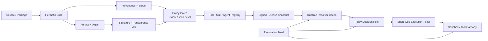
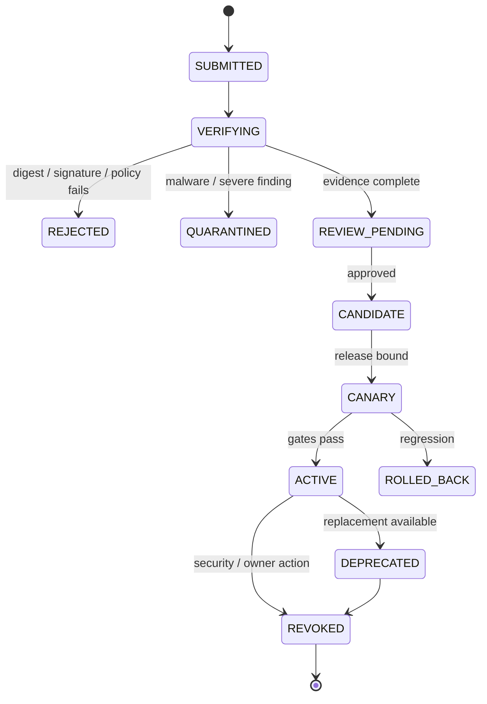

# Capability 供应链：Tool、Skill 与 Agent Registry 的可信发布

能力供应链负责把 Tool、Skill 和 Agent Profile 从来源代码安全地交付到运行任务。链路需要记录版本、摘要、签名、SBOM、来源与撤销状态；解析后的能力仍受 Policy、Secret Broker、网络出口和审批约束。

## 1. Registry 不是“可信插件商店”

Registry 首先是**声明与索引系统**：它告诉控制面某个能力声称叫什么、需要什么、由谁发布。它不能单独证明：

- 二进制就是被审查的源代码构建出来的；
- `readOnly: true` 的工具不会写数据或外传；
- Skill 中没有诱导模型越权的隐藏指令；
- Agent Profile 不会请求超出角色的能力；
- 远端 MCP Server 当前暴露的内容与注册时相同；
- 一个旧的“批准”可以安全沿用到新版本。

因此必须区分四类事实：

| 层次 | 例子 | 信任方式 |
| --- | --- | --- |
| Publisher claim | 名称、描述、risk、自报只读 | 不可信输入，仅用于审核候选 |
| Verified evidence | digest、签名、构建 provenance、SBOM、扫描结果 | 由独立验证器和信任根校验 |
| Organization decision | owner、租户 allowlist、风险覆盖、状态 | Policy/审核流程的版本化决策 |
| Runtime fact | 实际参数、资源、身份、出口、当前撤销状态 | 每次调用重新解析和授权 |

“已登记”不等于“已允许执行”；“签名有效”也只证明由某个密钥签发且内容未变，不证明内容安全。

## 2. 控制面与执行面的完整链路



控制面负责摄入、验证、审核、发布版本化快照；执行面基于固定快照解析能力，但在执行前仍检查当前撤销、主体、资源、环境和策略。控制面短暂不可用时，Runtime 可以使用未过期的本地签名快照；撤销通道则应采用更短 TTL 和独立 kill path。

## 3. 统一对象模型：声明、Artifact、Release、Binding

不要把所有字段塞在一个可随时修改的 Registry 行中。建议拆成：

- **Descriptor**：模型/人可读的声明和 schema；
- **Artifact**：不可变内容，地址由 digest 标识；
- **Evidence**：签名、provenance、SBOM、扫描与 Eval 结果；
- **Release**：审核通过、可部署的版本组合；
- **Binding**：某租户/环境允许使用哪个 Release，以及附加限制；
- **Snapshot**：某次 Task 实际解析出的封闭能力集合。

```ts
type CapabilityKind = "tool" | "skill" | "agent";

type CapabilityRelease = {
  id: string;                         // cap://github/create-pr@2.3.1
  kind: CapabilityKind;
  version: string;                    // immutable SemVer label
  descriptorDigest: `sha256:${string}`;
  artifactDigest: `sha256:${string}`;
  provenanceDigest: `sha256:${string}`;
  sbomDigest?: `sha256:${string}`;
  signatures: Array<{ keyId: string; bundleRef: string }>;
  owner: string;
  risk: "R0" | "R1" | "R2" | "R3" | "R4";
  lifecycle: "candidate" | "active" | "deprecated" | "quarantined" | "revoked";
  compatibility: { runtimeApi: string; os?: string[]; arch?: string[] };
  createdAt: string;
};

type TenantBinding = {
  tenantId: string;
  capabilityId: string;
  releaseDigest: string;
  environments: Array<"dev" | "staging" | "prod">;
  resourceConstraints: string[];
  egressPolicyId: string;
  secretPolicyId: string;
  approvalPolicyId: string;
  rolloutId: string;
};
```

版本字符串适合人类沟通，`artifactDigest` 才是执行身份。同一个 `2.3.1` 不能覆盖发布；若内容改变必须生成新版本和 digest。

## 4. 三种 Registry 的不同语义

### 4.1 Tool Registry：可执行协议与副作用

Tool Descriptor 需要输入/输出 schema、实际 Artifact、进程/远端 endpoint、超时、资源、效果和健康协议：

```yaml
apiVersion: agent.platform/v1
kind: Tool
metadata:
  id: github.create_pull_request
  version: 2.3.1
spec:
  runtime:
    type: oci
    artifact: registry.example/tool/github@sha256:0b17...
    entrypoint: ["/app/tool-server"]
  protocol: mcp-2026-07-28
  schemas:
    inputDigest: sha256:91a2...
    outputDigest: sha256:b4f0...
    additionalProperties: false
  declaredEffects: [external_write]
  organizationRiskOverride: R2
  requiredCapabilities:
    - github:pull_request:create
  resources:
    patterns: ["github://org-approved/*"]
  execution:
    timeoutMs: 30000
    memoryMiB: 256
    pids: 64
    idempotency: downstream_supported
  network:
    policyRef: github-api-only-v3
  owner: developer-platform
```

`declaredEffects` 是审核输入，组织风险覆盖才进入 Policy。即使工具声明只读，网络代理、文件系统和业务 API 授权仍按真实能力限制。

### 4.2 Skill Registry：行为包而非权限包

Skill 是指令、模板、示例与脚本的版本化行为包。它可以建议调用 Tool，却不能附带或授予权限。

```yaml
apiVersion: agent.platform/v1
kind: Skill
metadata:
  id: fix-ci
  version: 4.1.0
spec:
  artifact: oci://registry.example/skills/fix-ci@sha256:7fea...
  entrypoint: SKILL.md
  contentDigest: sha256:6c0d...
  requestedTools:
    - shell.readonly@^3
    - workspace.apply_patch@^2
  outputSchema: cap://schema/ci-fix-report@1
  maxInstructionBytes: 65536
  allowedModes: [local, worktree]
  owner: developer-productivity
```

摄入时扫描隐藏 Unicode、外部动态下载、越权话术、混淆脚本和跨目录引用；但静态扫描无法理解所有语义，因此仍需人工审核、模型行为 Eval 和沙箱约束。Skill 的 Markdown 被篡改即产生新 digest，旧 Task 恢复时继续固定旧内容或明确迁移。

### 4.3 Agent Registry：配置上限，不是超级身份

Agent Profile 定义角色、模型需求、最大工具集、默认预算、输出合同和是否允许再委派：

```yaml
apiVersion: agent.platform/v1
kind: AgentProfile
metadata:
  id: code-security-reviewer
  version: 3.0.0
spec:
  modelProfile: reasoning-balanced
  instructionRef: cap://prompt/security-review@sha256:21d4...
  requestedSkills: [secure-code-review@^5]
  maximumTools: [repo.read@^3, scanner.sast@^2]
  maximumEffects: [read, isolated_execute]
  mayDelegate: false
  defaultBudget:
    steps: 25
    costMicros: 1500000
  outputSchema: cap://schema/security-findings@2
  owner: appsec
```

Profile 是策略允许的**最大候选范围**。某个 Task 实际得到的权限仍是父任务授权、Profile、租户绑定、资源策略、环境和委派请求的交集。Profile 中写 `maximumEffects: [external_write]` 绝不表示 Runtime 必须授予该能力。

## 5. 从源码到 Artifact：可复现证据链

理想构建链：

```text
source commit + dependency lock + build recipe
    -> isolated/hermetic builder
    -> content-addressed artifact
    -> provenance(subject digest, builder identity, inputs)
    -> SPDX/CycloneDX SBOM
    -> vulnerability/license/secret/malware scans
    -> signature + transparency record
    -> behavioral eval + human review
    -> candidate release
```

Provenance 至少回答：谁在什么受控 builder 上，使用哪些源代码和参数，产出了哪个 digest。SBOM 列依赖，但不证明依赖没有恶意行为；CVE 扫描只覆盖已知漏洞；签名只绑定身份与内容。这些证据要组合使用。

```json
{
  "_type": "https://in-toto.io/Statement/v1",
  "subject": [{
    "name": "registry.example/tool/github",
    "digest": {"sha256": "0b17..."}
  }],
  "predicateType": "https://slsa.dev/provenance/v1",
  "predicate": {
    "buildDefinition": {
      "buildType": "https://platform.example/build/tool/v2",
      "externalParameters": {"sourceRef": "git+https://...@8a33..."},
      "resolvedDependencies": [{"uri": "git+https://...", "digest": {"sha1": "8a33..."}}]
    },
    "runDetails": {"builder": {"id": "https://builder.example/prod"}}
  }
}
```

生产策略可以要求：已知 builder 身份、两人审核、provenance subject 匹配 Artifact digest、SBOM 存在、高危 CVE 为零、许可证合规、Eval 阻断项为零。开发环境可以较宽，但必须显式标注 `untrusted-dev`，不能沿用到生产。

## 6. 摄入状态机：验证失败不能“带警告上线”



状态变化写不可变审计事件；Release 对象本身不可修改。修复元数据错误也发布新 Revision。`quarantined` 与 `revoked` 应进入独立快速分发通道，不能等待常规配置周期。

## 7. Capability Resolution：先锁版本，再暴露给模型

解析输入包括 Task/Agent/Skill 请求、租户 Binding、Runtime/OS 能力、数据区域、当前健康和撤销状态。流程分两步：

1. **控制面解析**兼容版本与依赖，生成带 digest 的封闭 Release Snapshot；
2. **执行面过滤**本次主体、资源、风险和数据分类，给模型暴露最小 Tool View。

```ts
type CapabilitySnapshot = {
  snapshotId: string;
  tenantId: string;
  releases: Array<{
    capabilityId: string;
    kind: CapabilityKind;
    releaseDigest: string;
    descriptorDigest: string;
    artifactDigest: string;
  }>;
  policyBundleDigest: string;
  trustRootVersion: string;
  createdAt: string;
  expiresAt: string;
  signature: string;
};

async function resolveForTask(req: ResolveRequest): Promise<CapabilitySnapshot> {
  const candidates = await registry.solvePinnedDependencies(req.requested, req.runtime);
  const allowed = [];
  for (const c of candidates) {
    assert(c.lifecycle === "active" || (req.environment !== "prod" && c.lifecycle === "candidate"));
    assert(await evidence.verify(c));
    assert(await bindings.permit(req.tenantId, req.environment, c));
    assert(!await revocations.contains(c.artifactDigest));
    allowed.push(pinAllDigests(c));
  }
  return snapshotSigner.sign({ ...req.identity, releases: allowed });
}
```

不要在 Task 运行中解析 `latest` 或宽松范围；恢复必须使用原 Snapshot。需要升级时产生显式 `capability_snapshot_migrated` 事件，运行兼容测试并使既有审批失效。

### 7.1 依赖解析与冲突

Skill 可能需要 `workspace.apply_patch@^2`，Agent Profile 允许 `@^2.1`，租户只批准 `2.2.4`。解析器选择交集中的固定 digest；交集为空就 Admission Deny，不能悄悄换成未经批准的旧版本。

解决结果要包含完整依赖图和原因，便于回答“为什么这个 Task 看到了此 Tool”。同名工具来自不同 Publisher 时使用命名空间和 publisher identity，不能按显示名覆盖。

## 8. Policy 与审批：Release 可用不代表本次可调用

Registry 判断某版本是否能进入候选集；PDP 决定本次调用。有效能力仍取交集：

```text
effective capability =
  task authorization
  ∩ tenant binding
  ∩ agent profile maximum
  ∩ skill requested set
  ∩ current resource policy
  ∩ environment/sandbox boundary
```

每个 Tool Call 经过：schema 校验 → 参数规范化 → 真实资源解析 → Policy → 必要时审批 → **审批后重新鉴权** → 签发执行票据。审批绑定：

```ts
type ApprovalBinding = {
  tenantId: string;
  taskId: string;
  callId: string;
  capabilityReleaseDigest: string;
  canonicalArgsDigest: string;
  normalizedResourcesDigest: string;
  policyDecisionDigest: string;
  requestedEffect: string;
  expiresAt: string;
};
```

审批不能扩大 Task 权限、不能把 A 仓库批准重放到 B 仓库、不能跨版本沿用。策略或资源状态变化后，旧审批可以变成无效；“用户点过允许”不是永久 allowlist。

## 9. 执行票据：把决策送到真正的安全边界

Tool Gateway/Sandbox 不应相信 Runtime 传来的 `approved: true`。它只接受短期签名 Execution Ticket：

```ts
type ExecutionTicket = {
  issuer: string;
  subject: string;                     // workload identity
  actor: string;                       // on-behalf-of user/service
  audience: "tool-gateway";
  taskId: string;
  callId: string;
  releaseDigest: string;
  artifactDigest: string;
  argsDigest: string;
  resources: string[];
  allowedEffects: string[];
  egressPolicyDigest: string;
  secretGrantRefs: string[];
  policyDigest: string;
  approvalDigest?: string;
  fencingToken: number;
  nonce: string;
  expiresAt: string;
};
```

Executor 验签、校验 audience/expiry/nonce/fencing、确认当前未撤销，再从内容寻址存储拉取确切 Artifact。票据不含原始 secret。参数或版本任一变化都要重新决策。

## 10. Secret Broker、出口代理与 DLP

### 10.1 Secret 按能力即时兑换

长期凭据留在 Vault。Execution Ticket 获准后，Executor 用 workload identity 向 Broker 换取短期凭据，限制：目标资源、操作、audience、Task、Call、TTL 和最大使用次数。模型、Skill 文本、环境变量转储和日志都不应看到原始 secret。

```yaml
secretGrant:
  ref: sgr_01J...
  subject: tool/github@sha256:0b17...
  audience: api.github.com
  resources: ["repo:approved-org/runtime"]
  operations: ["pull_request:create"]
  taskId: tsk_01J...
  callId: tc_08
  ttlSeconds: 90
  maxUses: 1
```

### 10.2 网络出口独立执法

Tool 描述中的 `allowedHosts` 不是网络策略。出口代理执行域名与解析后 IP 双校验、端口/scheme 限制、每次重定向复核、私网/metadata 拒绝、DNS rebinding 防护、流量上限和 TLS 身份验证。凭据只在目标身份通过后注入。

DLP 在输入、Tool 参数、出口正文、Artifact 和日志多个点运行。检测命中后可 redact、deny 或升级审批，但不能把 DLP 当作唯一防线；最小 Context、最小 secret 和 deny-by-default egress 更可靠。

## 11. 动态工具与 MCP：发现结果需要再注册

远端 MCP Server 的 `tools/list`、schema、annotations 与 `list_changed` 都是 Publisher claim。生产 Runtime 不应把新发现工具立即暴露给 Agent：

1. 以 server identity、协议版本和 transport 建立命名空间；
2. 规范化 schema，限制大小、递归深度、描述长度和工具总数；
3. 计算 descriptor digest，与已批准 Snapshot 比较；
4. 未知或变化项进入 quarantine/review；
5. 已运行 Task 继续使用原 Tool-set Snapshot；
6. 实际调用仍经本地 PDP、Ticket、egress 和输出验证。

远端 endpoint 本身无法内容寻址时，Snapshot 至少固定 server identity、TLS/工作负载身份、descriptor digest 和组织审核版本；若服务端实现无通知改变，Runtime 只能通过隔离、契约探测和观测降低风险，不能声称可复现。

## 12. 分阶段发布、Eval 与自动回滚

Capability 升级同时改变程序行为和模型选择行为。即使 API schema 兼容，描述词变化也可能导致调用率、参数和审批频率改变。因此发布门包括：

- Artifact/SBOM/provenance/签名门；
- schema 与 Runtime API 兼容测试；
- 沙箱和 egress 合约测试；
- golden task Eval：成功率、越权率、错误工具选择、token/成本；
- prompt injection 与恶意 Tool Result 红队；
- shadow → internal tenant → 1% → 10% → 50% → 100% 灰度；
- 与 baseline 比较的自动暂停/回滚阈值。

```yaml
rollout:
  capability: cap://github/create-pr@2.4.0
  releaseDigest: sha256:84c1...
  stages:
    - name: shadow
      trafficPercent: 0
      minTasks: 500
    - name: internal
      tenantSelector: employee
      minTasks: 200
    - name: canary
      trafficPercent: 1
      minDurationMinutes: 60
    - name: ramp
      trafficPercent: 10
  gates:
    unauthorizedEffectCount: 0
    taskSuccessDeltaMin: -0.01
    p95LatencyDeltaMax: 0.15
    costPerSuccessDeltaMax: 0.10
    approvalRateDeltaMax: 0.20
```

回滚是把新 Task Binding 指回旧 Release；已在运行的 Task 默认固定旧 Snapshot。若是安全事故则撤销优先：阻止新调用、撤销凭据、取消/隔离相关 Task，并逐个确认已发生副作用。

## 13. 撤销语义：快，但不能假装时间倒流

撤销对象可包括 publisher key、Release、Artifact digest、Tool endpoint、Agent Profile、Skill、Secret grant 或 Policy bundle。事件应包含原因、严重性、作用域、生效时间、替代版本和事件负责人。

```sql
CREATE TABLE capability_revocation (
  revocation_id       TEXT PRIMARY KEY,
  tenant_id           TEXT NULL,
  subject_type        TEXT NOT NULL,
  subject_digest      TEXT NOT NULL,
  severity            TEXT NOT NULL CHECK (severity IN ('normal','urgent','emergency')),
  reason_code         TEXT NOT NULL,
  effective_at        TEXT NOT NULL,
  replacement_digest TEXT NULL,
  created_by          TEXT NOT NULL,
  created_at          TEXT NOT NULL,
  UNIQUE (tenant_id, subject_type, subject_digest)
);
```

执行面在 Task Admission、Tool 解析、审批后再授权和 Ticket 验证处检查撤销。Emergency 还要推送 kill signal、撤销 Secret、封禁 egress 和隔离相关 Artifact。已经发送的邮件、创建的 PR、发布的包不会因 Registry 撤销自动消失；需要查询、补偿、通知与事件响应。

缓存撤销列表必须 fail-safe：超过 freshness SLA 时，高风险写入 fail closed；低风险只读可依据组织策略降级。不要让控制面网络分区把所有平台读取都阻断，也不要让陈旧缓存无限执行。

## 14. 数据模型与审计查询

```sql
CREATE TABLE capability_release (
  release_digest      TEXT PRIMARY KEY,
  capability_id       TEXT NOT NULL,
  kind                TEXT NOT NULL,
  version             TEXT NOT NULL,
  descriptor_digest   TEXT NOT NULL,
  artifact_digest     TEXT NOT NULL,
  provenance_digest   TEXT NOT NULL,
  sbom_digest         TEXT,
  lifecycle           TEXT NOT NULL,
  owner               TEXT NOT NULL,
  created_at          TEXT NOT NULL,
  UNIQUE (capability_id, version)
);

CREATE TABLE task_capability_snapshot (
  task_id              TEXT NOT NULL,
  snapshot_digest      TEXT NOT NULL,
  capability_id        TEXT NOT NULL,
  release_digest       TEXT NOT NULL,
  policy_bundle_digest TEXT NOT NULL,
  PRIMARY KEY (task_id, capability_id)
);

CREATE TABLE capability_decision (
  decision_id          TEXT PRIMARY KEY,
  task_id              TEXT NOT NULL,
  call_id              TEXT,
  release_digest       TEXT NOT NULL,
  principal_digest     TEXT NOT NULL,
  args_digest          TEXT,
  resource_digest      TEXT,
  decision             TEXT NOT NULL,
  reason_codes_json    TEXT NOT NULL,
  policy_digest        TEXT NOT NULL,
  approval_digest      TEXT,
  created_at           TEXT NOT NULL
);
```

审计必须能回答：某 Task 看到哪些能力？为什么被选择？精确执行了哪个 Artifact？签名和构建证据是什么？谁在何策略下批准了哪些规范参数？当时 secret/egress scope 是什么？该版本何时被撤销？

`description`、secret 原文和大型 SBOM 不要复制进每条审计事件；存内容寻址引用、摘要和受控 Artifact，配合保留/删除策略。

## 15. 可靠性与一致性边界

Registry 发布采用构建不可变 Snapshot + 签名 + CDN/本地缓存，避免 Runtime 每次 Tool Call 同步查询控制面。更新流程可用 Outbox/Reconciler：先保存 Release/Biding 状态，再异步构建快照；只有 Snapshot 可验证且达到分发 quorum 才标记 Active。

常见竞态：

- Registry 显示 Active，但 Artifact 尚未复制到目标区域；发布门应验证可拉取性；
- Snapshot 已下载，Trust Root 旋转；需要重叠验证窗口和版本化根；
- Approval 等待期间 Release 被撤销；执行前重新鉴权必须拒绝；
- Task 恢复时 Artifact 被保留策略删除；Task 应转 `blocked_missing_artifact`，不能解析 `latest`；
- Rollout 回滚与 Task 创建并发；Task 保存解析到的 Snapshot digest，以提交时结果为准；
- 动态 endpoint schema 未变但行为变了；契约探测、异常检测和 kill switch 兜底。

外部 Tool 的业务副作用依旧是 at-least-once 风险面。Registry 的唯一版本、Ticket nonce 或消息去重都无法普遍提供 exactly-once；仍需业务幂等键、receipt、外部状态查询、对账和补偿。

## 16. 威胁模型与失败模式

| 威胁/失败 | 攻击或误区 | 防线 |
| --- | --- | --- |
| Typosquatting | 发布近似名称工具诱导选择 | namespace、publisher identity、组织 allowlist |
| Descriptor poisoning | 工具描述宣称只读并注入指令 | 描述按不可信输入、风险覆盖、最小 Tool View |
| Tag overwrite | `v2.3.1` 指向新恶意内容 | digest 身份、禁止覆盖、透明日志 |
| Build substitution | 审查源码与运行二进制不同 | provenance subject、受控 builder、签名验证 |
| 依赖投毒 | lockfile 中引入恶意包 | SBOM、镜像代理、扫描、依赖策略、沙箱 |
| Publisher key 泄露 | 攻击者签发合法外观版本 | 多人审核、key rotation、快速撤销、行为 Eval |
| Agent Profile 权限膨胀 | Profile 自报可使用任意工具 | Profile 只是上限候选，授权永远取交集 |
| Skill 获得凭据 | 指令包直接携带 token | Secret Broker 仅对已批准 Tool/Call 发放 |
| 审批跨版本复用 | 更新后使用旧批准 | approval 绑定 release/args/resource/policy digest |
| 陈旧缓存继续写 | 撤销未及时下发 | freshness SLA、高风险 fail closed、kill path |
| 自动更新破坏恢复 | 同一历史得到不同 Tool | Task 固定 Snapshot，显式迁移事件 |
| 签名即安全 | 有效签名的恶意软件被放行 | evidence + review + eval + policy + sandbox |
| 删除 Registry 行 | 丧失审计和存量恢复依据 | 生命周期状态、不可变记录、受控 retention |

## 17. 测试矩阵

供应链测试至少覆盖：

1. Artifact 任一字节改变，digest/签名验证失败；
2. Provenance subject 与实际 Artifact 不一致；
3. SBOM 缺失、高危 CVE、禁止许可证和已泄露 Publisher key；
4. Skill 引用目录外文件、含混淆脚本或动态下载；
5. Profile 请求父任务没有的 Tool/资源，解析结果拒绝；
6. 同名不同 Publisher、版本范围无交集、Runtime API 不兼容；
7. MCP `list_changed` 增加危险工具，正在运行 Task 看不到新能力；
8. 审批后参数、资源、Release 或 Policy 变化，Ticket 不签发；
9. Ticket audience/expiry/nonce/fencing 错误，Executor 拒绝；
10. 撤销传播延迟、控制面分区、Trust Root 轮换和 Artifact 跨区缺失；
11. Canary 的越权调用数大于零，自动停止并回滚；
12. 外部写响应丢失，系统进入 reconcile 而非因 Registry 去重盲目重试。

```ts
it("approval is invalid after capability upgrade", async () => {
  const approval = approve({ releaseDigest: "sha256:old", argsDigest: "sha256:a" });
  const call = request({ releaseDigest: "sha256:new", argsDigest: "sha256:a" });
  await expect(ticketIssuer.issue(call, approval)).rejects.toThrow("APPROVAL_BINDING_MISMATCH");
});

it("signed metadata does not bypass organization risk policy", async () => {
  const release = signedRelease({ declaredEffects: ["read"] });
  detector.observe(release.artifactDigest, { writesNetwork: true });
  await expect(promote(release)).rejects.toThrow("BEHAVIOR_POLICY_VIOLATION");
});
```

## 18. 实战练习

实现一个最小 Capability Control Plane：接收 OCI Tool、Skill tarball 和 Agent Profile；校验 digest、签名与 provenance；生成 SPDX SBOM；运行 schema/沙箱/Eval 门；创建租户 Binding；发布签名 Snapshot；Runtime 固定 Snapshot 并签发 Execution Ticket；最后演练 Publisher key 泄露的 emergency revoke。

验收必须展示：

- 相同版本无法覆盖内容；
- Skill 不能授予自身请求的 Tool；
- Agent 子委派权限不超过父任务；
- 审批绑定参数、资源、Release 和 Policy digest；
- Secret 仅在 Executor 内按 Call 临时兑换；
- MCP 目录变化不会污染存量 Task；
- 安全撤销在 SLA 内阻止新写，并列出已发生但无法撤回的外部副作用；
- 控制面短时不可用时，低风险读取按签名快照运行，高风险写在撤销缓存过期后拒绝。

## 19. 架构评审清单

- [ ] Release 不可变，执行身份由 Artifact digest 而非版本标签确定。
- [ ] Descriptor claim、验证证据、组织决策和运行时事实分层保存。
- [ ] Tool、Skill、Agent Profile 的语义分开；Skill/Profile 不能授予权限。
- [ ] Provenance、SBOM、签名、扫描、人工审核和行为 Eval 组合使用。
- [ ] Task 固定签名 Capability Snapshot，恢复不重新解析 `latest`。
- [ ] 每次调用以 Task/租户/Profile/Skill/资源/环境授权交集重新裁决。
- [ ] 审批后再授权，Execution Ticket 绑定版本、参数、资源、策略与 fencing。
- [ ] Secret Broker 和 egress proxy 是独立执行边界，不信任 Tool 声明。
- [ ] Canary/rollback/revoke 语义明确，撤销不会假装已逆转外部效果。
- [ ] Registry 缓存有 freshness SLA，高风险操作在撤销状态不确定时 fail closed。
- [ ] 任意外部副作用不声称 exactly-once，具备 receipt/reconcile/compensation。

## 关联章节与延伸阅读

- [Tool System：Schema、权限与幂等副作用](../03-runtime/tool-system.md)
- [Multi-Agent 编排：委派与隔离](../03-runtime/multi-agent-orchestration.md)
- [控制面与数据面](control-data-plane.md)
- [安全威胁模型与红队](security-threat-model.md)
- [平台交付与演进](delivery-evolution.md)
- [SLSA v1.2 Specification](https://slsa.dev/spec/v1.2/)
- [in-toto Attestation Framework](https://in-toto.io/)
- [SPDX Specification](https://spdx.github.io/spdx-spec/)
- [Sigstore Cosign：Verify](https://docs.sigstore.dev/cosign/verifying/verify/)
- [NIST Secure Software Development Framework](https://csrc.nist.gov/pubs/sp/800/218/final)
- [MCP Security Best Practices](https://modelcontextprotocol.io/specification/draft/basic/security_best_practices)
