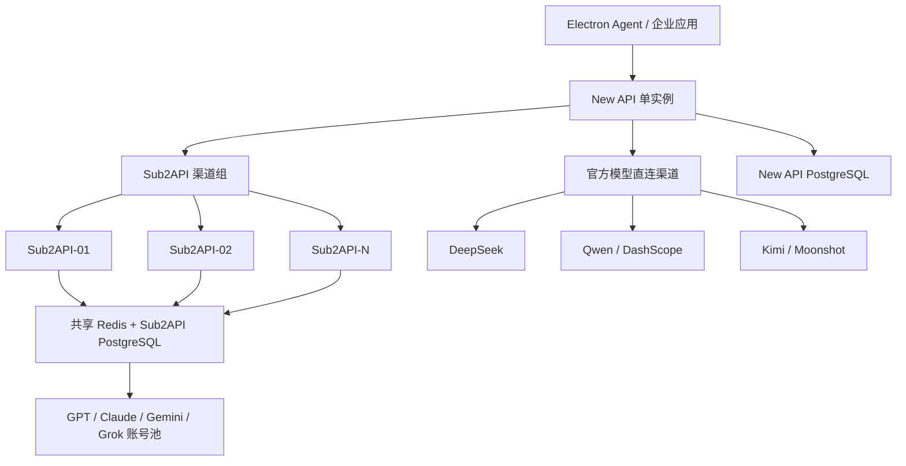

# 企业级 AI Gateway：路由、账号池与故障处理

New API 决定请求进入哪个资源池，Sub2API 决定本次请求使用哪个账号。两层职责分开，账号池的状态也不会泄漏到企业入口。

## 1. 需求边界

架构只包含以下组件：

```text
Electron Agent / 企业应用
          |
          v
New API 单实例
          |
          +--> Sub2API 多实例资源池
          |       +--> GPT
          |       +--> Claude
          |       +--> Gemini
          |       +--> Grok
          |
          +--> DeepSeek 官方接口
          +--> Qwen / DashScope 官方接口
          +--> Kimi / Moonshot 官方接口
```

组件分工：

| 组件         | 定位                                                  |
| ---------- | --------------------------------------------------- |
| New API    | 企业统一入口、认证、租户、限流、模型映射、渠道选择、Usage                     |
| Sub2API    | GPT、Claude、Gemini、Grok 账号池、账号调度、Sticky Session、并发控制 |
| Redis      | Sub2API 多实例之间共享 Session、账号状态、锁和调度状态                 |
| PostgreSQL | New API 和 Sub2API 的持久化数据                            |
| 官方渠道       | DeepSeek、Qwen、Kimi 等官方 API 直连                       |

这里不额外引入独立的 AI Router、Agent Runtime、Workflow、Kafka、ClickHouse 或复杂控制面。

---

## 2. 设计原则

### 2.1 New API 只做企业入口

New API 负责：

* 用户和应用认证
* API Key、JWT
* 租户和项目管理
* 模型权限
* 请求限流
* 模型别名
* 渠道优先级和权重
* 官方接口直连
* Sub2API 实例级选择
* 基础 Usage 和审计

New API 不负责：

* 选择具体 OAuth 账号
* 账号配额调度
* Account Sticky Session
* OAuth Token 刷新
* Sub2API 内部并发控制

### 2.2 Sub2API 是有状态的账号调度层

Sub2API 负责：

```text
请求
  |
  v
Session 解析
  |
  v
账号选择
  |
  v
账号并发控制
  |
  v
账号配额和健康状态检查
  |
  v
上游 GPT / Claude / Gemini / Grok
```

New API 只选择：

```text
Sub2API-01
Sub2API-02
Sub2API-03
```

Sub2API 再选择：

```text
Account A
Account B
Account C
```

因此，路由分为两级：New API 选择 Sub2API 实例，Sub2API 再选择具体账号。

### 2.3 New API 保持单实例

当前方案不做 New API 集群。

单实例适合以下情况：

* New API 本身不是主要并发瓶颈
* 主要并发压力位于 Sub2API 和上游账号池
* 可以接受 New API 重启时短暂中断
* 通过进程守护、自动重启和数据备份保证可恢复性

New API 单实例仍然是一个故障点，因此需要配置：

* systemd 或 Docker 自动重启
* 健康检查
* 配置持久化
* PostgreSQL 备份
* 可选的冷备或热备实例

不为了追求形式上的高可用而增加 New API 集群。

---

## 3. 架构




如果需要 HTTPS、域名和基础防护，可以在 New API 前增加一个轻量入口：

```text
Client
  |
  v
Nginx / SLB / Ingress
  |
  v
New API
```

它只负责 TLS 和反向代理，不增加独立路由逻辑。

---

## 4. 请求流转

### 4.1 Sub2API 资源池请求

```text
Electron Agent
      |
      v
New API
      |
      | 识别 model=claude.default
      | 选择 channel group=pool-claude
      v
Sub2API-01 / 02 / 03
      |
      | 读取共享 Redis
      | 查找 session -> account
      v
Claude Account
      |
      v
上游模型
```

### 4.2 官方模型请求

```text
Electron Agent
      |
      v
New API
      |
      | 识别 model=deepseek.default
      | 选择 direct-deepseek-01
      v
DeepSeek 官方 API
```

### 4.3 请求步骤

```text
1. 客户端请求 New API
2. New API 验证 API Key、用户、租户和模型权限
3. New API 根据模型别名选择渠道组
4. 如果是 Sub2API 资源，选择健康的 Sub2API 实例
5. Sub2API 从 Redis 查询 Session 绑定
6. 没有绑定时，Sub2API 选择账号并写入 Redis
7. 请求转发到上游模型
8. Streaming 数据原路返回
9. New API 记录企业侧 Usage
10. Sub2API 记录账号池侧配额和调度数据
```

企业计费以 New API 的 Usage 为准，Sub2API 的 Usage 主要用于账号配额和运行监控，避免两边重复计费。

---

## 5. New API 渠道设计

建议在 New API 中建立以下渠道组：

```text
pool-gpt
pool-claude
pool-gemini
pool-grok

direct-deepseek
direct-qwen
direct-kimi
```

### 5.1 模型别名映射

| 模型别名               | 渠道组               | 主要用途                  |
| ------------------ | ----------------- | --------------------- |
| `gpt.default`      | `pool-gpt`        | Sub2API GPT 资源池       |
| `claude.default`   | `pool-claude`     | Sub2API Claude 资源池    |
| `gemini.default`   | `pool-gemini`     | Sub2API Gemini 资源池    |
| `grok.default`     | `pool-grok`       | Sub2API Grok 资源池      |
| `deepseek.default` | `direct-deepseek` | DeepSeek 官方直连         |
| `qwen.default`     | `direct-qwen`     | Qwen / DashScope 官方直连 |
| `kimi.default`     | `direct-kimi`     | Kimi / Moonshot 官方直连  |

### 5.2 Sub2API 渠道注册方式

推荐将每个 Sub2API 实例作为 New API 的独立渠道注册：

```text
sub2api-gpt-01
sub2api-gpt-02
sub2api-gpt-03
```

优点：

* New API 可以感知每个实例的健康状态
* 可以单独设置权重
* 某个实例故障时可以快速摘除
* 不增加额外的 Sub2API 负载均衡层
* 请求链路更短

如果 Sub2API 实例数量很多，也可以在中间增加一个内部 Nginx 或 Service，但会多一跳网络转发。

### 5.3 渠道选择规则

```text
1. 根据模型别名匹配渠道组
2. 排除 disabled 渠道
3. 排除健康检查失败渠道
4. 按 priority 选择优先级
5. 同优先级按 weight 分流
6. 失败后切换同模型的其他渠道
```

New API 不执行账号级调度。

---

## 6. Sub2API 多实例集群

Sub2API 当前项目本身提供多账号管理、Sticky Session、并发控制、限流和 Redis/PostgreSQL 依赖，适合放在账号池调度层。[Sub2API README](https://github.com/Wei-Shaw/sub2api/blob/main/README.md)

### 6.1 部署方式

```text
Sub2API Cluster
├── Sub2API-01
├── Sub2API-02
├── Sub2API-03
└── Sub2API-N
```

逻辑上可以分为：

```text
GPT Pool
Claude Pool
Gemini Pool
Grok Pool
```

物理上可以选择：

* 一个 Sub2API 实例承载全部资源
* 不同实例承载不同资源
* 按资源类型拆分多个 Sub2API 集群

建议先采用一个集群、多个逻辑资源组，后续根据流量和账号数量拆分。

### 6.2 所有实例必须共享状态

不能使用：

```text
Sub2API-01 本地内存保存 Session
Sub2API-02 不知道 Session
```

必须使用：

```text
Sub2API-01
Sub2API-02
Sub2API-03
      |
      v
共享 Redis
```

共享内容包括：

```text
Session Sticky
账号健康状态
账号并发数
账号配额
账号冷却时间
调度锁
任务队列
```

这样用户请求从 Sub2API-01 切换到 Sub2API-02 后，仍然能够解析到同一个账号。

### 6.3 Sub2API 内部调度

账号选择应由 Sub2API 完成，New API 不重复实现一套调度算法。

Sub2API 可以综合：

```text
账号优先级
当前并发
账号剩余配额
历史延迟
错误率
最近使用时间
Session 是否已绑定
```

账号调度的原则是：

```text
优先复用健康的 Sticky Account
账号异常时触发 Sticky Escape
没有可用账号时快速失败
```

当前 Sub2API 配置中已经包含 Sticky Escape、TTFT 阈值、错误率阈值、HTTP/2 和连接池相关配置，可直接围绕这些能力调优。[Sub2API 配置示例](https://github.com/Wei-Shaw/sub2api/blob/main/deploy/config.example.yaml)

---

## 7. Session 和 Sticky Session

### 7.1 Session 所属边界

| 内容                            | 负责组件                |
| ----------------------------- | ------------------- |
| `conversation_id`             | Agent Runtime / 客户端 |
| `session -> account`          | Sub2API             |
| `session -> Sub2API instance` | 由负载和共享状态共同决定        |
| 用户权限                          | New API             |
| 租户限流                          | New API             |
| 账号配额                          | Sub2API             |

New API 只需要透传：

```text
session_id
conversation_id
task_id
user_id
```

不需要解析账号绑定关系。

### 7.2 Sticky 不能永久绑定

推荐逻辑：

```text
第一次请求
    |
    v
Sub2API 选择 Account A
    |
    v
Redis 保存 session -> Account A
    |
    v
后续请求优先使用 Account A
```

当以下情况发生时允许逃逸：

```text
Account A 429
Account A 超时
Account A 错误率升高
Account A TTFT 明显变慢
Account A 配额耗尽
Account A 被暂停
```

然后：

```text
Session
  |
  v
Account B
```

不能永久绑定：

```text
conversation_id -> Account A
```

否则 Account A 一旦达到额度，整个会话都会失败。

### 7.3 Session Key

概念上的 Redis 数据结构：

```text
sub2api:session:{session_hash}
```

内容：

```json
{
  "account_id": "account-123",
  "provider": "claude",
  "created_at": 1710000000,
  "expires_at": 1710003600
}
```

实际 Key 名称应以当前 Sub2API 版本实现为准，不建议在外部程序中直接修改 Sub2API 内部 Key。

---

## 8. Redis 和 PostgreSQL

### 8.1 Redis

Sub2API 集群用 Redis 保存共享状态，它是运行依赖，不只是缓存。

主要用途：

```text
Session Registry
Account State
Concurrency Counter
Distributed Lock
Quota State
Cooldown State
Scheduler Coordination
```

生产建议：

* Redis Sentinel、Redis Cluster 或托管 Redis
* 开启密码和 ACL
* 开启 TLS
* 监控内存、延迟、连接数和 Eviction
* 保证所有 Sub2API 实例访问同一 Redis 集群
* 不允许各实例使用本地 Redis

如果 New API 也使用 Redis，至少要做到：

```text
不同数据库或 Key Prefix
不同 ACL 用户
不同连接池
```

不能让 New API 和 Sub2API 使用相同 Key 空间。

### 8.2 PostgreSQL

建议逻辑分库：

```text
PostgreSQL
├── new_api_db
└── sub2api_db
```

即使运行在同一个 PostgreSQL 集群中，也应使用：

* 不同数据库
* 不同数据库用户
* 不同连接池
* 不同备份策略

New API 数据：

```text
用户
租户
API Key
模型
渠道
限流
Usage
```

Sub2API 数据：

```text
账号
OAuth 信息
账号配额
账号状态
账单
调度配置
运行日志
```

---

## 9. 官方模型直连

### 9.1 DeepSeek

```text
New API
   |
   +--> direct-deepseek-01
   +--> direct-deepseek-02
   |
   v
DeepSeek Official API
```

### 9.2 Qwen

```text
New API
   |
   +--> direct-qwen-01
   +--> direct-qwen-02
   |
   v
Qwen / DashScope Official API
```

### 9.3 Kimi

```text
New API
   |
   +--> direct-kimi-01
   +--> direct-kimi-02
   |
   v
Kimi / Moonshot Official API
```

每个官方 Provider 建议至少配置两个渠道：

```text
不同 API Key
不同项目账号
不同区域端点
```

优先使用 New API 已有的官方渠道类型。如果某个接口协议不兼容，只增加一个轻量适配配置，不再引入独立的多模型代理平台。

---

## 10. 故障切换

### 10.1 Sub2API 实例故障

```text
New API
   |
   +--> Sub2API-01 unhealthy
   |
   +--> Sub2API-02 healthy
   +--> Sub2API-03 healthy
```

处理方式：

```text
1. New API 健康检查发现 Sub2API-01 异常
2. 将 Sub2API-01 从可选渠道中摘除
3. 新请求发送到 Sub2API-02 或 Sub2API-03
4. 由于 Session 在共享 Redis 中，会话可以继续解析
```

### 10.2 账号故障

由 Sub2API 处理：

```text
Account A 429
    |
    v
冷却 Account A
    |
    v
切换 Account B
```

### 10.3 官方渠道故障

```text
direct-qwen-01 失败
        |
        v
direct-qwen-02
```

### 10.4 重试规则

可以重试：

```text
连接失败
408
429
502
503
504
```

不建议重试：

```text
参数错误
权限错误
模型不存在
上下文超限
策略拒绝
```

Streaming 已经开始返回数据后，不要自动重新执行完整请求，否则可能产生重复响应。

---

## 11. 低延迟设计

### 11.1 请求链路最短化

推荐链路：

```text
Client
  -> New API
  -> Sub2API
  -> Upstream
```

或者：

```text
Client
  -> New API
  -> DeepSeek/Qwen/Kimi
```

不要在中间增加多个同步代理层。

### 11.2 New API

* 模型映射和渠道配置放在内存
* 不在每个请求中查询 PostgreSQL
* 连接池常驻
* HTTP Keep-Alive
* HTTP/2
* Streaming 立即转发
* 限制最大请求体和最大输出 Token

### 11.3 Sub2API

重点调优：

```text
HTTP/2
Keep-Alive
Upstream Connection Pool
Max Connections
Max Concurrent Streams
Account Connection Isolation
```

当前 Sub2API 配置示例已经提供 HTTP/2、连接池、每主机连接数和连接池隔离相关配置，生产环境应根据账号数量和并发压测调整，而不是直接照搬默认值。[Sub2API 配置示例](https://github.com/Wei-Shaw/sub2api/blob/main/deploy/config.example.yaml)

### 11.4 Nginx Streaming 配置示例

如果前面使用 Nginx：

```nginx
location / {
    proxy_pass http://new-api:3000;

    proxy_http_version 1.1;
    proxy_set_header Connection "";

    proxy_buffering off;
    proxy_request_buffering off;

    proxy_read_timeout 3600s;
    proxy_send_timeout 3600s;
}
```

如果 Sub2API 依赖带下划线的 Session Header，需要确保 Nginx 不丢弃这些 Header：

```nginx
http {
    underscores_in_headers on;
}
```

Sub2API README 特别提到，Nginx 默认可能丢弃包含下划线的 `session_id` Header，从而破坏多账号 Sticky Session。[Sub2API README](https://github.com/Wei-Shaw/sub2api/blob/main/README.md)

---

## 12. New API 单实例的可用性措施

虽然 New API 只有一个实例，但仍应具备以下保护：

```text
Docker restart: always
或
systemd Restart=always
```

同时配置：

* 健康检查
* 自动重启
* 配置文件备份
* PostgreSQL 定时备份
* 日志轮转
* 监控告警
* 发布前配置校验
* 可选冷备实例

需要明确：

```text
New API 重启时，正在进行的 Streaming 请求可能中断
```

客户端应支持：

```text
request_id
session_id
重连
状态查询
有限重试
```

如果未来需要零中断升级，再增加第二个 New API 实例即可，不需要现在就引入集群。

---

## 13. 安全和运维边界

### 13.1 网络访问

公网只开放：

```text
New API
```

内网开放：

```text
Sub2API
Redis
PostgreSQL
Monitoring
```

客户端不能直接访问：

```text
Sub2API
官方 Provider
Redis
PostgreSQL
```

### 13.2 凭证

* 官方 API Key 只保存在 New API 服务端
* Sub2API OAuth 信息只保存在 Sub2API
* 不把账号 Token 返回给客户端
* 不在普通日志中打印 Token
* 定期轮换 API Key
* 为 Redis 和 PostgreSQL 启用认证

### 13.3 账号池前置条件

Sub2API 当前 README 明确提示，使用订阅账号或上游账号可能涉及供应商服务条款，并且项目本身不授予商业运营授权。[Sub2API README](https://github.com/Wei-Shaw/sub2api/blob/main/README.md)

因此生产部署前应确认：

```text
账号来源
授权范围
企业内部使用边界
数据使用边界
供应商条款
```

这属于部署前置条件，不需要额外增加路由平台。

---

## 14. 监控指标

### New API

```text
QPS
P50/P95/P99 延迟
TTFT
Streaming 数量
4xx
5xx
429
超时数
渠道切换次数
Token 使用量
Cost
```

### Sub2API

```text
实例健康状态
账号可用数
账号冷却数
账号 429 数
账号并发数
账号剩余配额
Sticky Session 命中率
Sticky Escape 次数
调度等待队列
```

### Redis

```text
连接数
命令延迟
内存使用率
Key 数量
Eviction
主从状态
故障切换次数
```

### PostgreSQL

```text
连接池使用率
慢查询
CPU
磁盘空间
主从复制延迟
```

---

## 15. 推荐部署基线

| 组件             |       起步配置 | 扩容依据                  |
| -------------- | ---------: | --------------------- |
| New API        |       1 实例 | 请求 QPS、Streaming 数、内存 |
| Sub2API GPT    |       2 实例 | GPT 并发和账号数量           |
| Sub2API Claude |       2 实例 | Claude 并发和账号数量        |
| Sub2API Gemini |       2 实例 | Gemini 并发和账号数量        |
| Sub2API Grok   |       2 实例 | Grok 并发和账号数量          |
| Redis          | 3 节点或托管 HA | Session、锁和调度压力        |
| PostgreSQL     |     HA 或主备 | 账号、Usage 和日志量         |
| Nginx/SLB      |      1 个入口 | TLS、域名和流量入口           |

部署方式可以分阶段：

```text
小规模：
Docker Compose + 托管 Redis/PostgreSQL

中等规模：
多台 Docker 主机 + 共享 Redis/PostgreSQL

较大规模：
Kubernetes Deployment + 共享 Redis/PostgreSQL
```

不需要一开始就把所有组件 Kubernetes 化。

---

## 16. 逻辑配置示例

以下是逻辑配置，不代表某个 New API 版本的精确字段格式：

```yaml
model_routes:
  gpt.default:
    type: sub2api
    channels:
      - sub2api-01
      - sub2api-02
      - sub2api-03
    strategy: priority_then_weight

  claude.default:
    type: sub2api
    channels:
      - sub2api-01
      - sub2api-02
      - sub2api-03
    strategy: priority_then_weight

  gemini.default:
    type: sub2api
    channels:
      - sub2api-01
      - sub2api-02
      - sub2api-03
    strategy: priority_then_weight

  grok.default:
    type: sub2api
    channels:
      - sub2api-01
      - sub2api-02
      - sub2api-03
    strategy: priority_then_weight

  deepseek.default:
    type: direct
    channels:
      - direct-deepseek-01
      - direct-deepseek-02
    strategy: priority_then_weight

  qwen.default:
    type: direct
    channels:
      - direct-qwen-01
      - direct-qwen-02
    strategy: priority_then_weight

  kimi.default:
    type: direct
    channels:
      - direct-kimi-01
      - direct-kimi-02
    strategy: priority_then_weight

channels:
  - id: sub2api-01
    type: sub2api
    base_url: http://sub2api-01:8080
    priority: 100
    weight: 33
    timeout_ms: 120000
    enabled: true

  - id: sub2api-02
    type: sub2api
    base_url: http://sub2api-02:8080
    priority: 100
    weight: 33
    timeout_ms: 120000
    enabled: true

  - id: sub2api-03
    type: sub2api
    base_url: http://sub2api-03:8080
    priority: 100
    weight: 34
    timeout_ms: 120000
    enabled: true

  - id: direct-deepseek-01
    type: official
    provider: deepseek
    base_url: https://api.deepseek.com
    priority: 100
    weight: 50
    credential_ref: secret/deepseek/key-01

  - id: direct-qwen-01
    type: official
    provider: dashscope
    base_url: https://dashscope.aliyuncs.com
    priority: 100
    weight: 50
    credential_ref: secret/qwen/key-01

  - id: direct-kimi-01
    type: official
    provider: moonshot
    base_url: https://api.moonshot.cn
    priority: 100
    weight: 50
    credential_ref: secret/kimi/key-01
```

---

## 17. 上线验收清单

### New API

* [ ] 所有客户端只能访问 New API
* [ ] 模型别名映射正确
* [ ] 租户和 API Key 限流正确
* [ ] 官方 DeepSeek/Qwen/Kimi 调用成功
* [ ] Streaming 不被缓冲
* [ ] New API 重启后可以自动恢复

### Sub2API 集群

* [ ] 所有实例连接同一个 Redis
* [ ] 所有实例连接同一个 Sub2API PostgreSQL
* [ ] Node1 创建的 Session 可以被 Node2 读取
* [ ] 账号状态在各实例之间一致
* [ ] 账号锁不会被多个实例重复获取
* [ ] 账号 429 可以自动冷却和切换
* [ ] Sticky Escape 正常工作
* [ ] 单个 Sub2API 实例宕机后新请求自动转移

### 官方渠道

* [ ] 每个 Provider 至少两个渠道或 Key
* [ ] 429、超时、5xx 能切换备用渠道
* [ ] 不同模型不会错误路由到其他模型族
* [ ] Provider Key 不出现在客户端和日志中

### 性能

* [ ] New API 不在热路径查询数据库
* [ ] Redis 延迟稳定
* [ ] HTTP Keep-Alive 和 HTTP/2 已启用
* [ ] Nginx 未丢失 Session Header
* [ ] 长 Streaming 请求不会被网关提前断开
* [ ] 已建立连接数和账号并发数在限制内

---

## 18. 架构摘要

```text
Enterprise AI Gateway
=
New API 单实例企业入口
+
Sub2API 多实例账号调度集群
+
共享 Redis 全局状态
+
Sub2API PostgreSQL 持久化
+
DeepSeek/Qwen/Kimi 官方直连
+
New API 渠道级路由
+
Sub2API 账号级调度
+
Streaming
+
限流
+
健康检查
+
故障切换
```

最终请求关系是：

```text
Electron Agent
      |
      v
New API
      |
      +--> Sub2API-01
      +--> Sub2API-02
      +--> Sub2API-03
      |        |
      |        v
      |   Redis Sticky Session
      |        |
      |        v
      |   GPT / Claude / Gemini / Grok Account Pool
      |
      +--> DeepSeek Official API
      +--> Qwen Official API
      +--> Kimi Official API
```
