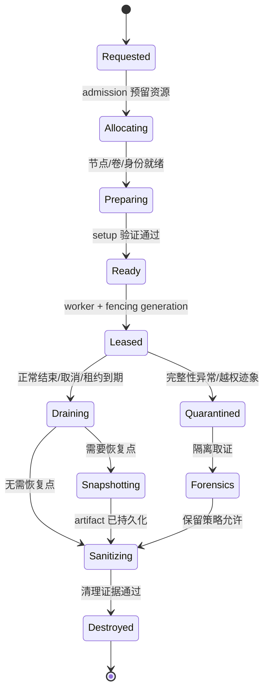
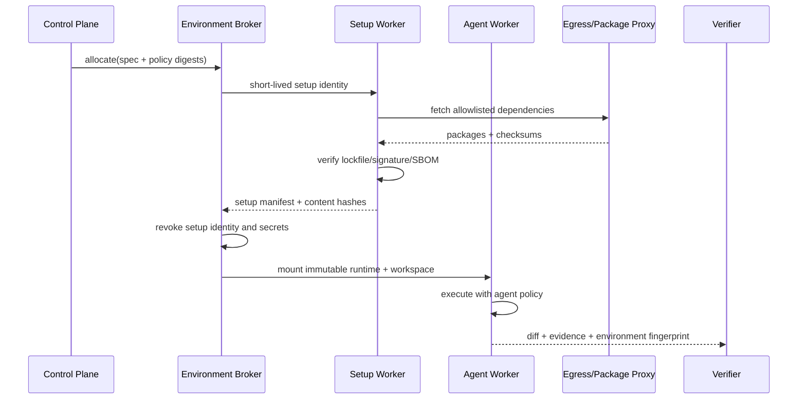
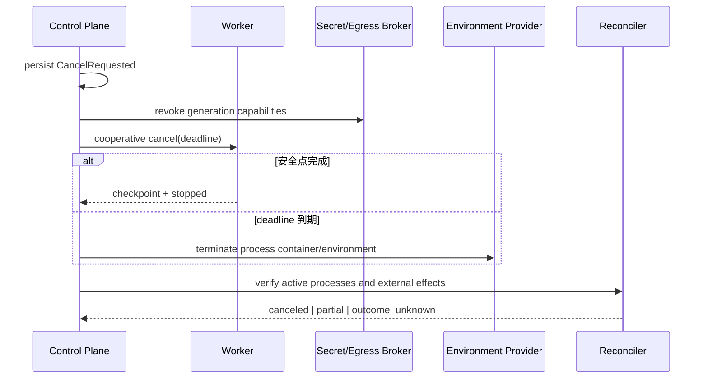

# 执行环境生命周期：指纹、租约与清理

> Agent 的执行环境包含 `cwd`、身份、策略、租约和证据。内容覆盖环境准备、云端两阶段执行、worktree、checkpoint、取消和数据删除。Codex 的产品行为按官方资料核对，其余内容是参考设计，需结合实际约束验证。

## 1. 两个危险抽象

“Worker 无状态”只表示 **Worker 进程应可替换**，不表示一次运行没有状态。真实状态至少分成四类：

| 状态 | 例子 | 真相来源 | 恢复策略 |
|---|---|---|---|
| 控制状态 | Task phase、预算、审批、fencing token | 事务数据库 / Event Store | 重放或快照恢复 |
| 工作状态 | worktree、生成文件、依赖缓存 | 受管工作卷 / artifact store | 重新挂载或从 checkpoint 重建 |
| 进程状态 | PID、PTY、打开的 socket | 当前执行节点 | 通常不迁移；失败后重启 Step |
| 外部状态 | PR、工单、部署、邮件 | 外部系统 | 查询、幂等提交、reconcile |

因此更准确的描述是：

> Worker 可替换；环境有状态但受管；副作用必须可识别；恢复从持久化控制状态和可验证 artifact 开始，而不是从某个内存栈继续。

第二个错误抽象是“容器等于沙箱”。容器提供 namespace、cgroup、filesystem 等隔离原语，但是否构成足够的安全边界，取决于宿主、运行时配置、内核攻击面、身份、网络、挂载和秘密暴露方式。对高风险不可信代码，应根据威胁模型选择强化容器、microVM 或独立 VM，不能只看部署名词。

## 2. 环境是一个可解析的契约

调用方提交的是意图 `ExecutionEnvironmentSpec`，控制面解析出不可变的 `ResolvedEnvironment`。不要让 Worker 自己从“latest”、PATH 或用户 shell 配置中猜环境。

```ts
type Sha256 = `sha256:${string}`;

interface ExecutionEnvironmentSpec {
  tenantId: string;
  taskId: string;
  runId: string;
  isolation: "local-brokered" | "container" | "microvm" | "vm";
  platform: { os: "linux" | "windows" | "macos"; arch: "amd64" | "arm64" };
  source: {
    repositoryId: string;
    baseCommit: string;       // 完整 commit hash，不接收可移动 branch 名作为执行真相
    worktreeMode: "read-only" | "isolated-write";
  };
  runtime: {
    imageDigest?: Sha256;     // 使用 digest，不只使用 tag
    toolchainLockDigest: Sha256;
    setupBundleDigest: Sha256;
  };
  policyRefs: {
    sandboxPolicy: string;
    networkPolicy: string;
    secretPolicy: string;
    retentionPolicy: string;
  };
  resources: { cpuMillis: number; memoryMiB: number; diskMiB: number; wallMs: number };
  region: string;
}

interface ResolvedEnvironment extends ExecutionEnvironmentSpec {
  environmentId: string;
  generation: number;
  imageDigest: Sha256;
  resolvedPolicies: Record<string, { version: string; digest: Sha256 }>;
  serviceIdentity: string;
  networkEgressIdentity: string;
  createdAt: string;
  expiresAt: string;
}
```

这里有三个不变量：

1. `baseCommit`、镜像和策略都解析为不可变版本；
2. Secret 只记录授权引用，不进入环境契约正文；
3. 每次重新分配都递增 `generation`，旧 Worker 的写入可被 fencing 拒绝。

## 3. 生命周期必须显式建模



状态转换不能仅由 Worker 报告。控制面至少要核对：

- 资源供应商返回的实例/Pod/VM 状态；
- 当前租约持有者与 fencing generation；
- 活动进程或作业容器是否归零；
- 工作卷和临时 Secret 挂载是否撤销；
- checkpoint/artifact 是否已写入耐久存储；
- 清理证明是否满足租户保留策略。

`BLOCKED`、`WAITING_APPROVAL` 是 **Task** 状态，不必让环境一直处于 Leased。长时间等待审批时，应先 checkpoint、撤销 Secret、释放 Worker；根据恢复成本选择保留加密工作卷或销毁后重建。

## 4. 环境类型与真实隔离边界

| 类型 | 启动速度 | 隔离强度 | 适合场景 | 核心风险 |
|---|---:|---:|---|---|
| 本地 brokered process | 最快 | 取决于 OS sandbox | 桌面端、用户本地仓库 | 宿主数据、TCC/UAC、用户凭据 |
| Git worktree + OS sandbox | 快 | 中等 | 可信仓库的代码修改 | 共享 Git object/common-dir |
| 临时容器 | 中 | 中等 | CI、构建、常规工具调用 | 宿主内核、错误挂载、逃逸 |
| 强化容器 / microVM | 较慢 | 较高 | 运行不可信代码、多租户 | 镜像/虚拟化供应链、成本 |
| 独立 VM | 最慢 | 高 | 高合规、高风险隔离 | 池化卫生、启动与成本 |

“本地”和“云端”不是安全等级。安全边界来自可验证配置，例如：只读 rootfs、非 root、最小 Linux capability、seccomp/AppContainer/App Sandbox、进程树容器、显式网络出口和独立工作卷。

桌面侧的 Job Object、ConPTY、AppContainer、security-scoped bookmark 与 XPC 细节见[本地 Coding Agent Host](../02-desktop/coding-agent-host.md)。

## 5. 两阶段执行：Setup 与 Agent 不共享权力

Codex Cloud 当前公开文档描述了两阶段模型：Setup 阶段可联网安装指定依赖；Agent 阶段默认离线，环境 Secret 只在 Setup 可用并在 Agent 阶段前移除。企业 Runtime 可以借鉴这个模式，但不应把它误写成所有本地/云端 Runtime 的普遍行为。



Setup 结束时生成 `SetupManifest`：

```ts
interface SetupManifest {
  environmentId: string;
  lockfileDigests: Sha256[];
  installed: Array<{ name: string; version: string; source: string; digest?: Sha256 }>;
  setupCommandsDigest: Sha256;
  networkDestinations: string[];
  sbomArtifactId: string;
  stdoutArtifactId: string;
  exitCode: number;
}
```

Agent 阶段只挂载验证后的结果。如果确实需要运行中联网，应通过新的能力授予，而不是把 Setup token 留在环境中。下载依赖与把源代码上传到任意域名是完全不同的权限；网络策略必须描述方向、域名/IP、协议、身份和数据分类。

## 6. 环境指纹：为了复现，不是为了制造确定性幻觉

环境指纹应覆盖影响运行结果的关键输入：

```ts
interface EnvironmentFingerprintV1 {
  schema: "env-fingerprint/v1";
  platform: { os: string; version: string; arch: string; kernel?: string };
  runtime: { imageDigest: Sha256; sandboxPolicyDigest: Sha256 };
  source: { repositoryId: string; baseCommit: string; initialTreeDigest: Sha256 };
  dependencies: { lockDigests: Sha256[]; setupManifestDigest: Sha256 };
  tools: Array<{ name: string; version: string; binaryDigest?: Sha256 }>;
  policies: Array<{ kind: string; version: string; digest: Sha256 }>;
  locale: { timezone: string; locale: string };
  network: { policyDigest: Sha256; proxyVersion?: string };
}

function fingerprint(value: EnvironmentFingerprintV1): Sha256 {
  // canonicalJson 必须固定 key 排序、Unicode 与数字编码规则。
  return `sha256:${sha256(canonicalJson(value))}`;
}
```

指纹不能证明执行完全确定：时钟、随机数、并发调度、远端 API、包仓库内容和硬件差异仍会影响结果。它提供的是：

- 对比两次运行是否在“已声明输入”上相同；
- 将测试证据绑定到某个具体环境；
- 发现 `latest` tag、PATH 漂移、策略热更新等未受控变化；
- 为事故复现和灰度回滚提供索引。

如果某个输入无法固定，就显式记录为 `uncontrolledInputs`，不要从指纹中静默省略。

## 7. Worktree 的所有权、冻结与合并

一个可写 Task/子 Agent 使用独立 worktree，且有唯一 owner：

```sql
CREATE TABLE execution_worktree (
  worktree_id       TEXT PRIMARY KEY,
  environment_id    TEXT NOT NULL,
  owner_step_id     TEXT NOT NULL,
  base_commit       TEXT NOT NULL,
  path_token        TEXT NOT NULL, -- broker 内部引用，不向模型暴露宿主绝对路径
  generation        INTEGER NOT NULL,
  status            TEXT NOT NULL CHECK (status IN
                     ('preparing','ready','leased','frozen','merged','discarded','quarantined')),
  initial_tree_hash TEXT NOT NULL,
  final_diff_hash   TEXT,
  UNIQUE(owner_step_id, generation)
);
```

提交前流程：冻结写入 → 读取真实 Git diff → 计算 hash → 运行 verifier → 审批绑定 `baseCommit + diffHash + policyVersion` → 再次 CAS 基线 → 合并。审批后若文件变化、基线变化或策略变化，旧批准立即失效。

多 Agent 不要并发写同一个目录。各自生成 patch artifact，由 Supervisor 根据依赖顺序合并；冲突进入显式状态，不能让“最后写入者获胜”。详见[多 Agent 编排](../03-runtime/multi-agent-orchestration.md)。

## 8. 池化：优化启动延迟但不池化租户状态

Warm pool 可以预热基础镜像、语言运行时和公开依赖缓存，但必须遵守“先清空身份，再重新绑定租户”：

1. 池中实例无租户网络凭据、无用户代码、无可复用的 Agent 会话；
2. 分配后才挂载租户工作卷、下发短期 workload identity；
3. 缓存按信任域和数据分类分区，私有包缓存不能跨租户可枚举；
4. 归还池前销毁可写层并证明 Secret、进程、socket、挂载均已清空；
5. 清理失败的实例进入 Quarantine，不能“尽力清理后继续复用”。

池化指标不能只看命中率：

```text
pool_allocation_latency_seconds{isolation,region}
pool_sanitize_failure_total{reason}
pool_quarantine_total{image_digest}
environment_cold_start_seconds{stage}
environment_cross_tenant_canary_violation_total
```

建议在测试租户中种植不可预测 canary，下一租户分配时扫描；任何命中都应触发 P0 隔离事故响应。

## 9. Secret 与网络出口是短期能力

Secret Broker 返回带有明确范围的短期能力，绑定主体、资源、动作、Task、环境 generation 和到期时间：

```ts
interface SecretLease {
  leaseId: string;
  subject: { tenantId: string; taskId: string; environmentId: string; generation: number };
  audience: string;
  scopes: string[];
  notBefore: string;
  expiresAt: string;
  maxUses?: number;
  delivery: "fd" | "named-pipe" | "memory-volume" | "brokered-call";
}
```

优先使用 brokered call：工具把规范化请求交给 Broker，由 Broker 注入凭据并调用目标服务，Agent 永远看不到 Secret 值。无法避免时，也不要写入命令行、事件正文、checkpoint、shell history 或通用环境快照。

网络出口通过 egress proxy 记录 `taskId/toolCallId/destination/policyDecisionId/bytes`；正文日志按数据分类采样或完全禁用。DNS allowlist 不是完整 SSRF 防线，还要处理重绑定、重定向、私网/metadata 地址、IPv6 和代理隧道。

## 10. 租约、fencing 与资源写入

租约只能说明“控制面当前认为谁持有任务”，不能阻止旧 Worker 在网络分区后继续写。每个有状态写入都带单调 `generation`：

```ts
async function commitArtifact(input: {
  environmentId: string;
  generation: number;
  artifact: Uint8Array;
}) {
  const current = await environments.currentGeneration(input.environmentId);
  if (input.generation !== current) throw new Error("STALE_EXECUTOR");
  return artifactStore.putIfGenerationMatches(input);
}
```

接收写入的一侧必须验证 fence；Worker 启动时的单次检查不够。对于不能识别 generation 的外部系统，使用幂等键、资源版本条件、查询确认和 reconcile；无法确认的结果进入 `outcome_unknown`。

详细的队列、公平调度与 Task lease 见[任务控制平面](task-control-plane.md)。

## 11. 取消：停止意图、停止执行、确认副作用是三件事

建议区分三档：

| 档位 | 行为 | 适用情形 |
|---|---|---|
| Soft | 停止派发新 Step，等待当前安全点，写 checkpoint | 用户普通取消、预算预警 |
| Hard | 撤销 Secret/网络能力，终止整个进程树/容器 | deadline 到期、Worker 无响应 |
| Emergency | 隔离节点、冻结证据、阻断租户出口 | 泄密或逃逸迹象 |



“已发送 kill”不等于 `CANCELED`。终态至少要核对进程容器归零；对已经发出的部署、支付、邮件等外部副作用单独查询。预算耗尽前必须预留 checkpoint、撤权、清理所需的资源额度，否则所谓“100% 立即停止”可能留下更贵、更危险的垃圾资源。

## 12. Checkpoint 不是内存转储

可迁移 checkpoint 只保存稳定逻辑状态与 artifact 引用：

```ts
interface ExecutionCheckpoint {
  schemaVersion: number;
  taskId: string;
  runId: string;
  planVersion: number;
  completedStepIds: string[];
  pendingStepIds: string[];
  eventSeq: number;
  environmentFingerprint: Sha256;
  workspaceSnapshot?: { artifactId: string; digest: Sha256; baseCommit: string };
  effectLedgerCursor: string;
  policySnapshotDigest: Sha256;
  capabilityRefs: string[]; // 不含 token/secret 值
  createdAt: string;
}
```

恢复时重新做 admission、授权和策略判定。旧 checkpoint 记录的是“当时允许过什么”，不是今天继续执行的通行证。若镜像、工具协议、policy schema 或 workspace 基线不兼容，应运行显式迁移或从最近可重放边界重做 Step。

不要序列化 PID、socket、数据库连接、原始 Secret 或 Provider SDK 私有对象。它们既不可移植，也会把恢复与具体实现锁死。

## 13. 清理、保留与删除传播

任务结束后的清理顺序应是：

1. 禁止新 Step 和新能力签发；
2. 递增 generation，使旧执行者失效；
3. 撤销 Secret、网络会话和临时身份；
4. 停止并核对进程树；
5. 按策略持久化 checkpoint、diff、验证证据与审计摘要；
6. 卸载工作卷并销毁可写层；
7. 删除 worktree、临时索引和缓存命名空间；
8. 写入 `EnvironmentSanitized`，由独立巡检器再次对账。

数据删除不是一次 `DELETE`：


备份通常不能瞬间物理改写。对外承诺应准确描述：在线删除延迟、缓存失效 SLA、备份保留窗口、legal hold 例外和 crypto-erasure 条件，而不是声称“所有副本立即消失”。

```sql
CREATE TABLE deletion_job (
  deletion_id       TEXT PRIMARY KEY,
  tenant_id         TEXT NOT NULL,
  subject_type      TEXT NOT NULL,
  subject_id        TEXT NOT NULL,
  requested_at      TEXT NOT NULL,
  retention_policy  TEXT NOT NULL,
  phase             TEXT NOT NULL,
  next_attempt_at   TEXT,
  proof_artifact_id TEXT,
  exception_code    TEXT
);
```

## 14. Kubernetes 参考骨架

下面只是企业参考配置片段，重点是表达安全不变量，不是可直接复制的完整生产清单：

```yaml
apiVersion: v1
kind: Pod
metadata:
  labels:
    app: agent-worker
    isolation-class: untrusted-code
spec:
  automountServiceAccountToken: false
  restartPolicy: Never
  runtimeClassName: sandboxed-runtime
  securityContext:
    runAsNonRoot: true
    seccompProfile: { type: RuntimeDefault }
  containers:
    - name: worker
      image: registry.example/agent-worker@sha256:REPLACE_WITH_DIGEST
      securityContext:
        allowPrivilegeEscalation: false
        readOnlyRootFilesystem: true
        capabilities: { drop: ["ALL"] }
      resources:
        requests: { cpu: "1", memory: "2Gi", ephemeral-storage: "4Gi" }
        limits: { cpu: "2", memory: "4Gi", ephemeral-storage: "8Gi" }
      volumeMounts:
        - { name: workspace, mountPath: /workspace }
        - { name: scratch, mountPath: /scratch }
  volumes:
    - name: workspace
      persistentVolumeClaim: { claimName: task-scoped-pvc }
    - name: scratch
      emptyDir: { sizeLimit: 8Gi }
```

还需要配套 NetworkPolicy/egress proxy、Pod Security、镜像签名验证、准入策略、节点隔离、短期 workload identity、日志脱敏和清理控制器。`restartPolicy: Never` 表示由 Runtime 根据事件语义决定重试，避免 Kubernetes 在不知道副作用结果时自行重跑。

## 15. 故障注入与验收矩阵

| 注入点 | 期望状态 | 必须证明的事实 |
|---|---|---|
| Setup 下载一半断网 | `PREPARING_FAILED` | 未把半成品标为 Ready；Secret 已撤销 |
| Ready 后节点宕机 | 可重新分配 | 新 generation 生效，旧写入被 fence |
| 审批等待 2 小时 | `WAITING_APPROVAL` | Worker 已释放，checkpoint 可恢复，Secret 不驻留 |
| Hard cancel 时子进程派生 | `CANCELING` 后终态 | 整个进程容器归零，不只父 PID 消失 |
| 工具请求超时但外部 PR 已创建 | `outcome_unknown` | 查询后关联既有 PR，不重复创建 |
| Sanitizing 删除工作卷失败 | `QUARANTINED` | 实例不回池，告警带 environmentId |
| 删除请求遇到 legal hold | 显式 exception | 在线访问被封，保留原因和到期条件可审计 |
| 指纹相同但测试偶发失败 | 质量事件 | 记录不受控输入，不能伪称“完全可复现” |

至少实现以下自动化测试：

- property test：任意状态序列都不能从 `Destroyed` 回到活动状态；
- concurrency test：两个 generation 只有较新者能提交 artifact；
- crash test：在“副作用完成、事件落盘前”强杀 Worker，恢复进入查询/对账；
- isolation test：跨租户缓存、卷、进程、DNS、Secret canary 均不可见；
- policy test：审批后改变参数、资源版本或策略版本会使批准失效；
- restore test：从前一版本 checkpoint 恢复时执行迁移或明确拒绝。

## 16. 架构评审问题

1. 环境的不可变输入有哪些？哪些仍是未受控输入？
2. 谁分配 generation，谁在每一个真实写入点验证它？
3. 等待审批期间为何还需要占着昂贵 Worker？
4. Setup 获得过哪些网络和 Secret？Agent 阶段能否读到残留？
5. 取消后如何证明后代进程、网络会话和外部副作用的状态？
6. Warm pool 如何证明上一个租户的数据不再存在？
7. 清理失败会重试、隔离，还是静默把实例重新投入使用？
8. “删除完成”的语义是否覆盖缓存、索引、备份和 legal hold？

## 17. 实战练习

实现一个 `EnvironmentBroker` 最小纵向切片：

- [ ] spec 被解析为 digest 固定的 resolved environment，并生成 canonical fingerprint；
- [ ] Setup 和 Agent 使用不同身份，Setup token 在切换前可验证地撤销；
- [ ] 两个并发 Worker 模拟租约漂移，旧 generation 的 artifact commit 被拒绝；
- [ ] 在 8 个生命周期点强杀进程，重启后无重复副作用、无泄漏实例；
- [ ] Soft/Hard/Emergency cancel 有不同证据与最终语义；
- [ ] 清理失败进入 Quarantine，不能回到 warm pool；
- [ ] 输出一份包含环境指纹、setup manifest、diff hash、验证证据和清理证明的 DeliveryBundle。

## 18. 关联章节与一手资料

继续阅读[任务控制平面](task-control-plane.md)、[安全威胁模型](security-threat-model.md)、[可靠性与成本](reliability-cost.md)、[执行契约与验证](../03-runtime/execution-contract-verification.md)和[生产检查清单](../07-practice/production-checklists.md)。

- [OpenAI：Agent approvals & security](https://developers.openai.com/codex/agent-approvals-security)
- [OpenAI：Codex cloud environments](https://developers.openai.com/codex/environments/cloud-environment)
- [OpenAI：Git worktrees](https://developers.openai.com/codex/environments/git-worktrees)
- [OCI Image Specification](https://github.com/opencontainers/image-spec)
- [Kubernetes：Pod Security Standards](https://kubernetes.io/docs/concepts/security/pod-security-standards/)
- [Kubernetes：Network Policies](https://kubernetes.io/docs/concepts/services-networking/network-policies/)
- [SLSA specification](https://slsa.dev/spec/)
