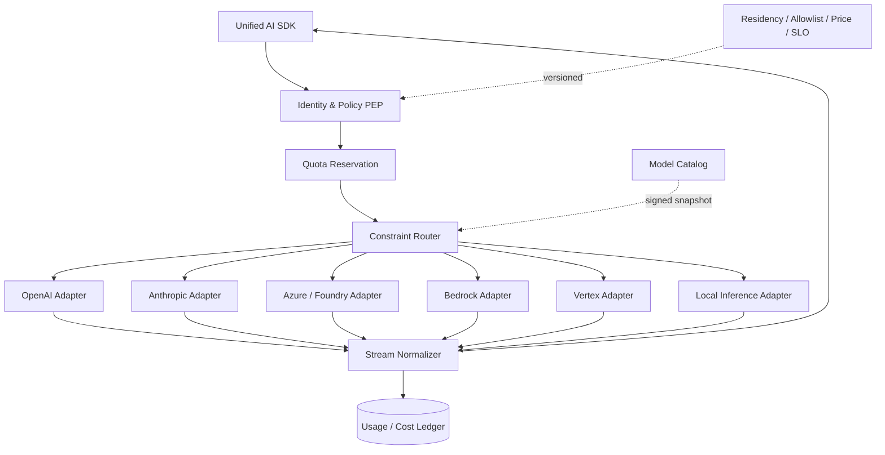

# 企业模型网关：身份、路由、流式与成本的统一执行面

可治理的 Model Gateway 需要硬约束优先的路由、供应商语义保真、配额预留、流式归一和成本账本，兼容 `/chat` 只是协议入口。厂商事实已于 **2026-08-30** 按官方资料核对；模型名称、价格、区域和限额变化频繁，生产系统必须从版本化 Catalog 读取，不能复制本文常量。

## 1. 直连 SDK 与企业网关不是二选一信仰

直连官方 SDK 的优点是最快获得新能力、类型最准确、调试链路短；适合原型、单团队低风险应用、完全本地推理，或必须使用供应商刚发布且网关尚未支持的功能。缺点是每个客户端持密钥/身份逻辑、重试与日志各自实现，数据区域和成本难以统一证明。

企业网关提供：工作负载身份、供应商密钥托管、租户配额、模型 allowlist、数据驻留、统一审计、降级、成本归属和协议适配。代价是增加一次网络跳、一个故障域和能力发布延迟。正确策略是“**稳定公共核心 + capability negotiation + 受控 vendor extensions**”，而不是把所有模型压成一个文本字符串。

| 场景 | 推荐路径 | 理由 |
|---|---|---|
| 本地离线代码补全 | 客户端 → 本地 gateway/推理服务 | 代码不出设备，仍复用统一事件合同 |
| 企业生产 Agent | 客户端 → 企业网关 → Provider | 身份、区域、预算和审计不可由客户端绕过 |
| 新模型功能试验 | 服务端受限直连或网关 passthrough | 保留官方语义，用 feature flag 限租户 |
| 高敏且供应商区域不满足 | 路由拒绝或合规的本地模型 | 合规硬约束不能靠 fallback 放宽 |

## 2. 数据面与控制面



控制面发布签名的 `ModelCatalogSnapshot`：逻辑模型、provider/deployment、输入输出能力、上下文上限、区域、数据处理/存储属性、支持的 tool/JSON/stream/cache、价格版本、健康策略。数据面用本地快照判定，控制面短暂故障不能阻断每个 token。

```ts
export type GatewayEvent =
  | { type: "response.started"; requestId: string; providerRequestId?: string }
  | { type: "text.delta"; index: number; delta: string }
  | { type: "tool.started"; callId: string; name: string }
  | { type: "tool.arguments.delta"; callId: string; delta: string }
  | { type: "usage"; input: number; output: number; cachedInput?: number; reasoning?: number }
  | { type: "response.completed"; finishReason: string }
  | { type: "response.failed"; errorClass: string; retryable: boolean; outcome: "known" | "unknown" };

export interface ProviderAdapter {
  readonly kind: "openai" | "anthropic" | "azure" | "bedrock" | "vertex" | "local";
  capabilities(target: ModelTarget): CapabilitySet;
  estimate(req: ModelRequest): Promise<{ inputTokens: number; maxOutputTokens: number }>;
  stream(req: RoutedRequest, signal: AbortSignal): AsyncIterable<GatewayEvent>;
}
```

公共事件不能丢失原始语义：每次调用另存受保留策略约束的 `providerEventType/providerRequestId/rawUsageHash`；高级功能通过 capability 和 typed extension 暴露。上层不得假设所有 provider 的 tool call、reasoning、finish reason 或缓存计量等价。

## 3. 六类 Provider 的适配要点

### 3.1 OpenAI

以 Responses API 的 output item / streaming event 为语义边界，不要退化为 Chat Completions 风格字符串。官方 TypeScript 参考展示 `stream: true` 返回带类型和 `sequence_number` 的事件；function call 有独立 `call_id/name/arguments/status`。adapter 应保留事件顺序，聚合完整 tool arguments 后再做 JSON Schema 校验。

`previous_response_id`/conversation 等服务端状态能力会改变数据保存边界；有 ZDR 或可移植恢复要求时，由 Runtime 明确重放所需 items，不得由网关偷偷开启状态。记录官方 usage 中 input/output、cached input、cache write、reasoning 等实际可得字段；字段缺失表示“未知/不适用”，不是 0。

```ts
async function* fromOpenAI(stream: AsyncIterable<any>): AsyncIterable<GatewayEvent> {
  for await (const e of stream) {
    switch (e.type) {
      case "response.output_text.delta":
        yield { type: "text.delta", index: e.output_index, delta: e.delta }; break;
      case "response.function_call_arguments.delta":
        yield { type: "tool.arguments.delta", callId: e.item_id, delta: e.delta }; break;
      case "response.completed":
        yield { type: "usage", input: e.response.usage.input_tokens,
          output: e.response.usage.output_tokens,
          cachedInput: e.response.usage.input_tokens_details?.cached_tokens,
          reasoning: e.response.usage.output_tokens_details?.reasoning_tokens };
        yield { type: "response.completed", finishReason: "completed" }; break;
    }
  }
}
```

具体 event union 以你锁定的 `openai` SDK 版本生成类型为准；上例展示适配边界，不应以 `any` 进入生产。

### 3.2 Anthropic Claude API

Messages API 接收结构化 messages，官方说明可用于单次或**无服务端状态的多轮**对话；system 是顶层字段，tool use/result 是 content block。SSE 顺序通常为 `message_start`，随后每个 block 的 start/delta/stop，再到 `message_delta/message_stop`，中间可能有 `ping`。adapter 要把 block index 和 tool-use ID 映射到统一 callId，不能假定每个 delta 都是完整 JSON。

Anthropic 官方 rate limit 以组织/模型的 RPM、ITPM、OTPM 等维度执行，并返回 429 与 `retry-after`；网关应读取响应 headers 更新局部限流器。prompt caching 通过 content block 的 `cache_control` 声明，当前 API 参考列出 `5m`/`1h` TTL；只有 capability catalog 确认目标模型支持时才写入，且统计 cache creation/read token，不能把 OpenAI 的缓存字段直接套过来。

### 3.3 Azure OpenAI / Microsoft Foundry

Azure/Foundry 常以“部署名 + resource/project endpoint”而不是公共模型别名寻址。生产认证优先 Microsoft Entra ID/managed identity：应用请求短期 token，RBAC 授权资源，无需把长期 API key 放进 Pod 或桌面客户端。adapter 的 target 应拆为 `{resource, project?, deployment, apiSurface, apiVersion?}`，不要只有 `model`。

区域规则必须按 deployment type 建模。微软官方数据隐私说明：普通区域部署的输入输出在客户指定 geography 内处理（运维可能在该 geography 内跨 region），Global/DataZone 例外；某些 stateful API/Files/Responses 会存储数据，Batch 也有不同处理位置。路由器必须把“处理区域、静态存储区域、abuse monitoring、feature storage”分列，而不是一个 `region=EU` 布尔值。

### 3.4 Amazon Bedrock

Bedrock 使用 AWS IAM/SigV4 和 `bedrock-runtime`；可选原生 `Converse/ConverseStream`、`InvokeModel/InvokeModelWithResponseStream`，也提供部分兼容 API。若要跨多家 Bedrock 模型，优先 Converse 公共面，同时保留 model-specific inference configuration。

target 可以是 foundation model、provisioned endpoint 或 inference profile。AWS 官方说明 geographic cross-region profile 会在指定 geography 内选 region，global profile 可能在全球支持区处理；数据驻留要求严格时绝不能把 single-region 429 自动降级成 global profile。CloudTrail/CloudWatch 归属与实际 inference region 都要进入 route record。

Bedrock model invocation logging 默认关闭；开启后可把完整输入、输出和 metadata 写到同账号同区的 CloudWatch Logs/S3。安全团队必须按数据分类决定是否启用和保留多久，不能为了排障全量记录代码。prompt caching、Guardrails、吞吐与 stream 支持均按模型/endpoint capability 判定。

### 3.5 Google Vertex AI

Vertex 使用 Google Cloud IAM/ADC 与 project/location；Google 模型、partner MaaS、自部署 endpoint 的 URL 和 schema 可能不同。adapter target 至少包含 `{project, location, publisher, model, endpointKind}`。位置是合规字段，不得让客户端自由提交。

Vertex 官方当前区分 pay-as-you-go Dynamic Shared Quota 与 Provisioned Throughput：DSQ 遇到共享资源紧张可能返回 429，建议重试；关键 SLO 可买预留吞吐。网关的 429 分类必须区分“本租户额度耗尽”和“provider shared capacity”，前者等待配额窗口，后者才考虑同合规区 fallback。

数据治理不能只引用平台总口号：官方 Zero Data Retention 页面列出 abuse monitoring、Grounding with Search/Maps、Live session resumption、in-memory caching 等具体例外/动作。catalog 以 feature 为粒度标 `zdrCompatible`，请求一旦启用 grounding/session 等扩展就重新做 policy evaluation。

### 3.6 Local inference

本地 vLLM/llama.cpp/Ollama 等减少外传但把 GPU 容量、模型许可、镜像供应链、访问认证和可观测责任交给企业。vLLM 官方提供多种 OpenAI-compatible endpoint，但也明确列出不支持/忽略的参数；“HTTP 兼容”不等于模型行为、tool calling、tokenizer、错误码或 usage 完全兼容。

```bash
# 仅用于隔离网络内的示例；生产需 TLS/mTLS、认证、镜像与模型 digest。
vllm serve /models/approved-model \
  --served-model-name corp-code-model \
  --tensor-parallel-size 2 \
  --api-key "$LOCAL_GATEWAY_BOOTSTRAP_KEY"

curl http://127.0.0.1:8000/v1/models \
  -H "Authorization: Bearer $LOCAL_GATEWAY_BOOTSTRAP_KEY"
```

catalog 固化 weight digest、tokenizer/chat-template digest、quantization、engine build、GPU type 和最大 context；health 不只看 `/health`，还看 queue time、KV cache、首 token 和 OOM。Local adapter 仍通过统一网关，业务不能因为“本机”就绕过工具策略和审计。

## 4. 身份链：用户身份不能变成供应商密钥

推荐链路：客户端 OIDC/device token → 网关验证并构造 `tenantId/actorId/purpose` → policy 决定逻辑模型 → 网关以自身 workload identity 调 provider。Azure 用 managed identity/Entra RBAC，AWS 用 IAM role，GCP 用 service account/Workload Identity；OpenAI/Anthropic API secret 则从短租约 secret manager 注入 adapter。任何长期 provider key 都不返回客户端或写日志。

```ts
type AuthContext = {
  tenantId: string; actorId: string; workloadId: string;
  roles: string[]; purpose: "interactive" | "eval" | "batch";
  dataClass: "public" | "internal" | "confidential" | "restricted";
};

type DataPolicy = {
  allowedProcessingZones: string[];
  allowedStorageZones: string[];
  zeroRetentionRequired: boolean;
  allowPromptLogging: boolean;
  allowCrossRegion: boolean;
};
```

网关从已验证 token 与服务端 tenant policy 生成上下文，拒绝请求 body 自报 tenant/zone。向 provider 发送的最终 prompt 也不能含平台 RBAC token；工具调用主体仍是 Runtime，不是模型。

## 5. 路由：硬约束过滤后再打分

先做硬过滤：租户 allowlist、数据处理/存储区、ZDR、输入模态、tool/JSON 能力、上下文、最大敏感度、供应商合同与预算上限。空集合必须明确拒绝，不能悄悄放宽区域。然后才按质量评测、健康、P95、预计成本和缓存亲和性打分。

```ts
function choose(req: ModelRequest, catalog: CatalogSnapshot): RouteDecision {
  const eligible = catalog.targets.filter(t =>
    t.enabledForTenants.includes(req.auth.tenantId) &&
    t.processingZones.every(z => req.policy.allowedProcessingZones.includes(z)) &&
    (!req.policy.zeroRetentionRequired ||
      req.featureSet.every(f => t.zdrCompatibleFeatures.includes(f))) &&
    req.requiredCapabilities.every(c => t.capabilities.includes(c)) &&
    t.maxContextTokens >= req.estimatedInput + req.maxOutputTokens &&
    t.maxDataClass >= rank(req.auth.dataClass));
  if (!eligible.length) throw new PolicyError("NO_COMPLIANT_MODEL_TARGET");

  const scored = eligible.map(t => ({ t, score:
    0.45 * evalScore(t, req.releaseId) +
    0.25 * healthScore(t) -
    0.15 * normalizedLatency(t) -
    0.15 * normalizedEstimatedCost(t, req) +
    cacheAffinity(t, req.promptPrefixDigest)
  }));
  const winner = scored.sort((a, b) => b.score - a.score)[0];
  return freezeDecision(winner, catalog.version, req.policy.version);
}
```

RouteDecision 记录所有候选被排除的**类别**、胜出分数、catalog/policy/price 版本和实际 deployment，不记录敏感 prompt。一次 turn 默认粘住目标；路由升级需由 eval gate 发布新 policy。

### 5.1 Fallback 的安全边界

- 建连失败、明确 429/5xx 且尚未产生可见 token/tool call：可在同合规集合中 fallback，生成新 attempt。
- 已输出 token：不能把另一模型续写拼到同一回答；要么向用户标记中断并重试新 attempt，要么 provider 支持基于同一 response 的恢复且合同明确。
- 已产生 tool call：先以 callId/receipt 对账，禁止在第二模型上重新生成后盲执行。
- timeout/断流：provider 可能仍在生成，标记 outcome unknown；不要既继续计费又立即双发昂贵 fallback。
- circuit breaker 按 `provider + region + deployment + errorClass` 分桶，认证错误不能熔断所有健康流量。

## 6. 配额与并发：先预留，后结算

供应商限额可能按 RPM、输入/输出 TPM、并发、日额度、provisioned units 等计算。平台还要有 tenant → project → agent → actor 分层配额。请求开始前根据 tokenizer/估算器预留 `estimatedInput + maxOutput` 和最大成本；stream 完成用 provider usage 结算，多余释放；断流 usage 未知则保守记账并异步与供应商账单对账。

```ts
const reservation = await quota.reserve({
  tenantId, routeId, requests: 1,
  inputTokens: estimate.inputTokens,
  outputTokens: request.maxOutputTokens,
  maxCostMicros: price.maxCost(estimate.inputTokens, request.maxOutputTokens),
  // 公共合同传绝对 deadlineAt；每一跳只消费剩余预算。
  ttlMs: Math.max(1_000, remainingMs(request.deadlineAt) + 30_000),
});
try {
  for await (const event of adapter.stream(routed, signal)) yield event;
  await reservation.commit(actualUsage);
} catch (e) {
  await reservation.settleUnknown(observedUsageLowerBound);
  throw e;
}
```

本地 token bucket 只能降低突发，分布式最终裁决要原子存储/Lua/数据库；收到 provider `Retry-After` 时更新目标的 admission window。不能让重试绕过额度，attempt 也要计费。

## 7. 流式规范化：增量是事件，不是字符串切片

SSE、NDJSON 和 SDK AsyncIterable 都转换成有序 GatewayEvent。Normalizer 维护 provider seq/block index、累计 tool-argument buffer、UTF-8 边界、首 token 时间和最后活动时间；下游慢时实行有界背压，不能无限缓存模型输出。客户端断开不等于取消 provider，Runtime 必须显式传播 AbortSignal 并记录取消确认。

tool arguments delta 只有在完整 block/finish 后才解析和 schema 校验；流中出现未知事件类型时保存类型、更新兼容指标，并按“可忽略增量/影响终态”策略处理，不能 default 当 text。终态最多一个，终态之后的 provider event 记协议异常，不再转发。

## 8. 缓存：区分三种完全不同的缓存

1. **配置缓存**：model catalog/policy 快照，可安全短期 stale，但每次调用记录版本。
2. **Provider prompt/prefix cache**：仍向 provider 发送内容，只减少重复计算。key 至少含 tenant、provider/model snapshot、region、prompt/tool schema digest、data class、cache policy；读取官方 usage 验证命中。
3. **语义响应缓存**：网关直接返回旧答案，风险最高。仅用于无副作用、低时效、可证明隔离的请求；key 包含规范化输入、检索快照、权限、模型/prompt/tool 版本和安全策略。Coding Agent 与含个人/仓库内容的自由问答默认关闭。

绝不跨租户共享含私有正文的 cache。缓存命中也做授权与配额；删除/撤权要能失效相关 key。供应商缓存的驻留和保留也属于 data policy，不能因为“只是 KV cache”跳过合规评审。

## 9. 成本账本：Provider usage 与内部价格都要版本化

每次 attempt 写：`tenant/project/agent/run/route/providerRequestId`、实际 target/region、输入/输出/缓存写读/reasoning/tool 等供应商原始 usage、价格 catalog version、估算与最终微单位成本、重试原因。不要用字符数永久代替 provider usage；供应商月账单是外部对账源，但内部 ledger 才能分摊到产品 Run。

路由优化不能只看“每百万 token 价格”：比较任务成功率后的 cost per successful task、TTFT、完整延迟、重试率、tool 误调用和人工接管率。便宜但失败两次的模型通常更贵。

## 10. 失败模式

| 症状 | 根因 | 架构修正 |
|---|---|---|
| 切换 provider 后 tool 参数解析坏 | 把所有 delta 当完整 JSON | block-aware buffer + 终点校验 + adapter contract test |
| EU 请求被 fallback 到全球 | 把区域当软分数 | residency 先硬过滤，空集合明确拒绝 |
| 网关显示成功但客户端缺尾部 | 只看 HTTP 200 | 显式 stream terminal、序号/断流 unknown、可重连事件日志 |
| 429 重试风暴 | 每实例独立退避且不读 header | 分布式 admission、Retry-After、jitter、按目标熔断 |
| “兼容 OpenAI”却 tool 行为不同 | 协议路径等于能力等价 | capability probing + golden contract suite + 模型/模板 digest |
| prompt 缓存泄漏租户边界 | cache key 只有 prompt hash | tenant/data class/policy/model/tool schema 全部入 key |
| 成本总和对不上账单 | 忽略缓存/reasoning/重试/区域 | 保存 raw usage + price version + provider invoice reconcile |
| 网关控制面宕机全站不可用 | 每请求同步查配置 | 签名不可变 snapshot、本地校验、受限 stale window |

## 11. 练习与验收

实现一个含 mock OpenAI、Anthropic 和 local-vLLM 的网关纵向切片，再接一个真实沙箱账号做契约验证。

- [ ] capability matrix 能阻止不支持 tool/JSON/region/ZDR 的 target；无合规候选返回稳定错误码。
- [ ] OpenAI/Anthropic 的 text、tool args、usage、终态都归一，原始事件可追溯；随机拆分 delta 仍解析一致。
- [ ] 在首 token 前注入 429 会选择同合规 fallback；首 token 后注入断流不会拼接第二模型。
- [ ] tenant/project/user 四层配额能预留、实际结算、unknown 保守结算，重试全部入账。
- [ ] prompt-cache key 跨 tenant 不命中；删除 release/policy 后立即失效。
- [ ] Azure managed identity、AWS role、GCP workload identity 均无静态云密钥进入业务 Pod；桌面客户端从未获得 provider secret。
- [ ] route record 可回答实际模型、deployment、处理区、policy/catalog/price 版本和 fallback 原因。
- [ ] 用至少 100 条任务评测 quality/TTFT/P95/cost-per-success，证明路由权重而非拍脑袋。

## 12. 关联章节

平台边界见[企业 AI 平台总览](overview.md)、[控制面与数据面](control-data-plane.md)；租户与驻留见[多租户治理](multitenancy-governance.md)，SLO/预算见[可靠性与成本](reliability-cost.md)，威胁模型见[安全威胁模型](security-threat-model.md)。上层统一合同见[Provider 抽象](../04-sdk/provider-abstraction.md)与[事件合同](../04-sdk/contracts-events.md)。

## 官方来源（核对时间：2026-08-30）

- [OpenAI Responses API TypeScript reference](https://developers.openai.com/api/reference/typescript/resources/responses/methods/create)、[OpenAI model / prompt-caching guidance](https://developers.openai.com/api/docs/guides/latest-model)
- [Anthropic Messages API](https://platform.claude.com/docs/en/api/messages/create)、[Streaming Messages](https://platform.claude.com/docs/en/build-with-claude/streaming)、[Rate limits](https://platform.claude.com/docs/en/api/rate-limits)
- [Microsoft Foundry authentication](https://learn.microsoft.com/en-us/azure/foundry/how-to/integrate-with-other-apps)、[Azure Direct Models data/privacy](https://learn.microsoft.com/en-us/azure/foundry/responsible-ai/openai/data-privacy)
- [Amazon Bedrock inference](https://docs.aws.amazon.com/bedrock/latest/userguide/inference.html)、[Cross-Region inference](https://docs.aws.amazon.com/bedrock/latest/userguide/cross-region-inference.html)、[Invocation logging](https://docs.aws.amazon.com/bedrock/latest/userguide/model-invocation-logging.html)、[Prompt caching](https://docs.aws.amazon.com/bedrock/latest/userguide/prompt-caching.html)
- [Vertex AI throughput quota](https://cloud.google.com/vertex-ai/generative-ai/docs/resources/throughput-quota)、[Vertex AI zero data retention](https://cloud.google.com/vertex-ai/generative-ai/docs/vertex-ai-zero-data-retention)、[Security controls](https://cloud.google.com/vertex-ai/generative-ai/docs/security-controls)
- [vLLM OpenAI-compatible serving](https://docs.vllm.ai/en/latest/serving/openai_compatible_server.html)、[Ollama streaming API](https://docs.ollama.com/api/streaming)
