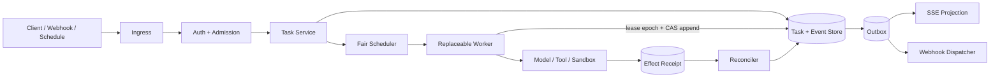
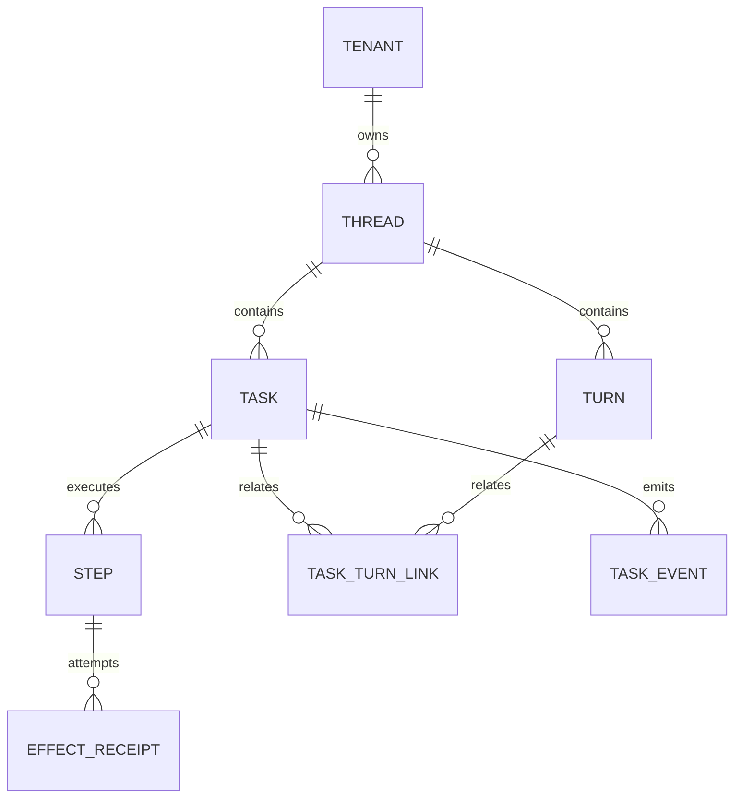

# 任务控制平面：请求、调度与耐久交付

> 这是**企业参考设计**，不是任何厂商产品的默认实现或 SLA。下文处理进程崩溃、客户端断线、重复请求、租约过期和回调失败。示例使用 TypeScript 和 PostgreSQL 风格 SQL；实现时要固定数据库、队列和一致性边界。

## 1. 控制平面真正控制什么

任务控制平面保存任务的耐久事实并决定“谁可在什么预算内推进哪一个任务”；Runtime Worker 负责推理和执行。两者不能只靠一个 `status` 字段松散连接。



控制平面至少承担：请求归一化、身份绑定、幂等、配额和预算预留、任务/事件持久化、公平调度、租约、取消、恢复、结果查询与耐久交付。它**不**把模型响应当业务任务状态，也不直接执行绕过策略的工具。

先记住三点：

- 客户端断开只终止订阅或同步等待，不隐式取消任务；取消必须是独立命令。
- Worker 是可替换的，不等于执行环境无状态；工作区、检查点和外部效果需要独立生命周期。
- 对任意外部副作用无法承诺 exactly-once；可实现的是持久意图、至少一次投递、接收方去重、状态查询和人工对账。

## 2. 统一 RequestEnvelope

所有 Chat、IDE、API、Git 事件和计划任务先转换为同一种信封。入口传入的 `tenantId`、`principal`、权限和策略名都只是声明，最终值必须由认证结果与服务端路由推导。

```ts
type RequestEnvelope = {
  requestId: string;                 // 平台生成，用于 trace
  source: "desktop" | "api" | "git" | "schedule" | "webhook";
  sourceEvent?: { provider: string; id: string; occurredAt: string };
  authContextRef: string;             // 不把 token 放入事件
  principal: {
    subject: string;                  // 已验证的人或服务身份
    onBehalfOf?: string;              // 受限委托，不是身份替换
    tenantId: string;                 // 服务端绑定
  };
  input: {
    kind: "message" | "task" | "resume";
    text: string;
    attachmentRefs: Array<{ uri: string; sha256: string }>;
    contextRefs: Array<{ uri: string; version?: string }>;
  };
  requestedMode: "sync_wait" | "async";
  callbackConfigId?: string;          // 只能引用预注册回调
  clientIdempotencyKey: string;
  clientMetadata?: Record<string, string>;
  receivedAt: string;
  schemaVersion: 1;
};
```

`authContextRef` 指向短期、受控的身份上下文；日志和队列不得复制原始 bearer token。附件引用必须固定摘要，防止准入检查后内容被替换。`sourceEvent.id` 用于上游事件防重放，但不能代替本 API 的幂等键。

### 2.1 幂等键必须绑定请求摘要

只按 `Idempotency-Key` 返回旧任务会产生严重错配：客户端错误复用同一个 key，却提交了不同目标或仓库。服务端应对**语义字段**做 canonicalize，再保存摘要；同 key 同摘要返回原任务，同 key 不同摘要返回 `409 IDEMPOTENCY_CONFLICT`。

```ts
import { createHash } from "node:crypto";

type CreateIntent = Pick<RequestEnvelope,
  "source" | "input" | "requestedMode" | "callbackConfigId"> & {
    tenantId: string;
    subject: string;
    releaseDigest: string;
  };

function requestDigest(x: CreateIntent): string {
  // 生产实现使用 RFC 8785/JCS 或等价、已测试的 canonical JSON；
  // 明确 Unicode、数字和缺省字段规则，不能依赖普通 JSON.stringify 的调用方键顺序。
  return createHash("sha256").update(canonicalJson(x)).digest("hex");
}

async function createOnce(env: RequestEnvelope, intent: CreateIntent) {
  const scope = `${intent.tenantId}:${intent.subject}`;
  const digest = requestDigest(intent);
  return db.transaction(async tx => {
    const old = await tx.idempotency.getForUpdate(scope, env.clientIdempotencyKey);
    if (old && old.requestDigest !== digest) throw conflict("IDEMPOTENCY_CONFLICT");
    if (old) return tx.tasks.get(old.taskId);

    const task = await createTaskAndReserveBudget(tx, intent);
    await tx.idempotency.insert({
      scope, key: env.clientIdempotencyKey, requestDigest: digest, taskId: task.id
    });
    await tx.outbox.insert(taskCreatedMessage(task));
    return task;
  });
}
```

不要把 `requestId`、接收时间、trace ID 或签名本身放入语义摘要；否则合法重试永远不同。摘要字段也不能遗漏 workspace commit、release/policy digest、附件摘要和 callback 配置，否则“同请求”的含义会漂移。canonical JSON 可参考 [RFC 8785](https://www.rfc-editor.org/rfc/rfc8785)。

## 3. Task、Thread、Turn、Step 的基数

`Task 1:1 Thread` 会限制持续对话运行多个任务，`Task 1:1 Turn` 也无法表达审批回复、补充信息和恢复。可按以下关系建模：

- **Thread**：一个持续会话边界，包含多个 Turn 和多个 Task。
- **Turn**：一次参与者输入到系统交还控制或进入后台的交互段。
- **Task**：可排队、计费、取消和恢复的耐久工作单元，属于一个 Thread。
- **Step**：Task 内可观测的编排推进；有确定输入、状态和重试语义。
- **TaskTurnLink**：显式记录某个 Turn 是发起、补充、审批还是交付，允许多对多。



```sql
CREATE TABLE task_turn_links (
  task_id uuid NOT NULL REFERENCES tasks(task_id),
  turn_id uuid NOT NULL REFERENCES turns(turn_id),
  role text NOT NULL CHECK (role IN
    ('initiated_by','clarification','approval','resume','delivery')),
  created_at timestamptz NOT NULL,
  PRIMARY KEY (task_id, turn_id, role)
);

CREATE TABLE steps (
  step_id uuid PRIMARY KEY,
  task_id uuid NOT NULL REFERENCES tasks(task_id),
  trigger_turn_id uuid REFERENCES turns(turn_id),
  plan_version integer NOT NULL,
  kind text NOT NULL,
  state text NOT NULL,
  input_digest text NOT NULL,
  attempt integer NOT NULL DEFAULT 0,
  UNIQUE (task_id, plan_version, step_id)
);
```

简单产品可以默认“一 Turn 发起一 Task”，但这是应用约定，不应写死为存储基数。模型调用与 Tool Call 是 Step 的子记录；不要把一次模型调用叫 Turn。

## 4. 准入是一次资源交易

准入同时检查身份、数据区、release/policy、风险、租户并发、模型容量和多维预算，并在**同一事务**中创建任务、预留预算和写入 outbox。

```ts
type BudgetVector = {
  wallMs: number;
  inputTokens: number;
  outputTokens: number;
  modelCostMicros: number;
  toolCalls: number;
  toolCostMicros: number;
  childAgentMs: number;
  egressBytes: number;
  artifactBytes: number;
};

type BudgetReservation = {
  work: BudgetVector;                 // 正常执行可消费
  finish: Pick<BudgetVector, "wallMs" | "toolCalls" | "artifactBytes">;
  // finish 只给 checkpoint、撤销凭据、终止进程、验证与最终交付使用
};
```

对每个维度满足：

```text
available = hard_limit - committed_usage - active_reservations
admit only if available >= requested_work + mandatory_finish_reserve
```

预留是带 TTL 的账本项，不是内存计数。Task 成功、拒绝或取消后结算实际用量并释放余量；Worker 崩溃时由 reservation sweeper 根据任务和 lease 状态回收，不能单看 TTL 删除仍在运行的预留。

```sql
BEGIN;
SELECT hard_limit, committed, reserved
FROM budget_accounts
WHERE tenant_id = :tenant AND dimension = :dim
FOR UPDATE;

-- 应用层逐维验证 hard_limit - committed - reserved >= :work + :finish
UPDATE budget_accounts
SET reserved = reserved + :work + :finish
WHERE tenant_id = :tenant AND dimension = :dim;

INSERT INTO budget_reservations
  (reservation_id, task_id, dimension, work_amount, finish_amount, expires_at, state)
VALUES (:rid, :task, :dim, :work, :finish, :expiry, 'active');
COMMIT;
```

### 4.1 运行中预算状态

阈值由 release/policy 版本化配置。下面是行为示例，百分比不能直接当作通用标准：

| 消耗比例（参考） | 控制动作 |
| --- | --- |
| 70% | 告警，刷新剩余工作估算 |
| 85% | 禁止非必要探索，降低并行度或切换已验证的低成本路由 |
| 95% | 强制收敛：只做验收、checkpoint、清理和交付 |
| 工作预算耗尽 | 在安全边界停止，使用 finish reserve 生成部分交付 |

达到 100% 才停止会耗尽保存检查点、撤销凭据和交付结果所需的资源。已开始的不可分割外部事务也不能在中间硬切断；每次授权效果前应确认该效果和恢复/清理所需预算仍可用。

## 5. Tenant-fair 调度

全局优先队列会被高流量租户或滥用 `priority=high` 的客户端占满。调度分三层：先按 cell/数据区/能力匹配；租户队列之间使用 Weighted Deficit Round Robin（WDRR）或近似公平排队；租户内部再按服务等级、截止时间和 aging 排序。

```ts
type TenantQueue = {
  tenantId: string;
  weight: number;
  deficit: number;
  peek(): { taskId: string; predictedCost: number; ageMs: number } | undefined;
  pop(): { taskId: string };
};

function pick(queues: TenantQueue[]): string | undefined {
  for (const q of roundRobin(queues)) {
    q.deficit += BASE_QUANTUM * bounded(q.weight, 1, 16);
    const job = q.peek();
    if (!job) continue;
    const charge = Math.max(MIN_CHARGE, job.predictedCost);
    if (charge <= q.deficit || job.ageMs > STARVATION_LIMIT_MS) {
      q.deficit -= charge;
      return q.pop().taskId;
    }
  }
}
```

`predictedCost` 可由环境类型、历史 Step、token 和工具成本估计，完成后用实际成本校准；不可让客户端直接声明为 0。交互任务和批任务可以使用独立容量池，但都要保留系统恢复/清理容量。监控每租户 queue delay、share、starvation age 与 prediction error，而不只看总吞吐。

## 6. Lease 之外必须有 fencing token

Lease 只表示“调度器当前认为谁应运行”。旧 Worker 可能经历长 GC 或网络分区，在 lease 过期后恢复并继续写。每次成功 claim 都递增单调 `lease_epoch`；所有状态推进都携带 epoch 并由存储拒绝旧值。

```sql
WITH candidate AS (
  SELECT task_id
  FROM tasks
  WHERE state IN ('QUEUED','RETRY_WAIT')
    AND ready_at <= now()
  ORDER BY scheduler_rank, created_at
  FOR UPDATE SKIP LOCKED
  LIMIT 1
)
UPDATE tasks t
SET state = 'PROVISIONING',
    lease_owner = :worker,
    lease_until = now() + interval '30 seconds',
    lease_epoch = lease_epoch + 1
FROM candidate c
WHERE t.task_id = c.task_id
RETURNING t.task_id, t.lease_epoch, t.head_seq;
```

```ts
async function appendWithFence(cmd: {
  taskId: string; workerId: string; leaseEpoch: bigint;
  expectedSeq: bigint; events: TaskEvent[];
}) {
  return db.transaction(async tx => {
    const task = await tx.oneForUpdate(cmd.taskId);
    if (task.leaseOwner !== cmd.workerId || task.leaseEpoch !== cmd.leaseEpoch)
      throw new StaleLeaseError();
    if (task.leaseUntil <= tx.databaseNow()) throw new LeaseExpiredError();
    if (task.headSeq !== cmd.expectedSeq) throw new SequenceConflictError();
    await tx.events.append(cmd.taskId, cmd.expectedSeq, cmd.events);
    await tx.tasks.advanceHead(cmd.taskId, task.headSeq + BigInt(cmd.events.length));
    await tx.outbox.enqueueFor(cmd.events);
  });
}
```

Heartbeat 只在 `(task_id, lease_owner, lease_epoch)` 全匹配时续期。使用数据库时间，避免各 Worker 墙钟漂移。Worker 收到 stale/expired 必须停止推进并丢弃本地推断，重新读取检查点。

对文件、数据库或部署系统的外部副作用，只有下游也检查 fencing token 才能阻止旧 Worker。若下游不支持 fence，则使用稳定 `effect_id`、请求摘要、幂等能力与回读对账；超时结果进入 `OUTCOME_UNKNOWN`，禁止盲重试。**Lease 不是幂等机制。**

## 7. 状态机与“结果未知”

生命周期、业务结果和副作用确定性应分别保存：

```ts
type Lifecycle =
  | "RECEIVED" | "VALIDATING" | "QUEUED" | "PROVISIONING" | "RUNNING"
  | "BLOCKED" | "RETRY_WAIT" | "OUTCOME_UNKNOWN" | "VERIFYING"
  | "DELIVERING" | "CANCELING"
  | "SUCCEEDED" | "SUCCEEDED_WITH_WARNING" | "FAILED" | "CANCELED" | "REJECTED";

type Outcome = "none" | "partial" | "achieved" | "not_achieved";
type EffectCertainty = "confirmed" | "unknown";
```



```mermaid
stateDiagram-v2
  [*] --> RECEIVED
  RECEIVED --> VALIDATING
  VALIDATING --> REJECTED: invalid / unauthorized
  VALIDATING --> QUEUED: admitted + reserved
  QUEUED --> PROVISIONING: lease claimed
  PROVISIONING --> RUNNING: environment ready
  PROVISIONING --> RETRY_WAIT: transient failure
  RUNNING --> BLOCKED: information / approval required
  BLOCKED --> QUEUED: input or approval supplied
  RUNNING --> RETRY_WAIT: known retryable failure
  RETRY_WAIT --> QUEUED: ready_at reached
  RUNNING --> OUTCOME_UNKNOWN: effect acknowledgement lost
  OUTCOME_UNKNOWN --> RUNNING: reconciled not applied
  OUTCOME_UNKNOWN --> VERIFYING: reconciled applied
  OUTCOME_UNKNOWN --> BLOCKED: cannot determine safely
  RUNNING --> VERIFYING: candidate complete
  VERIFYING --> RUNNING: repairable failure + budget
  VERIFYING --> DELIVERING: criteria satisfied / partial sealed
  DELIVERING --> SUCCEEDED
  DELIVERING --> SUCCEEDED_WITH_WARNING: primary result durable, callback exhausted
  QUEUED --> CANCELED
  BLOCKED --> CANCELED
  RUNNING --> CANCELING
  OUTCOME_UNKNOWN --> CANCELING
  CANCELING --> CANCELED: local execution stopped; certainty recorded
```

`BLOCKED` 表示等待用户补充信息、批准或策略解除，之后可重新排队。`OUTCOME_UNKNOWN` 表示需要查询外部系统、验证真实资源或人工裁决。取消后仍可能存在 `effectCertainty=unknown`；“本地进程已停”不能证明远端请求未生效。

取消分三层：soft 在下一个安全点停止并 checkpoint；hard 终止模型流、工具进程和子代理；emergency 额外撤销凭据、关闭 egress 并隔离环境。每层都应追加事件并设置 deadline；超过 deadline 不能伪报 `CANCELED` 已无外部效果。

## 8. Task API：同步只是等待方式

```http
POST   /v1/tasks                         # 202 + Task resource
GET    /v1/tasks/{task_id}               # durable projection + ETag
GET    /v1/tasks/{task_id}/events         # after_seq / SSE
POST   /v1/tasks/{task_id}:cancel         # command，带 expected version
POST   /v1/tasks/{task_id}:resume         # 补充信息/审批后恢复
GET    /v1/tasks/{task_id}/delivery       # 最终或部分 DeliveryBundle
```

`POST /tasks` 要求 `Idempotency-Key`；冲突返回 409，准入拒绝使用稳定错误码并说明哪一维受限。`mode=sync_wait` 只让 Gateway 在一个上限内等待同一个 durable Task：超时返回 `202 + taskId`，不创建第二个任务，也不取消原任务。

取消和恢复都通过命令完成，客户端不能直接更新状态。命令带 `If-Match`/`expectedVersion` 防止旧 UI 覆盖新状态；重复相同命令返回原 command 结果。API 返回的 `state` 是事件投影，任务事件与 effect receipt 才是依据。

## 9. SSE 的断点续传协议

SSE 的 `id` 应是任务作用域内的耐久游标，例如 `taskId:seq`，不要使用随机 event UUID。服务端先建立实时订阅并记下 watermark，再回放 `(afterSeq, watermark]`，然后消费 `> watermark` 的实时事件，避免查历史和建立订阅之间丢消息。

```http
GET /v1/tasks/tsk_7/events
Accept: text/event-stream
Last-Event-ID: tsk_7:184

id: tsk_7:185
event: task.step.completed
data: {"schemaVersion":1,"stepId":"stp_9","artifactRef":"art_3"}
```

```ts
async function* subscribe(taskId: string, afterSeq: bigint) {
  const live = eventBus.subscribe(taskId);       // 先订阅
  const watermark = await events.headSeq(taskId);
  for await (const event of events.range(taskId, afterSeq, watermark)) yield event;
  for await (const event of live) {
    if (event.seq > watermark) yield event;       // 重复可由 seq 去掉
  }
}
```

客户端按 seq 做幂等投影：重复忽略，出现 gap 立即重拉，不能按时间戳排序。控制事件、状态跃迁和最终结果必须持久化；高频 token delta 可合并或仅短期保存，但恢复承诺要写进 API。

### 9.1 Retention 与 compaction

服务端公开 `minAvailableSeq`、`headSeq` 和 retention policy version。若游标早于可用窗口，返回 `410 EVENTS_COMPACTED`，携带受权限保护的 snapshot/delivery 引用及其 `throughSeq`；客户端载入快照后从 `throughSeq + 1` 继续。压缩不能改变最终投影，也不能删除仍被审计、审批或对账引用的事件。

SSE heartbeat 只判断连接健康；它不续 Worker lease。反向代理 idle timeout、单客户端缓冲上限、最大重连速率和 `Retry-After` 都应纳入契约。

## 10. Webhook：预注册、签名、收件箱

允许请求体直接提供任意 callback URL 会把控制平面变成 SSRF 代理。租户管理员应预注册 `callbackConfigId`，平台在注册时校验 HTTPS、域名所有权/allowlist、解析后的公网地址、端口和重定向策略；投递仍经受控 egress，并防 DNS rebinding 与跳转到私网。

```ts
type DeliveryEnvelope = {
  deliveryId: string;                 // 每次逻辑交付稳定
  eventId: string;                    // 业务事件稳定
  taskId: string;
  tenantId: string;
  type: "task.succeeded" | "task.failed" | "task.blocked" | "task.canceled";
  attempt: number;
  occurredAt: string;
  schemaVersion: 1;
  dataRef: string;                    // 大结果用受控引用
};

function signature(secret: Buffer, timestamp: string, rawBody: Buffer) {
  return hmacSha256(secret, Buffer.concat([
    Buffer.from(timestamp + ".", "utf8"), rawBody
  ]));
}
```

签名覆盖时间戳和**原始字节**；接收方先检查时间窗口，再恒定时间比较签名，最后以 `(endpoint, deliveryId)` 去重。若同 delivery ID 的 payload digest 不同，必须告警而非覆盖。

Dispatcher 从 outbox 至少一次投递，使用指数退避、抖动和最大尝试次数；只有明确的 2xx 才标记 delivered。4xx 是否重试按错误分类，429/5xx/超时通常可重试。尝试耗尽进入 DLQ；人工 replay 保持原 `deliveryId` 并新增 `replayId`，不能伪装成新业务事件。

```sql
CREATE TABLE webhook_inbox (
  endpoint_id text NOT NULL,
  delivery_id text NOT NULL,
  payload_digest text NOT NULL,
  received_at timestamptz NOT NULL,
  processed_at timestamptz,
  result_digest text,
  PRIMARY KEY (endpoint_id, delivery_id)
);
```

Webhook 交付失败不应把已验证、已持久化的业务结果改成 `FAILED`。它影响 delivery 状态，最终可表现为 `SUCCEEDED_WITH_WARNING`。同理，收到 webhook 只代表事件通知；消费者仍应按 `taskId` 查询受权结果。

## 11. Outbox、Inbox 与 reconcile

需要原子提交的是“任务事实 + 待发送意图”，不是数据库和网络：

```ts
await db.transaction(async tx => {
  const event = await tx.taskEvents.appendCAS({ taskId, expectedSeq, payload });
  await tx.tasks.project(event);
  await tx.outbox.putIfAbsent({
    messageId: `task-event:${event.eventId}`,
    orderingKey: taskId,
    payloadDigest: sha256(event),
    payload: event
  });
});
// commit 后 dispatcher 才能调用 broker/webhook
```

接收方 Inbox 保证同一 `messageId + digest` 只处理一次；同 ID 异 digest 进入 poison queue。它防止消费者重复应用消息，却不能神奇地让第三方副作用 exactly-once。

外部效果使用三态回执：`confirmed_succeeded`、`confirmed_failed`、`unknown`。网络超时、worker crash 或响应丢失时先写 `unknown`，reconciler 按以下顺序处理：

1. 用稳定 effect/idempotency key 查询下游；
2. 若资源可读回，以目标资源版本、内容摘要和 actor 证明是否生效；
3. 只有下游明确保证同 key 同效果时才安全重试；
4. 仍无法判断则转 `OUTCOME_UNKNOWN/BLOCKED`，输出人工裁决所需证据。

不要把“没收到成功响应”写成 confirmed failed；这正是重复发邮件、重复扣款和重复发布的来源。

## 12. 关键事务边界

| 路径 | 必须原子提交 | 不能放进同一事务 |
| --- | --- | --- |
| 创建任务 | 幂等记录、Task、初始事件、预算预留、outbox | 队列网络发布 |
| Worker 推进 | fence 校验、head CAS、事件、projection、outbox | 模型/工具调用 |
| 工具准备 | effect intent、args digest、稳定 effect key | 真正外部效果 |
| 最终完成 | Verification/Delivery 引用、终态事件、清理意图 | webhook HTTP |
| 预算结算 | usage ledger、释放 reservation、对账事件 | provider 账单抓取 |

若多个表不在同一数据库，使用单一 authoritative write + outbox/reconciler，不要用无事务双写制造“看似成功”。事件 schema、projection 版本和幂等记录的 TTL 必须兼容客户端最大重试窗口与审计保留期。

## 13. 失败模式与设计响应

| 故障 | 错误做法 | 生产语义 |
| --- | --- | --- |
| 客户端 POST 超时后重试 | 创建两个 Task | key + canonical digest 返回同一 Task；异内容 409 |
| Worker lease 过期后复活 | 继续追加事件 | epoch fence + head CAS 拒绝；外部效果另行对账 |
| 高权重租户持续灌入 | 全局 priority queue | tenant queue + WDRR + aging + 每租户上限 |
| 预算耗尽 | 直接 kill，结果与凭据未清理 | 预留 finish budget，在安全点 checkpoint/cleanup/partial delivery |
| 审批等待数小时 | Worker 持有 lease 和容器 | checkpoint 后 park；释放计算 lease，保留耐久阻塞态 |
| 外部写超时 | 标 failed 后自动重试 | receipt unknown，查询/回读/人工裁决 |
| SSE 重连漏事件 | 只订阅当前 pub/sub | durable seq + watermark 回放 + gap 检测 |
| 旧游标已压缩 | 静默从最新开始 | 410 + snapshot throughSeq + retention 元数据 |
| Webhook URL 来自请求体 | 任意地址投递 | 预注册 target + egress 防护 + 禁止私网跳转 |
| Webhook 连续失败 | 把业务 Task 改失败 | 独立 delivery 状态、DLQ、replay、warning |
| cancel 已返回 | 宣称外部写一定没发生 | 记录 effect certainty；未知时明确披露 |

## 14. 测试矩阵

| 测试类型 | 注入与断言 |
| --- | --- |
| 幂等 property test | 同 key 同 canonical body 任意重试只得一个 task；任一语义字段变化均 409 |
| 并发准入 | 100 个请求争最后一个预算槽，只允许满足账本约束的请求提交 |
| 调度公平 | noisy tenant 持续饱和时，其他租户等待时间仍低于约定 starvation bound |
| Lease/fence | 暂停 W1 至过期，W2 claim 后恢复 W1；W1 的 append 和 fenced write 必须失败 |
| Crash matrix | 在 task/event/outbox commit 前后逐点 kill，恢复后无丢事实，允许重复投递但无重复投影 |
| 未知效果 | 下游写成功但响应丢失；不得自动二次写，reconcile 后收敛或阻塞 |
| 取消传播 | soft/hard/emergency 分别验证模型、工具、子代理、凭据和环境状态 |
| SSE race | 在历史查询与 live subscribe 边界插入事件；最终 seq 连续且投影一致 |
| Compaction | 过期游标收到 410；加载快照后得到与完整重放相同 projection |
| Webhook | 重复、乱序、超时、429、5xx、签名篡改、时间重放、DNS rebinding、DLQ replay |
| 容量故障 | queue/broker/DB 单点抖动时有背压，不绕过 admission/policy |
| 账单对账 | 预留、内部 usage、供应商账单和释放量满足守恒关系 |

必须在测试里验证不变量，而非只验证 HTTP 200：每 Task seq 严格递增；单一 epoch 可推进；预算账本不为负；终态不可被普通命令复活；每个外部效果都有 receipt；已验证业务结果不因回调失败丢失。

## 15. 练习：实现最小 Task Service

1. 用 PostgreSQL 实现 `POST /tasks`：canonical digest、幂等冲突、预算预留、初始事件和 outbox 同事务。
2. 实现两租户 WDRR 调度器，构造 100:1 流量并画出每租户 queue-delay 分布。
3. 实现 `claim/heartbeat/append`，故意冻结旧 Worker，证明新 epoch 后旧 Worker 无法推进。
4. 实现从历史事件切到实时订阅的 SSE，并加入 compaction snapshot 与 `410` 恢复路径。
5. 实现签名 webhook、接收方 Inbox、DLQ/replay；远端成功而响应丢失时进入 reconcile。
6. 给系统增加 `OUTCOME_UNKNOWN` 运维页面：展示请求摘要、effect key、外部引用、最后一次网络证据和允许的人工裁决动作。

完成标准：随机 kill 测试 1,000 次后任务投影可由事件重建；不会观察到重复的非幂等测试效果；取消与回调失败均能诚实表达确定性；一个租户饱和不使另一个租户永久饥饿。

## 16. 关联知识

- [控制面与数据面](control-data-plane.md)：ReleaseBundle、cell 与策略传播。
- [可靠性与成本](reliability-cost.md)：重试、背压、预算和成本归因。
- [多租户与治理](multitenancy-governance.md)：身份委托、隔离与审计。
- [SQLite 持久化内核](../03-runtime/persistence-sqlite.md)：CAS event append、outbox/inbox 与未知副作用。
- [Streaming、取消与恢复](../03-runtime/streaming-recovery.md)：流事件、背压、checkpoint 与断线语义。
- [Workflow Engine](../03-runtime/workflow-engine.md)：跨天等待、durable timer 与 Activity 边界。
- [工具系统](../03-runtime/tool-system.md)：效果身份、授权、receipt 与幂等冲突。
- [SDK 事件契约](../04-sdk/contracts-events.md)：跨端 event schema 与兼容演进。
- [RFC 9110：HTTP Semantics](https://www.rfc-editor.org/rfc/rfc9110) 与 [RFC 8785：JSON Canonicalization Scheme](https://www.rfc-editor.org/rfc/rfc8785)。

## 17. 设计评审清单

- [ ] 入口身份、tenant、policy 与 callback 目标来自可信服务端绑定，而非模型或请求自报。
- [ ] 幂等 key 按 tenant/principal scope 存储，并绑定完整 canonical request digest。
- [ ] Thread 可包含多个 Task/Turn；Task/Turn 关联不被错误写死为 1:1。
- [ ] 准入同时预留 work 与 finish budget；释放与 usage 可对账。
- [ ] 调度有 tenant fairness、aging、容量池与 starvation 指标。
- [ ] 每次 claim 递增 fencing token；heartbeat/append/cleanup 都检查相同 epoch。
- [ ] `BLOCKED`、`OUTCOME_UNKNOWN` 可恢复；取消与外部效果确定性分开表达。
- [ ] Task API 的同步等待超时不会取消任务或创建替代 Task。
- [ ] SSE 使用耐久 seq、watermark、gap 检测和明确 compaction 恢复协议。
- [ ] Webhook 目标预注册，签名覆盖原始 body，收件方 inbox 按 ID + digest 防冲突。
- [ ] Task/Event/Outbox 等关键写在一个事务；网络调用永不放入数据库事务。
- [ ] 任意外部副作用没有被宣传为 exactly-once；unknown 有可执行 reconcile/runbook。
- [ ] 随机崩溃、旧 Worker 复活、慢消费者、预算耗尽和 DNS/重定向攻击已纳入测试。
