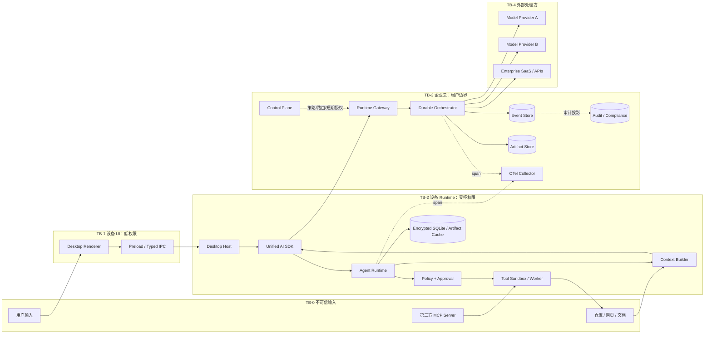
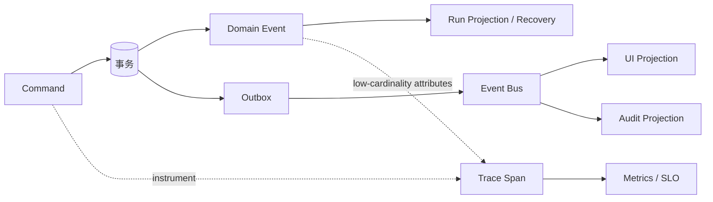
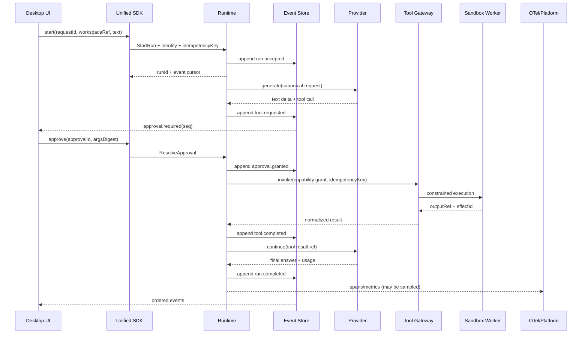

# 端到端参考架构：从桌面交互到可治理 Agent 平台

> 目标：给出一套可以拿去做架构评审的厂商无关基线。它不是唯一正确答案，但每条边界、数据流、状态归属和失败语义都必须说得清楚。

## 1. 先定义系统承诺

参考场景是“企业代码工作助手”：用户在 Windows/macOS 客户端发起仓库分析，Agent 读取本地文件、调用模型、提出补丁，经过审批后写入文件并运行测试。系统承诺：

- 客户端崩溃或断网后，可从最后一个已提交事件恢复；
- 模型、Codex SDK、Claude Agent SDK 都是可替换的执行后端，不进入产品领域模型；
- 高风险 Tool 必须经过策略判定和明确授权，授权与确切参数绑定；
- 任何副作用采用“至少一次调度 + 幂等效果/查询确认/补偿”，不宣称通用 exactly-once；
- UI、审计、恢复、Trace 消费同一因果链，但事件日志与遥测数据不是同一个存储；
- 租户策略、凭据、模型路由位于控制平面；本地文件和进程能力尽量停留在设备执行平面。

### 1.1 核心 SLO 示例

| 指标 | 目标 | 测量边界 |
| --- | --- | --- |
| 接受请求延迟 | p95 < 300 ms | `startRun` 到 `run.accepted` 已持久化 |
| 首个可见增量 | p95 < 2.5 s | accepted 到客户端收到首个 text/status delta |
| 可恢复率 | > 99.9% | 故障注入后无重复不可逆副作用且能到达终态 |
| 工具授权正确率 | 100% | 未授权参数不得执行；安全不设误差预算 |
| 事件完整率 | 100% | 单 Run 的终态、工具开始/完成和审批事实无缺口 |
| 成本归属率 | > 99% | 可计费调用关联 tenant/run/provider/pricingVersion |

SLO 是架构输入。若业务接受“重开任务”，可以省掉持久 Workflow；若要求跨天审批后继续，就必须有持久状态、版本化定义和租约。

## 2. 总体分层、信任边界与数据流



### 2.1 信任边界不是网络边界

| 边界 | 跨越的数据 | 必须执行的控制 | 禁止假设 |
| --- | --- | --- | --- |
| TB-0 → TB-1/2 | prompt、文件、Tool 输出 | 长度/类型校验，来源标签，提示注入视为数据 | “本地文件就是可信的” |
| Renderer → Host | IPC command | allowlist、schema、调用方窗口身份、速率限制 | `contextIsolation` 等于业务授权 |
| Host → Sandbox | Tool call、capability grant | 资源范围、只读/写、网络 egress、CPU/内存/时限 | 子进程天然隔离 |
| Device → Cloud | context、事件、artifact | mTLS/TLS、设备身份、租户绑定、数据分类/脱敏 | 登录用户可访问整个租户 |
| Cloud → Provider | prompt、tool schema、文件 | 路由政策、DLP、地区、保留策略、短期凭据 | Provider 失败表示“没有执行” |
| Runtime → Telemetry | span、metric、log | 默认不记录正文/secret，高基数限制，采样 | 可观测平台适合作为审计真相 |

## 3. 每层职责与禁止泄漏

### 3.1 Desktop：交互与设备能力代理

Renderer 只负责视图状态：输入、事件投影、审批 UI、连接状态。主进程持有设备身份、Runtime 生命周期和窗口到 session 的绑定。文件读写、shell、凭据访问在受限 worker 中执行。

```ts
// preload 暴露固定命令，不暴露 ipcRenderer.send(channel, any)
type DesktopAPI = {
  startRun(input: { workspaceId: string; text: string; requestId: string }):
    Promise<{ runId: string }>;
  approve(input: { runId: string; approvalId: string; decision: "allow" | "deny" }):
    Promise<void>;
  subscribe(runId: string, afterSeq: number,
    onEvent: (event: PublicRunEvent) => void): () => void;
};
```

**边界规则**：UI 传入的 `workspaceId` 只是引用，Host 必须把它解析为预先授权的规范路径；不得接受 renderer 提供的任意绝对路径。

### 3.2 Unified SDK：稳定产品合约

统一 SDK 对上暴露 Run/Thread/Approval/Artifact，对下适配本地 Runtime、云 Gateway、Codex/Claude 等实现。它不负责业务策略，也不把供应商 event 原样抛给 UI。

```ts
export interface AgentClient {
  start(request: StartRunRequest, options?: CallOptions): Promise<RunHandle>;
  resume(runId: string, options?: CallOptions): Promise<RunHandle>;
  cancel(runId: string, reason?: string): Promise<void>;
  resolveApproval(input: ResolveApprovalRequest): Promise<void>;
  events(runId: string, cursor?: EventCursor): AsyncIterable<PublicRunEvent>;
}

export interface RunHandle {
  taskId: string;
  runId: string;
  acceptedAt: string;
  idempotencyKey: string;
}
```

SDK 处理：协议协商、重连 cursor、超时/取消传播、稳定错误码、客户端 telemetry。SDK 不处理：模型选择策略、审批放行、租户配额最终判定。

### 3.3 Runtime：状态机与可靠执行

Runtime 是决策中心，但不是所有 I/O 的执行者。推荐拆成：

- **Task/Attempt Coordinator**：加载事件/快照、获取 lease + fencing token、驱动 reducer；
- **TaskSpec / Planner**：把目标编译为范围、验收和版本化 Plan DAG；
- **Agent Loop**：根据模型输出形成下一条 command；
- **Workflow**：跨等待、跨进程的确定性步骤；
- **Context Builder**：预算、检索、压缩、来源与敏感度；
- **Tool Gateway**：注册、schema、风险评估、授权、幂等、sandbox；
- **Environment Broker**：不可变环境指纹、工作卷、短期身份、隔离与清理证明；
- **Capability Resolver**：固定 Tool/Skill/Agent Release digest、来源、撤销和本次最小视图；
- **Provider Router**：能力/合规/成本/健康度选择，不由 prompt 随意指定；
- **Event Committer**：乐观并发追加、outbox、snapshot；
- **Artifact Service**：大对象内容寻址、加密、生命周期。
- **Verifier / Delivery**：按 AcceptanceCriteria 产出 Evidence、Claim Map 与 DeliveryBundle。

核心循环坚持“先记录意图，再做副作用，再记录结果”：

```ts
async function execute(command: ToolCommand, deps: Deps): Promise<void> {
  await deps.events.append(command.runId, command.expectedSeq, command.fencingToken, [{
    type: "tool.execution.requested",
    commandId: command.commandId,
    callId: command.callId,
    argumentsDigest: command.argumentsDigest
  }]);

  const prior = await deps.effects.findByKeyAndDigest(
    command.idempotencyKey, command.argumentsDigest
  );
  const result = prior?.confirmed
    ? prior.receipt
    : await deps.tools.invokeOrReconcile(command);

  if (result.certainty === "unknown") {
    await deps.events.appendFromLatestFenced(command.runId, command.fencingToken, [{
      type: "tool.execution.outcome_unknown",
      callId: command.callId,
      effectId: result.effectId
    }]);
    return;
  }

  await deps.events.appendFromLatestFenced(command.runId, command.fencingToken, [{
    type: "tool.execution.completed",
    callId: command.callId,
    effectId: result.effectId,
    outputRef: result.outputRef
  }]);
}
```

第一条事件与实际调用之间崩溃时，恢复器会看到 requested 无 completed，先按幂等键查询；调用完成但第二条事件前崩溃时，只有下游原生幂等或可查询时才能安全复用结果。既不幂等又不可查询时必须进入 `outcome_unknown`，不能从本地缺失 completed 事件推导“尚未发生”。相同 key 若对应不同参数摘要必须冲突，而不是复用。

### 3.4 Provider 与 Tool：不同的不可靠边界

Model Provider 主要产生“建议/内容”，Tool 可能制造真实副作用，二者不能共享一套粗糙重试策略。

| 维度 | Provider 调用 | Tool 调用 |
| --- | --- | --- |
| timeout 后含义 | 可能已计费/生成但未收到 | 可能已提交真实副作用 |
| 自动重试 | 仅在请求幂等、预算允许时 | 仅幂等或可查询确认时 |
| 输出信任 | 不可信生成内容 | 不可信外部数据；结果事实需验证 |
| 版本固定 | model + params + adapter | tool schema + implementation + policy |
| 审批 | 通常按数据/成本策略 | 按资源、动作、参数、风险 |

Provider adapter 统一为“能力”而非最低公分母：

```ts
type Capability =
  | "text.stream" | "tool.parallel" | "structured.strict"
  | "reasoning.encrypted" | "context.compaction";

interface ModelAdapter {
  capabilities(): ReadonlySet<Capability>;
  generate(request: CanonicalModelRequest): AsyncIterable<ModelEvent>;
  normalizeError(error: unknown): RuntimeError;
}
```

调用方声明 required/preferred capability。required 不满足就快速失败；preferred 可降级且发布 `run.degraded` 事件，不能静默改变语义。

### 3.5 Event、Trace 与 Platform：三种不同真相

- **Domain Event**：业务事实，要求有序、可恢复、受保留政策约束，如 `approval.granted`；
- **Trace Span**：一次操作的诊断视图，可采样、可丢失，如 `provider.generate`；
- **Audit Record**：谁在何时以何种权限做了什么的合规投影，防篡改、最小披露；
- **Metric**：聚合趋势，不用于恢复单次 Run。



不要“从 Trace 恢复 Run”：采样、脱敏和后端保留都会破坏完整性。也不要把完整 prompt 塞入 span attribute；用受访问控制的 `inputRef + digest`。

## 4. 一次端到端运行的数据流

### 4.1 正常路径



### 4.2 每一步的数据最小化

| 流 | 可以携带 | 默认不携带 |
| --- | --- | --- |
| UI → SDK | workspace 引用、用户文本、requestId | API key、真实根路径、租户策略 |
| Runtime → Provider | 预算后的 context、必要 tool schema | 无关文件、长期凭据、内部 RBAC |
| Runtime → Event Store | digest、结构化事实、artifact ref | token delta 全量、secret、原始 header |
| Runtime → OTel | ID、时延、状态、token/成本计数 | prompt/tool output 正文 |
| Tool → Sandbox | 短期 capability、规范参数 | 用户主凭据、租户管理员 token |

### 4.3 断线、崩溃与重放路径

1. SDK 保存最后已应用的 `seq`，重连发送 `afterSeq`。
2. Runtime 不依赖 worker 内存，使用 `runId` 获取 lease。
3. 从最新兼容快照加载，再按 seq 重放事件。
4. 对悬空 command 查询 effect ledger；可确认则补 completed，不可确认且非幂等则进入人工处置。
5. UI reducer 去重 `eventId`，发现 seq gap 就停止应用并补拉。
6. 恢复本身产生 `run.recovery.started/completed`，但不得改写历史事件。

## 5. 数据模型与不变量

```ts
type RunEvent<P = unknown> = {
  schemaVersion: 1;
  eventId: string;
  tenantId: string;
  runId: string;
  seq: number;
  type: string;
  occurredAt: string;
  causationId?: string;
  correlationId: string;
  producer: { name: string; version: string };
  dataClass: "public" | "internal" | "confidential" | "restricted";
  payload: P;
};
```

必须由数据库约束和 reducer 双重保证：

- `(tenant_id, run_id, seq)` 唯一且连续；
- Task 的 phase/outcome 分开表达；`BLOCKED` 可恢复、`CANCELING` 未确认、未知外部效果不伪装成失败；
- 一个 Attempt 对应唯一终态；
- terminal 后拒绝业务事件，迟到响应写诊断流；
- approval 的 `argumentsDigest/toolVersion/resourceGrant` 与执行时完全一致；
- `idempotencyKey` 在租户 + 操作范围内唯一，并绑定 canonical request/args digest；
- artifact ref 指向不可变内容；修改产生新 digest；
- 所有外部调用都有 deadline，所有内部队列都有界；
- workflow definition/version 和 adapter version 随 Run 固化。

## 6. 控制平面与数据平面

控制平面发布版本化快照，数据平面在一次 Run 内固定快照，不应每一步读取可变配置：

```ts
type ExecutionPolicySnapshot = {
  policyVersion: string;
  tenantId: string;
  allowedProviders: string[];
  allowedRegions: string[];
  toolRulesDigest: string;
  maxCost: { amount: string; currency: string };
  retentionClass: string;
  issuedAt: string;
  expiresAt: string;
  signature: string;
};
```

紧急 kill switch 是例外：可在执行前二次检查，并发布 `policy.execution.revoked`。普通配置更新只影响新 Run，避免同一 Run 前后语义漂移。

## 7. 部署拓扑选择

| 拓扑 | 编排位置 | 适用 | 主要代价 |
| --- | --- | --- | --- |
| Local-first | 设备 | 强隐私、离线、本地仓库 | 关机中断、升级碎片化、设备资源不稳 |
| Cloud-first | 云 | 长任务、统一治理、弹性 | 本地资源需代理，数据出域与延迟 |
| Hybrid（推荐基线） | 云持久 Workflow + 本地 Activity | 企业代码/桌面助手 | 双平面协议、租约、离线协调更复杂 |

Hybrid 中本地 Tool Activity 必须有 durable handle。云端发出 activity task 后，本地 agent 以 claim token 领取；结果按 `taskId + attempt + fencingToken` 提交，并由接收端拒绝旧 token。设备离线时 Workflow 进入 `waiting_device`，不循环重试烧资源。

## 8. 容量、成本与背压

先用工作负载模型而不是拍脑袋选组件：

```text
并发 Run ≈ 峰值每秒新 Run × 平均活跃秒数
Provider 并发 ≈ 并发 Run × 每 Run 同时模型调用数
事件写入/s ≈ 并发 Run × 每 Run 每秒“需持久化”事件数
日 artifact ≈ 日 Run × 每 Run 平均 artifact 字节 × 保留系数
```

示例：10 RPS、平均活跃 45 秒约 450 个活跃 Run。若 token delta 20 次/秒且全部持久化，会达到 9,000 writes/s；把 delta 合并为每 250 ms 一批并以 completed 快照收口，写放大显著降低。关键事件不可因背压丢弃；可合并的只有展示增量。

背压顺序：

1. 限制租户/用户并发；
2. 有界队列，返回 `RESOURCE_EXHAUSTED + retryAfter`；
3. Provider 调用用 semaphore 和 deadline；
4. 慢客户端断开后按 cursor 补拉，而非无限 buffer；
5. 遥测过载先采样 span，绝不丢 domain event。

## 9. 安全威胁到架构控制的映射

| 威胁 | 攻击路径 | 控制 | 验证方式 |
| --- | --- | --- | --- |
| Prompt injection | repo/MCP 文本诱导调用危险 Tool | 来源分区、Tool policy、参数级批准 | 恶意语料红队，确认无越权 |
| 参数替换 | 审批后模型修改路径/命令 | canonical JSON digest 绑定批准 | property test 随机变异参数 |
| 路径逃逸 | symlink/`..` 越出工作区 | realpath、打开后校验、目录句柄能力 | TOCTOU/symlink 测试 |
| 凭据外泄 | Tool/Provider/trace 收到 secret | brokered credential、DLP、默认不记正文 | canary secret 扫描 |
| 租户串线 | cache/event key 缺 tenant | 全键 tenant 前缀、DB RLS、授权重验 | 双租户并发隔离测试 |
| 重放攻击 | 重用 grant 或 approval | run/call/digest/expiry/nonce 绑定 | 过期与跨 Run 重放测试 |
| 供应链 | 恶意插件/SDK 更新 | 签名、SBOM、锁定版本、渐进发布 | provenance 与回滚演练 |

## 10. 架构验证：不要只画图

### 10.1 必做的架构适配测试

- Provider A/B 互换：领域事件和 UI reducer 不变；
- local/cloud transport 互换：幂等与 cursor 语义不变；
- worker 在副作用前、后各崩溃一次：支持幂等/查询的效果收敛；无法确认的效果明确进入 unknown，不静默重复；
- approval 后篡改一个参数：执行必须被拒绝；
- 旧客户端遇到新事件类型：安全忽略并保持 seq；
- Event Store 短暂不可用：不得先做未记录副作用；
- OTel Collector 完全不可用：执行可继续，遥测有本地限额；
- 控制平面中断：已有 Run 使用固定快照，新 Run 按政策降级/拒绝。

### 10.2 评审所需证据

```yaml
architecture_evidence:
  contracts:
    - event-schema-v1.json
    - tool-capability-v1.json
  tests:
    - replay-property-test
    - duplicate-effect-chaos-test
    - tenant-isolation-test
  operations:
    - slo-dashboard
    - provider-outage-runbook
    - key-rotation-runbook
  security:
    - threat-model
    - data-flow-inventory
    - sandbox-escape-assessment
  evolution:
    - compatibility-matrix
    - rollback-plan
```

## 11. 常见错误架构

- **“Electron 主进程就是 Runtime”**：导致生命周期、测试、Web/IDE 复用和权限边界绑死。Host 应组合 Runtime，而不是成为领域层。
- **“统一 SDK 等于转发各家 SDK”**：调用方仍被供应商事件/错误/会话 ID 绑定。应统一产品语义并保留可选 provider metadata。
- **“Kafka 里有事件，所以有 Event Sourcing”**：若消息不可按 Run 完整重放、没有并发约束和 schema 演进，它只是传输日志。
- **“上了容器就是沙箱”**：容器还需用户/namespace/seccomp、只读根、资源限制、网络策略、secret broker。
- **“审批一次，后续都允许”**：授权必须有资源范围、参数摘要、到期时间和撤销。
- **“失败就重试三次”**：重试必须由错误分类、幂等性、deadline、预算共同决定。

## 12. 关联知识与验收

建议先回看 [Runtime 总览](../03-runtime/overview.md)、[执行契约与验证](../03-runtime/execution-contract-verification.md)、[任务控制平面](../06-platform/task-control-plane.md)、[执行环境生命周期](../06-platform/execution-environment-lifecycle.md)、[能力供应链](../06-platform/capability-supply-chain.md)、[合约与事件](../04-sdk/contracts-events.md) 和 [安全威胁模型](../06-platform/security-threat-model.md)，再用 [架构 Katas](architecture-katas.md) 做压力测试。

**章节验收**：

- [ ] 能在图上指出至少五条信任边界，并说明跨边界数据和控制。
- [ ] 能从一次点击追到 SDK、Runtime、Provider/Tool、Event、Trace、审计平台。
- [ ] 能解释 domain event、trace、audit record 为什么不能混为一谈。
- [ ] 能给出副作用前后崩溃的恢复算法，而不是笼统说“重试”。
- [ ] 能说明 Hybrid 模式下云 Workflow 与本地 Activity 的断线语义。
- [ ] 能用容量公式估算并识别 token delta 的写放大。
- [ ] 能拿出契约测试、故障注入、SLO、runbook，而不仅是组件图。

## 一手资料

- [OpenAI Codex SDK](https://learn.chatgpt.com/docs/codex-sdk)（thread、resume、sandbox；核验 2026-08-30）
- [Model Context Protocol Specification](https://modelcontextprotocol.io/specification/latest)（协议与信任原则）
- [W3C Trace Context](https://www.w3.org/TR/trace-context/)（跨进程 trace 传播）
- [OpenTelemetry Specification](https://opentelemetry.io/docs/specs/otel/)（Trace/Metric/Log 语义）
