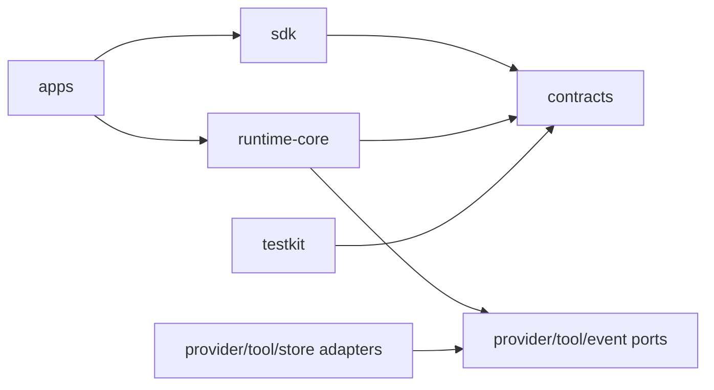

# 参考项目：构建一个可恢复的 Runtime Kernel

> 用一个预计 2～4 周完成的 TypeScript monorepo，验证“SDK → 状态机 → Provider → 幂等 Tool → 事件/恢复 → Trace”这条链。重点是执行语义，不是 UI 或框架数量。

## 1. 可运行起点与最终演示

最小纵切实现位于 [labs/runtime-kernel/README.md](../../labs/runtime-kernel/README.md)。先运行它观察事件序列，再把内核扩展为 monorepo。该 lab 使用内存状态演示 reducer、幂等键和故障分支；“重启”只表示在同一测试进程内重建 Coordinator，**不代表进程崩溃后的 durable recovery**。完成 M4、换成 SQLite/PostgreSQL 并运行真实子进程 kill/restart 测试后，才能宣称进程级恢复。最终项目应支持：

1. Desktop/CLI 发送“读取 `README.md` 并生成摘要”；
2. Unified SDK 返回 `runId`，并按 `seq` 流式订阅；
3. Fake Provider 先请求 `workspace.read_file` Tool，再生成最终回复；
4. Tool 需要一个绑定 `argumentsDigest` 的审批；
5. 对支持下游幂等键/结果查询的 Tool，在副作用前后注入进程崩溃，恢复后 effect 只发生一次；不支持者进入 `effect_unknown`，不盲目重试；
6. 切换 Fake/OpenAI/Anthropic adapter 时上层事件合约不变；
7. Trace 能关联 run/model/tool，但默认不包含文件正文。

### 1.1 非目标

- 不在第一版实现“任意 DAG 编辑器”、长期向量记忆、多 Agent 社交网络；
- 不把真实 Provider 的全部特性塞进统一最低公分母；
- 不以 Kafka、Kubernetes 或某个 Workflow 引擎作为系统质量的证明；
- 不在示例中把 API Key 写入 renderer、日志或配置文件。

## 2. Monorepo 目录

```text
agent-runtime-reference/
├─ apps/
│  ├─ desktop/                 # Electron/Tauri host + renderer；只做交互/设备代理
│  ├─ runtime-api/             # HTTP/WebSocket gateway，可选
│  └─ cli/                     # 最快的端到端入口
├─ packages/
│  ├─ contracts/               # JSON Schema、生成类型、错误码、事件
│  ├─ sdk/                     # AgentClient，local/remote transport
│  ├─ runtime-core/            # reducer、command planner、coordinator
│  ├─ event-store/             # in-memory、SQLite、PostgreSQL adapter
│  ├─ provider-core/           # canonical request/event + capability
│  ├─ provider-fake/           # 可编程脚本、虚拟时钟、故障
│  ├─ provider-openai/         # 可选真实 adapter
│  ├─ provider-anthropic/      # 可选真实 adapter
│  ├─ tool-core/               # registry、policy、approval、effect ledger
│  ├─ tool-workspace/          # 受限 read/patch/test
│  ├─ context/                 # budget、source、redaction、compaction
│  ├─ observability/           # OTel ports、redaction、metrics
│  └─ testkit/                 # scenario DSL、fault injector、contract suites
├─ schemas/
│  ├─ event/v1/*.json
│  ├─ tool/v1/*.json
│  └─ error/v1/error.json
├─ tests/
│  ├─ contract/
│  ├─ integration/
│  ├─ recovery/
│  └─ security/
├─ docs/
│  ├─ adr/
│  ├─ threat-model.md
│  └─ runbooks/
├─ pnpm-workspace.yaml
├─ tsconfig.base.json
└─ package.json
```

依赖只允许自上而下：



`runtime-core` 不能 import Electron、OpenAI、Anthropic、数据库 client；adapter 可以依赖 core 定义的 port。用 ESLint boundary rule 或依赖图 CI 强制这条边界。

## 3. 迭代里程碑与退出条件

| 里程碑 | 产出 | 退出条件 |
| --- | --- | --- |
| M0 合约 | Run/Event/Error JSON Schema、类型生成 | schema diff CI；未知事件安全处理 |
| M1 纯状态机 | reducer + command planner | 100% transition table；非法终态被拒 |
| M2 最小纵切 | Fake Provider + read Tool + CLI | 一次运行产生完整有序事件 |
| M3 审批与能力 | policy、approval digest、workspace grant | 参数被改一位即拒绝；路径逃逸测试通过 |
| M4 持久化恢复 | SQLite event store、snapshot、effect ledger | 进程在两个 crash point 重启不重复 effect |
| M5 统一 SDK | local/remote transport、cursor reconnect | 两 transport 跑同一 contract suite |
| M6 Provider 适配 | 至少两个 adapter 或一个真实 + Fake | capability/degrade/error mapping 测试 |
| M7 生产化 | OTel、SLO、限流、升级/回滚 runbook | 24h soak + chaos + 安全评审证据 |

每个里程碑都以“可执行证据”结束，不以“代码写完”结束。

## 4. 核心合约

### 4.1 Run 状态与事件

```ts
export type Phase =
  | "new" | "accepted" | "running" | "waiting_approval"
  | "cancelling" | "completed" | "failed" | "cancelled";

export type EventData =
  | { type: "run.accepted"; requestId: string }
  | { type: "run.started" }
  | { type: "model.requested"; callId: string }
  | { type: "model.tool_call"; callId: string; toolCall: ToolCall }
  | { type: "approval.required"; approval: ApprovalRequest }
  | { type: "approval.resolved"; approvalId: string; decision: "allow" | "deny" }
  | { type: "tool.execution.requested"; toolCall: ToolCall; idempotencyKey: string }
  | { type: "tool.execution.completed"; callId: string; outputRef: string }
  | { type: "run.cancel.requested"; reason?: string }
  | { type: "run.completed"; outputRef: string }
  | { type: "run.failed"; error: RuntimeError }
  | { type: "run.cancelled" };

export type EventEnvelope = {
  schemaVersion: 1;
  eventId: string;
  runId: string;
  seq: number;
  occurredAt: string;
  correlationId: string;
  causationId?: string;
  data: EventData;
};
```

### 4.2 Port：把不可靠 I/O 放到边缘

```ts
export interface EventStore {
  append(
    runId: string,
    expectedSeq: number,
    events: ReadonlyArray<Omit<EventEnvelope, "seq">>
  ): Promise<ReadonlyArray<EventEnvelope>>;
  read(runId: string, afterSeq?: number): Promise<ReadonlyArray<EventEnvelope>>;
}

export interface Provider {
  readonly id: string;
  capabilities(): ReadonlySet<string>;
  generate(request: ModelRequest, signal: AbortSignal):
    AsyncIterable<CanonicalModelEvent>;
}

export interface ToolExecutor {
  invoke(call: AuthorizedToolCall, signal: AbortSignal):
    Promise<ConfirmedEffectReceipt>;
  findEffect(idempotencyKey: string):
    Promise<ConfirmedEffectReceipt | undefined>;
}

export interface ArtifactStore {
  put(bytes: Uint8Array, metadata: ArtifactMetadata): Promise<{ ref: string }>;
  get(ref: string): Promise<Uint8Array>;
}

export interface Clock {
  now(): Date;
  sleep(ms: number, signal: AbortSignal): Promise<void>;
}
```

`Clock`、ID generator、Provider、Store 都注入，测试才能使用虚拟时间和确定性 ID。不要在 reducer 内调用 `Date.now()`、`crypto.randomUUID()` 或网络。

## 5. 纯 reducer：可重放决策核心

```ts
export type RunState = {
  runId: string;
  phase: Phase;
  lastSeq: number;
  pendingApproval?: ApprovalRequest;
  terminal: boolean;
  outputRef?: string;
  error?: RuntimeError;
};

export function initial(runId: string): RunState {
  return { runId, phase: "new", lastSeq: 0, terminal: false };
}

export function reduce(state: RunState, event: EventEnvelope): RunState {
  if (event.seq !== state.lastSeq + 1) throw new Error("EVENT_GAP");
  if (state.terminal) throw new Error("EVENT_AFTER_TERMINAL");

  const next = { ...state, lastSeq: event.seq };
  switch (event.data.type) {
    case "run.accepted":
      if (state.lastSeq !== 0 || state.phase !== "new") {
        throw new Error("INVALID_TRANSITION");
      }
      return next;
    case "run.started":
      if (state.phase !== "accepted") throw new Error("INVALID_TRANSITION");
      return { ...next, phase: "running" };
    case "approval.required":
      if (state.phase !== "running") throw new Error("INVALID_TRANSITION");
      return { ...next, phase: "waiting_approval",
        pendingApproval: event.data.approval };
    case "approval.resolved":
      if (state.phase !== "waiting_approval") throw new Error("INVALID_TRANSITION");
      return { ...next, phase: "running", pendingApproval: undefined };
    case "run.cancel.requested":
      if (!["accepted", "running", "waiting_approval"].includes(state.phase)) {
        throw new Error("INVALID_TRANSITION");
      }
      return { ...next, phase: "cancelling" };
    case "run.completed":
      if (state.phase !== "running") throw new Error("INVALID_TRANSITION");
      return { ...next, phase: "completed", terminal: true,
        outputRef: event.data.outputRef };
    case "run.failed":
      if (!["accepted", "running", "waiting_approval", "cancelling"]
        .includes(state.phase)) throw new Error("INVALID_TRANSITION");
      return { ...next, phase: "failed", terminal: true,
        error: event.data.error };
    case "run.cancelled":
      if (state.phase !== "cancelling") throw new Error("INVALID_TRANSITION");
      return { ...next, phase: "cancelled", terminal: true };
    default:
      return next;
  }
}

export function replay(runId: string, events: EventEnvelope[]): RunState {
  return events.reduce(reduce, initial(runId));
}
```

生产实现还要验证 `event.runId`、唯一 `eventId`、审批 ID、Tool 生命周期。Reducer 只解释事实，不重发网络请求；Command planner 根据 state 决定下一意图，executor 才做 I/O。

## 6. 可编程 Fake Provider

Fake 不应只返回固定字符串；它要能精确制造 streaming、Tool call、限流、迟到事件和协议错误。

```ts
export type ProviderStep =
  | { kind: "text"; delta: string }
  | { kind: "tool"; call: ToolCall }
  | { kind: "usage"; input: number; output: number }
  | { kind: "delay"; ms: number }
  | { kind: "fail"; error: RuntimeError }
  | { kind: "completed"; reason: "tool" | "stop" | "length" };

export class ScriptedProvider implements Provider {
  readonly id = "fake";
  constructor(
    private readonly script: ProviderStep[],
    private readonly clock: Clock
  ) {}

  capabilities() {
    return new Set(["text.stream", "tool.single"]);
  }

  async *generate(_request: ModelRequest, signal: AbortSignal) {
    for (const step of this.script) {
      if (signal.aborted) throw signal.reason;
      if (step.kind === "delay") {
        await this.clock.sleep(step.ms, signal);
      } else if (step.kind === "fail") {
        throw step.error;
      } else {
        yield step;
      }
    }
  }
}
```

一个测试场景脚本：

```ts
const provider = new ScriptedProvider([
  { kind: "text", delta: "我先读取目标文件。" },
  { kind: "tool", call: {
      callId: "call-1",
      tool: "workspace.read_file",
      version: "1.0.0",
      arguments: { path: "README.md" },
      argumentsDigest: "sha256:..."
  }},
  { kind: "usage", input: 120, output: 18 },
  { kind: "completed", reason: "tool" }
], clock);
```

每次 `generate` attempt 必须恰好一个 `completed`，`reason: "tool"` 表示本次模型调用结束、Runtime 接下来执行 Tool，不表示整个 Run 完成。iterator 自然结束不能代替终态，Fake 也必须经过 canonical adapter，否则契约测试会绕开真实路径。

## 7. 幂等 Tool、未知结果与 Effect Ledger

```ts
type EffectReceipt =
  | { state: "started"; idempotencyKey: string; callId: string; startedAt: string }
  | { state: "confirmed"; idempotencyKey: string; callId: string;
      downstreamEffectId: string; outputRef: string; confirmedAt: string }
  | { state: "unknown"; idempotencyKey: string; callId: string;
      reason: string; reconcileAfter: string };

type ConfirmedEffectReceipt =
  Extract<EffectReceipt, { state: "confirmed" }>;

type LookupResult =
  | { status: "confirmed"; effectId: string; outputRef: string }
  | { status: "not_found"; authoritative: true }
  | { status: "unknown" };

interface QueryableTool {
  supportsIdempotencyKey: boolean;
  lookup(idempotencyKey: string, signal: AbortSignal): Promise<LookupResult>;
  invoke(
    call: AuthorizedToolCall & { downstreamIdempotencyKey: string },
    signal: AbortSignal
  ): Promise<{ effectId: string; outputRef: string }>;
}

interface EffectLedger {
  get(key: string): Promise<EffectReceipt | undefined>;
  reserve(receipt: Extract<EffectReceipt, { state: "started" }>): Promise<void>;
  confirm(key: string, value: {
    downstreamEffectId: string; outputRef: string; confirmedAt: string
  }): Promise<ConfirmedEffectReceipt>;
  markUnknown(key: string, value: {
    reason: string; reconcileAfter: string
  }): Promise<void>;
}

export class IdempotentToolExecutor implements ToolExecutor {
  constructor(
    private readonly effects: EffectLedger,
    private readonly downstream: QueryableTool
  ) {}

  async findEffect(key: string) {
    const receipt = await this.effects.get(key);
    return receipt?.state === "confirmed" ? receipt : undefined;
  }

  async invoke(call: AuthorizedToolCall, signal: AbortSignal) {
    const prior = await this.effects.get(call.idempotencyKey);
    if (prior?.state === "confirmed") return prior;

    if (prior) {
      const lookup = await this.downstream.lookup(call.idempotencyKey, signal);
      if (lookup.status === "confirmed") {
        return this.effects.confirm(call.idempotencyKey, {
          downstreamEffectId: lookup.effectId,
          outputRef: lookup.outputRef,
          confirmedAt: new Date().toISOString()
        });
      }
      if (lookup.status === "unknown" &&
          !this.downstream.supportsIdempotencyKey) {
        await this.effects.markUnknown(call.idempotencyKey, {
          reason: "DOWNSTREAM_LOOKUP_INCONCLUSIVE",
          reconcileAfter: new Date(Date.now() + 60_000).toISOString()
        });
        throw effectUnknown("Cannot safely retry an unconfirmed effect");
      }
      // authoritative not_found，或下游承诺同 key 幂等，才允许进入调用。
    } else {
      // reserve 使用数据库唯一索引；started 必须在外部调用之前 durable commit。
      await this.effects.reserve({
        state: "started",
        idempotencyKey: call.idempotencyKey,
        callId: call.callId,
        startedAt: new Date().toISOString()
      });
    }

    try {
      // 关键：同一个 key 必须透传给真正制造副作用的下游。
      // 下游重复收到 key 时返回原 effect，而不是再执行一次。
      const result = await this.downstream.invoke({
        ...call,
        downstreamIdempotencyKey: call.idempotencyKey
      }, signal);
      return await this.effects.confirm(call.idempotencyKey, {
        downstreamEffectId: result.effectId,
        outputRef: result.outputRef,
        confirmedAt: new Date().toISOString()
      });
    } catch (error) {
      // timeout/进程崩溃不能证明下游未执行；恢复器先按同一个 key 查询。
      await this.effects.markUnknown(call.idempotencyKey, {
        reason: classifyUnknown(error),
        reconcileAfter: new Date(Date.now() + 60_000).toISOString()
      });
      throw error;
    }
  }
}
```

恢复器的顺序是：读取 `started/unknown` receipt → 用同一 idempotency key 调下游 `lookup` → 查到则补写 `confirmed` → 明确未发生且下游承诺该 key 幂等时才重调 → 无法确认则保持 `EFFECT_UNKNOWN` 并人工处置。

本地 ledger、进程锁甚至“先写 started”都**不能单独提供 exactly-once**：崩溃可能发生在下游成功与本地 `confirm` 之间。安全效果必须来自下游 idempotency key、可查询 receipt、业务唯一约束或补偿。对“发送邮件”这类 API，应把 key 传给对方；若对方不支持但能查询，先写 durable outbox，由单一投递器发送并按业务键对账；既不幂等、不可查询又不可补偿的 Tool 不得自动重试。

## 8. Coordinator 的最小推进算法

```ts
export class Coordinator {
  constructor(private readonly d: Dependencies) {}

  async recoverAndAdvance(runId: string, signal: AbortSignal): Promise<RunState> {
    const history = await this.d.events.read(runId);
    let state = replay(runId, history);
    if (state.terminal || state.phase === "waiting_approval") return state;

    const dangling = findDanglingToolRequest(history);
    if (dangling) {
      const effect = await this.d.tools.findEffect(dangling.idempotencyKey);
      if (effect) {
        await this.commit(runId, state.lastSeq, {
          type: "tool.execution.completed",
          callId: dangling.toolCall.callId,
          outputRef: effect.outputRef
        });
      } else {
        await this.executeAuthorized(dangling, signal);
      }
      return this.recoverAndAdvance(runId, signal);
    }

    await this.runModelTurn(runId, state.lastSeq, signal);
    return replay(runId, await this.d.events.read(runId));
  }

  private async commit(runId: string, expectedSeq: number, data: EventData) {
    return this.d.events.append(runId, expectedSeq, [{
      schemaVersion: 1,
      eventId: this.d.ids.next(),
      runId,
      occurredAt: this.d.clock.now().toISOString(),
      correlationId: runId,
      data
    }]);
  }
}
```

递归只是示意；生产中要有最大 step、最大 wall time、最大 cost 和公平调度，避免单 Run 占满 worker。并发推进通过 lease + `expectedSeq` CAS 阻止双写。

## 9. 本地运行方式

```bash
corepack enable
pnpm install --frozen-lockfile
pnpm build
pnpm --filter @demo/cli start --scenario read-file
pnpm test
pnpm test:recovery
pnpm test:contract
```

配置采用显式 profile：

```yaml
# config/local.yaml（不含 secret）
runtime:
  maxSteps: 20
  runDeadlineMs: 120000
  snapshotEveryEvents: 50
provider:
  selected: fake
tool:
  workspaceRoot: ./fixtures/workspace
  network: deny
telemetry:
  exporter: console
  captureContent: false
```

真实密钥从 OS keychain/secret broker 注入，配置只保存 credential reference。

## 10. 测试金字塔

### 10.1 状态机与 property test

```ts
import { describe, expect, it } from "vitest";

describe("run reducer", () => {
  it("rejects a second terminal event", () => {
    const completed = envelope(3, { type: "run.completed", outputRef: "sha256:a" });
    const state = { ...initial("r1"), phase: "running",
      lastSeq: 2, terminal: false } as RunState;
    const terminal = reduce(state, completed);
    expect(() => reduce(terminal,
      envelope(4, { type: "run.failed", error: internalError() })
    )).toThrow("EVENT_AFTER_TERMINAL");
  });

  it("detects a sequence gap", () => {
    expect(() => reduce(initial("r1"),
      envelope(2, { type: "run.started" })
    )).toThrow("EVENT_GAP");
  });
});
```

用 fast-check 生成事件排列，断言：任意合法历史可重放；重复事件按 eventId 去重后状态不变；删除中间事件必报 gap；terminal 恰好一个。

### 10.2 Adapter contract suite

```ts
export function providerContract(make: () => Provider) {
  it("honors AbortSignal", async () => {
    // 在 provider delay 中取消，并断言在 deadline 内结束。
  });
  it("emits one terminal model event", async () => {
    // 收集完整 stream 并验证结束事件。
  });
  it("maps provider errors to stable codes", async () => {
    // 把供应商限流映射为 RATE_LIMITED。
  });
  it("does not invent unsupported capabilities", async () => {
    // required capability 不满足时快速失败。
  });
}

providerContract(() => new ScriptedProvider(script, clock));
providerContract(() => new OpenAIAdapter(testConfig));
providerContract(() => new AnthropicAdapter(testConfig));
```

真实 adapter 的 CI 用录制/回放或供应商 sandbox，夜间再运行少量 live smoke，避免单元测试依赖外网和动态模型行为。

### 10.3 端到端断线测试

```ts
it("reconnects from the last committed cursor", async () => {
  const first = await collect(client.events("r1", { afterSeq: 0 }), 4);
  transport.disconnect();
  const rest = await collect(client.events("r1", {
    afterSeq: first.at(-1)!.seq
  }));

  const all = [...first, ...rest];
  expect(all.map(e => e.seq)).toEqual(range(1, all.length));
  expect(new Set(all.map(e => e.eventId)).size).toBe(all.length);
});
```

## 11. 失败注入

### 11.1 注入点

```ts
export type FaultPoint =
  | "after_tool_requested_commit"
  | "before_tool_side_effect"
  | "after_tool_side_effect"
  | "before_tool_completed_commit"
  | "during_provider_stream"
  | "after_terminal_commit"
  | "event_store_conflict";

export interface FaultInjector {
  hit(point: FaultPoint, context: { runId: string; callId?: string }):
    Promise<void>;
}

export class CrashOnce implements FaultInjector {
  private fired = false;
  constructor(private readonly target: FaultPoint) {}
  async hit(point: FaultPoint) {
    if (!this.fired && point === this.target) {
      this.fired = true;
      throw new Error("INJECTED_PROCESS_CRASH");
    }
  }
}
```

在生产代码中保留明确 hook，release build 可让 injector 为 no-op；不要靠随机 `throw`，否则无法重复故障。

### 11.2 恢复测试

```ts
it.each([
  "after_tool_requested_commit",
  "before_tool_side_effect",
  "after_tool_side_effect",
  "before_tool_completed_commit"
] as const)("recovers from %s without duplicate effect", async point => {
  // 该测试仅适用于声明 supportsIdempotencyKey/lookup 的 fake downstream。
  // durable 版本须启动子进程 + SQLite/PostgreSQL，并在 fault point SIGKILL。
  const h = harness({ fault: new CrashOnce(point),
    downstream: idempotentQueryableFake() });
  await expect(h.start()).rejects.toThrow("INJECTED_PROCESS_CRASH");

  const recovered = await h.restartWithoutFault().recover("run-1");
  expect(recovered.phase).toBe("completed");
  expect(await h.downstream.effectCount("call-1")).toBe(1);
  expect(assertContiguous(await h.events.read("run-1"))).toBe(true);
});
```

### 11.3 失败矩阵

| 故障 | 预期 | 必须观察 |
| --- | --- | --- |
| Provider 429 | 有界退避，尊重 retry-after | attempt、等待时间、预算 |
| Provider stream 中断 | 续传能力存在则续；否则新 attempt | 不把 partial 当 completed |
| Event Store 超时 | 不先执行 Tool | 无未记录副作用 |
| Tool timeout | 查询 effect；未知则人工处置 | `EFFECT_UNKNOWN` |
| 双 worker 抢 Run | 只有 lease/CAS 胜者推进 | conflict metric |
| 用户取消 + Tool 完成竞态 | 原子选择唯一终态；记录 effect 事实 | terminal 唯一 |
| 磁盘满 | 停止接新 Run，保护已有日志 | 明确 degraded/health |
| OTel 不可用 | 有界丢 span，不阻塞 Run | dropped telemetry metric |

## 12. Observability 与可评估性

建议 span 树：

```text
agent.run
├─ context.build
├─ model.generate (attempt=1, provider=fake)
├─ approval.wait
├─ tool.invoke (tool=workspace.read_file, risk=low)
└─ model.generate (attempt=2)
```

低基数字段进入 metric/attribute：provider、model family、tool、error code、status、tenant tier；runId 可进入 trace 查询但不做 metric label。正文仅在租户明确允许时进入受控 artifact，且有保留期限。

评估数据集至少覆盖：正常读取与摘要、prompt injection 文档、超大文件触发 context budget、Tool 拒绝、Provider 降级、取消/恢复，以及同一任务在不同 adapter 的质量与成本。

## 13. Code Review 问题

每个 PR 至少回答：

1. 新状态由哪个事件表达？能从历史重放吗？
2. 新 I/O 的 deadline、取消、重试和幂等语义是什么？
3. 跨了哪条信任边界？输入和输出如何校验/脱敏？
4. schema 是兼容新增还是 breaking change？旧客户端如何表现？
5. 失败发生在副作用前/后分别怎样恢复？
6. 需要哪些 metric、trace 和 audit 字段？是否包含敏感/高基数内容？
7. Fake/contract/故障注入如何证明实现？

## 14. 项目验收 Definition of Done

- [ ] CLI 或 Desktop 能跑通 Provider→Tool→Provider 的完整回合。
- [ ] 事件有严格 seq、唯一 eventId、唯一终态，可从零重放。
- [ ] Tool 授权绑定版本、参数摘要、资源范围、主体和过期时间。
- [ ] 四个关键 crash point 的恢复测试全部通过，真实 effect 计数为 1。
- [ ] 两个 transport、所有 provider adapter 共用 contract suite。
- [ ] 取消贯穿 SDK、Provider、Tool；取消竞态有确定终态。
- [ ] Trace 可关联但不含默认正文，SLO 可由 metric 计算。
- [ ] 有威胁模型、ADR、升级/回滚与 Provider 故障 runbook。
- [ ] 首次接触项目的开发者能按照 README 在 15 分钟内跑通 Fake 场景，无真实密钥。

## 关联章节

- [端到端参考架构](reference-architecture.md)：明确此项目中每个 package 的边界。
- [生产检查清单](production-checklists.md)：M7 的发布门禁。
- [ADR 模板](adr-template.md)：记录 event store、Workflow、sandbox 的关键选择。
- [速查表](../08-appendix/cheatsheet.md)：状态、事件、错误与重试约定。
