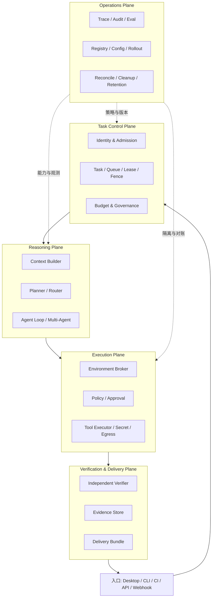
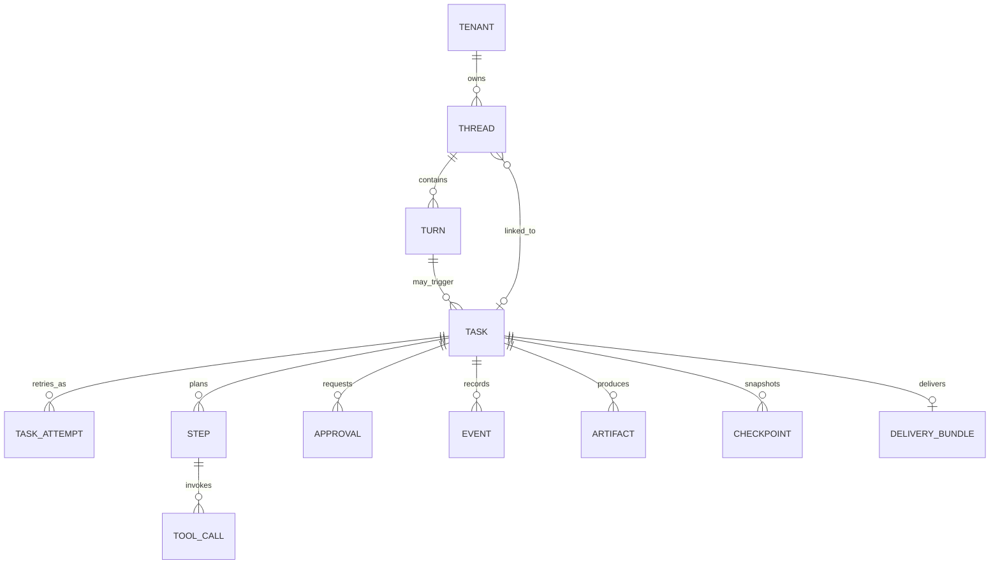
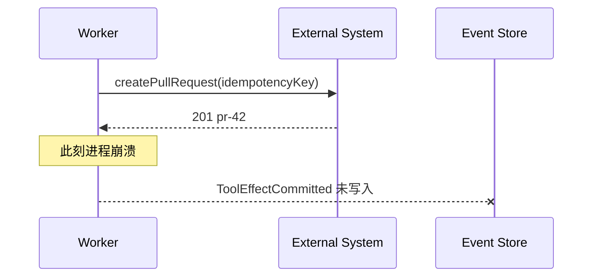
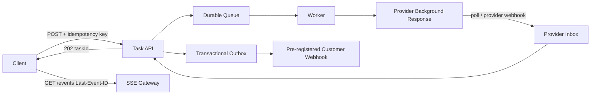

# Agent Runtime 架构覆盖矩阵：20 个阶段与 14 条硬边界

> 这份矩阵把企业级 Agent Runtime 拆成 20 个执行阶段，并标出实现前必须确定的可靠性、安全和治理边界。可用它检查架构覆盖范围，或为故障注入、ADR 和生产验收建立索引。

## 1. 十四条实现硬边界

可运营的 Coding Agent 需要任务控制、推理编排、受控执行、独立验证、证据交付和治理运营。模型循环只是其中一层。

真正进入实现前，还必须补齐以下硬边界：

1. 租约不能阻止失联旧 Worker 写入，必须增加单调 fencing token；
2. 客户端幂等键必须绑定 canonical request digest，相同 key 不同请求应返回冲突；
3. 审批不是授权扩张，批准后仍需基于当前参数、资源版本和策略重新鉴权；
4. 等待审批不应长期占有 Worker、Secret 和高价环境，应 checkpoint 后 park；
5. 任意外部副作用无法获得通用 exactly-once，只能做幂等、查询确认与 reconcile；
6. 超时、断线或强杀不能自动推导“副作用没发生”，需要一等 `outcome_unknown`；
7. Provider 的 background response 不是业务 Task 状态机；
8. Structured Outputs 只解决满足条件时的结构遵循，拒答、截断、内容过滤、网络错误和语义错误仍需处理；
9. Thread、Task、Turn、Step 不能硬编码为简单 1:1；
10. “Worker 无状态”应解释为 Worker 可替换，而工作卷、worktree 和外部效果仍有状态；
11. SSE 恢复要基于单调 cursor、水位与保留窗口，不只依赖随机 event ID；
12. Webhook 目标应预注册并验证，不能把请求体中的任意 URL 直接交给 Worker；
13. 删除传播到备份通常受保留窗口约束，不能承诺瞬时物理删除；
14. 预算必须预留验证、checkpoint、撤权和清理额度，不能耗尽到零后才收尾。

这十四条边界应写成不变量，并进入故障注入、契约测试和审计检查。

## 2. 从 20 个阶段映射到知识库

| 架构阶段 | 核心问题 | 深化后的主章节 | 学习验收 |
|---|---|---|---|
| 1. 触发与接入 | 多入口如何成为可信请求 | [任务控制平面](../06-platform/task-control-plane.md) | 能实现 RequestEnvelope、来源防重和请求摘要 |
| 2. 身份与租户 | 谁代表谁执行 | [多租户与治理](../06-platform/multitenancy-governance.md) | 能计算用户/Agent/Tool/环境权限交集 |
| 3. 准入与预算 | 是否允许开始、如何保证收尾 | [任务控制平面](../06-platform/task-control-plane.md) | 能做预算 reservation、finish reserve 和阈值动作 |
| 4. Task 控制 | 排队、租约、恢复、公平性 | [任务控制平面](../06-platform/task-control-plane.md) | 能解释 WDRR、公平调度、lease 与 fence 的差异 |
| 5. 环境准备 | 在哪里安全执行 | [执行环境生命周期](../06-platform/execution-environment-lifecycle.md) | 能输出环境指纹、setup manifest、清理证明 |
| 6. 上下文构建 | 什么能进入当前模型窗口 | [Context Engineering](../03-runtime/context-engineering.md) | 能实现来源、信任、优先级、预算与压缩 |
| 7. 目标与验收 | “完成”如何机器判定 | [执行契约与验证](../03-runtime/execution-contract-verification.md) | 能定义 TaskSpec 和可执行 AcceptanceCriteria |
| 8. 规划与风险 | 如何拆解、何时重规划 | [执行契约与验证](../03-runtime/execution-contract-verification.md) | 能验证 Plan DAG、版本和 replan 原因 |
| 9. 模型路由 | 质量/延迟/成本/合规取舍 | [企业模型网关](../06-platform/model-gateway.md) | 能做 capability routing、fallback 预算和归因 |
| 10. Agent Loop | 如何有限自治 | [Agent Loop](../03-runtime/agent-loop.md) | 能实现 progress invariant、终止与 no-progress 检测 |
| 11. 能力注册 | 工具/技能/Agent 如何可信发现 | [能力供应链](../06-platform/capability-supply-chain.md) | 能校验 digest、签名、来源、撤销和兼容性 |
| 12. 策略与审批 | 是否允许这次具体动作 | [Tool System](../03-runtime/tool-system.md) 与[执行契约](../03-runtime/execution-contract-verification.md) | 批准必须绑定参数摘要并执行前 reauthorize |
| 13. 沙箱/网络/Secret | 技术上实际能做什么 | [执行环境生命周期](../06-platform/execution-environment-lifecycle.md) 与[安全模型](../06-platform/security-threat-model.md) | 能证明最小权限、出口控制、Secret 撤销 |
| 14. 工具执行 | 调用、输出、超时如何标准化 | [Tool System](../03-runtime/tool-system.md) | 能区分调用终态与业务副作用终态 |
| 15. 可靠性 | 重试、恢复、取消如何不放大事故 | [Durable Workflow](../03-runtime/workflow-engine.md) 与[流式恢复](../03-runtime/streaming-recovery.md) | 能处理 crash window、unknown outcome、reconcile |
| 16. 多 Agent | 委派、隔离、join、合并 | [多 Agent 编排](../03-runtime/multi-agent-orchestration.md) | 子任务能力与预算只可收窄，worktree 不共享 |
| 17. 验证 | 谁证明结果正确 | [执行契约与验证](../03-runtime/execution-contract-verification.md) | verifier 独立、证据带来源和环境指纹 |
| 18. 结果交付 | 如何表达完成度与证据 | [执行契约与验证](../03-runtime/execution-contract-verification.md) | DeliveryBundle 区分 complete/partial/unverified/unknown |
| 19. 同步/流式/后台 | 客户端断线后如何继续 | [任务控制平面](../06-platform/task-control-plane.md) | 能实现 SSE resume、poll、webhook inbox/DLQ |
| 20. 清理与保留 | 结束后数据和资源去哪里 | [执行环境生命周期](../06-platform/execution-environment-lifecycle.md) | 能描述缓存、在线数据、密钥和备份的删除传播 |

横切主题的落点：

| 主题 | 主章节 |
|---|---|
| 事件模型、持久化、乐观并发 | [SQLite 持久化内核](../03-runtime/persistence-sqlite.md) |
| SDK 稳定边界与协议演进 | [统一 SDK 总览](../04-sdk/overview.md)、[契约与事件](../04-sdk/contracts-events.md) |
| Codex / Claude 集成 | [Provider 适配](../02-desktop/provider-adapters.md)、[本地主机](../02-desktop/coding-agent-host.md) |
| MCP / A2A | [协议专题](../05-frameworks/mcp-a2a.md) |
| 观测、Agent audit、Eval | [可观测性与 Evals](../03-runtime/observability-evals.md) |
| SLO、容量和成本 | [可靠性与成本](../06-platform/reliability-cost.md) |
| 灰度、兼容与自动回滚 | [交付与演进](../06-platform/delivery-evolution.md) |
| 上线评审 | [生产检查清单](../07-practice/production-checklists.md) |

## 3. 五个平面，而不是一个 Runtime 进程



拆成五个平面的原因不是组织好看，而是信任职责不同：模型可以提议动作，不能自己授予权限；执行器可以报告退出码，不能自己宣布业务目标完成；Verifier 可以否决交付，不应复用同一份未经检查的模型陈述；运营面可以发布配置，但不能绕过运行时的版本快照。

## 4. 数据模型修正：不要把概念基数锁死

更稳妥的关系是：



为什么 Task 与 Thread 不能简单 1:1：

- 一个会话 Turn 可能触发一个主 Task 和多个后台 Task；
- CI 或 webhook Task 可能没有对话 Thread；
- 一个长期 Thread 中会有多个独立 Task；
- Task retry 是 Attempt，不应伪装成新 Turn；
- 多 Agent 子任务可以继承 trace，但不一定成为用户可见 Thread。

建议使用显式关联表：

```sql
CREATE TABLE task_thread_link (
  task_id    TEXT NOT NULL,
  thread_id  TEXT NOT NULL,
  turn_id    TEXT,
  relation   TEXT NOT NULL CHECK (relation IN
             ('triggered_by','reports_to','continues','visible_in')),
  PRIMARY KEY (task_id, thread_id, relation)
);
```

`Response ID`、`Codex thread ID`、Runtime `thread_id`、业务 `task_id` 属于不同命名空间，必须分别存储并标出 provider。任何一个外部 ID 都不应成为内部数据库的唯一业务主键。

## 5. Task 状态与结果状态是两条轴

单一枚举很快会陷入歧义。例如“执行结束但外部部署状态未知”既不是普通成功，也不能安全重试。推荐至少分为：

```ts
type TaskPhase =
  | "received" | "admitted" | "queued" | "preparing"
  | "running" | "waiting_approval" | "blocked"
  | "verifying" | "delivering" | "canceling" | "terminal";

type TaskOutcome =
  | "none" | "succeeded" | "failed" | "canceled"
  | "partial" | "unverified" | "outcome_unknown";

interface TaskStatus {
  phase: TaskPhase;
  outcome: TaskOutcome;
  reasonCode?: string;
  recoverable: boolean;
  nextAction?: "resume" | "approve" | "reconcile" | "retry" | "none";
}
```

`BLOCKED` 不是天然终态；输入补齐、配额恢复或依赖修复后可以 resume。`CANCELING` 也不是结果，它表示停止协议尚未确认。UI 必须展示“正在停止”和“已确认取消”的差别。

## 6. 关键协议修正

### 6.1 幂等键要绑定请求内容

```ts
const digest = sha256(canonicalJson({
  tenantId,
  principalId,
  taskType,
  input,
  policyProfile,
  callbackRef,
}));

// (tenant, idempotencyKey) 首次写入 digest。
// 再次请求：digest 相同返回既有 Task；不同则 409 IDEMPOTENCY_CONFLICT。
```

只用 `idempotencyKey UNIQUE` 会把客户端 bug 隐藏成错误复用；服务端自行随机生成 key 又无法帮助网络重试防重。

### 6.2 Lease 要配 Fence

```sql
UPDATE task_lease
SET owner = :worker, epoch = epoch + 1, expires_at = :expires
WHERE task_id = :task
  AND (expires_at < :now OR owner = :worker)
RETURNING epoch;
```

之后每个 event append、artifact commit、checkpoint 和可控副作用都带 `epoch`，接收端拒绝低于当前值的写入。若下游不支持 fence，就必须降低并发、用版本条件或进入查询/对账协议。

### 6.3 审批要绑定“将执行的那一个动作”

审批对象应至少包含：

```ts
interface ApprovalBinding {
  toolName: string;
  toolVersion: string;
  canonicalArgsDigest: string;
  resourceVersion?: string;
  subjectDigest: string;
  policyVersion: string;
  environmentGeneration: number;
  expiresAt: string;
  maxUses: 1;
}
```

执行前重新解析工具版本和真实资源，再鉴权；任一摘要或版本变化均请求新审批。批准只能消除“需要人确认”的条件，不能突破调用者、租户、沙箱和组织策略的交集。

### 6.4 事件追加需要 expected sequence

原子事件追加至少需要 aggregate version/CAS：

```ts
await eventStore.append({
  streamId: taskId,
  expectedSeq,
  events: [modelCompleted, stepTransitioned],
  outbox: notifications,
});
```

否则两个 Worker 都可能基于同一旧状态产生“合法”后续事件。Event Store、snapshot、outbox 与业务 projection 的事务边界见[SQLite 持久化内核](../03-runtime/persistence-sqlite.md)。

## 7. 外部副作用：为什么不能承诺通用 exactly-once

考虑这段 crash window：



重启后“不重试”可能丢失后续流程，“盲重试”可能创建两个 PR。正确协议是：

1. 在调用前持久化 `EffectIntent` 与稳定 operation key；
2. 尽量让下游原生接受 idempotency key；
3. 超时/崩溃后先按 key 或业务资源查询；
4. 能确认已发生则补写 committed event；
5. 能确认未发生才重试；
6. 无法确认则 `outcome_unknown`，交给 reconcile 或人工。

这提供的是“可恢复的一次业务意图”，不是数学上的任意外部系统 exactly-once。

## 8. Provider 能力与业务 Runtime 的边界

截至 **2026-08-30**，官方资料给出的 Codex 集成面可以这样选择：

| 集成面 | 官方定位 | 适用场景 | 企业层仍需补充 |
|---|---|---|---|
| Codex App Server | 面向富客户端，含认证、历史、审批和流式 Agent 事件；协议为双向 JSON-RPC 风格 | 桌面/IDE 深度嵌入 | 业务 Task、租户治理、审计留存、升级兼容 |
| Codex SDK | 服务端以代码启动、继续、恢复本地 Codex thread | CI、内部自动化、Coding 专项 Agent | admission、队列、预算、环境池、DeliveryBundle |
| `codex exec` | 脚本/CI 非交互运行；JSONL 可消费运行事件 | shell pipeline、批处理 | 进程监督、幂等、断线恢复、结构化业务契约 |
| Responses background mode | 异步启动并轮询模型 Response | 长模型调用 | 业务状态机、审批、外部工具账本、清理与保留 |

官方当前说明：Codex App Server 的远程 WebSocket transport 仍属实验/不支持生产工作负载，因此不能把实验传输层当成既定生产 SLA；Codex SDK 的 TypeScript 库可启动、继续、恢复 thread；`codex exec --json` 产生 JSONL 事件；Codex 默认结合沙箱、审批和网络控制，具体行为随运行环境及配置而异。

来源：[Codex App Server](https://developers.openai.com/codex/app-server)、[Codex SDK](https://developers.openai.com/codex/codex-sdk)、[Non-interactive mode](https://developers.openai.com/codex/non-interactive-mode)、[Agent approvals & security](https://developers.openai.com/codex/agent-approvals-security)。

## 9. Background、Webhook 与 SSE 的正确组合



这里有三个不同的异步层：

- Provider background：解决一次模型调用可能很久；
- Runtime Task：解决跨模型、工具、审批、恢复和交付的业务生命周期；
- 客户端通知：SSE/poll/webhook 只是读取 Task 事实的方式。

OpenAI 官方 Background mode 当前支持异步创建并对 `queued`/`in_progress` 轮询，Webhook 要验证签名、快速返回，并可能在失败后重试和偶发重复。企业 Runtime 因此必须有 inbox 去重，不能在 HTTP handler 中直接执行业务效果。来源：[Background mode](https://developers.openai.com/api/docs/guides/background)、[Webhooks](https://developers.openai.com/api/docs/guides/webhooks)。

SSE 的 `Last-Event-ID` 应映射为 Task 流内单调 cursor。若 cursor 已早于保留水位，返回明确的 snapshot/cursor-expired 协议（例如 `410 Gone` + snapshot URL），不要从任意剩余事件继续而制造缺口。

## 10. Context Compaction 不是业务记忆

模型上下文、业务状态、记忆和证据必须分开：

| 层 | 目的 | 可以压缩吗 | 是否为审计真相 |
|---|---|---:|---:|
| Prompt context | 当前推理输入 | 可以 | 否 |
| Provider compaction item | 延续长模型会话 | 可由 Provider 生成 | 否，且可能是 opaque |
| Runtime state | phase、plan、预算、effect ledger | 只能做有版本 snapshot | 是 |
| Memory | 跨 Turn 的有用事实 | 可总结，但需来源与失效策略 | 取决于用途 |
| Evidence | 测试、diff、artifact、外部回执 | 不可用摘要替代原件 | 是 |

OpenAI 当前 Compaction 文档明确将 compaction item 描述为用于后续延续的 opaque 项；因此不能解析其内部内容来重建审批、预算、工具账本或合规证据。来源：[Compaction](https://developers.openai.com/api/docs/guides/compaction)。

## 11. Structured Outputs 的边界

结构化输出非常适合 Planner、Tool args、TaskSpec 和 DeliveryBundle，但消费端必须先判断响应终态：

```ts
function decodeStructured<T>(r: ProviderResponse, semanticCheck: (x: T) => void): T {
  if (r.status !== "completed") {
    throw new Error(`MODEL_${r.status.toUpperCase()}:${r.incompleteReason ?? "unknown"}`);
  }
  if (r.refusal) throw new Error("MODEL_REFUSAL");
  const value = strictSchemaParse<T>(r.output);
  semanticCheck(value); // JSON Schema 无法证明文件存在、DAG 无环或权限合法
  return value;
}
```

官方 Structured Outputs 指南同样要求处理 refusal、`incomplete`、`max_output_tokens`、`content_filter` 和调用错误。Schema adherence 不等于业务正确、事实真实或动作获权。来源：[Structured model outputs](https://developers.openai.com/api/docs/guides/structured-outputs)。

## 12. 覆盖矩阵外的横向依赖

Runtime 还依赖一组系统外侧能力，单独看模型循环或任务状态机很容易漏掉它们：

| 横向依赖 | 为什么重要 | 对应章节 |
|---|---|---|
| Windows/macOS 进程树与权限 | 企业桌面不是 Linux 容器的缩小版 | [Coding Agent Host](../02-desktop/coding-agent-host.md) |
| Typed IPC 与 Renderer 零信任 | Web UI 输入不应直达本机能力 | [进程与 IPC](../02-desktop/process-ipc.md) |
| 供应链签名、SBOM、撤销 | Tool/Skill/Agent 是可执行依赖 | [能力供应链](../06-platform/capability-supply-chain.md) |
| 契约兼容测试 | 统一 SDK 会被 Web/IDE/Extension 长期依赖 | [兼容性测试](../04-sdk/compatibility-testing.md) |
| Framework anti-corruption layer | 不让 LangGraph 等框架对象污染公共 API | [Framework 集成](../05-frameworks/framework-integration.md) |
| 语义 Eval 与 shadow/canary | 单元测试不能度量 Agent 质量漂移 | [可观测性与 Evals](../03-runtime/observability-evals.md) |
| 桌面签名、更新、回滚 | Runtime 安全依赖可信客户端分发 | [打包与更新](../02-desktop/distribution.md) |
| 组织和平台产品化 | 技术平台需要 adoption、SLO、owner | [交付与演进](../06-platform/delivery-evolution.md) |

## 13. 用纵向链路验证矩阵

选择一条纵向链路，把相关阶段串起来实现，再注入故障。下面三条链路分别覆盖只读分析、受控修改和长任务恢复：

### 切片 A：只读仓库分析

`RequestEnvelope → admission → read-only environment → context → model → verifier → DeliveryBundle`

验收：断网、模型超时、客户端断线都不会丢 Task；输出中的每个事实能定位到文件版本或工具证据。

### 切片 B：受控代码修改

`TaskSpec → Plan DAG → isolated worktree → tool proposal → policy/approval → patch → tests → diff gate → delivery`

验收：审批后篡改参数会被拒绝；原工作区不被 Agent 直接写；测试证据绑定环境指纹和真实 diff。

### 切片 C：异步外部交付

`queued task → leased worker → provider/tools → effect ledger → PR/deploy → webhook/outbox → reconcile → cleanup`

验收：在每个外部调用前后强杀进程，系统都不会静默重复副作用；无法确认时明确展示 unknown。

## 14. 评审用不变量清单

将下面每条写成自动化测试或可查询约束：

- [ ] 同一 Task event stream 的序号严格递增，append 使用 expected sequence；
- [ ] 同一 idempotency key 不能对应两个 request digest；
- [ ] 旧 fencing generation 不能提交 event、artifact 或 checkpoint；
- [ ] 子 Agent 的权限、预算、截止时间不大于父级下放范围；
- [ ] 审批摘要与执行参数、资源版本、策略版本完全一致；
- [ ] 批准后执行前总会重新授权；
- [ ] `WAITING_APPROVAL` 不长期保留无必要的 Secret 和 Worker；
- [ ] 任何工具调用都有唯一终态；unknown 是终态/对账态而不是丢失记录；
- [ ] 最终“测试通过”声明存在对应 verifier evidence；
- [ ] Structured Output 在终态、拒答、截断检查后才进入 schema/语义验证；
- [ ] SSE 客户端能检测 cursor 缺口，不能悄悄跳过事件；
- [ ] Webhook URL 来自租户预注册配置，并经过签名、去重、重放保护；
- [ ] 环境清理失败会隔离，不能重新进入 warm pool；
- [ ] 删除证明准确表达备份保留和 legal hold 例外；
- [ ] Runtime Task、Provider Response、Codex thread、产品 Thread ID 永不混为一个字段。

## 15. 架构练习

选择一个“创建修复 PR”的 Task，提交以下评审材料：

1. 画出从 API 接入到 webhook 交付的正常与崩溃时序；
2. 给出 RequestEnvelope、TaskSpec、Plan、ApprovalBinding、EffectIntent、Evidence 和 DeliveryBundle schema；
3. 标出所有事务边界与不能原子提交的边界；
4. 在模型调用、补丁应用、PR 创建的请求前/后各设计一个 crash test；
5. 证明旧 Worker、过期审批和过期 Secret 都无法继续产生效果；
6. 给出 70/85/95/100% 预算阈值动作，并保留收尾预算；
7. 演示 SSE 断线恢复、Webhook 重复和 DLQ replay；
8. 输出 DeliveryBundle，明确区分 `succeeded`、`partial`、`unverified`、`outcome_unknown`。

能完成这组材料，才说明你掌握的是可运营的 Agent Runtime，而不是只会画组件框图。
