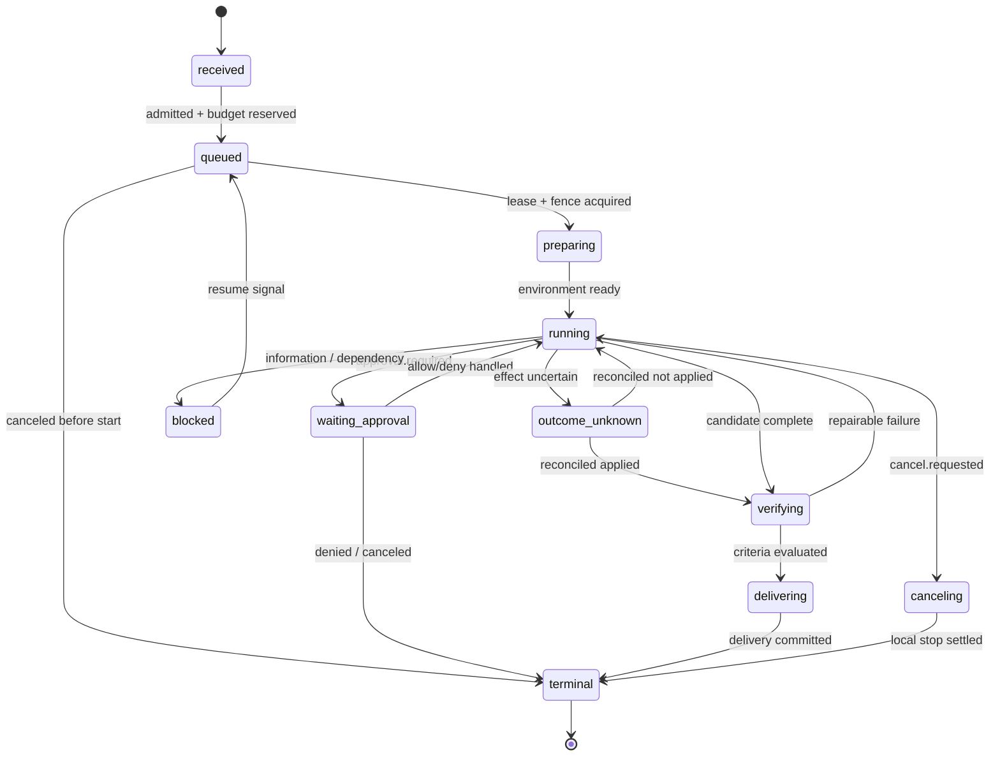

# Agent Runtime 速查表：决策、状态、事件与错误

> 速查表用于 Agent Runtime 架构评审、Code Review 和事故处置，检查状态、事件、副作用、权限、恢复与验证边界。实现细节以对应章节和正式 schema 为准。

## 1. 遇到需求先问 16 个问题

1. 用户要的结果是什么，Agent 只是建议还是会制造真实副作用？
2. Task 最长多久；它与 Thread、Provider Response、Run/Attempt 如何映射？
3. 权威状态在哪里；哪个数据可重建，哪个不可丢？
4. 跨了哪些信任边界；输入是否来自网页/仓库/MCP/模型？
5. 谁能用哪个 Tool，对哪个资源，参数是什么，到何时？
6. timeout 后外部 effect 是否可能已发生；能否幂等、查询、补偿？
7. Provider/Tool 能力不同怎样协商；降级是否改变产品语义？
8. 上下文窗口放什么，谁有权限，如何压缩和引用？
9. 客户端断线后从哪个 cursor 恢复，如何发现 gap/重复？
10. 如何证明质量、正确性、安全、延迟和成本没有回退？
11. 如何渐进发布、回滚；历史 Run 由哪个版本继续？
12. 值班人在五分钟内能做什么止血？
13. TaskSpec 的范围、验收和 DeliveryBundle 是什么；谁独立验证最终 claim？
14. lease 过期后，哪个真实写入点用 fencing token 拒绝旧 Worker？
15. 等待审批时是否 park 并释放 Worker/Secret；批准后是否重新鉴权？
16. 环境、Tool/Skill/Agent Release 如何固定指纹、验证供应链、撤销和证明清理？

## 2. 架构决策矩阵

### 2.1 Local / Cloud / Hybrid

| 条件 | 优先选择 | 仍需解决 |
| --- | --- | --- |
| 本地文件、强隐私、离线、低延迟 | Local-first | 崩溃恢复、设备资源、升级碎片化 |
| 跨天任务、弹性、统一治理 | Cloud-first | 本地资源代理、数据出域、网络延迟 |
| 云持久 Workflow + 本地 Tool | Hybrid | durable Activity、设备离线、双平面身份/租约 |

### 2.2 Agent Loop / Workflow

| 需求 | Agent Loop | Durable Workflow |
| --- | --- | --- |
| 模型自主选择下一动作 | 强 | 作为 Activity/子流程组合 |
| 确定步骤、审批等待、timer | 弱 | 强 |
| 进程重启恢复 | 需自行实现 | 核心能力 |
| 非确定 I/O | 直接调用但难重放 | 放 Activity，history 记录结果 |

常见组合：Workflow 控制长期生命周期；一个 Workflow step 内运行有预算的 Agent Loop。

### 2.3 Snapshot / Event Log

| 选择 | 适用 | 风险 |
| --- | --- | --- |
| 只存 snapshot | 短、无审计、失败可重开 | 无因果，副作用窗口难判断 |
| Event log + snapshot | 长 Run、审计、恢复、多投影 | schema/reducer/version/存储复杂 |
| Workflow history + domain events | 用成熟引擎且需稳定产品协议 | 双层映射和运营成本 |

## 3. Task phase / outcome 速查



### 3.1 不变量

```text
phase 与 outcome 分开；BLOCKED/WAITING_APPROVAL 可恢复
terminal_count(attempt) = 1
event.seq = previous.seq + 1
terminal 后无业务事件
Tool completed 前必须有 requested
执行参数 digest = 审批参数 digest
批准后执行前重新 authorize
旧 fencingToken 无法提交 event/artifact/checkpoint
同一 idempotencyKey 只能绑定同一 canonical request digest
Delivery claim 必须引用 verifier evidence 或明确 unverified
attempt 改变，idempotencyKey 不改变
```

`cancel.requested` 不是终态；`timeout` 不是 `failed` 的充分证据；迟到 effect 必须记录/对账。

### 3.2 状态归属

| 状态 | Source of truth | 不应放在 |
| --- | --- | --- |
| Task phase/outcome/head | Event Store + projection | UI 内存 |
| Tool effect | 下游 receipt + effect ledger | Trace |
| Policy | 签名版本快照/控制面 | prompt |
| Artifact | 加密 object/blob store | event payload |
| Provider session ID | adapter 私有映射 | 公共 SDK 主身份 |
| 诊断 | trace/log | 恢复状态 |

## 4. Event 速查

### 4.1 Envelope

```ts
type EventEnvelope<P> = {
  schemaVersion: number;
  eventId: string;        // 去重
  tenantId: string;       // 隔离；不能从 ID 猜
  taskId: string;         // 业务执行承诺
  runId: string;
  seq: number;            // Run 内排序
  type: string;           // noun.past-tense / lifecycle fact
  occurredAt: string;     // 展示；不负责排序
  correlationId: string;  // 同一 operation 链
  causationId?: string;   // 直接因果
  producer: { name: string; version: string };
  dataClass: "public" | "internal" | "confidential" | "restricted";
  payload: P;
};
```

### 4.2 最小生命周期

| 对象 | 开始事实 | 中间事实 | 结束事实 |
| --- | --- | --- | --- |
| Task | `task.accepted` | queued/blocked/verifying/canceling | succeeded/failed/canceled/partial/unknown |
| Run/Attempt | `run.started` | progress/waiting/cancel requested | completed/failed/canceled |
| Model call | `model.requested` | text delta/tool call/usage | completed/failed |
| Tool call | `tool.requested` | approval/started/output delta | completed/failed/effect_unknown |
| Approval | `approval.required` | viewed（可选） | allowed/denied/expired/revoked |
| Artifact | `artifact.declared` | chunk（可选） | committed/failed |

Delta 是展示优化；必须有 completed snapshot/ref 收口。

### 4.3 命名规则

```text
好：tool.execution.requested   approval.granted   run.completed
坏：doTool                     statusChanged      handleEvent
```

事件是事实过去式；Command 是祈使式：`ExecuteTool`、`GrantApproval`。不要复用旧 event type 改语义。

## 5. Command 执行模板

```ts
async function handle(command: Command, d: Deps) {
  const signal = deadlineSignal(command.deadline);
  await d.events.appendIntent(command);   // durable，先于副作用
  try {
    const result = await d.executor.invoke(command, signal);
    await d.events.appendResult(command, result);
  } catch (e) {
    const error = normalizeError(e);
    if (error.effect === "unknown") {
      await d.events.appendEffectUnknown(command, error);
      await d.reconcile.enqueue(command);
      return;
    }
    await d.events.appendFailure(command, error);
  }
}
```

外部 effect 只有满足以下之一才自动 retry：

1. 下游以同一 key 保证幂等；
2. 可查询确认明确“未发生”，随后重试；
3. effect 天然幂等（例如把同一内容写到同一 content-addressed key）；
4. 业务明确允许重复且有去重/补偿。

## 6. Error 速查

### 6.1 稳定错误模型

```ts
type RuntimeError = {
  code:
    | "INVALID_ARGUMENT" | "UNAUTHENTICATED" | "PERMISSION_DENIED"
    | "POLICY_DENIED" | "NOT_FOUND" | "CONFLICT"
    | "RATE_LIMITED" | "RESOURCE_EXHAUSTED"
    | "PROVIDER_UNAVAILABLE" | "TIMEOUT" | "CANCELLED"
    | "PROTOCOL_ERROR" | "EFFECT_UNKNOWN" | "INTERNAL";
  message: string;                 // 安全展示
  retryable: boolean;              // 对这个 operation，不是全局
  retryAfterMs?: number;
  effect: "none" | "not_started" | "committed" | "unknown";
  diagnosticRef?: string;          // 受控诊断，不回传正文/stack
  providerCode?: string;
};
```

### 6.2 行为矩阵

| Code | 默认重试 | UI 行为 | 注意 |
| --- | --- | --- | --- |
| INVALID_ARGUMENT | 否 | 指出字段 | 不重试相同输入 |
| UNAUTHENTICATED | 刷新一次 | 登录/重认证 | 避免刷新风暴 |
| PERMISSION/POLICY_DENIED | 否 | 解释策略/申请 | 模型不能绕过 |
| CONFLICT | 重读后有限重试 | 通常透明 | expectedSeq/lease/fencing/idempotency digest |
| RATE_LIMITED | 是 | 排队/倒计时 | 尊重 retry-after + budget |
| RESOURCE_EXHAUSTED | 条件 | 减少/稍后 | 配额与系统容量分开 |
| PROVIDER_UNAVAILABLE | 条件 | 等待/显式 fallback | capability/合规检查 |
| TIMEOUT | 只对幂等 | 显示“结果待确认” | effect 可能 unknown |
| CANCELLED | 否 | 正常终态/取消中 | 不全部计入错误率 |
| PROTOCOL_ERROR | 通常否 | 安全失败 | quarantine payload |
| EFFECT_UNKNOWN | **否** | 人工/对账中 | 先 reconcile |
| INTERNAL | 条件 | 关联支持 ID | 不能把 stack 给 UI |

### 6.3 Retry 预算

```ts
function retryDelay(attempt: number, retryAfterMs?: number) {
  if (retryAfterMs) return retryAfterMs;
  const cap = 30_000;
  const base = Math.min(cap, 250 * 2 ** attempt);
  return Math.random() * base; // full jitter；测试注入 RNG
}
```

停止条件：非 retryable、deadline 不足完成下一次、attempt 上限、Task cost/step budget、finish reserve、cancellation、circuit open。

## 7. Effect 安全矩阵

| Tool 类型 | 示例 | 自动 retry | 必需机制 |
| --- | --- | --- | --- |
| Pure read | 读文件/查询 | 通常可 | deadline、权限、输出上限 |
| Idempotent write | put 同一 key/声明式配置 | 可 | 稳定 key、语义等价 |
| Queryable effect | 邮件/订单支持 key+查询 | 可确认后 | intent、downstream key、lookup |
| Compensatable | 创建临时资源 | 条件 | receipt、补偿 Workflow、审计 |
| Irreversible/unqueryable | 某些付款/物理动作 | 默认不可 | 明确批准、人工确认、禁止盲重试 |

`Effect Ledger` 记录 started/confirmed/unknown；它不能单独消除“下游成功、本地未确认”的崩溃窗口。

## 8. Approval / Capability 速查

```ts
type CapabilityGrant = {
  grantId: string;
  tenantId: string;
  subject: string;
  taskId: string;
  runId: string;
  callId: string;
  tool: { id: string; version: string };
  action: string;
  resources: string[];
  argumentsDigest: string;
  resourceVersion?: string;
  environmentGeneration: number;
  policyVersion: string;
  issuedAt: string;
  expiresAt: string;
  nonce: string;
  signature: string;
};
```

执行点必须复验：

- 身份/tenant/run/call 匹配；
- tool version 与 canonical arguments digest 匹配；
- resource 在 scope 内，grant 未过期/撤销；
- policy kill switch 未关闭；
- 防重放 nonce/使用次数；
- 高风险审批人满足职责分离。
- 当前 Task 未取消、预算仍允许，审批/策略/资源版本未变化；
- 审批只解除交集内的人工门禁，不能扩大 capability 或 sandbox。

Tool 描述、模型解释、`readOnlyHint` 只能辅助 UX，不能替代 host policy。

## 9. Context 预算速查

```text
可用输入 = model_window
         - max_output
         - tool_schema
         - safety/system reserve
         - reasoning reserve（若适用）
```

推荐优先级：

1. system/security/任务目标；
2. 当前用户输入与已确认事实；
3. 待处理 Tool/Workflow 状态；
4. 高相关、已授权、有来源的检索材料；
5. 压缩历史；
6. 可丢的寒暄/重复/低可信材料。

每个 context item 至少带：

```ts
type ContextItem = {
  ref: string;
  source: "user" | "memory" | "retrieval" | "tool" | "system";
  trust: "instruction" | "untrusted-data";
  sensitivity: string;
  observedAt: string;
  tokenEstimate: number;
  digest: string;
};
```

不要把外部文本提升成 instruction；compaction 不删除审计 event。

## 10. Provider 选择速查

路由过滤顺序：

```text
合规/区域/租户允许
→ required capability
→ 健康/配额/circuit
→ 数据与保留政策
→ latency/quality/cost 优化
→ preferred capability 与 sticky/session 约束
```

required 不满足：快速失败。preferred 不满足：显式 `run.degraded`，记录实际 provider/model/adapter/policy/pricing version。

## 11. Streaming 与重连

| 问题 | 规则 |
| --- | --- |
| 排序 | `seq`，不是 timestamp/到达顺序 |
| 去重 | `eventId` |
| 断线 | 客户端保存 last committed seq，传 `afterSeq` |
| Gap | 停止应用，补拉；不可静默跳过 |
| 慢客户端 | 有界 buffer；合并 text delta；断开后补拉 |
| 历史过期 | snapshot(atSeq) + 后续 events |
| Terminal | 每 Attempt exactly one；Task outcome 单调收口；terminal 后迟到流进诊断/对账通道 |

Cursor 要写清 exclusive/inclusive。本库约定 `afterSeq` 为 exclusive。

## 12. Observability 速查

### 12.1 Span 树

```text
agent.run
├─ context.build
├─ model.generate (attempt, provider, model)
├─ approval.wait
├─ tool.invoke (tool, risk, outcome)
└─ workflow.persist
```

异步队列/恢复 worker 使用 span link；不要伪造一个持续 14 天的活动 span。跨进程传播 W3C Trace Context，但 `traceId` 不作为授权。

### 12.2 记录与不记录

| 记录 | 默认不记录 |
| --- | --- |
| operation/status/duration/attempt | prompt/response/tool output 正文 |
| provider/model family/tool/version | secret、header、token |
| token/usage/estimated cost | 绝对路径、用户名、PII |
| stable error code | 任意 provider error body/stack 给前端 |

Metric label：provider、tool、error_code、tenant_tier 可以；runId、userId、原始 prompt 不可以。

## 13. Schema 演进速查

| 变更 | 通常兼容？ | 要求 |
| --- | --- | --- |
| 新增 optional 字段 | 是 | 旧端忽略，新端有默认 |
| 新增 enum value | 只在 consumer 有 unknown 时 | 统计 unknown |
| 新增 event type | 只在安全忽略时 | 保持 seq；不能默认授权 |
| 删除/改名字段 | 否 | 新 major/双读/迁移 |
| optional→required | 否 | 分阶段填充再收紧 |
| 改字段语义/单位 | 否 | 新字段/type，不复用旧名 |
| 放宽输入 | 可能 | 安全/资源上限复核 |
| 收窄输入 | 否 | 使用量分析、弃用窗口 |

CI：schema source → generated types → compatibility diff → golden vectors → N/N-1 contract。

## 14. SLO / 容量公式

```text
并发 Run ≈ 峰值 Run/s × 平均活跃秒
Provider 并发 ≈ 活跃 Run × 同时模型调用数
事件写 QPS ≈ 活跃 Run × 每 Run 每秒持久事件
错误预算 = 总事件 × (1 - SLO)
单位 Run 成本 = 模型 + Tool + 存储 + 计算 + 重试摊销
```

Burn-rate 告警至少 fast（5m/1h）+ slow（6h/3d）；安全/重复不可逆 effect 直接 page，不等错误预算烧完。

## 15. 五分钟事故检查

```text
1. 用户影响：哪些 tenant/tier/region/tool/provider？
2. 正确性：重复 effect、effect unknown、跨租户、丢/乱事件？
3. 止血：暂停高风险 Tool、限流、固定 Provider、只读模式。
4. 状态：event head/gap/terminal、lease、outbox、effect ledger。
5. 依赖：Provider/Tool/DB/queue/OTel；避免重试风暴。
6. 恢复：fence 旧 writer，渐进 half-open，公平排 backlog。
7. 证据：保存 event/trace/audit ref，不复制敏感正文。
```

## 16. Code Review 十问

- [ ] 这段代码改变了哪个领域状态/合约？
- [ ] 外部 I/O 之前 durable intent 在哪里？
- [ ] timeout/取消/重试时 effect 的真实含义？
- [ ] idempotency key 的范围、期限、下游支持？
- [ ] 输入跨了什么信任边界，在哪里 schema/授权？
- [ ] 是否泄漏 Provider/Framework 类型到 core？
- [ ] 旧客户端/历史 Run/unknown enum 如何表现？
- [ ] 队列/buffer/输出是否有界？
- [ ] trace/log 是否含正文、secret、高基数？
- [ ] 用哪个 contract/property/fault/eval 证明？

关联：[精确术语表](glossary.md)、[生产检查清单](../07-practice/production-checklists.md)、[参考架构](../07-practice/reference-architecture.md)。
